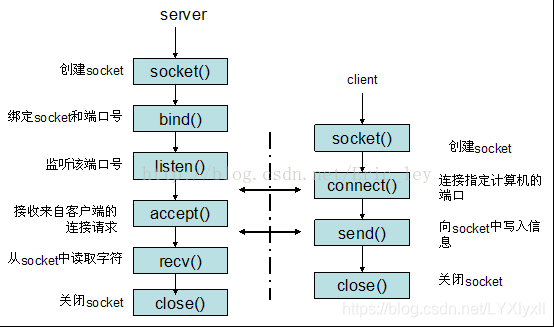

# 套接字通信流程



# UDP

## client.py

```python
from socket import *
serverName = '191.101.232.165' # 服务器地址，本例中使用一台远程主机
serverPort = 12000 # 服务器指定的端口
clientSocket = socket(AF_INET, SOCK_DGRAM) # 创建UDP套接字，使用IPv4协议
message = input('Input lowercase sentence:').encode() # 用户输入信息，并编码为bytes以便发送
clientSocket.sendto(message, (serverName, serverPort)) # 将信息发送到服务器
modifiedMessage, serverAddress = clientSocket.recvfrom(2048) # 从服务器接收信息，同时也能得到服务器地址
print(modifiedMessage.decode()) # 显示信息
clientSocket.close() # 关闭套接字
```

## server.py

```python
from socket import *
serverPort = 12000 # 服务器指定的端口
serverSocket = socket(AF_INET, SOCK_DGRAM) # 创建UDP套接字，使用IPv4协议
serverSocket.bind(('',serverPort)) # 将套接字绑定到之前指定的端口
print("The server in ready to receive")
while True: # 服务器将一直接收UDP报文
	message, clientAddress = serverSocket.recvfrom(2048) # 接收客户端信息，同时获得客户端地址
	modifiedMessage = message.upper() # 将客户端发来的字符串变为大写
	serverSocket.sendto(modifiedMessage, clientAddress) # 通过已经获得的客户端地址，将修改后的字符串发回客户端
```


# TCP

## client.py

```python
from socket import *
serverName = '191.101.232.165' # 指定服务器地址
serverPort = 12000
clientSocket = socket(AF_INET, SOCK_STREAM) # 建立TCP套接字，使用IPv4协议
clientSocket.connect((serverName,serverPort)) # 向服务器发起连接

sentence = input('Input lowercase sentence:').encode() # 用户输入信息，并编码为bytes以便发送
clientSocket.send(sentence) # 将信息发送到服务器
modifiedSentence = clientSocket.recvfrom(1024) # 从服务器接收信息
print(modifiedSentence[0].decode()) # 显示信息
clientSocket.close() # 关闭套接字
```

## server.py

```python
from socket import *
serverPort = 12000
serverSocket = socket(AF_INET, SOCK_STREAM) # 创建TCP欢迎套接字，使用IPv4协议
serverSocket.bind(('',serverPort)) # 将TCP欢迎套接字绑定到指定端口
serverSocket.listen(1) # 最大连接数为1
print("The server in ready to receive")

while True:
	connectionSocket, addr = serverSocket.accept() # 接收到客户连接请求后，建立新的TCP连接套接字
	print('Accept new connection from %s:%s...' % addr)
	sentence = connectionSocket.recv(1024) # 获取客户发送的字符串
	capitalizedSentence = sentence.upper() # 将字符串改为大写
	connectionSocket.send(capitalizedSentence) # 向用户发送修改后的字符串
	connectionSocket.close() # 关闭TCP连接套接字
```

