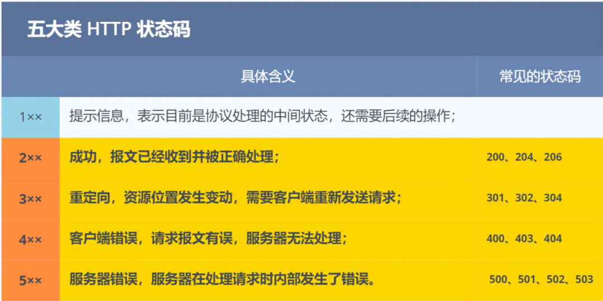
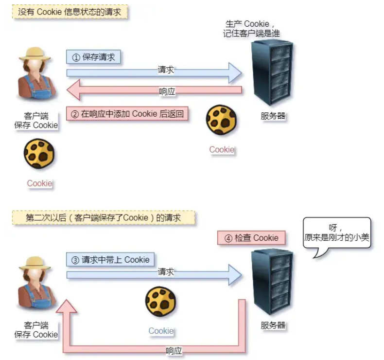

# http	

## 什么是http协议

http是一个在计算机世界里专门在**两点**之间**传输**文字、图片、音频、视频等**超文本**数据的**约定和规范**

## 常见的http状态码



* 1XX

  1XX 类状态码属于提示信息，是协议处理中的一种中间状态，实际用到的比较少

+ 2XX

  2XX 类状态码表示服务器成功处理了客户端的请求，也是我们最愿意看到的状态

  **200 OK** 是最常见的成功状态码，表示一切正常。如果是非HEAD请求，服务器返回的响应头都会有body数据

  **204 No Content** 也是常见的成功状态码，与200 OK基本相同，但响应没有body数据

  **206 Partial Content** 是应用于HTTＰ分块下在或断点续传，表示响应返回的body数据并不是资源的全部，而是其中的一部分，也是服务器处理成功的状态

+ 3XX

  3XX 类状态码表示客户端请求的资源发生了变动，需要客户端用心的URL重新发送请求获取资源，也就是重定向

  **301 Moved Permanently** 表示永久重定向，说明请求的资源已经不存在了，需要改用新的URL再次访问

  **302 Found** 表示临时重定向，说明请求的资源还在，但暂时需要用另一个URL来访问

   <span style="color:green">301 和 302 都会在响应头里使用字段Location，表明后续要跳转的URL，浏览器会自动重定向新的URL</span>

  **304 Not Modified** 不具有跳转的含义，表示资源未修改，重定向已存在的缓冲文件，也称缓存重定向，用于缓存控制

+ 4XX

  4XX 类状态码表示客户端请求的报文有错误，服务器无法处理，也就是错误码的含义

  **400 Bad Request** 表示客户端请求的保温有错误，但只是个笼统的错误

  **403 Forbidden** 表示服务器禁止访问资源，并不是客户端的请求出错

  **404 Not Found** 表示请求的资源在服务器上不存在或未找到，所以无法提供给客户端

+ 5XX

  5XX 类状态码表示客户端请求报文正确，但是服务器处理时内部发生了错误，属于服务器端的错误码

  **500 Internal Server Error** 是个笼统的错误码，服务器发生了什么错误，我们并不知道

  **501 Not Implemented** 表示客户端请求的功能还不支持

  **502 Bad Gateway** 通常是服务器作为网关或代理时返回的错误码，表示服务器自身正常工作，访问后端服务器发生了错误

  **503 Service Unavailable** 表示服务器当前很忙，暂时无法响应客户端  


## get与post

**get**方法的含义是<span style="color:blue">从服务器获取指定的资源</span>，这个资源可以是静态的文本、页面、图片视频等。get方法是安全、幂等、可被缓存的。

**post**方法的语义是<span style="color:blue">根据请求符合（报文body）对指定的资源做出处理</span>,具体处理方式视资源类型不同而不同。post方法不安全，不幂等，（大部分实现）不可缓存。

## cookie

通过在请求和响应报文中写入cookie信息来控制客户端的状态




# 套接字通信流程


# UDP

## client.py

```python
from socket import *
serverName = '191.101.232.165' # 服务器地址，本例中使用一台远程主机
serverPort = 12000 # 服务器指定的端口
clientSocket = socket(AF_INET, SOCK_DGRAM) # 创建UDP套接字，使用IPv4协议
message = input('Input lowercase sentence:').encode() # 用户输入信息，并编码为bytes以便发送
clientSocket.sendto(message, (serverName, serverPort)) # 将信息发送到服务器
modifiedMessage, serverAddress = clientSocket.recvfrom(2048) # 从服务器接收信息，同时也能得到服务器地址
print(modifiedMessage.decode()) # 显示信息
clientSocket.close() # 关闭套接字
```

## server.py

```python
from socket import *
serverPort = 12000 # 服务器指定的端口
serverSocket = socket(AF_INET, SOCK_DGRAM) # 创建UDP套接字，使用IPv4协议
serverSocket.bind(('',serverPort)) # 将套接字绑定到之前指定的端口
print("The server in ready to receive")
while True: # 服务器将一直接收UDP报文
	message, clientAddress = serverSocket.recvfrom(2048) # 接收客户端信息，同时获得客户端地址
	modifiedMessage = message.upper() # 将客户端发来的字符串变为大写
	serverSocket.sendto(modifiedMessage, clientAddress) # 通过已经获得的客户端地址，将修改后的字符串发回客户端
```


# TCP

## client.py

```python
from socket import *
serverName = '191.101.232.165' # 指定服务器地址
serverPort = 12000
clientSocket = socket(AF_INET, SOCK_STREAM) # 建立TCP套接字，使用IPv4协议
clientSocket.connect((serverName,serverPort)) # 向服务器发起连接

sentence = input('Input lowercase sentence:').encode() # 用户输入信息，并编码为bytes以便发送
clientSocket.send(sentence) # 将信息发送到服务器
modifiedSentence = clientSocket.recvfrom(1024) # 从服务器接收信息
print(modifiedSentence[0].decode()) # 显示信息
clientSocket.close() # 关闭套接字
```

## server.py

```python
from socket import *
serverPort = 12000
serverSocket = socket(AF_INET, SOCK_STREAM) # 创建TCP欢迎套接字，使用IPv4协议
serverSocket.bind(('',serverPort)) # 将TCP欢迎套接字绑定到指定端口
serverSocket.listen(1) # 最大连接数为1
print("The server in ready to receive")

while True:
	connectionSocket, addr = serverSocket.accept() # 接收到客户连接请求后，建立新的TCP连接套接字
	print('Accept new connection from %s:%s...' % addr)
	sentence = connectionSocket.recv(1024) # 获取客户发送的字符串
	capitalizedSentence = sentence.upper() # 将字符串改为大写
	connectionSocket.send(capitalizedSentence) # 向用户发送修改后的字符串
	connectionSocket.close() # 关闭TCP连接套接字
```


