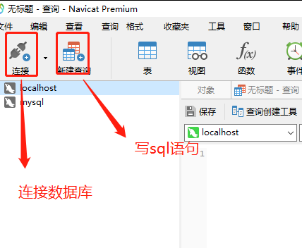
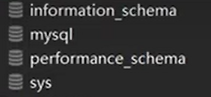
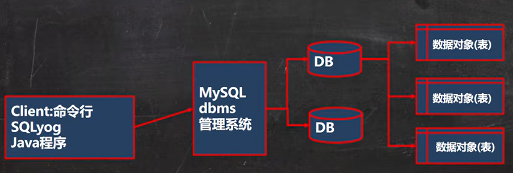

# mysql

## 安装

[http://www.mysql.com](http://www.mysql.com)

安装过程较复杂，参考视频教程安装

### 安装错误

**删除已经安装好的mysql**==要慎重==

```mysql
sc delete mysql
```

### 配置环境变量

### 查mysql版本

```mysql
mysql --version
```

## mysql基本使用

### 启动mysql服务

```mysql 
net start mysql
```

### 关闭mysql服务

```mysql
net stop mysql
```

### 连接到mysql服务

```mysql
# 方法一
mysql -u root -p
root

# 方法二 p和密码之间没有空格
mysql -u root -proot

# 连接指定的 ip和端口  
# 127.0.0.1也可以写localhost默认本机；
# P端口号要大写，（不写的话默认）3306
mysql -h 127.0.0.1 -P 3306 -u root -proot
```

### 使用mysql服务中的mysql数据库

```mysql
# 使用mysql中的mysql数据库
use mysql;
```

### 修改mysql数据库的密码

```mysql
# 修改密码
update user set authentication_string=password('root')where user='root' and Host='localhost';

# 刷新权限,刷新权限之后才能生效
flush privileges
```

### 退出数据库

```mysql
quit
```


# 可视化软件


## navicat使用

### 安装

官网安装，直接下一步

### 基本使用



### 四个不要乱动的数据库




## sqlyog使用

同[navicat](# navicat使用)


# mysql的三层结构

DBMS(数据库管理系统): 监听3306端口





#  sql 语句

## sql语句分类

> DDL: 数据定义语句[creat 表，库...]
>
> DML: 数据操作有语言[增加 insert, 修改 update, 删除 delete]
>
> DQL: 数据查询语句[select]
>
> DCL: 数据控制语句[管理数据库: 比如用户权限 grant revoke] 

## 创建数据库

1. 创建默认数据库

```mysql
create database [if not exists] db_name
```

2. 删除数据库

```mysql
drop database [if exists] db_name
```

3. 创建一个使用utf8字符集的数据库

```mysql
create database db_name character set utf8
```

4. 创建一个使用utf8字符集，并带校对规则的数据库

```mysql
# 校对规则utf8_bin区分大小写，默认utf8_general_ci不区分大小写
create database db_name character set utf8 collate utf8_bin
```

## 查询数据库

1. 查看当前数据库服务器中的所有数据库

```mysql
show databases
```

2. 查看前面创建的数据库的定义信息

```mysql
show create database db_name
```


| mysql基本使用                                 |                  |
| --------------------------------------------- | ---------------- |
| show databases;                               | 显示数据库列表   |
| use database;                                 | 进入数据库       |
| show tables;                                  | 显示数据库中的表 |
| desc + 表名                                   | 查询表结构       |
| show create table 表名                        | 查看字符集       |
| drop table if exists 表名                     | 删除表名         |
| alert table 表名 rename to 新表名             | 表重命名         |
| alert table stu gender varchar(10)            | 添加列           |
| alert table stu change gender sex varchar(20) | 修改列名         |
|                                               |                  |

| sql语句-dml                                       |            |
| ------------------------------------------------- | ---------- |
| insert into 表名 (列名1，列名n）values (值1，值n) | 添加数据   |
| insert into 表名 values（值1，值n）               |            |
| select * from stu                                 | 查询数据   |
| delete from 表名 [where 条件]                     | 删除数据   |
| select * from 表名 where name like G%;            | 模糊查询   |
| select * from  表名 where name in ("sy", "ym");   | 查询多个值 |
|                                                   |            |
|                                                   |            |
|                                                   |            |

```mysql
//创建表

create table stu(
	id int,
	name varchar(32),
	age int,
	score double(4,1),
	birthday date,
	insert_time TIMESTAMP
);

// 删除表
 drop table if exists 表名
 
 //复制表
 create table student like stu;
```

