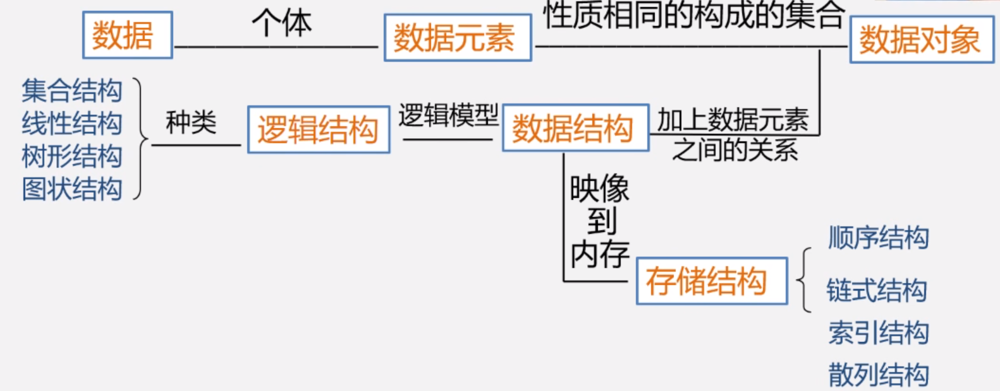
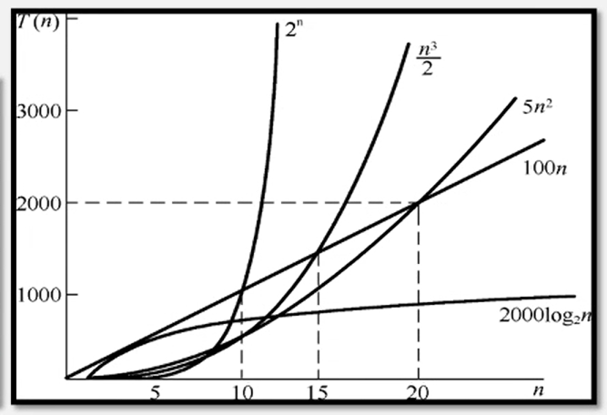

# 基本术语

##  数据结构 

+ 数据元素之间的逻辑关系，也成为逻辑结构
+ 数据元素及其关系在计算机内存中的表示(又称为映像)，称为数据的物理结构或数据的存储结构
+ 数据的运算和实现，即对数据元素可以施加的操作以及这些操作在相应的存储结构上的实现

1. ==**逻辑结构**==
   + 描述数据元素之间的逻辑关系
   + 与数据的存储无关，独立于计算机
   + 是从具体问题抽象出来的数学模型
2. ==**物理结构(存储结构)**==
   + 数据 元素及其关系在计算机存储器中的结构(存储方式)
   + 是数据结构在计算机中的表示
3. 逻辑结构和存储结构的关系
   + 存储结构是逻辑关系的映像与元素本身的映像
   + 逻辑结构是数据结构的抽象，存储结构是数据结构的实现

## 算法

==**程序 = 数据结构 + 算法**==

### 时间复杂度

# 线性表

