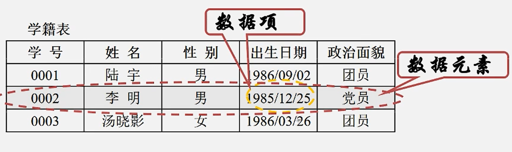
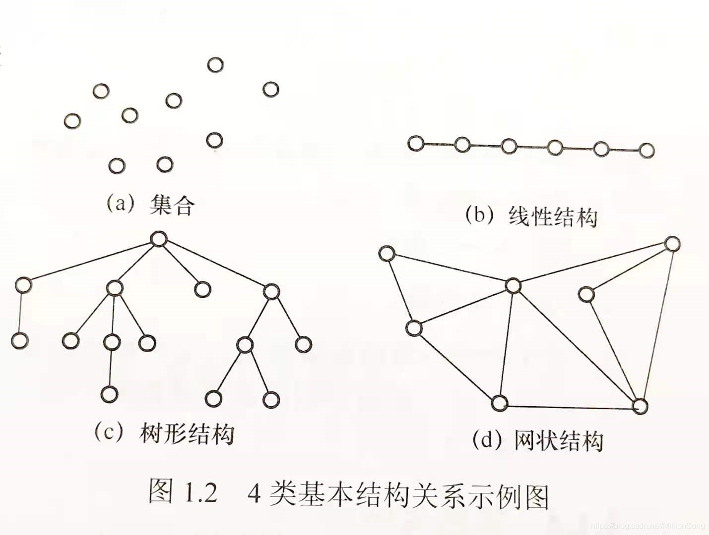
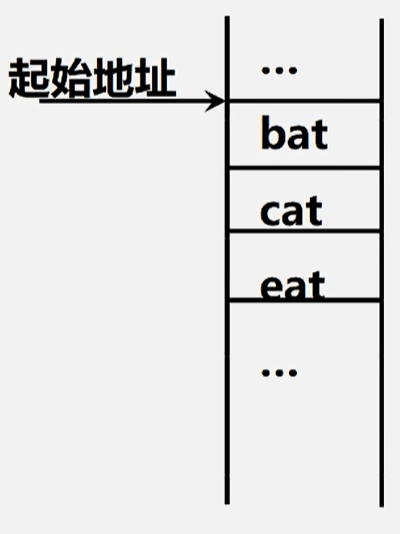
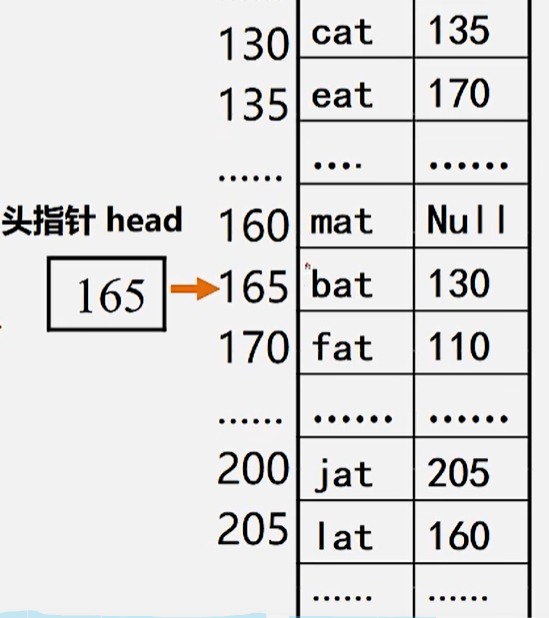
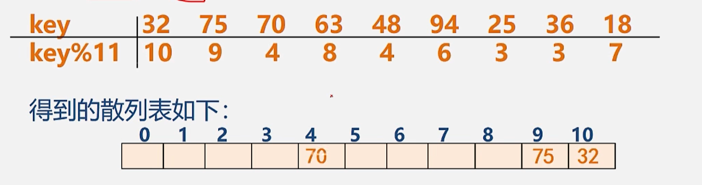
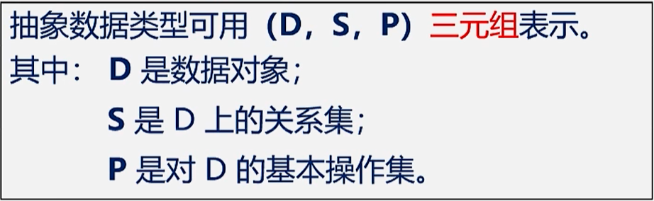

# 0. 基本术语

## 0.1 数据

**1. 数据(Data)：是能输入计算机且能被计算机处理的各种符号的集合**

+ 信息的载体
+ 是对客观事物的符号化表示
+ 能够被计算机识别、存储和加工

   **分类：**

+ 数值型数据： 整数，实数等
+ 非数值型数据： 文字、图像、图形声音等

**2. 数据元素(Data element)和数据项**

1. 数据元素
   + 是数据的基本单位，在计算机中通常作为一个整体进行考虑和处理
   + 也简称为元素，或称为记录、节点或顶点
   + 一个数据元素可由若干个数据项(Data Item)组成
   + 与数据的关系： 是集合的个体
2. 数据项
   + 构成数据元素不可分割的最小单位

3. 数据对象

+ 是性质相同的数据元素的集合，是数据的一个子集
+ 与数据的关系：集合的子集

## 0.2 数据结构 

**1.  数据结构**

+ 数据元素之间的逻辑关系，也成为逻辑结构
+ 数据元素及其关系在计算机内存中的表示(又称为映像)，称为数据的物理结构或数据的存储结构
+ 数据的运算和实现，即对数据元素可以施加的操作以及这些操作在相应的存储结构上的实现

1. ==**逻辑结构**==
   + 描述数据元素之间的逻辑关系
   + 与数据的存储无关，独立于计算机
   + 是从具体问题抽象出来的数学模型
2. ==**物理结构(存储结构)**==
   + 数据 元素及其关系在计算机存储器中的结构(存储方式)
   + 是数据结构在计算机中的表示
3. 逻辑结构和存储结构的关系
   + 存储结构是逻辑关系的映像与元素本身的映像
   + 逻辑结构是数据结构的抽象，存储结构是数据结构的实现

**2. 逻辑结构的种类**

 1. 划分方法一

    + 线性结构

      有且仅有一个开始和一个终端节点，并且所有节点都最多只有一个直接前驱和一个直接后继。

      例如： 线性表、栈、队列、串

    + 非线性结构

      一个节点可能有多个直接前驱和直接后继

      例如：树、图

2. 划分方法二：

   + 集合结构
   + 线性结构
   + 树形结构
   + 网状结构

   

 **3. 存储结构的种类**

1. 顺序存储结构

   + 用一组连续的存储单元依次存储数据元素，数据元素之间的逻辑关系由元素的存储位置来表示
   + c语言中用数组来实现顺序存储结构

   

2. 链式存储结构

   + 用一组任意的存储单元存储数据元素，数据元素之间的逻辑关系用指针来表示
   + C语言中用指针来实现链式存储结构

   

3. 索引存储结构

   + 在存储结点信息的同时，还建立附加的**索引表**

4. 散列存储结构

   + 根据结点的关键字直接计算处该结点的存储地址

   

## 0.3 数据类型

**1.  C语言中的数据类型**

+ `int, char, float, double等`
+ 数组，结构，共用体，枚举等构造数据类型
+ 指针、空(void)类型
+ 用户自定义类型

**2. 抽象数据类型(Abstract Data Type,ADT)**

+ 用户定义的，从问题抽象出的数据模型(逻辑结构)

+ 以及定义在数据模型上的一组抽象运算

  

## 0.4 算法

==**程序 = 数据结构 + 算法**==

# 1. 复杂度

