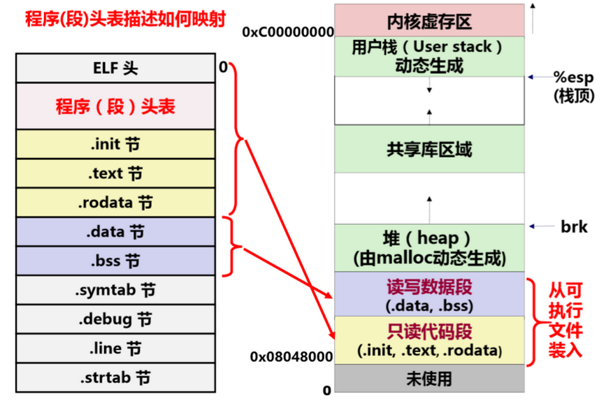

# 计算机的层次结构

## 计算机中的基本部件

## 计算机是如何工作的

+ 程序执行前

  数据和指令实现存放在存储器中，每条指令和每个数据都有地址，指令按序存放，指令由OP、ADDR字段组成，程序其实地址置PC

+ 开始执行程序

  根据PC取指令

  指令译码 

  取操作数

  指令执行

  回写结果

  修改PC的值

  继续执行吓一跳指令

## 高级语言转换成机器语言程序的两种转换方式

+ 编译Complier: 将高级语言源程序转换为机器级目标程序，执行时只要启动目标程序即可
+ 解释Interpreter: 将高级语言逐条翻译成机器指令并执行，不生成目标文件

# 数值在计算机中的表示

## 移码

对接时使用，小阶向大阶看齐。

阶码=偏置 = 阶(真值的指数)

## 大端存储和小端存储

数的高位存放在低地址成为大端存储，反之称为小端存储

# 程序和指令的关系

## 指令的概念

+ 机器指令处于硬件和软件的交界面
+ 微指令是微程序级命令，属于硬件范畴
+ 伪指令是由若干机器指令组成的指令序列，属于软件范畴
+ 汇编指令是机器指令的汇编表示形式，即符号表示

## 可执行文件的存储映像

## IA-32

### IA-32寄存器的组织

**通用寄存器**

EAX - 存放累加操作数和结果，传递参数和结果等

EBX - 指向DS数据段中数据的指针

ECX - 字符串和循环操作的计数器

EDX - I/O指针

ESI - 指向DS数据段中数据的指针；字符串操作的源指针

EDI - 根ES配合，指向目的数据的指针；字符串操作的目的指针

ESP - 栈指针

EBP - 指向栈中数据，一般用作函数嵌套调用时的栈帧基址

**段寄存器**
CS - 代码段寄存器

DS - 数据段寄存器

SS - 栈段寄存器

ES - 附加段寄存器

FS - 附加段寄存器

GS - 附加段寄存器

**程序状态与控制寄存器**

+ 条件标志

​	ZF - 零标志 结果为0,则为true,否则为false

​	OF - 溢出标志

​	CF - 进位和借位标志

​	SF - 符号标志

​	AF - 辅助进位标志

​	PF - 奇偶标志

+ 控制标志

  DF - 方向标志

  IF - 中断允许标志（仅对外部可屏蔽中断有用）

  TF - 陷阱标志（是否是单步跟踪状态）

**指令指针寄存器**

EIP - 指令指针寄存器，保存着CPU要执行的指令地址，大小为32位即4个字节

程序运行时，CPU会读取EIP中的一条指令地址，传送指令到指令缓冲区后，EIP寄存器的值将自动增加，增加的大小为读取指令的字节大小。CPU每次执行完一条指令，就会通过EIP寄存器读取并执行下一条指令。

### IA-32寻址方式

+ 如何根据指令给定信息得到操作数地址

+ 操作数所在位置

  立即寻址（指令中直接给出操作数）

  寄存器寻址（给出的寄存器中为操作数）

  其他寻址方式（基址加偏移，相对寻址pc加偏移）

+ 操作数的寻址方式与微处理器的工作模式有关

  实地址模式和保护模式（虚拟地址）

