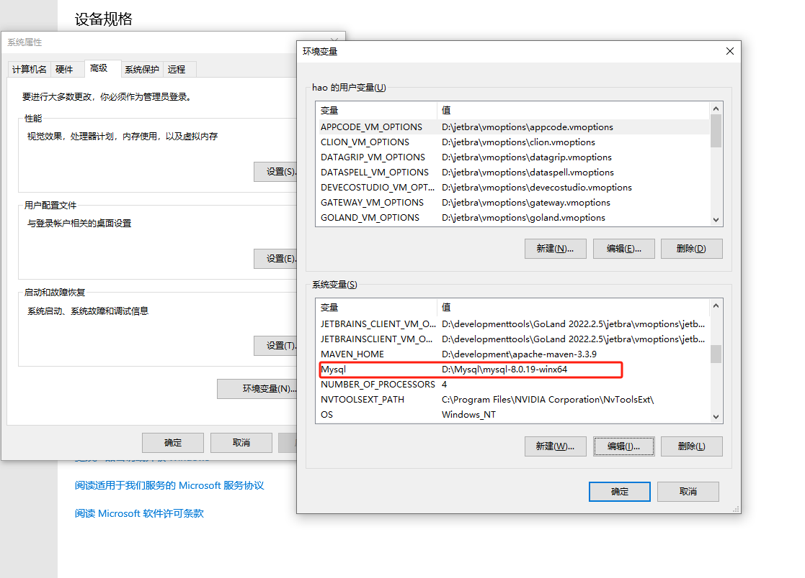
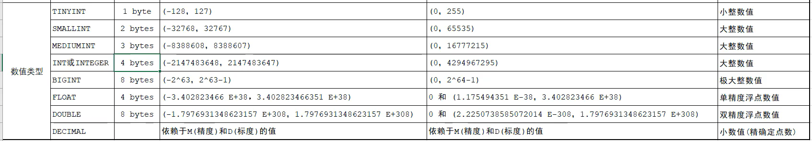
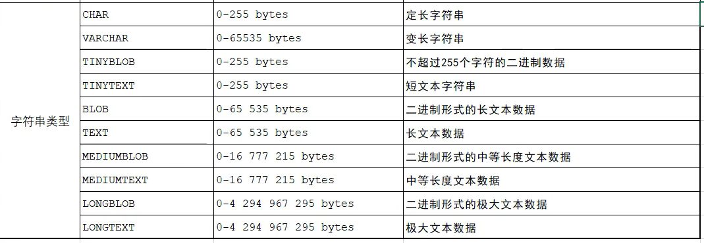
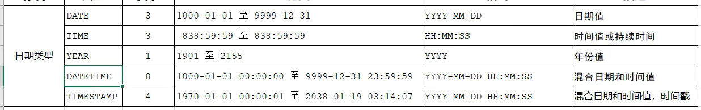

# MySQL

## 卸载

**删除已经安装好的mysql**==要慎重==

```mysql
sc delete mysql
```

## 安装

官网下载，默认安装   ==默认端口号3306==

设置root密码

## 配置环境变量



## mysql基本使用

### 启动mysql服务

```mysql 
net start mysql
```

### 关闭mysql服务

```mysql
net stop mysql
```

### 连接到mysql服务

```shell
# 方法一
mysql -u root -p
root     // 这是密码

# 方法二 p和密码之间没有空格
mysql -u root -proot

# 连接指定的 ip和端口  
# 127.0.0.1也可以写localhost默认本机；
# P端口号要大写，（不写的话默认）3306
mysql -h 127.0.0.1 -P 3306 -u root -proot
```

## SQL

### SQL通用语法

1. SQL语句可以单行或多行书写，以分号结尾
2. SQL语句可以使用空格/缩进来增强语句的可读性
3. MySQL数据库的SQL语句不区分大小写，关键字建议使用大写
4. 注释：
   + 单行注释：-- 或者 #
   + 多行注释: /* */

### DDL

数据定义语言（Data Definition Language）用来定义数据库对象（数据库，表，字段）

**1.数据库操作**

+ 查询

  查询所有数据库

  ```sql
  SHOW DATABASES;
  ```

  查询当前数据库

  ```sql
  SELECT DATABASE();
  ```

+ 创建

  ```sql
  CREATE DATABASE [IF NOT EXISTS] 数据库名 [DEFAULT CHARSET 字符集][COLLATE 排序规则];
  ```

+ 删除

  ```sql
  DROP DATABASE [IF EXISTS] 数据库名;
  ```

+ 使用

  ```sql
  USE 数据库名
  ```

**2.表操作-查询**

+ 查询当前数据库所有表

  ```sql
  show tables;
  ```

+ 查询表结构

  ```sql
  desc 表名;
  ```

+ 查询指定表的建表语句

  ```sql
  show create table 表名;
  ```

  表操作-创建

  ```sql
  create table 表名(
  	字段1 字段1类型 [comment 字段1注释]，
      字段2 字段2类型 [comment 字段2注释]
  )[comment 标注注释];
  ```

**3.数据类型**

+ 数值类型



+ 字符串类型



+ 日期类型




**4.表操作-修改**

+ 添加字段

  ```sql
  alter table 表名 add 字段名  类型(长度) [comment 注释][约束];
  ```

+ 修改数据类型

  ```sql
  alter table 表名 modify 字段名 新数据类型(长度);
  ```

+ 修改字段名和字段类型

  ```sql
  alter table 表名 change 旧字段名 新字段名 类型(长度) [comment 注释][约束];
  ```

+ 删除字段

  ```sql
  alter table 表名 drop 字段名;
  ```

+ 修改表名

  ```sql
  alter table 表名 rename to 新表名;
  ```

**5.表操作-删除**

+ 删除表

  ```sql
  drop table[if exists] 表名;
  ```

+ 删除指定表，并重新创建该表

  ```sql
  truncate table 表名;
  ```

  

### DML

数据操作语言（Data Manipulation Language）用来对数据库表中的数据进行增删改

### DQL

数据查询语言（Data Query Language）用来查询数据库中表的记录

### DCL

数据控制语言（Data Control Language）用来创建数据库用户、控制数据库的访问权限

