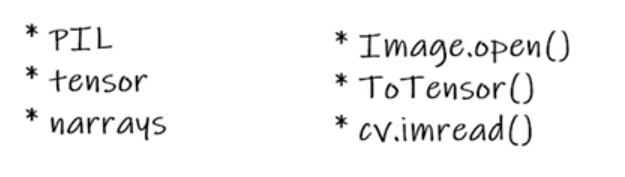

# 使用transforms

```python
from torchvision import transforms
from PIL import Image


img_path = "../dataset/train/ants/6240338_93729615ec.jpg"
img = Image.open(img_path)
img.show()

# 1.transforms如何使用 
tensor_trans = transforms.ToTensor()
img_tensor = tensor_trans(img)
print(type(img_tensor))
```

## 三种图片格式的打开方式



## 归一化

减均值，除以标准差

```python
from PIL import Image
from torchvision import transforms
from torch.utils.tensorboard import SummaryWriter


img = Image.open("../images/v2-b9b988349f80d686f8e4bc3409745281_r.png")
# print(img)
writer = SummaryWriter("logs")


trans_totensor = transforms.ToTensor()
img_tensor = trans_totensor(img)
writer.add_image("tensor_img", img_tensor)


# Normalize
trans_norm = transforms.Normalize([0.5, 0.5, 0.5], [0.5, 0.5, 0.5])
writer.add_image("norm_img", trans_norm(img_tensor))


writer.close()
```


## Resize

```python
# Resize

print(img.size)
trans_resize = transforms.Resize((512, 512))
writer.add_image("resize", trans_resize(img_norm), 0)


trans_resize_2 = transforms.Resize(512)
trans_compose = transforms.Compose([trans_resize_2, trans_totensor])
img_compose = trans_compose(img)
writer.add_image("resize", img_compose, 1)
```


## RandomCrop随机裁剪

```python
# RandomCrop
trans_random = transforms.RandomCrop(256)
trans_compose_2 = transforms.Compose([trans_random, trans_totensor])

for i in range(10):
    img_crop = trans_compose_2(img)
    writer.add_image("RandomCrop", img_crop, i)
```

## 总结

+ 关注输入输出(查官方文档)
+ 关注方法需要什么参数，默认值保持不变
+ 不知道返回值类型的话，可以用print(data), print(type(data))