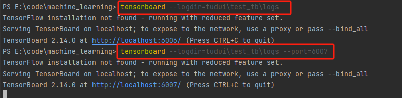

# Tensorboard可视化

## 基础使用

```python
from torch.utils.tensorboard import SummaryWriter

writer = SummaryWriter("logs")


# writer.add_image()
for i in range(100):
    writer.add_scalar("y = x", i, i)


writer.close()
```



## 添加图片

```python
from torch.utils.tensorboard import SummaryWriter
import cv2
from PIL import Image
import numpy as np

writer = SummaryWriter("logs")

image_path = "./../dataset/train/ants/20935278_9190345f6b.jpg"
img = Image.open(image_path)
img_array = np.array(img)
print(img_array.shape)
writer.add_image("test", img_array, 1, dataformats="HWC")

for i in range(100):
    writer.add_scalar("y = 2x", 2 * i, i)


writer.close()
```

