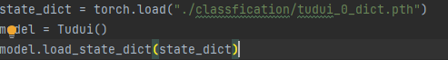
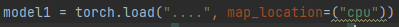

# 模型验证

+ 如果保存的模型和测试文件不在同一个目录下，那么只能用只加载模型参数的方式，不能用直接加载模型

  可以在同个目录下，先加载模型，在保存参数，然后再另外一个文件加载参数

  

+ 如果使用gpu保存的模型，再cpu环境下加载时要指定为cpu方式

  

```python
from PIL import Image
import torchvision
from torch import nn
import torch


# 搭建神经网络
class Tudui(nn.Module):

    def __init__(self):
        super(Tudui, self).__init__()
        self.model = nn.Sequential(
            nn.Conv2d(3, 32, 5, padding=2),
            nn.MaxPool2d(2),
            nn.Conv2d(32, 32, 5, padding=2),
            nn.MaxPool2d(2),
            nn.Conv2d(32, 64, 5, padding=2),
            nn.MaxPool2d(2),
            nn.Flatten(),
            nn.Linear(64*4*4, 64),
            nn.Linear(64, 10)
        )

    def forward(self, x):
        return self.model(x)


image_path = "./images/v2-b9b988349f80d686f8e4bc3409745281_r.png"
image = Image.open(image_path)
print(image)

transform = torchvision.transforms.Compose(
    [torchvision.transforms.Resize((32, 32)),
     torchvision.transforms.ToTensor()]
)

image = transform(image)
print(image.shape)
state_dict = torch.load("./classfication/tudui_0_dict.pth")
model = Tudui()
# model.load_state_dict(state_dict)
model1 = torch.load("....", map_location=("cpu"))
image = torch.reshape(image, (1, 3, 32, 32))
print(image.shape)
output = model(image)

model.eval()
with torch.no_grad():
    output = model(image)

print(output)
# print(tudui)
```

