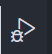

### 1.开发环境搭建

1. 下载minGW64和cmake解压将只能装包复制到开发program Files 文件夹中；

2. 复制bin目录路径，系统变量中path目录下新建环境变量；

### 2.编写调试程序

~~~c++
```#include <iostream>
using namespace std;

void swap(int &a, int &b){
    int temp;
    temp = a;
    a = b;
    b = temp;
}
int main(int argc, char **argv){
    int val1 = 10;
    int val2 = 20;
    cout << "Brfore swap:" << endl;
    cout << "val1 = "<< val1 << endl;
    cout << "val2 = "<< val2 << endl;
    swap(val1, val2);
    cout <<"After swap:" << endl;
    cout << "val1 = "<< val1 << endl;
    cout << "val2 = "<< val2 << endl;
}
~~~
编译运行，打开terminal

```cmd
g++ mian + tab键
a.exe

g++ -g main+tab -o mysingle_swap    //-g表示生成可调试文件，-o给文件重新命名
mysingle_ swap
```

调试

点击debug按钮



create .json 文件

f9 大断点

f5 调试

vim的指法，或者emacs的指法