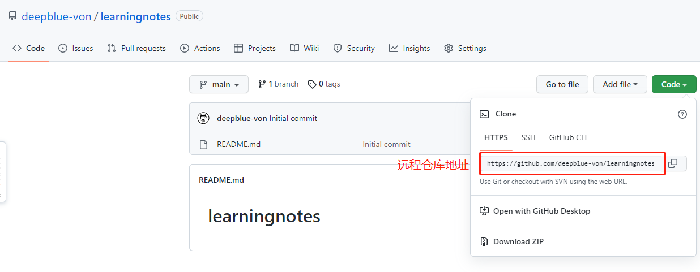

# git

**==分布式版本控制工具==**

## git基本操作

### 初始化本地仓库

==右键-->git bash here==

```git
# 在当前目录初始化一个git本地仓库
git init
```


**执行操作后在learningnotes目录下生成一个.git文件夹**


### 配置提交者信息

==--golbal在电脑的该用户所有仓库都用同样的配置信息==

名称和邮箱都可以随便填，与远程仓库和github没有任何关系

```git
git config --global user.name "kuangshen"  #名称
git config --global user.email 24736743@qq.com   #邮箱
```


### git基本命令

```git
# 显示工作区和暂存区的状态
git status

# 将文件添加到暂存区
git add  文件名.后缀

# 将工作区所有文件添加到暂存区
git add .

# 从工作区和索引中删除文件
git rm  file

# 将指定文件从暂存区提交到本地仓库
git commit -m "提交信息"  文件名.后缀

# 将暂存区所有文件提交到本地仓库
git commit -m "提交信息"

# 将暂存区的文件删除（不删除工作区）
git rm --cached  file

# 查看版本信息
git reflog

# 查看完整版本信息
git log

```

#### git commit操作以及退出日志编辑状态

刚进去时发现怎么也输入都没反应，是因为此时vim编辑器处于不可编辑状态，输入字母 `c` 可以进入编辑状态，这个时候就可以修改注释信息啦 ~

修改完之后按`esc`键退出编辑状态，再按大写`ZZ`就可以保存退出vim编辑器。

## 版本穿梭

本地仓库保存了所有提交的版本，所以可以放心穿梭而不用担心丢失信息

==本地仓库靠head指针调整指向的分支内容，（不同分支指向不同版本内容）==

 

```git
# 查看版本号
git reflog

```


```git
# 穿梭会历史版本
git reset --hard 历史版本号
```


### git分支中常用指令

**分支的好处**

+ 同时并行推进多个功能开发，提高开发效率

+ 各个分支在开发过程中，如果一个分支开发失败，不会对其他分支有任何影响，失败的分支删除重新开始即可
+ 

```git
# 列出所有本地分支
git branch

# 列出所有远程分支
git branch -r

# 新建一个分支，但依然停留在当前分支
git branch [branch-name]

# 新建一个分支，并切换到该分支
git checkout -b [branch]

# 合并指定分支到当前分支
$ git merge [branch]

# 删除分支
$ git branch -d [branch-name]

# 删除远程分支
$ git push origin --delete [branch-name]
$ git branch -dr [remote/branch]
```


## 远程仓库


### ==工作原理：==

**1. 团队内协作**


**2. 跨团队协作**


### 在远程创建一个仓库并将本地仓库关联到远程仓库

```git
# 配置远程仓库(origin 别名，可以起别的名字)
git remote add origin ssh                
git remote add 别名 远程地址     

# 查看远程仓库信息
git remote -v

# 删除关联的远程仓库（只是删除关联，并没有删库）
git remote remove orign
```


**1. 创建仓库：**


**2. 关联仓库：**




### 推送本地仓库代码到远程仓库

```git
# 把代码提交到远程仓库 
git push 远程别名 本地分支
git push -u origin master   

# 填写-u之后，下次提交可简写为
git push
```


### 拉取远程仓库的代码到本地仓库

```git
# 直接拉取远程代码并合并到本地
git pull 远程别名 远程分支

# git pull相当于下面两条
git fetch
git merge
```

### 克隆远程代码

==克隆代码不需要登陆账号==

```git
git clone ssh 
```

**clone会做三件事：**

1. 完整的把远程库下载到本地
2. 创建origin远程地址别名
3. 初始化本地库


## 团队内协作

**1. 邀请合作伙伴**


**2. 接受邀请**

获得邀请函之后，登录自己的github，在地址栏复制并搜索-->点击接受


然后就可以推送代码到远程库了


## 跨团队协作


**1. 找到别人的项目，点击fork,改完之后点击pull request**


**2. 本团队可以在pull request中看到其他人的拉取请求**


## linux命令

| command | means                                                        |
| ------- | ------------------------------------------------------------ |
| cd      | 改变目录                                                     |
| cd..    | 退回到上级目录                                               |
| pwd     | 显示当前目录的路径                                           |
| ls(ll)  | 列出当前目录的所有文件                                       |
| touch   | 新建一个文件                                                 |
| rm      | 删除文件                                                     |
| mkdir   | 新建目录                                                     |
| rm -r   | 删除文件夹                                                   |
| mv      | mv index.html src   <br />index.html 是要移动的文件, src 是目标文件夹<br/>必须保证文件和目标文件夹在同一目录下 |
| clear   | 清屏                                                         |
| exit    | 退出                                                         |
|         |                                                              |
|         |                                                              |
|         |                                                              |


