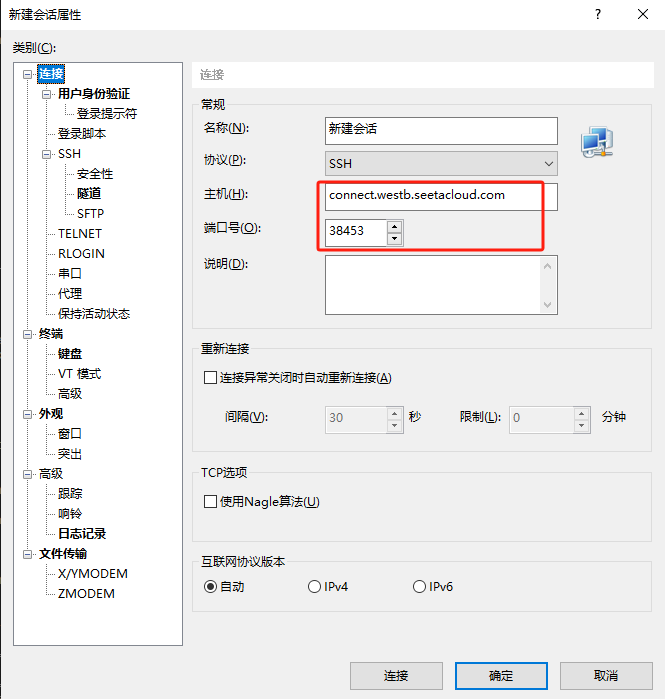
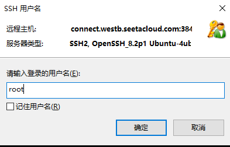
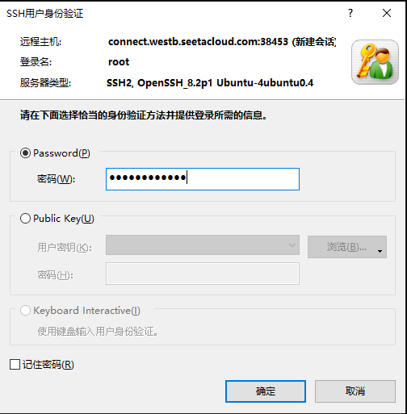

# 如何远程连结服务器

+ 从`autodl`租来的服务器

   ```c
  连结指令：  ssh -p 38453 root@connect.westb.seetacloud.com
  密码：     5RuIsmhaPnW8
   ```

  

+ 根据指令填写IP和端口号

  

+ 设置用户名，建议root

  

+ 输入密码，为`autodl`自动生成的密码

