# Linux入门

## Linux系统结构

### Linux组件

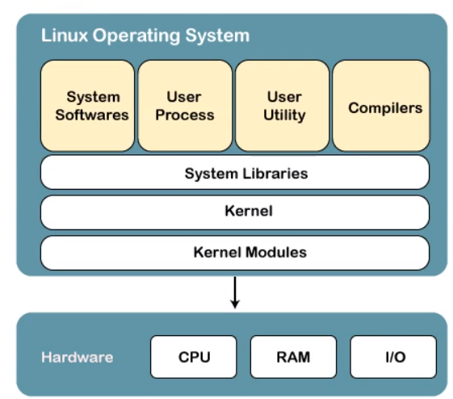

### Linux内核


## 安装ubantu

### 1.制作系统启动盘

+ 将u盘格式化为fat32格式
+ 下载镜像 .iso
+ 下载universial-usb-installer
+ 按步骤制作启动盘

### 2.创建空的硬盘分区

+ 拆分出一块分区

+ 格式化当前分区ext4

  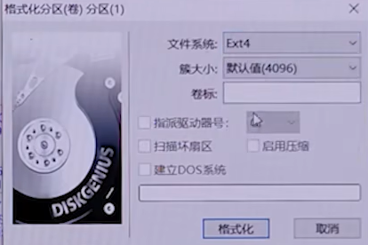

### 3.安装

+ f12  选择u盘

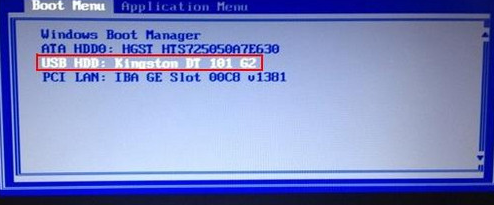

+ install

  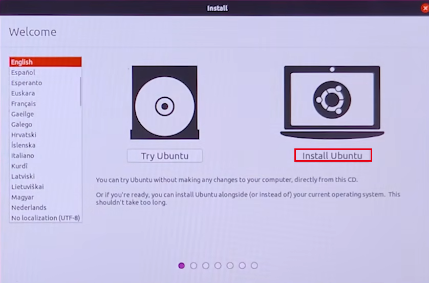

  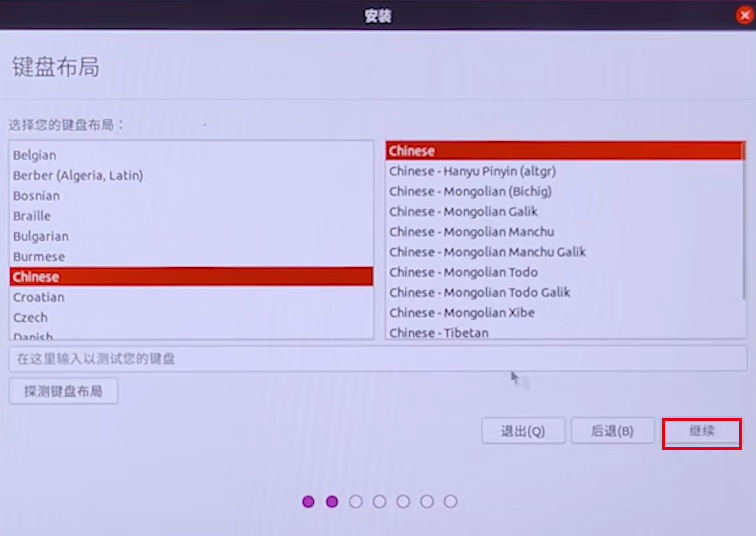

+ 如果看到turn off RST 转到第四步

+ 继续

  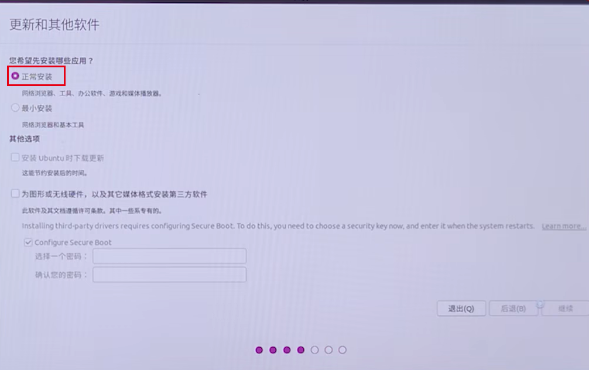

+ 安装选项<span style="color:red">慎重</span>

  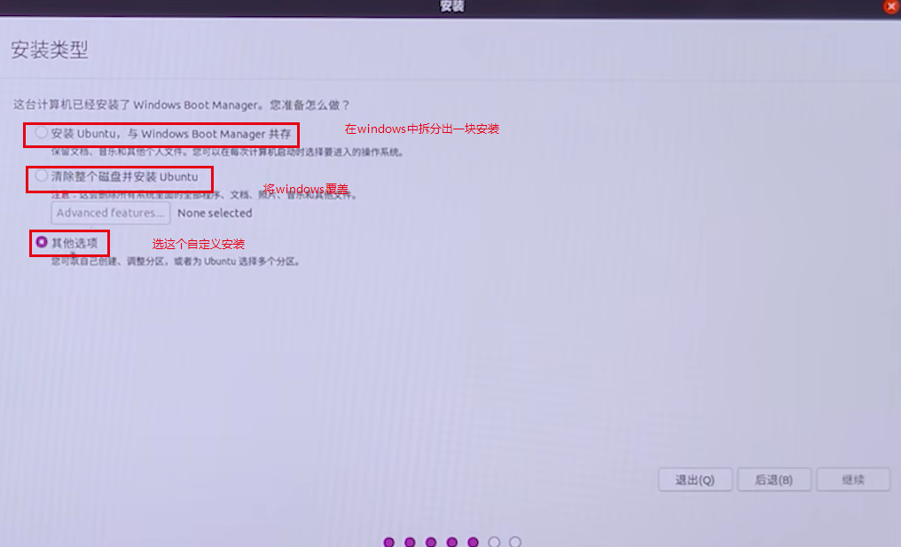

+ 找到刚才创建的分区

  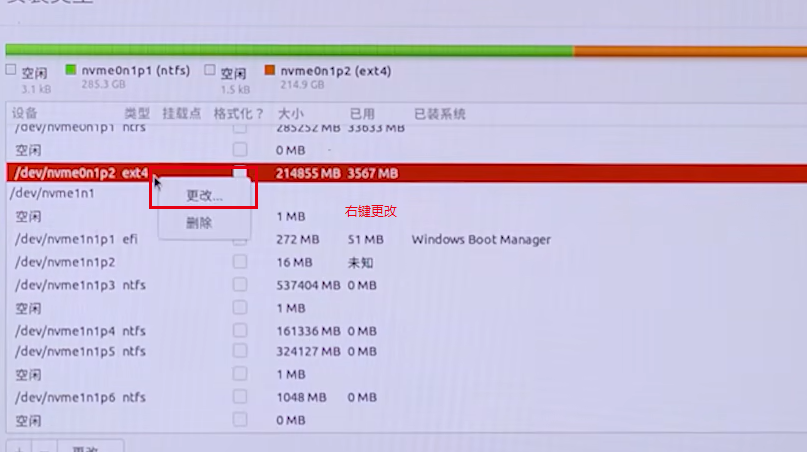

  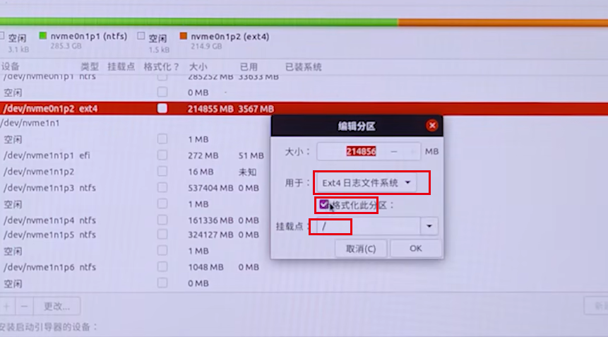

  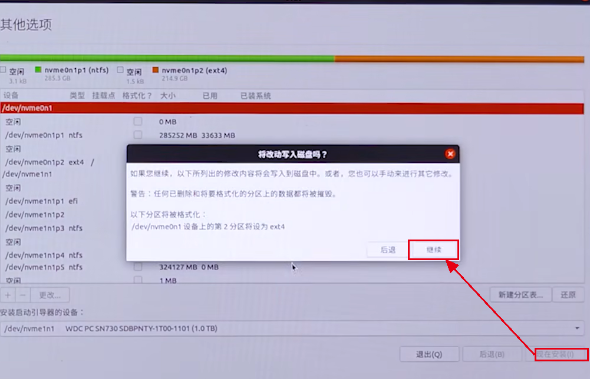

+ 设置用户名密码

  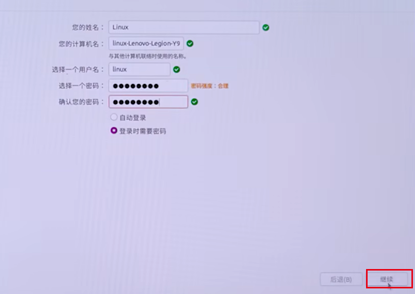

+ 自动安装大功告成


### 4.如果出现turn off RST

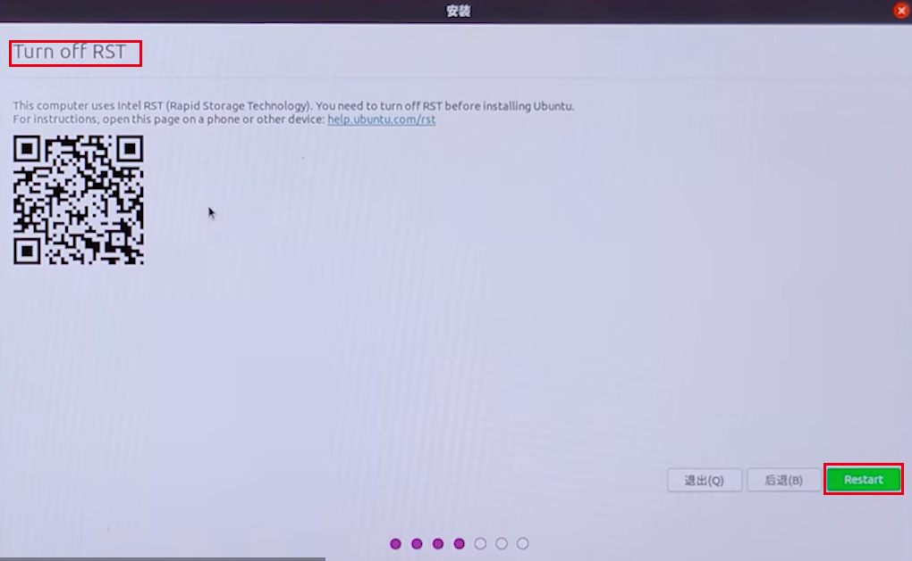

+ 返回windows

  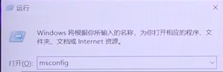

  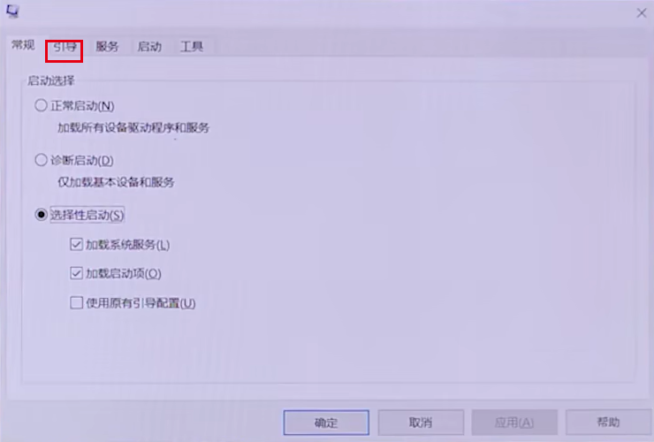

  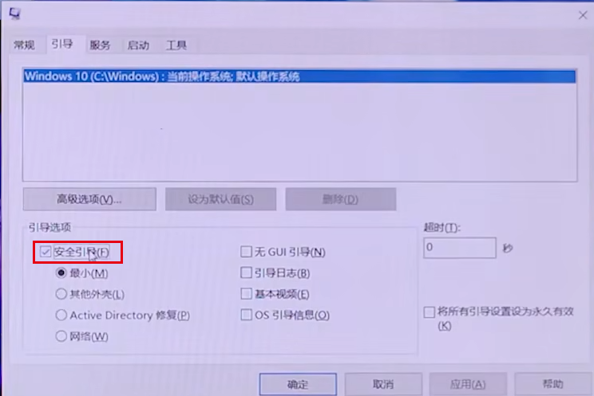

  

+ f2键进入UEFI的bios设置

+ configuration中找到存储设置

  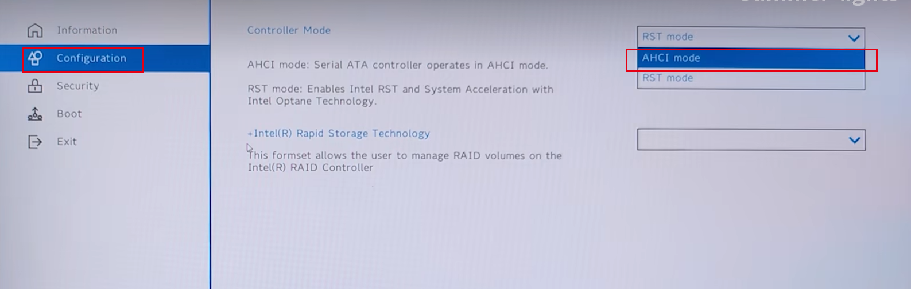

+ f10保存并退出

+ 将这个关闭，重启

  

  


## wsl设置root密码


# linux目录结构

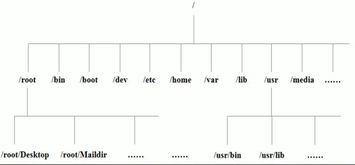


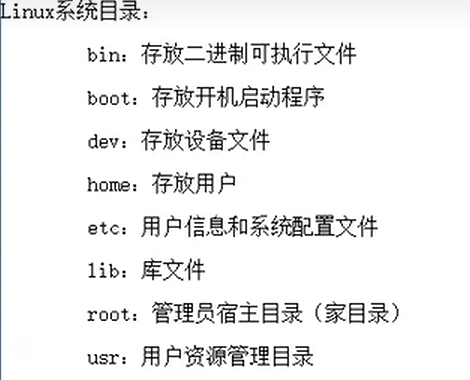

+ /bin **常用**（/usr/bin、/usr/local/bin）

  是binary的缩写，这个目录存放着最经常使用的命令

+ /sbin （/usr/sbin、 /usr/local/sbin）

  s就是super user的意思，这里存放的是系统管理员使用的系统管理程序

+ /home **常用** 

  存放普通给用户的主目录，在linux中每个用户都有一个自己的目录，一般该目录是以用户的账号mingming

+ /root **常用**

  该目录为系统管理员，也称作超级权限者的用户主目录

+ /lib 系统为开机所需要的最基本的动态连接共享库，其作用类似于Windows里的dll文件。几乎所有的应用程序都需要用到这些共享库

+ /lost+found这个目录一般情况下是空的，当系统非法关机后，这里就存放了一些文件

+ /etc **常用**

  所有的系统管理所需要的配置文件和子目录 my.conf

+ /usr **常用**

  这是一个非常重要的目录，用户的很多应用程序和文件都放在这个目录下，类似于windows下的program files目录

+ /boot **常用** 存放的是启动linux时的一些核心文件包括一些连接文件以及镜像文件
+ /proc 这个目录是一个虚拟目录，它是系统内存的映射，访问这个目录来获取系统信息
+ /sys 这是linux2.6内核的一个很大的变化，该目录下安装了2.6内核中新出现的一个文件系统sysfs
+ /tmp 这个目录是用来存放一些临时文件的

+ /dev 类似于Windows的设备管理器，把所有的硬件用文件的形式存储

+ /media **常用**linux系统会自动识别一些设备，例如U盘、光驱等等，当识别后，linux会把识别的设备挂载到这个目录下

+ /mnt **常用**

  系统提供该目录是为了让用户临时挂在别的文件系统的，我们可以将外部的存储挂载到/mnt/上，然后进入该目录就可以查看里面的内容了

+ /opt 这是给主机额外安装软件所摆放的目录。如oracle数据库就可放到该目录下。默认为空

+ /usr/local **常用**

  这是另一个给主机额外安装软件所安装的目录。一般是通过编译源码方式安装的程序

+ /var **常用**

  这个目录中存放着在不断扩充着的东西，习惯将经常被修改的目录放在这个目录下。包括各种日志文件

+ /selinux [security-enhanced linux]

  SELinux是一种安全子系统，他能控制程序这能访问特定文件，有三种工作模式，可以自行设置


# linux shell 快捷键

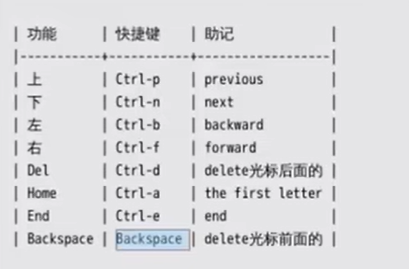


CTRL u  删除行　


# WSL

## WSL联网问题

wsl接外网（clash的ip和端口）

```linux
export http_proxy='http://172.30.224.1:7890'  # 根据实际IP和端口修改地址
export https_proxy='http://192.168.31.100:7890'
export all_proxy='socks5://192.168.3.4:7890'
export ALL_PROXY='socks5://192.168.3.4:7890'
```

## WSL  db5error

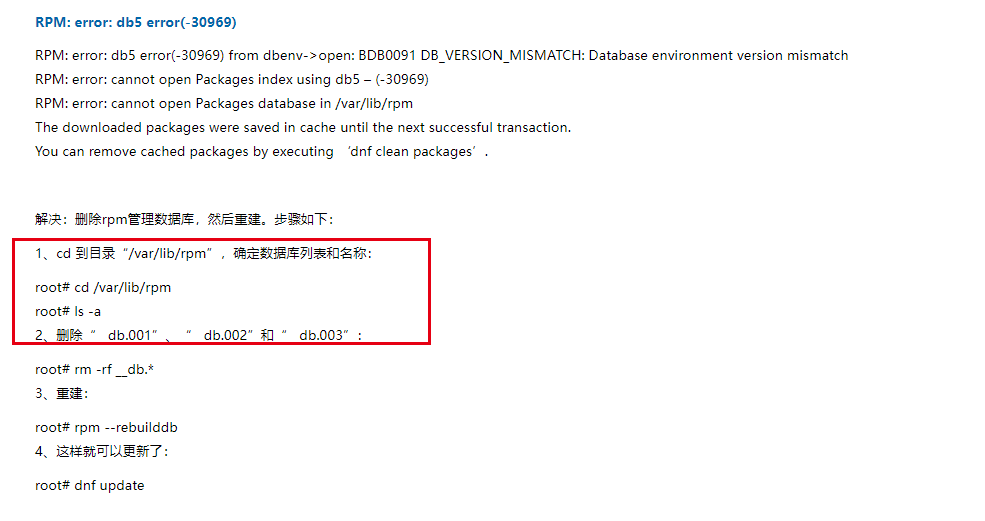

# 远程连接

1. `ifconfig`查看远程ip

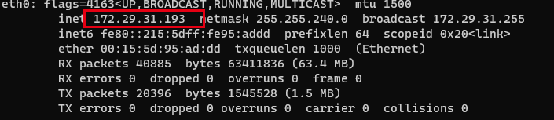


# vim


## vim设置

```shell
inoremap jj <esc>inoremap ' ''<ESC>i
inoremap " ""<ESC>i
inoremap ( ()<ESC>i
inoremap [ []<ESC>i
inoremap { {<CR>}<ESC>O
"编辑模式下jj快速跳出编辑模式
inoremap jj <ESC>
```


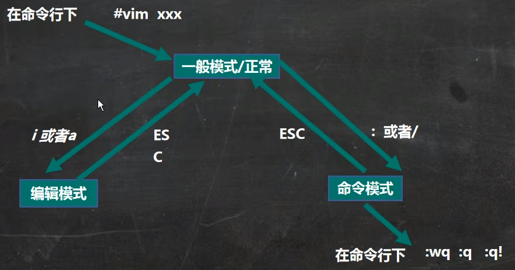

1. 拷贝当前行 yy, 拷贝当前行向下的5行 5yy， 并粘贴p。【一般模式】
2. 删除当前行 dd, 删除当前行向下的5行 5dd 【一般模式】
3. 在文件中查找某个单词【命令行下】/关键字， 回车查找， 输入n就是查找下一个
4. 设置文件的行号，取消文件的行号【命令行下】`:set nu`和`:set nonu` 【一般模式】
5. 编辑/etc/profile文件，使用快捷键到该文档的最行末G和最行首gg 
6. 在一个文件中输入"hello"，==然后撤销这个动作u==
7. 编辑/etc/profile文件，并将光标移动到20行， 20gg
8. hjkl 左下右上

```shell
// 跳转至行首[一般模式]
0

// 跳转至行尾[一般模式]
A

// 打开目录下所有文件
vim * -p 
切换 ctrl pageup

vim -p a.c b.c
gt // 切换至下一个文件
gT // 切换至上一个文件

//  分屏创创建文件
:vsp  sub.c  
ctrl ww  切换窗口

```

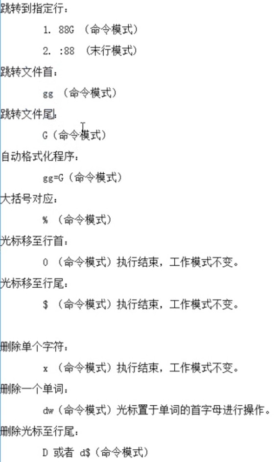


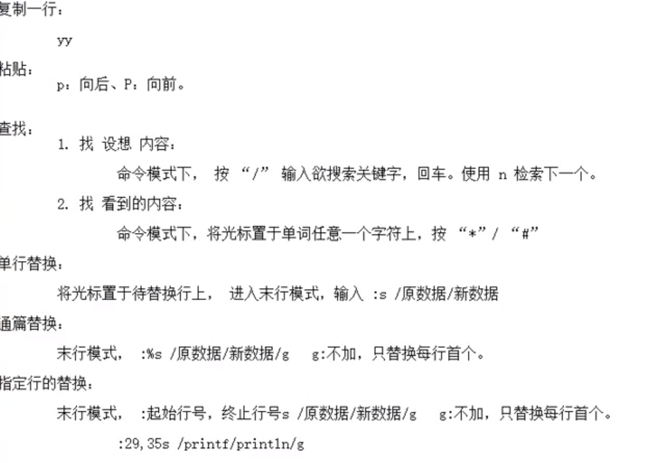

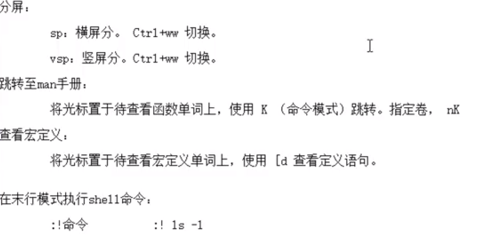


# WSL

cmd下查看当前环境安装的wsl

```cmd
wsl --list
```

注销当前安装的Linux的Windows子系统

```cmd
wsl --unregister ubuntu
```


# 关机&重启命令

```shell
# 立刻进行关机
shutdown -h now

shudown -h 1 "一分钟后关机了"

# 现在重启计算机
shutdown -r now

# 立刻关机
halt

# 现在重启
reboot

# 把内存的数据同步(synchronize)到磁盘
sync
```

<span style="color:red">不管是重启系统还是关闭系统，首先要运行sync命令，把内存中的数据写到磁盘中</span>

# 登录注销

1. 登录时尽量少用root账号登录，因为它是系统管理员，最大的权限，避免操作失误。可以利用普通用户登录后，再用`su username`命令来切换成系统管理员身份
2. 在提示符下输入logout即可注销用户，[logout注销指令在图形运行级别无效]

# 用户管理

linux系统是一个多用户多任务的操作系统，任何一个要使用系统资源的用户，都必须首先向系统管理员申请一个账号，然后以这个账号的身份进入系统

## 创建用户

ubantu下的基本语法`adduser 用户名`

默认该用户的目录在/home目录下

当创建用户成功后，会自动创建和用户名同名的目录

应该可以通过`useadd -d 指定目录 用户名`，给新创建的用户指定目录

**显示当前用户坐在目录**：`pwd`

## 删除用户

`userdel -r 用户名`      删除用户及目录

`userdel 用户名`          只删除用户，不删除目录

## 修改密码

`passwd 用户名`

## 切换用户

`su zhangsan`

`su`   切换到root用户


# 目录和文件操作

```shell
cd - 返回上一个目录
cd ~ 进入用户主目录  /home/linux
cd / 进入根目录

ls -l  列出当前目录下的所有文件，并显示详细信息
ls -a  列出隐藏文件
ls -d  显示目录(命令后面跟着的目录)

touch file.c  创建文件

mkdir dir  创建目录
ls -l dir  查看dir目录下的详细信息
ls -dl dir 查看dir目录本身的信息

ls -R  有目录递归进入查看

rmdir dir  删除空目录
rm -r dir 递归删除目录 
```

## linux系统文件类型

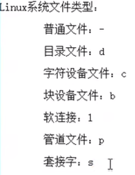

# 常用命令

## which命令

which date  查看命令的位置

## mv

```shell
mv file1 file2   重命名
mv file1 dir1 移动
```

## cp

```shell
cp file1 file2 用file1创建file2
cp file1 dir1  将file1复制到dir1
cp -a dir dir2
```

## cat

```shell
cat file 查看文件并输出到终端
```

## more / less

显示文件内容，空格翻页，回车下一行

## head / tail

```shell
head -15 file 查看前15行
```

## 软连接、硬连接

```shell
ln -s file file.s  给file创建一个file.s的软连接//相当于快捷方式
ln file file.h  创建硬连结
```

+ 为保证软连接在任何地方可用，创建时必须使用绝对路径

## 查看文件状态信息

```shell
stat file
```


## 修改权限

```shell
chmod u+x file.c
chmod 471 file.c
```

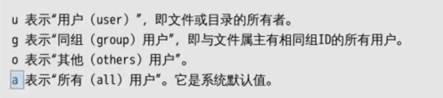

## 修改所有者

```shell
chown user1 a.c  
chown user1:group1 a,c  修改所有者和用户组
```

## 查找文件find

+ linux不以后缀区分文件类型

```shell
find ./ -type 'l'   按文件类型查找
find ./ -name '*.jpg'  按文件名查找
find ./ -maxdepth 1 -name  '*.jpg'   指定寻找层级,maxdepth要作为第一个参数出现
```

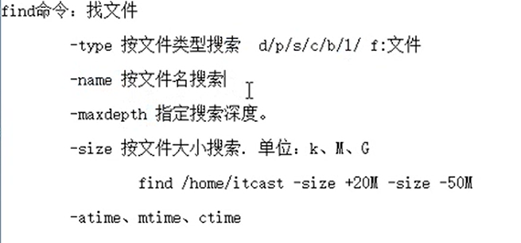

+ 寻找并执行命令 -exec

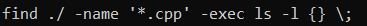

+ -ok  以交互式的方式寻找并执行


+ find 和管道结合  xargs

  将find搜索结果集执行某一指定命令，当结果集数量过大时，可以分片映射

```shell
find ./ -maxdepth 1 -type f | xargs ls -l    // -f表示普通文件
```

将拆分依据改为null

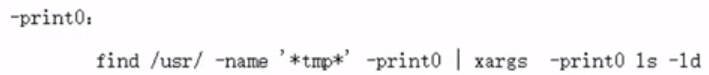

## 查找文件内容grep

```shell
grep -r 'copy' ./ -n
```

## ps	

显示进程状态

```shell
ps aux | grep usr   搜索进程内容包含usr的进程/x代表不仅显示附加到终端的进程，也显示后台进程
```

# 软件安装和卸载

 ```shell
apt-get install
yum install

yum update   //跟新本地软件列表
yum remove 软件名  //卸载软件
 ```

# 压缩和解压

## tar

```shell
tar zcvf 要生成的压缩包名 压缩材料
	tar zcvf test.tar.gz file1 dir2    // 使用gzip方式压缩
tar jcvf test.tar.gz file1 dir2    // 使用bzip2方式压缩
```

**file**: `file  hello.c`查看hello.c的文件类型

```shell
tar zxvf test.tar.gz    // 解压缩
```

## rar

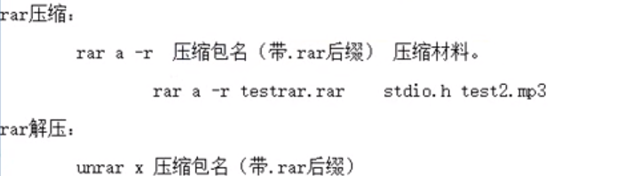

## zip

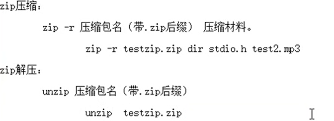

# 其它命令


# 静态库

gcc 进行链接时，会把静态库中代码打包到可执行程序中

## 命名规则


## 制作

```shell
1. 将.c生成a.o文件（.c文件中一定要包含头文件add.h）
gcc -c add.c -o add.o
gcc -c sub.c -o sub.o

2. 使用ar工具之所静态库
ar rcs mylib.a  add.o sub.o

3. 写静态库的配套头文件,add, sub的声明
```

## 使用	

```shell
1. 包含头文件

2. 将静态库一起编译
gcc test.c mylib.a -o test
```

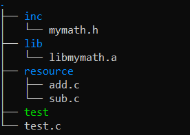

```shell
gcc test.c ./lib/libmyth.a -o test -I ./inc

# mymath是库的名字，lib是库的前缀
gcc main.c -o app -L./lib -l mymath
```


# 动态库

gcc 进行链接时，动态库的代码不会被打包到可执行程序中，程序启动之后，动态库会被加载到内存中

## 命名规则

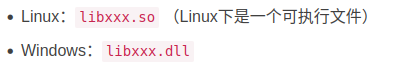

## 制作

```shell
1. 将.c 生成.O文件 （生成与位置无关的代码 -fPIC）
gcc -c add.c -o add.o -fPIC
或者
gcc -c add.c -o add.o -fpic

2. 使用gcc -shared制作动态库
gcc -shared -o lib库名.so  add.o sub.o
```

## 使用

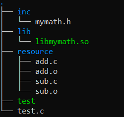

1. 编译可执行程序时指定所使用的动态库,  -l 指定库名， -L指定库路径

   ```shell
   gcc test.c -o test -I ./inc/ -L ./lib/ -l mymath
   
   # 列出程序运行时所需要的库
   ldd test
   ```

2. 如何定位共享库文件

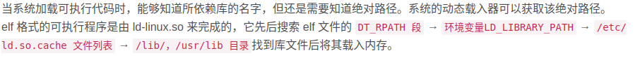

3. 运行时报错，通过添加环境变量

   **临时配置**

   ```shell
   # $LD_LIBRARY: 表示拼接上原先的环境变量
   export LD_LIBRARY_PATH=$LD_LIBRARY_PATH:动态库的绝对路径
   ```

   关闭终端之后，配置失效

   **永久配置用户级**

   ```shell
   # 切入home文件下找到.bashrc文件修改
   cd home
   ll
   vim .bashrc
   
   # 在.bashrc文件最后一行插入以下指令
   export LD_LIBRARY_PATH=$LD_LIBRARY_PATH:动态库的绝对路径
   
   # 生效更新
   . .bashrc # source .bashrc
   
   # 在处理后生成的app文件下用lld指令，如果libcalculate.so以分配内存且路径在lib文件夹下则链接成功
   ldd app
   
   ```

   **永久配置系统级**

   ```shell
   # 方法一
   
   # 用管理员身份进入系统变量设置文件
   sudo vim /etc/profile
   
   # 在profile文件最后一行插入以下指令
   export LD_LIBRARY_PATH=$LD_LIBRARY_PATH:lib文件的绝对路径
   
   # 生效更新
   . /etc/profile # source /etc/profile
   
   # 在处理后生成的app文件下用lld指令，如果libcalculate.so以分配内存且路径在lib文件夹下则链接成功
   ldd app
   
   
   
   # 方法二
   
   # 由于/etc/ld.so.cache文件是二进制文件，所以我们间接修改/etc/ld.so.conf文件：插入lib文件的绝对路径保存即可
   sudo vim /etc/ld.so.conf
   
   # 生效更新
   sudo ldconfig
   
   # 在处理后生成的app文件下用lld指令，如果libcalculate.so以分配内存且路径在lib文件夹下则链接成功
   ldd app
   
   
   # 方法三
   将自定义动态库拷贝到/lib 或/usr/lib目录下（不建议这样做）
   ```


# gdb调试工具

## 基础使用

```shell
gcc test.c -o test -g  // -g生成调试文件
gdb test
list: list 1  列出源码， 从第一行开始
b:  b 20   // 在20行设置断点
run/r   运行程序
n/next 下一条指令（会越过函数）
s/step 下一条指令(会进入函数)
p/print  p i  查看变量i的值
continue  继续执行断点后续指令
quit   推出当前调试
display i 跟踪变量
```

## 其他

 