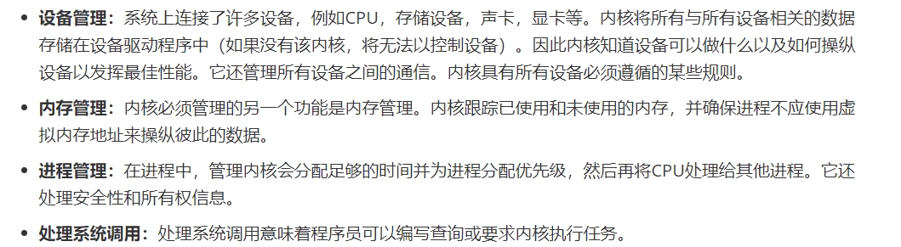

# Linux入门

## Linux系统结构

### Linux组件

### Linux内核

## 安装虚拟机

VMware 或 virtual box

## centos

# linux目录结构

+ /bin **常用**（/usr/bin、/usr/local/bin）

  是binary的缩写，这个目录存放着最经常使用的命令

+ /sbin （/usr/sbin、 /usr/local/sbin）

  s就是super user的意思，这里存放的是系统管理员使用的系统管理程序

+ /home **常用** 

  存放普通给用户的主目录，在linux中每个用户都有一个自己的目录，一般该目录是以用户的账号mingming

+ /root **常用**

  该目录为系统管理员，也称作超级权限者的用户主目录

+ /lib 系统为开机所需要的最基本的动态连接共享库，其作用类似于Windows里的dll文件。几乎所有的应用程序都需要用到这些共享库

+ /lost+found这个目录一般情况下是空的，当系统非法关机后，这里就存放了一些文件

+ /etc **常用**

  所有的系统管理所需要的配置文件和子目录 my.conf

+ /usr **常用**

  这是一个非常重要的目录，用户的很多应用程序和文件都放在这个目录下，类似于windows下的program files目录

+ /boot **常用** 存放的是启动linux时的一些核心文件包括一些连接文件以及镜像文件
+ /proc 这个目录是一个虚拟目录，它是系统内存的映射，访问这个目录来获取系统信息
+ /sys 这是linux2.6内核的一个很大的变化，该目录下安装了2.6内核中新出现的一个文件系统sysfs
+ /tmp 这个目录是用来存放一些临时文件的

+ /dev 类似于Windows的设备管理器，把所有的硬件用文件的形式存储

+ /media **常用**linux系统会自动识别一些设备，例如U盘、光驱等等，当识别后，linux会把识别的设备挂载到这个目录下

+ /mnt **常用**

  系统提供该目录是为了让用户临时挂在别的文件系统的，我们可以将外部的存储挂载到/mnt/上，然后进入该目录就可以查看里面的内容了

+ /opt 这是给主机额外安装软件所摆放的目录。如oracle数据库就可放到该目录下。默认为空

+ /usr/local **常用**

  这是另一个给主机额外安装软件所安装的目录。一般是通过编译源码方式安装的程序

+ /var **常用**

  这个目录中存放着在不断扩充着的东西，习惯将经常被修改的目录放在这个目录下。包括各种日志文件

+ /selinux [security-enhanced linux]

  SELinux是一种安全子系统，他能控制程序这能访问特定文件，有三种工作模式，可以自行设置

# 远程连接

1. `ifconfig`查看远程ip

