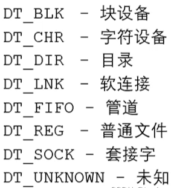
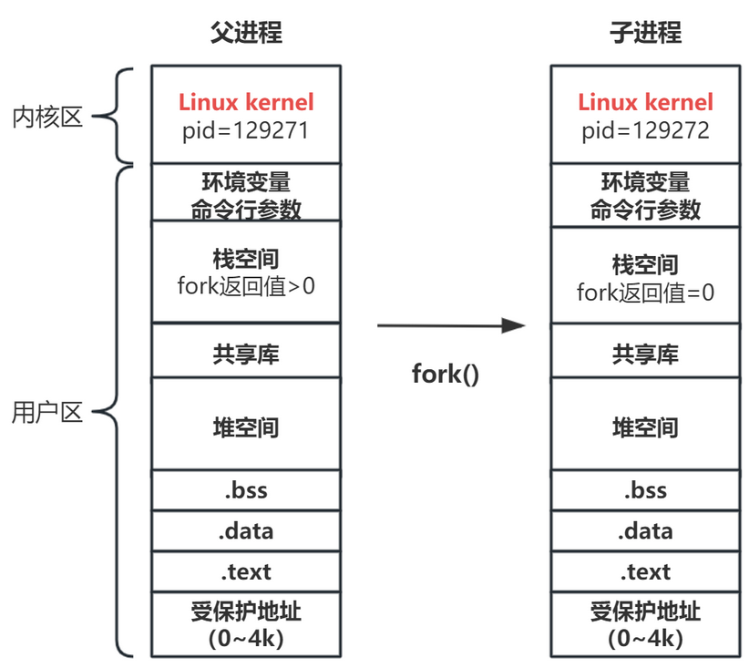

# Linux安装及介绍

## Linux系统结构

### Linux组件


### Linux内核


## 安装ubantu

### 1.制作系统启动盘

+ 将u盘格式化为fat32格式
+ 下载镜像 .iso
+ 下载universial-usb-installer
+ 按步骤制作启动盘

### 2.创建空的硬盘分区

+ 拆分出一块分区

+ 格式化当前分区ext4

  

### 3.安装

+ f12  选择u盘


+ install

  

  

+ 如果看到turn off RST 转到第四步

+ 继续

  

+ 安装选项<span style="color:red">慎重</span>

  

+ 找到刚才创建的分区

  

  

  

+ 设置用户名密码

  

+ 自动安装大功告成


### 4.如果出现turn off RST


+ 返回windows

  

  

  

  

+ f2键进入UEFI的bios设置

+ configuration中找到存储设置

  

+ f10保存并退出

+ 将这个关闭，重启

  

  


## wsl设置root密码


## linux目录结构


+ /bin **常用**（/usr/bin、/usr/local/bin）

  是binary的缩写，这个目录存放着最经常使用的命令

+ /sbin （/usr/sbin、 /usr/local/sbin）

  s就是super user的意思，这里存放的是系统管理员使用的系统管理程序

+ /home **常用** 

  存放普通给用户的主目录，在linux中每个用户都有一个自己的目录，一般该目录是以用户的账号mingming

+ /root **常用**

  该目录为系统管理员，也称作超级权限者的用户主目录

+ /lib 系统为开机所需要的最基本的动态连接共享库，其作用类似于Windows里的dll文件。几乎所有的应用程序都需要用到这些共享库

+ /lost+found这个目录一般情况下是空的，当系统非法关机后，这里就存放了一些文件

+ /etc **常用**

  所有的系统管理所需要的配置文件和子目录 my.conf

+ /usr **常用**

  这是一个非常重要的目录，用户的很多应用程序和文件都放在这个目录下，类似于windows下的program files目录

+ /boot **常用** 存放的是启动linux时的一些核心文件包括一些连接文件以及镜像文件
+ /proc 这个目录是一个虚拟目录，它是系统内存的映射，访问这个目录来获取系统信息
+ /sys 这是linux2.6内核的一个很大的变化，该目录下安装了2.6内核中新出现的一个文件系统sysfs
+ /tmp 这个目录是用来存放一些临时文件的

+ /dev 类似于Windows的设备管理器，把所有的硬件用文件的形式存储

+ /media **常用**linux系统会自动识别一些设备，例如U盘、光驱等等，当识别后，linux会把识别的设备挂载到这个目录下

+ /mnt **常用**

  系统提供该目录是为了让用户临时挂在别的文件系统的，我们可以将外部的存储挂载到/mnt/上，然后进入该目录就可以查看里面的内容了

+ /opt 这是给主机额外安装软件所摆放的目录。如oracle数据库就可放到该目录下。默认为空

+ /usr/local **常用**

  这是另一个给主机额外安装软件所安装的目录。一般是通过编译源码方式安装的程序

+ /var **常用**

  这个目录中存放着在不断扩充着的东西，习惯将经常被修改的目录放在这个目录下。包括各种日志文件

+ /selinux [security-enhanced linux]

  SELinux是一种安全子系统，他能控制程序这能访问特定文件，有三种工作模式，可以自行设置


## linux shell 快捷键


CTRL u  删除行　


# WSL

## WSL联网问题

wsl接外网（clash的ip和端口）

```linux
export http_proxy='http://172.30.224.1:7890'  # 根据实际IP和端口修改地址
export https_proxy='http://192.168.31.100:7890'
export all_proxy='socks5://192.168.3.4:7890'
export ALL_PROXY='socks5://192.168.3.4:7890'
```

## WSL  db5error


# 远程连接

1. `ifconfig`查看远程ip


# vim


## vim设置

```shell
inoremap jj <esc>inoremap ' ''<ESC>i
inoremap " ""<ESC>i
inoremap ( ()<ESC>i
inoremap [ []<ESC>i
inoremap { {<CR>}<ESC>O
"编辑模式下jj快速跳出编辑模式
inoremap jj <ESC>
```


1. 拷贝当前行 yy, 拷贝当前行向下的5行 5yy， 并粘贴p。【一般模式】
2. 删除当前行 dd, 删除当前行向下的5行 5dd 【一般模式】
3. 在文件中查找某个单词【命令行下】/关键字， 回车查找， 输入n就是查找下一个
4. 设置文件的行号，取消文件的行号【命令行下】`:set nu`和`:set nonu` 【一般模式】
5. 编辑/etc/profile文件，使用快捷键到该文档的最行末G和最行首gg 
6. 在一个文件中输入"hello"，==然后撤销这个动作u==
7. 编辑/etc/profile文件，并将光标移动到20行， 20gg
8. hjkl 左下右上

```shell
// 跳转至行首[一般模式]
0

// 跳转至行尾[一般模式]
A

// 打开目录下所有文件
vim * -p 
切换 ctrl pageup

vim -p a.c b.c
gt // 切换至下一个文件
gT // 切换至上一个文件

//  分屏创创建文件
:vsp  sub.c  
ctrl ww  切换窗口

```


# Linux系统使用

## 关机&重启命令

```shell
# 立刻进行关机
shutdown -h now

shudown -h 1 "一分钟后关机了"

# 现在重启计算机
shutdown -r now

# 立刻关机
halt

# 现在重启
reboot

# 把内存的数据同步(synchronize)到磁盘
sync
```

<span style="color:red">不管是重启系统还是关闭系统，首先要运行sync命令，把内存中的数据写到磁盘中</span>

## 登录注销

1. 登录时尽量少用root账号登录，因为它是系统管理员，最大的权限，避免操作失误。可以利用普通用户登录后，再用`su username`命令来切换成系统管理员身份
2. 在提示符下输入logout即可注销用户，[logout注销指令在图形运行级别无效]

## 用户管理

linux系统是一个多用户多任务的操作系统，任何一个要使用系统资源的用户，都必须首先向系统管理员申请一个账号，然后以这个账号的身份进入系统

### 创建用户

ubantu下的基本语法`adduser 用户名`

默认该用户的目录在/home目录下

当创建用户成功后，会自动创建和用户名同名的目录

应该可以通过`useadd -d 指定目录 用户名`，给新创建的用户指定目录

**显示当前用户坐在目录**：`pwd`

### 删除用户

`userdel -r 用户名`      删除用户及目录

`userdel 用户名`          只删除用户，不删除目录

### 修改密码

`passwd 用户名`

### 切换用户

`su zhangsan`

`su`   切换到root用户


## 目录和文件操作

```shell
cd - 返回上一个目录
cd ~ 进入用户主目录  /home/linux
cd / 进入根目录

ls -l  列出当前目录下的所有文件，并显示详细信息
ls -a  列出隐藏文件
ls -d  显示目录(命令后面跟着的目录)

touch file.c  创建文件

mkdir dir  创建目录
ls -l dir  查看dir目录下的详细信息
ls -dl dir 查看dir目录本身的信息

ls -R  有目录递归进入查看

rmdir dir  删除空目录
rm -r dir 递归删除目录 
```

### linux系统文件类型


## 常用命令

### which命令

which date  查看date命令的位置

### mv

```shell
mv file1 file2   重命名
mv file1 dir1 移动
```

### cp

```shell
cp file1 file2 用file1创建file2
cp file1 dir1  将file1复制到dir1
cp -a dir dir2
```

### cat

```shell
cat file 查看文件并输出到终端
```

### more / less

显示文件内容，空格翻页，回车下一行

### head / tail

```shell
head -15 file 查看前15行
```

### 软连接、硬连接

```shell
ln -s file file.s  给file创建一个file.s的软连接//相当于快捷方式
ln file file.h  创建硬连结
```

+ 为保证软连接在任何地方可用，创建时必须使用绝对路径

### 查看文件状态信息

```shell
stat file
```


### 修改权限

```shell
chmod u+x file.c
chmod 471 file.c
```


### 修改所有者

```shell
chown user1 a.c  
chown user1:group1 a,c  修改所有者和用户组
```

### 查找文件find

+ linux不以后缀区分文件类型

```shell
find ./ -type 'l'   按文件类型查找
find ./ -name '*.jpg'  按文件名查找
find ./ -maxdepth 1 -name  '*.jpg'   指定寻找层级,maxdepth要作为第一个参数出现
```


+ 寻找并执行命令 -exec


+ -ok  以交互式的方式寻找并执行


+ find 和管道结合  xargs

  将find搜索结果集执行某一指定命令，当结果集数量过大时，可以分片映射

```shell
find ./ -maxdepth 1 -type f | xargs ls -l    // -f表示普通文件
```

将拆分依据改为null


### 查找文件内容grep

```shell
grep -r 'copy' ./ -n
```

### ps	

显示进程状态

```shell
ps aux | grep usr   搜索进程内容包含usr的进程 x代表不仅显示附加到终端的进程，也显示后台进程
```

### stat

显示文件的信息

```shell
stat hello.txt
```


## 软件安装和卸载

 ```shell
apt-get install
yum install

yum update   //跟新本地软件列表
yum remove 软件名  //卸载软件
 ```

## 压缩和解压

### tar

```shell
tar zcvf 要生成的压缩包名 压缩材料
	tar zcvf test.tar.gz file1 dir2    // 使用gzip方式压缩
tar jcvf test.tar.gz file1 dir2    // 使用bzip2方式压缩
```

**file**: `file  hello.c`查看hello.c的文件类型

```shell
tar zxvf test.tar.gz    // 解压缩
```

### rar


### zip


# 系统编程

## 静态库

gcc 进行链接时，会把静态库中代码打包到可执行程序中

### 命名规则


### 制作

```shell
1. 将.c生成a.o文件（.c文件中一定要包含头文件add.h）
gcc -c add.c -o add.o
gcc -c sub.c -o sub.o

2. 使用ar工具之所静态库
ar rcs mylib.a  add.o sub.o

3. 写静态库的配套头文件,add, sub的声明
```

### 使用	

```shell
1. 包含头文件

2. 将静态库一起编译
gcc test.c mylib.a -o test
```


```shell
gcc test.c ./lib/libmyth.a -o test -I ./inc

# mymath是库的名字，lib是库的前缀
gcc main.c -o app -L./lib -l mymath
```

### 静态库的优缺点

+ 优点
  + 静态库被打包到应用程序中加载速度快
  + 发布程序无需额外提供静态库，移植方便
+ 缺点
  + 消耗系统资源，浪费内存
  + 更新，部署，发布麻烦


## 动态库

gcc 进行链接时，动态库的代码不会被打包到可执行程序中，程序启动之后，动态库会被加载到内存中

### 命名规则


### 制作

```shell
1. 将.c 生成.O文件 （生成与位置无关的代码 -fPIC）
gcc -c add.c -o add.o -fPIC
或者
gcc -c add.c -o add.o -fpic

2. 使用gcc -shared制作动态库
gcc -shared -o lib库名.so  add.o sub.o
```

### 使用


1. 编译可执行程序时指定所使用的动态库,  -l 指定库名， -L指定库路径

   ```shell
   gcc test.c -o test -I ./inc/ -L ./lib/ -l mymath
   
   # 列出程序运行时所需要的库
   ldd test
   ```

2. 如何定位共享库文件


3. 运行时报错，通过添加环境变量

   **临时配置**

   ```shell
   # $LD_LIBRARY: 表示拼接上原先的环境变量
   export LD_LIBRARY_PATH=$LD_LIBRARY_PATH:动态库的绝对路径
   ```

   关闭终端之后，配置失效

   **永久配置用户级**

   ```shell
   # 切入home文件下找到.bashrc文件修改
   cd home
   ll
   vim .bashrc
   
   # 在.bashrc文件最后一行插入以下指令
   export LD_LIBRARY_PATH=$LD_LIBRARY_PATH:动态库的绝对路径
   
   # 生效更新
   . .bashrc # source .bashrc
   
   # 在处理后生成的app文件下用lld指令，如果libcalculate.so以分配内存且路径在lib文件夹下则链接成功
   ldd app
   
   ```

   **永久配置系统级**

   ```shell
   # 方法一
   
   # 用管理员身份进入系统变量设置文件
   sudo vim /etc/profile
   
   # 在profile文件最后一行插入以下指令
   export LD_LIBRARY_PATH=$LD_LIBRARY_PATH:lib文件的绝对路径
   
   # 生效更新
   . /etc/profile # source /etc/profile
   
   # 在处理后生成的app文件下用lld指令，如果libcalculate.so以分配内存且路径在lib文件夹下则链接成功
   ldd app
   
   
   
   # 方法二
   
   # 由于/etc/ld.so.cache文件是二进制文件，所以我们间接修改/etc/ld.so.conf文件：插入lib文件的绝对路径保存即可
   sudo vim /etc/ld.so.conf
   
   # 生效更新
   sudo ldconfig
   
   # 在处理后生成的app文件下用lld指令，如果libcalculate.so以分配内存且路径在lib文件夹下则链接成功
   ldd app
   
   
   # 方法三
   将自定义动态库拷贝到/lib 或/usr/lib目录下（不建议这样做）
   ```

### 动态库的优缺点

+ 优点
  + 可以实现进程间资源共享
  + 更新，部署，发布简单
  + 加载动态库时间可控

+ 缺点
  + 加载速度相对于静态库慢
  + 发布程序时需要提供依赖的动态库


## makefile

### 什么是makefile

makefile是一种用于管理和自动化软件爱你项目编译，构建爱你和部署过程的文本文件

### 命名规则

makefile/Makefile

### makefile变量

| 预定义变量名 | 含义                 | 默认值 |
| ------------ | -------------------- | ------ |
| AR           | 归档维护程序的名称   | ar     |
| CC           | C编译器的名称        | cc     |
| CXX          | C++编译器的名称      | g++    |
| $@           | 目标文件的完整名称   |        |
| $<           | 第一个以来文件的名称 |        |
| $^           | 所有的依赖文件       |        |

**自定义变量**

变量名=变量值

**获取变量值**

$(var)


### 模式匹配

| 通配符 | 含义                                        |
| ------ | ------------------------------------------- |
| *      | 匹配零个或多个字符                          |
| ？     | 匹配一个字符                                |
| %      | 匹配一个字符串（两个%匹配的是同一个字符串） |
| [...]  | 匹配方括号内的任何一个字符                  |
| [^...] | 匹配除方括号内字符之外的任何一个字符        |
|        |                                             |


### makefile常用函数

1. $(wildcard PATTERN)

   作用： 获取制定目录下指定的文件列表

   参数： PATTERN指一个或多个（空格隔开）对应某种类型的文件

   返回： 得到对应匹配的文件列表

2. $(patsubst PATTERN, REPLACEMENT, TEXT)

   作用： 如果TEXT与PATTERN匹配，则用REPLACEMENT对应替换TEXT

   参数： PATTERN是之匹配规则，REPLACEMENT是指替换后字符串，TEXT是待替换字符串

   返回： 被替换后的字符串


```Makefile
src=$(wildcard ./*.c)
objs=$(patsubst %.c, %.o, $(src))
target=app
$(target):$(objs)
	$(CC) $(objs) -o $@

%.o:%.c
	$(CC) -c $< -o $@

# .PHONY  clean是一个伪目标，不生成对应的clean文件
.PHONY:clean
clean:
	rm -f $(objs)
```


## gdb调试工具

### 基础使用

```shell
gcc test.c -o test -g  // -g生成调试文件
gdb test

# 设置参数
set args 10 20
# 显示参数
show args

# 推出当前调试
quit/q

# 获取帮助信息 
help
# 列出源代码
list/l
list 20   从指定行开始显示
l/回车    继续显示下面的代码
list main.c:5
list main.c:main  # 显示main.c的main函数
show list/listsize # 显示行数
set list/listsize  # 设置行数


# 设置断点
break/b  9  # 在第九行设置断点
b 函数名
b 文件名:行号
info/i  b  # 打印断点信息
delete 行号  # 删除断点
disable 行号  # 设置断点无效
enable  行号  # 设置断点生效
# 设置条件断点
break 10 if i = 5 # 如果 i=5 在第十行设置断点

# 运行程序
run/r   # 运行程序（遇到断点暂停）
start   # 运行程序（程序停在第一行）
n/next # 下一条指令（会越过函数）
s/step # 下一条指令(会进入函数)
continue  # 继续执行断点后续指令（直到遇到下一个断点）
finish # 跳出函数
until  # 跳出循环
# 变量操作
p/print  p i  # 查看变量i的值
display i # 跟踪变量i
undisplay i # 取消跟踪变量
```


## 标准C库IO函数和linux系统IO函数


## 虚拟地址空间


## 文件描述符

文件描述符表本质是一个数组，前三个数字0、1、2固定后面可看作为文件编号方便打开文件，默认大小为1024字节


## Linux系统IO函数

man 2      Linux系统函数

man 3      标准C库IO函数


### 打开文件

**`int open(const char *pathname, int flags);`**

+ 作用：打开一个已经存在的文件

+ 参数：
  + pathname：要打开的文件路径
  + flags：对文件操作的权限设置（还有其他设置）
    + 必选项：O_RDONLY 只读， O_WRONLY 只写， O_RDWR 读写
    + 可选项：O_CREAT 文件不存在，创建新文件


+ 返回值：如果成功返回一个新的文件描述符；如果失败返回-1


**`void perror(const char *s);`**

+ 作用：打印 errno 对应的错误描述

+ 参数：s：用户描述，比如hello，最终输出的内容是hello:xxx(实际的错误描述）

+ 返回值：errno 属于Linux系统函数库，库里面的一个全局变量，记录的是最近的错误号，返回对应的 errno 错误描述


**`int open(const char *pathname,int flags, mode_t mode);`**

+ 作用：打开一个已经存在的文件
+ 参数：
  + pathname：要打开的文件路径
  + flags：对文件操作的权限设置（还有其他设置）
    + 必选项：O_RDONLY 只读， O_WRONLY 只写， O_RDWR 读写
    + 可选项：O_CREAT 文件不存在，创建新文件
  + mode：八进制的数，表示创建出的新的文件的操作权限，最终权限为 mode & ~umask
            ，umask 的作用就是抹去某些权限，调用umask 函数可设定
+ 返回值：如果成功返回一个新的文件描述符，如果失败


**`int close(int fd);`**

- **作用**：关闭文件描述符（养成每打开一次文件匹配一个此函数的习惯）
- **参数**：`fd`：文件描述符
- **返回值**：如果成功返回0，如果失败返回-1


### read & write

**`ssize_t read(int fd, void *buf, size_t count);`**

+ 作用：读取指定文件
+ 参数：
	+ fd：文件描述符，open得到的，通过这个文件描述符操作某个文件
	+ buf：需要读取数据存放的地方，数组的地址（传出参数)
	+ count：要读的数据的实际的大小
+ 返回值：如果成功大于0返回实际读取到的字节数，等于0表示文件已经读取完毕；如果失败返回-1并设置errno


### lseek函数

**`off_t lseek(int fd, off_t offset, int whence);`**

+ 作用：1.移动文件指针到文件头lseek(fd,0，SEEK_SET);
              2.获取当前文件指针的位置lseek(fd，0，SEEK_CUR);
              3.==获取文件长度lseek(fd,0，SEEK_END);==
              4.拓展文件的长度（如：当前文件10b，110b，增加了100个字节）lseek(fd,100,SEEK_END);
+ 参数：
  + fd：文件描述符，open得到的，通过这个文件描述符操作某个文件
  + offset：偏移量
  + whence：
    + SEEK SET 设置文件指针的偏移量
    + SEEK CUR 设置偏移量：当前位置 + 第二个参数offset的值
    + SEEK END 设置偏移量：文件大小 + 第二个参数offset的值   
+ 返回值：返回文件指针的位置
====
**拓展文件长度**

```c
#include <sys/types.h>
#include <sys/stat.h>
#include <fcntl.h>
#include <stdio.h>
#include <unistd.h>

int main()
{
    int fd = open("hello.text", O_RDWR);
    if (fd == -1)
    {
        perror("open");
        return -1;
    }

    // 扩展文件的长度
    lseek(fd, 100, SEEK_END);

    // 为方便显示录入数据后的变化，写入空字符填满并增加1字节
    write(fd, " ", 1);
    
    // 关闭文件
    close(fd);
    return 0;
}
```


### stat & lstat函数

**`int stat(const char *pathname, struct stat statbuf);`**

+ 作用：获取一个文件相关的一些信息

+ 参数：
  + pathname：操作的文件的路径
  + statbuf：结构体变量，传出参数，用于保存获取到的文件的信息
+ 返回值：如果成功返回0；如果失败返回-1并设置errno

```c
#include <sys/types.h>
#include <sys/stat.h>
#include <fcntl.h>
#include <stdio.h>
#include <unistd.h>

int main(){

    struct stat statbuf;
    int ret = stat("hello.txt", &statbuf);
    if (ret == -1)
    {
        perror("stat");
        return -1;
    }
    printf( "size: %ld\n", statbuf.st_size);


    return 0;
}
```


**stat结构体**

```c
struct stat
{
    dev_t      st _dev; // 文件的设备编号
    ino_t      st_ino; // 节点
    mode_t     st_mode; // 文件的类型和存取的权限
    nlink_t    st_nlink; // 连到该文件的硬连接数目
    uid_t      st_uid; // 用户ID
    gid_t      st_gid; // 组ID
    dev_t      st_rdev; // 设备文件的设备编号
    off_t      st_size; // 文件字节数(文件大小)
    blksize_t  st_blksize; // 块大小
    blkcnt_t   st_blocks; // 块数
    time_t     st_atime; // 最后一次访问时间
    time_t     st_mtime; // 最后一次修改时间(指内容)
    time_t     st_ctime; // 最后一次改变时间(指属性)
};

```


**st_mode**


**`int lstat(const char *pathname,struct stat statbuf);`**

+ 作用：获取一个软链接文件指向的文件的相关的一些信息
+ 参数：
	+ pathname：操作的文件的路径
	+ statbuf：结构体变量，传出参数，用于保存获取到的文件的信息
+ 返回值：如果成功返回0；如果失败返回-1并设置errn

 

lstat 是获取软链接的信息

### 软链接与硬链接

> **软链接是一种特殊的文件，它包含指向目标文件或目录的路径。** 软链接通常用于跨文件系统的链接或者需要在文件系统中保留一些特殊结构的情况。
> **硬链接是在同一文件系统上的同一文件或目录的多个名称。** 硬链接通常用于在同一文件系统内共享文件内容而不占用额外空间的情况。


**创建软链接**

```shell
ln -s a.txt b.txt
```


### 实现ls -l命令

`ls -l 文件名` ：用于列出文件和目录详细信息的命令，包括文件的权限、所有者、大小、创建日期等。

**实现**

```c
//模拟实现 ls -l 命令
#include <sys/types.h>
#include <sys/stat.h>
#include <fcntl.h>
#include <stdio.h>
#include <unistd.h>
#include <pwd.h>
#include <grp.h>
#include <time.h>
#include <string.h>


int main(int argc, char* argv[]){

    //判断输入的参数是否正确，不正确则提示
    if (argc>2)
    {
        printf("%s filename\n",argv[0]);
        //exit();
        return -1;
    }

    //通过stat函数获取用户传入的文件信息
    struct stat st;
    int ret = stat(argv[1],&st);
    if (ret == -1)
    {
        perror("stat");
        return -1;
    }

    // 获取文件类型和文件权限
    char perms[11] = {0}; // 用于保存文件类型和文件权限的字符串
    switch (st.st_mode & __S_IFMT)
    {
    case __S_IFLNK:
        perms[0] = 'l';
        break;
    case __S_IFDIR:
        perms[0] = 'd';
        break;
    case __S_IFREG:
        perms[0] = '-';
        break;
    case __S_IFBLK:
        perms[0] = 'b';
        break;
    case __S_IFCHR:
        perms[0] = 'c';
        break;
    case __S_IFSOCK:
        perms[0] = 's';
        break;
    case __S_IFIFO:
        perms[0] = 'p';
        break;
    default:
        perms[0] = '?';
        break;
    }

    //判断文件的访问权限

    //文件所有者访问权限
    perms[1] = (st.st_mode & S_IRUSR)? 'r' : '-' ;
    perms[2] = (st.st_mode & S_IWUSR)? 'w' : '-' ;
    perms[3] = (st.st_mode & S_IXUSR)? 'x' : '-' ;
    
    //文件所在组访问权限
    perms[4] = (st.st_mode & S_IRGRP)? 'r' : '-' ;
    perms[5] = (st.st_mode & S_IWGRP)? 'w' : '-' ;
    perms[6] = (st.st_mode & S_IXGRP)? 'x' : '-' ;
    
    //其他人访问权限
    perms[7] = (st.st_mode & S_IROTH)? 'r' : '-' ;
    perms[8] = (st.st_mode & S_IWOTH)? 'w' : '-' ;
    perms[9] = (st.st_mode & S_IXOTH)? 'x' : '-' ;
    
    //硬链接数
    int linkNum = st.st_nlink;

    //文件所有者名称
    char* fileUsr = getpwuid(st.st_uid)->pw_name;

    //文件所在组名称
    char* fileGrp = getgrgid(st.st_gid)->gr_name;
    
    //文件大小
    off_t fileSize = st.st_size;
    
    //获取修改时间
    char* time = ctime(&st.st_mtime);
    
    //删除time带来的换行
    char mtime[512];
    strncpy(mtime, time, strlen(time)-1);

    //输出
    char buf[1024];
    sprintf(buf,"%s %d %s %s %ld %s %s", perms, linkNum, fileUsr, fileGrp, fileSize, mtime, argv[1]);

    printf("%s\n", buf);

    return 0;
}
```


### 文件属性操作函数

#### access函数

**`int access(const char *pathname, int mode);`**

+ 作用：判断某个文件是否有某个权限，或者判断文件是否存在参数
+ 参数：
	+ pathname：判断的文件路径
	+ mode：R_OK判断是否有读权限，w_OK判断是否有写权限，X_OK判断是否有执行权限，F_OK判断文件是否存在
+ 返回值：如果成功返回0；如果失败返回-1并设置errno


#### chomd函数

**`int chmod(const char *pathname, mode_t mode);`**

- **作用**：修改文件的权限
- 参数：   
  - `pathname`：需要修改的文件的路径
  - `mode`：需要修改的权限值，八进制的数
- **返回值**：如果成功返回0；如果失败返回-1并设置errno

```c
#include <sys/stat.h>
#include <stdio.h>

int main(){
    int ret = chmod("a.txt",0777);
    if (ret == -1){
        perror("chmod");
        return -1;
    }
    return 0;
}
```


#### chown 函数

**`int chown (const char *pathname, uid_t owner, gid_t group);`**

+ 作用：修改文件的所有者与所有组
+ 参数：
	+ pathname：需要修改的文件的路径
	+ owner：所有者的ID
	+ group：所有组的ID
+ 返回值：如果成功返回0；如果失败返回-1并设置errno


### truncate函数

**`int truncate(const char *path, off_t length);`**

- **作用**：缩减或者扩展文件的尺寸至指定的大小
- 参数：   
  - `path`：需要修改的文件的路径
  - `length`：需要最终文件变成的大小
- **返回值**：如果成功返回0；如果失败返回-1并设置errno


### 目录操作函数

#### mkdir 函数

**`int mkdir(const char *pathname, mode_t mode);`**

- **作用**：创建一个目录
- 参数：   
  - `pathname`：创建的目录的路径
  - `mode`：权限，八进制的数
- **返回值**：如果成功返回0；如果失败返回-1并设置errno


#### rmdir 函数

**`int rmdir (const char *pathname);`**

- **作用**：删除一个空目录（只能是空目录含文件会报错）
- **参数**：`pathname`：需删除的目录的路径
- **返回值**：如果成功返回0；如果失败返回-1并设置errno


#### rename函数

**`int rename(const char *oldpath,const char *newpath);`**

- **作用**：重命名
- **参数**：   
  - `oldpath`：当前目录的路径名
  - `newpath`：改后目录的路径名
- **返回值**：如果成功返回0；如果失败返回-1并设置errno


#### chdir 函数

**`int chdir(const char *path);`**

- **作用**：修改进程的工作目录
- **参数**：`path`：需修改的工作目录的路径
- **返回值**：如果成功返回0；如果失败返回-1并设置errno


#### getcwd 函数

**`char *getcwd(char *buf, size_t size);`**

- **作用**：获取当前的工作目录
- **参数**：   
  - `buf`：存储的路径，指向的是一个数组
  - `size`：数组的大小
- **返回值**：返回指向的一块内存，这块内存的数据就是第一个参数


### 目录遍历函数

```c
#include <sys/types.h>
#include <dirent.h>
```

#### opendir 函数

**`DIR *opendir(const char *name);`**

- **作用**：打开一个目录
- **参数**： `name`：需要打开的目录的名称
- **返回值**：返回 `DIR*` 类型的目录流


#### readdir 函数

**`struct dirent *readdir(DIR *dirp);`**

+ 作用：读取目录中的信息
+ 参数： dirp：opendir返回的结果
+ 返回值：struct dirent* 类型表示如果读取成功返回 dirent 结构体；如果读取到的文件的信息读取到了末尾或者失败了，返回NULL


#### dirent结构体

```c
struct dirent
{
    ino_t d_ino;                 // 此目录进入点的inode
    off_t d_off;                 // 目录文件开买至此目录进入点的位移
    unsigned short int d_reclen; // d_name的长度，不包含NULL字符
    unsigned char d_type;        // d_name所指的文件类型
    char d_name[256];            // 文件名
};

```



#### closedir 函数

**`int closedir(DIR *dirp);`**

- **作用**：关闭目录指定目录
- **参数**：`dirp`：opendir返回的结果
- **返回值**：如果成功返回0；如果失败返回-1并设置errno

**获取某个目录下普通文件的个数**

```c
#define _DEFAULT_SOURCE
#include <sys/types.h>
#include <dirent.h>
#include <unistd.h>
#include <stdio.h>
#include <string.h>
#include <stdlib.h>

// 读取某个目录下所有的普通文件的个数
int getFileNum(const char *path)
{
    // 打开目录
    DIR *dir = opendir(path);
    if (dir == NULL)
    {
        perror("opendir");
        exit(0);
    }

    struct dirent *ptr;

    // 记录普通文件个数
    int total = 0;

    while ((ptr = readdir(dir)) != NULL)
    {
        // 获取名称
        char *dname = ptr->d_name;
        // 忽略掉．和..
        if (strcmp(dname, ".") == 0 || strcmp(dname, "..") == 0)
        {
            continue;
        }
        // 判断是否是普通文件还是目录
        if (ptr->d_type == DT_DIR)
        {
            // 目录,需要继续读取这个目录
            char newpath[256];
            sprintf(newpath, "%s/%s", path, dname);
            total += getFileNum(newpath);
        }

        if (ptr->d_type == DT_REG)
        {
            // 普通文件
            total++;
        }
    }
    // 关闭目录
    closedir(dir);
    return total;
}

int main(int argc, char *argv[1])
{
    if (argc < 2)
    {
        printf("%s path\n", argv[0]);
        return -1;
    }
    int num = getFileNum(argv[1]);
    printf("普通文件的个数为:%d\n", num);

    return 0;
}

```


### dup函数

**`int dup (int oldfd);`**

- **作用**：复制文件描述符（原文件描述符和复制文件描述符指向同一个文件）

  ​	    从空闲的文件描述符表中找一个最小的，作为新的拷贝的文件描述符

- **参数**： `oldfd`：需要复制的文件描述符
- **返回值**：如果成功返回文件描述符；如果失败返回-1并设置errno

```c
#include <unistd.h>
#include <stdio.h>
#include <fcntl.h>
#include <sys/types.h>
#include <sys/stat.h>
#include <string.h>

int main()
{
    int fd = open("a.txt", O_RDWR | O_CREAT, 0664);
    int fd1 = dup(fd);
    if (fd1 == -1)
    {
        perror("dup");
        return -1;
    }
    printf("fd：%d\nfd1：%d\n", fd, fd1);
    close(fd);
    char *str = "hello,world";

    int ret = write(fd1, str, strlen(str));
    if (ret == -1)
    {
        perror("write");
        return -1;
    }
    close(fd1);
    return 0;
}
```


**`int dup2 (int oldfd, int newfd);`**

+ 作用：重定向文件描述符（如：oldfd 指向a.txt， newfd 指向 b.txt；调用函数成功后：newfd 和 b.txt 做 close，newfd 指向了a.txt）
+ 参数：
	+ oldfd：原文件描述符（必须是有效的）
	+ newfd：可以重定向的文件描述符
+ 返回值：如果成功返回重定向的文件描述符；如果失败返回-1并设置errno

```c
#include <unistd.h>
#include <stdio.h>
#include <fcntl.h>
#include <sys/types.h>
#include <sys/stat.h>
#include <string.h>
int main()
{
    int fd = open("1.txt", O_RDWR | O_CREAT, 0664);
    if (fd == -1)
    {
        perror("open");
        return -1;
    }

    int fd1 = open("2.txt", O_RDWR | O_CREAT, 0664);
    if (fd1 == -1)
    {
        perror("open");
        return -1;
    }

    printf("fd：%d\nfd1：%d\n", fd, fd1);

    int fd2 = dup2(fd, fd1);
    if (fd2 == -1)
    {
        perror("dup2");
        return -1;
    }

    // 通过fd1去写数据，实际操作的是1.txt，而不是2.txt
    char *str = "hello, dup2";
    int len = write(fd1, str, strlen(str));

    printf("fd：%d\nfd1：%d\nfd2：%d\n", fd, fd1, fd2);

    close(fd);
    close(fd1);
    // close(fd2); fd1、fd2文件描述符相同可选一个关

    return 0;
}
```


### fcntl 函数

```c
#include <unistd.h>
#include <fcntl.h>
```

**`int fcntl(int fd, int cmd, ...);`**

+ 作用：复制文件描述符、设置和获取文件状态标志
+ 参数：
	+ fd：表示需要操作的文件描述符
	+ cmd：表示对文件描述符进行如何操作
		+ F_DUPFD：复制文件描述符，复制的是第一个参数 fd
		+ F_GETFL：获取指定的文件描述符文件状态 flag
            获取的 flag 和我们通过open函数传递的 flag 是一个东西
		+ F_SETFL：设置文件描述符文件状态 flag
            必选项：O_RDONLY， O_WRONLY ，O_RDWR （不可以被修改）
            可选项：O_APPEND 追加数据，O_NONBLOCK 设置非阻塞（可以被修改）
+ 返回值：如果成功返回重定向的文件描述符；如果失败返回-1并设置errno

```c
#include <unistd.h>
#include <fcntl.h>
#include <stdio.h>
#include <string.h>
int main()
{
    // 1.复制文件描述符
    int fd = open("1.txt", O_RDWR);
    // 第三个参数为0，则系统会自动选择一个未使用的最小文件描述符作为复制后的文件描述符。
    int fd1 = fcntl(fd, F_DUPFD, 0);

    printf("fd：%d\nfd1：%d\n", fd, fd1);
    close(fd1);

    // 2.修改或者获取文件状态flag
    if (fd == -1)
    {
        perror("open");
        return -1;
    }

    // 2.1.获取文件描述符状态flag
    int flag = fcntl(fd, F_GETFL);
    flag |= O_APPEND; // flag = flag | O_APPEND

    // 2.2.修改文件描述符状态的flag，给flag加入O_APPEND这个标记
    int ret = fcntl(fd, F_SETFL, flag);
    if (ret == -1)
    {
        perror("fcntl");
        return -1;
    }

    char *str = "nihao";

    write(fd, str, strlen(str));

    close(fd);

    return 0;
}
```

## 进程

### 进程的状态

进程转台分为三个基本状态就绪态，运行态，阻塞态。


**运行态**：进程占有处理器正在运行

**就绪态**：进程具备运行条件，等待系统分配处理器以便运行当进程一分配到除cpu以外的所有必要资源后，只要在获得cpu便可立即执行。在一个系统中处于就绪态的进程可能有多个，通常将它们排列成一个队列，成为就不队列

**阻塞态**：又称为等待态或睡眠态，至今成不具备运行条件，正在等待某个事件的完成


**新建态**：进程刚被创建时的状态，尚未进入就绪队列

**终止态**：进程完成任务到达正常结束点，或出席那无法克服的错误而一场终止，或被操作系统及有终止权的进程所终止时所处的状态。进入终止态的进程以后不再执行，但依然保留在操作系统中等待善后。一旦其他进程完成了对终止态进程的信息抽取之后，操作系统将删除该进程。

### 进程相关命令

#### ps

`ps aux/ajx`

a: 显示终端上的所有进程，包括其他用户的进程

u：显示进程的详细信息

x: 显示没有控制终端的进程

j： 列出与作业控制相关的信息

#### top

实时显示进程动态


可以在使用 `top` 命令时加上 `-d n`来指定显示信息更新的时间间隔

```shell
top -d 5
```

**更新排序**
 进入top后界面键入以下键盘按键可按规则显示

- `M`：根据内存使用量排序
- `P`：根据 CPU 占有率排序
- `T`：根据进程运行时间长短排序
- `U`：根据用户名来筛选进程
- `K`：输入指定的PID杀死进程
- `Q`：退出top界面

#### kill

杀死进程

```shell
kill pid

# 强制终止进程的命令
kill -9 pid #kill -SIGKILL pid

# 建议先向进程发送一个终止请求，允许进程执行清理工作并正常退出（15是kill默认信号）。别直接一来就9，除非出现严重问题。
kill -15 pid #kill -SIGTERM pid
```


### 进程号和相关函数

**进程号**
每个进程都由 进程号(PID) 来标识，其类型为 pid_t (整型)进程号的范围: 0~32767。进程号是唯一的，但可以重复使用。当一个进程终止后，其进程号就可以再次使用。

**父进程号**
任何进程(除 init 进程)都是由另一个进程创建，该进程称为被创建进程的父进程对应的进程号称为 父进程号 (PPID) 。

**进程组号**
进程组是一个或多个进程的集合。他们之间相互关联，进程组可以接收同一终端的各种信号，关联的进程有一个 进程组号 (PGID) 。默认情况下，当前的进程号会当做当前的进程组号。

相关函数

**`pid_t getpid(void);`**

+ 作用：用于获取调用进程的进程号
+ 返回值：如果成功子进程中返回 0，父进程中返回子进程 ID调用进程的进程号；如果失败返回-1并设置errno

**`pid_t getppid(void);`**

+ 作用：用于获取调用进程的父进程号
+ 返回值：如果成功子进程中返回 0调用进程的父进程号；如果失败返回-1并设置errno

**`pid_t getpgid(void);`**

+ 作用：用于获取调用进程的进程组号
+ 返回值：如果成功子进程中返回进程组号；如果失败返回-1并设置errno

### 进程创建

#### fork 函数

**`pid_t fork(void);`**

+ 作用：用于创建一个新的进程（子进程）
+ 返回值：如果成功子进程中返回 0，父进程中返回子进程 ID；如果失败返回-1并设置errno

**失败的两个主要原因**

+ 当前系统的进程数已经达到了系统规定的上限，这时 errno 的值被设置为 EAGAIN
+ 系统内存不足，这时 errno的值被设置为ENOMEM

```c
#include <sys/types.h>
#include <unistd.h>
#include <stdio.h>

int main()
{

    // 创建子进程
    pid_t pid = fork();

    // 判断是父进程还是子进程
    if (pid > 0)
    {
        printf("pid : %d\n", pid);
        // 如果大于0，返回的是创建的子进程的进程号，当前是父进程
        printf("i am parent process, pid : %d, ppid : %d\n", getpid(), getppid());
    }
    else if (pid == 0)
    {
        // 当前是子进程
        printf("i am child process, pid : %d, ppid : %d\n", getpid(), getppid());
    }

    for (int i = 0; i < 5; i++)
    {
        printf("i : %d, pid : %d\n", i, getpid());
        sleep(2);
    }

    return 0;
}
```


#### 父子进程虚拟地址空间情况

1. 附近成执行到fork函数时，创建一个子进程

2. 子进程创建完成后，fork会给父进程返回子进程的pid，会给子进程返回0

3. 系统会为父进程的复制资源生成一段新的虚拟地址空间供子进程使用

4. 调用fork之后，子进程的用户区数据与父进程相同但是fork返回值不同，核区数据也会拷贝过来但是pid不同

   

#### 写时拷贝技术（copy-on-write）

当一个进程或线程向哟呵修应该共享数据时，会创建该数据的副本，然后再进行修改。

原始数据保持不变，其他进程或线程仍可读取原始数据的副本。但是这个粗略避免了多个进程同时修改数据时的竞争条件，从而提高了并发性能。

当资源读取的时候内核并不复制整个进程地址空间，而是让父子进程共享同一个地址空间。只有在需要写入的时候才会复制到新的地址空间，从各个进程拥有各自的空间地址。


### 父子进程关系及GDB多进程调试

#### 父子进程关系

**区别**

+ fork() 的返回值不同
	+ 父进程中：>0 返回子进程的ID
	+ 子进程中：=0
+ PCB 中的一些数据
	+ 当前的进程的id：pid
	+ 当前的进程的父进程的id：ppid
	+ 信号集

**共同**
当子进程刚被创建出来，还没有执行任何的写数据的操作，以下对象父子进程共享

+ 用户区的数据
+ 文件描述符表

**父子进程对变量是不是共享的?**
刚开始是共享的，一旦修改数据共享不了。读时共享，写时拷贝。

#### GDB调试

**设置调试进程**

```shell
set follow-fork-mode parent
set follow-fork-mode child
```

**设置调试模式**

```shell
# 调试当前进程，其他进程继续执行（默认）
set detach-on-fork on
# 调试当前进程，其他进程被GDB挂起
set detach-on-fork off

# 查看调试的信息
info inferiors
# 切换当前调试的进程
inferior id
# 使进程脱离GDB调试(之后改进程会继续执行)
detach inferiors id
```


## exec函数族

**在调用进程内部执行一个可执行文件**

```c
#include <unistd.h>
extern char **environ;

int execl(const char *path, const char *arg, ...);   // 必须使用绝对路径或者相对路径
int execlp(const char *file, const char *arg, ...);  // 在环境变量中查找是否有可执行程序
int execle(const char *path, const char *arg,..., char * const envp[]);
int execv(const char *path, char *const argv[]);
int execvp(const char *file, char *const argv[]);
int execvpe(const char *file, char *const argv[],char *const envp[]);
```

**含义区分**

+ 带l：调用程序每个命令行参数需单独写成列表形式并以空指针结束
+ 带p：如果函数参数 file 含 / 就视为路径名，否则按 PATH 环境变量指定的目录搜索可执行文件
+ 带v：需先构造一个命令行参数的指针数组，然后将数组地址作为调用程序参数
+ 带e：需先构造环境字符串指针数组，然后将数组地址传给函数使用新的环境变量代替调用进程的环境变量

**参数**


+ path：可执行文件的路径名字
+ file ：按 PATH 环境变量指定的目录搜索可执行文件
+ arg ：可执行程序所带的命令行参数，第一个参数为可执行文件的名字（没什么用，一般写这个），从第二个参数开始就是程序所需参数列表，最后必须以NULL结束
+ argv[] ：命令行参数的指针数组
+ envp[] ：环境字符串指针数组
  

**在程序中执行ps命令**

```c
#include <stdio.h>
#include <unistd.h>


int main(){
    pid_t pid = fork();

    if(pid > 0) {
        printf("this is parent process, pid: %d\n", getpid());
        sleep(1);
    } else if(pid == 0) {
        execl("/usr/bin/ps", "ps", "aux", NULL);
        printf("this is child process, pid: %d\n", getpid());
    }

    for(int i = 0; i < 3; i++)
    {
        printf("i = %d, pid = %d\n", i, getpid());
    }
    
    return 0;
}
```


## 进程控制

```c
#include <stdlib.h>
void exit(int status);


#include <unistd.h>
void _exit(int status);
```


### 孤儿进程

+ 父进程运行结束，但子进程还在运行这样的子进程就称为孤儿进程(Orphan Process) 
+ 每当出现一个孤儿进程的时候，内核就把孤儿进程的父进程设置为init，而init进程会循环地wait() 这个子进程。这样，当一个孤儿进程凄凉地结束了其生命周期时，init进程就会代表党和政府出面处理它的一切善后工作
+ 因此孤儿进程并不会有什么危害


### 僵尸进程

每个进程结束之后，都会释放自己地址空间中的用户区数据， 内核区的 PCB没有办法自己释放掉，需要父进程去释放。进程终止时，父进程尚未回收，子进程残留资源（PCB）存放于内核中，变成僵尸进程(Zombie Process)。

```c
#include <sys/types.h>
#include <unistd.h>
#include <stdio.h>

int main()
{
    // 创建子进程
    pid_t pid = fork();

    // 判断是父进程还是子进程
    if (pid > 0)
    {
        while (1)
        {
            //  如果大于0，返回的是创建的子进程的进程号，当前是父进程
            printf("i am parent process, pid : %d, ppid : %d\n", getpid(), getppid());
            sleep(1);
        }
        
    }
    else if (pid == 0)
    {
        // 当前是子进程
        printf("i am child process, pid : %d, ppid : %d\n", getpid(), getppid());
    }

    for (int i = 0; i < 5; i++)
    {
        printf("i : %d, pid : %d\n", i, getpid());
    }

    return 0;
}
```

新建一个终端输入 `ps aux` 查看僵尸进程

一般调试使用 `Ctrl + C` 杀掉僵尸进程（`kill -9`杀不死）

### 进程回收

在每个进程退出的时候，内核释放该进程所有的资源、包括打开的文件、占用的内存等。但是仍然为其保留一定的信息，这些信息主要主要指进程控制块PCB的信息(包括进程号、退出状态、运行时间等)。
父进程可以通过调用 wait() 或 waitpid() 得到它的退出状态同时彻底清除掉这个进程。

**wait函数**

**`pid_t wait(int *wstatus)`**

- **作用**：等待任意一个子进程结束，如果任意一个子进程结束了，则此函数会回收子进程的资源。
- **参数**：`wstatus`：退出时的状态信息，传入的是一个int类型的地址，传出参数
- **返回值**：如果成功返回被回收的子进程的id；如果失败返回-1（所有的子进程都结束，调用函数失败）

调用 `wait()` 的进程会被挂起（阻塞），直到它的一个子进程退出或者收到一个不能被忽略的信号才被唤醒（相当于继续往下执行）。如果没有子进程或子进程都结束了，会立即返回 -1 

```c
#include <sys/types.h>
#include <unistd.h>
#include <stdio.h>
#include <sys/wait.h>

int main() {
    // 有一个父进程，创建5个子进程（兄弟）
    pid_t pid;
    for (int i = 0; i < 5; i++) {
        pid = fork();
        if (pid == 0) {
            break;
        }
    }
    if (pid > 0) {
        // 父进程
        while (1) {
            printf("parent, pid = %d\n", getpid());
            int ret = wait(NULL);
            if (ret == -1) {
                break;
            }
            printf("child die, pid = %d\n", ret);
            sleep(1);
        }
    }
    else if (pid == 0) {
        // 子进程
        while (1) {
            printf("child, pid = %d\n", getpid());
            sleep(1);
        }
    }
    return 0;
}
```

执行代码后ps aux查看创建的5个子进程都处于阻塞状态

选择第一个子进程杀掉

```shell
kill -9 84790
```

**退出信息相关宏函数**

**退出**

+ WIFEXITED(status)：非0，进程正常退出
+ WEXITSTATUS (status)：如果上面宏为真，获取进程退出的状态（ exit() 的参数）

**终止**

+ WIFSIGNALED(status)：非0，进程异常终止
+ WTERMSIG(status)：如果上面宏为真，获取使进程终止的信号编号

**暂停**

+ IFSTOPPED (status)：非0，进程处于暂停状态
+ WSTOPSIG(status)：如果上面宏为真，获取使进程暂停的信号的编号
+ WIFCONTINUED (status)：非0，进程暂停后已经继续运行


```c
#include <sys/types.h>
#include <unistd.h>
#include <stdio.h>
#include <sys/wait.h>

int main() {
    // 有一个父进程，创建5个子进程（兄弟）
    pid_t pid;
    for (int i = 0; i < 5; i++) {
        pid = fork();
        if (pid == 0) {
            break;
        }
    }
    if (pid > 0) {
        // 父进程
        while (1){
            printf("parent, pid = %d\n", getpid());
            int st;
            int ret = wait(&st);
            
            if (ret == -1){
                break;
            }
            if (WIFEXITED(st)){
                // 是不是正常退出
                printf("退出的状态码:%d\n", WEXITSTATUS(st));
            }
            if (WIFSIGNALED(st)){
                // 是不是异常终止
                printf("被哪个信号干掉了：%d\n", WTERMSIG(st));
            }
            printf("child die, pid = %d\n", ret);
            sleep(1);
        }
    }
    else if (pid == 0) {
        // 子进程
        printf("child, pid = %d\n", getpid());
        sleep(1);
    }
    return 0;
}
```

**waitpid 函数**

**`pid_t waitpid(pid_t pid, int *wstatus, int options);`**

+ 作用：回收一个指定进程号的子进程，可以设置是否阻塞。
+ 参数：
	+ pid：
            pid > 0：某个子进程的pid
            pid = 0 ：回收当前进程组的任意子进程
            pid = -1：回收所有的子进程，相当于wait()  (最常用)
            pid < -1 ：某个进程组的组id的绝对值，回收指定进程组中的子进程
	+ wstatus：退出时的状态信息，传入的是一个int类型的地址，传出参数
	+ options：设置阻塞或者非阻塞
            0：阻塞
            WNOHANG ：非阻塞
+ 返回值：
        >0: 返回子进程的id
        =0 : options = WNOHANG，表示还有子进程活着
        = -1 :错误，或者没有子进程了

```c
#include <sys/types.h>
#include <sys/wait.h>
#include <stdio.h>
#include <stdlib.h>
#include <unistd.h>

int main() {

    pid_t pid;
    for (int i = 0; i < 5; i++) {
        pid = fork();
        if(pid == 0) {
            break;
        }
    }

    if(pid > 0) {
        while(1) {
            printf("parent, pid = %d\n", getpid());
            sleep(1);

            int st;
            int ret = waitpid(-1, &st, WNOHANG);
            if(ret == -1) {
                break;
            } else if (ret == 0) {
                continue;
            } else if (ret > 0) {
                if(WIFEXITED(st)) {
                    printf("退出的状态码：%d\n", WEXITSTATUS(st));
                }
                if (WIFSIGNALED(st)) {
                    printf("被哪个信号干掉了：%d\n", WTERMSIG(st));
                }
            }
            printf("Child die, pid = %d\n", ret);
        }
    } else if (pid == 0) {
        while (1) {
            printf("child, pid = %d\n", getpid());
            sleep(1);
        }
        exit(1);
    }


    return 0;
}
```

## 进程间通信

+ 进程是一个独立的资源分配单元不同进程（这里所说的进程通常指的是用户进程）之间的资源时独立的，没有关联，不能在一个进程中直接访问另一个进程的资源
+ 但是进程不是孤立的，不同的进程需要进行信息的交互和状态的传递等，因此需要进程间通信（IPC： Inter Processes Communication）
+ 进程间通信的目的：
  + 数据传输：一个进程需要将他的数据发送给另一个进程
  + 通知事件：一个进程需要向另一个或一组进程发送消息，同志它发生了某种事件（如进程终止时要通知父进程）
  + 资源共享：多个进程之间共享同样的资源。为了做到这一点，需要内核提供互斥和同步机制
  + 进程控制：有些进程希望完全控制另一个进程的执行（如debug进程），此时控制进程希望能够拦截另一个进程的所有陷入和异常，并能够即使知道他的状态改变

### linux进程间通信的方式


### 匿名管道

+ 管道也叫无名（匿名）管道，它是UNIX系统IPC(进程间通信）的最古老形式，所有的 UNIX 系统都支持这种通信机制。 **匿名管道是一种单向通信管道，允许一个进程将数据写入管道的一端，另一个进程从管道的另一端读取数据**。

+ 统计一个目录文件的数目，为了执行该命令 shell 创建了两个进程来分别执行 `ls` 和 `wc`

  ```shell
  ls | wc -l
  ```

  


**管道的特点**

+ 管道其实是一个在内核内存中维护的缓冲器，这个缓冲器的存储能力是有限的，不同的操作系统大小不一定相同
+ 管道拥有文件的特质：读操作、写操作，匿名管道没有文件实体，有名管道有文件实体，但不存储数据，可以按照操作文件的方式对管道进行操作
+ 一个管道是一个字节流，使用管道时不存在消息或者消息边界的概念，从管道读取数据的进程可以读取任意大小的数据块，而不管写入进程写入管道的数据块的大小是多少
+ 通过管道传递的数据是顺序的,从管道中读取出来的字节的顺序和它们被写入管道的顺序是完全一样的
+ 在管道中的数据的传递方向是单向的，一端用于写入，一端用于读取，管道是半双工的
+ 从管道读数据是一次性操作，数据一旦被读走，它就从管道中被抛弃，释放空间以便写更多的数据，在管道中无法使用 lseek() 来随机的访问数据
+ 匿名管道只能在具有公共祖先的进程（父进程与子进程，或者两个兄弟进程，具有亲缘关系）之间使用


**为什么可以使用管道进行进程间通信**

或者说匿名管道只能在具有公共祖先的进程之间使用。
其实管道类似于文件，管道读写端获取数据类似于文件的读写。


**管道的数据结构**

底层为线性队列，逻辑类似循环队列，读写顺序相同。


### 父子进程通过匿名管道通信

**创建匿名管道**

**`int pipe(int pipefd[2]);`**

+ 作用：创建一个匿名管道，用来进程间通信
+ 参数：int pipefd[2]：这个数组是一个传出参数
    + pipefd[0] ：对应的是管道的读端
    + pipefd[1] ：对应的是管道的写端
    
+ 返回值：如果成功返回 0；如果失败返回 -1

注意：匿名管道只能用于具有关系的进程之间的通信（父子进程、兄弟进程）。管道中如果没有信息时 read 操作是阻塞的，管道中如果信息已满 write 操作是阻塞，不能够同时进行读写，否则会一直阻塞。 sleep() 不能放在 read() 下面否则会造成自写自读（注释掉 sleep() 也会发生）

```c
// 子进程发送数据给父进程，父进程读取到数据输出
#include <unistd.h>
#include <sys/types.h>
#include <stdio.h>
#include <stdlib.h>
#include <string.h>

int main()
{
    // 在fork之前创建管道
    int pipefd[2];
    int ret = pipe(pipefd);
    if (ret == -1)
    {
        perror("pipe");
        exit(0);
    }

    // 创建子进程
    pid_t pid = fork();
    if (pid > 0)
    {
        // 父进程
        printf("i am parent processe, pid = %d\n", getpid());

        char buf[1024] = {0};
        while (1)
        {
            // 从管道中读取数据
            int len = read(pipefd[0], buf, sizeof(buf));
            printf("parent recv : %s, pid : %d\n", buf, getpid());

            // 向管道中写入数据
            char *str = "hello,i am parent";
            write(pipefd[1], str, strlen(str));
            sleep(1);
        }
    }
    else if (pid == 0)
    {
        // 子进程
        printf("i am child process, pid = %d\n", getpid());

        char buf[1024] = {0};
        while (1)
        {
            // 向管道中写入数据
            char *str = "hello, i am child";
            write(pipefd[1], str, strlen(str));
            sleep(1);

            // 从管道中读取数据
            int len = read(pipefd[0], buf, sizeof(buf));
            printf("child pecv: %s, pid = %d\n", buf, getpid());
        }
    }

    return 0;
}
```


**查看管道缓冲大小命令**

```shell
ulimit -a
```


**使用函数获取**
**`long fpathconf(int fd, int name);`**

+ 作用：用于查询文件描述符相关属性
+ 参数：
	+ fd：要查询的文件描述符
	+ name ：表示要查询的属性（以_PC_为前缀的常量）以下为常用属性：
		+ _PC_LINK_MAX ：文件的最大链接数
		+ _PC_MAX_CANON ：规范输入队列中的最大字节数
		+ _PC_MAX_INPUT ：输入队列中的最大字节数
		+ _PC_NAME_MAX ：文件名的最大长度
		+ _PC_PATH_MAX ：文件路径的最大长度
		+ _PC_PIPE_BUF ：管道缓冲区的最大大小
		+ _PC_CHOWN_RESTRICTED ：指示是否允许更改文件所有者
+ 返回值：如果成功返回查询到的属性值（long 类型）；如果失败返回 -1 并设置errno

```c
#include <unistd.h>
#include <stdio.h>

int main(){
    int pipefd[2];
    int ret = pipe(pipefd);

    // 获取管道的大小
    long size = fpathconf(pipefd[0],  _PC_PIPE_BUF);
    printf("pipe size : %ld\n", size);

    return 0; 
}
```


### 匿名管道通信三种情况


**解决方法** 父进程关闭写端，子进程关闭读端

```c
// 子进程发送数据给父进程，父进程读取到数据输出
#include <unistd.h>
#include <sys/types.h>
#include <stdio.h>
#include <stdlib.h>
#include <string.h>

int main()
{

    // 在fork之前创建管道
    int pipefd[2];
    int ret = pipe(pipefd);
    if (ret == -1)
    {
        perror("pipe");
        exit(0);
    }

    // 创建子进程
    pid_t pid = fork();
    if (pid > 0)
    {
        // 父进程
        printf("i am parent processe, pid = %d\n", getpid());

        // 关闭写端
        close(pipefd[1]);

        char buf[1024] = {0};
        while (1)
        {
            // 从管道中读取数据
            int len = read(pipefd[0], buf, sizeof(buf));
            printf("parent recv : %s, pid : %d\n", buf, getpid());
        }
    }
    else if (pid == 0)
    {
        // 子进程
        printf("i am child process, pid = %d\n", getpid());

        // 关闭读端
        close(pipefd[0]);

        char buf[1024] = {0};
        while (1)
        {
            // 向管道中写入数据
            char *str = "hello, i am child\n";
            write(pipefd[1], str, strlen(str));
        }
    }

    return 0;
}

```


**实现ps aux | grep root**

```c++
#include <iostream>
using namespace std;
#include <fcntl.h>
#include <string.h>
#include <sys/wait.h>
#include <unistd.h>
#define _size 1024

/*
    实现 ps aux 父子进程之间通信

    子进程：ps aux，子进程结束之后将数据发送给父进程
    父进程：获取到数据，打印

    思路：
    子进程需要执行 ps aux 命令，调用exec族函数，但是这些函数的默认输出端是在stdout_fileno
    所以需要使用dup2()函数将其重定向到管道的写端
    将读取的内容存到文本中，然后去执行grep命令即可
*/

int main() {
    // 创建管道
    int pipefd[2];

    int ret = pipe(pipefd);
    if (ret == -1) {
        perror("pipe");
        return -1;
    }

    // 创建子进程
    pid_t pid = fork();
    if (pid == -1) {
        perror("fork");
        return -1;
    }

    if (pid > 0) {
        // 父进程

        // 关闭写端
        close(pipefd[1]);

        // 读
        char buf[_size] = {0};
        int len = -1;

        // 先打开，如果不存在则创建，存在则删除再创建
        // 建议不要重复打开，这里就打开一次然后写，最后关闭即可
        int fd = open("file.txt", O_RDONLY);
        if (fd != -1)            // 存在，将其删除
            remove("file.txt");  // 不能用exec()函数族，因为这就把这个主进程替换了，不会回来
        close(fd);

        // 然后创建一个
        fd = open("file.txt", O_RDWR | O_CREAT, 0664);
        if (fd == -1) {
            perror("open");
            return -1;
        }

        // -1 留一个结束符
        // 循环读
        while ((len = read(pipefd[0], buf, sizeof(buf) - 1)) != 0) {
            if (len == -1) {
                perror("read");
                return -1;
            }

            // printf("%s", buf);
            write(fd, buf, strlen(buf));

            bzero(buf, _size);
        }

        close(fd);

        // grep筛选root
        execlp("grep", "grep", "root", "file.txt", nullptr);

        // 父进程回收子进程资源防止出现僵尸进程
        wait(nullptr);
    } else if (pid == 0) {
        // 子进程

        // 关闭读端
        close(pipefd[0]);

        // 将标准输入stdout_fileno重定向到管道的写端
        // dup2() newfd指向oldfd指向的位置，oldfd被释放
        int ret = dup2(pipefd[1], STDOUT_FILENO);
        if (ret == -1) {
            perror("dup2");
            return -1;
        }

        // 使用exec函数族执行shell命令，他输出靠的是的是stdout_fileno
        // 为防止管道大小不够，循环的去执行保证指令被写完
        while (ret = execlp("ps", "ps", "aux", nullptr))
            if (ret == -1) {
                perror("execlp");
                return -1;
            }
    }

    return 0;
}
```


### 管道的特点和管道设置为非阻塞

**读管道：**

+ 管道中有数据，读取会返回实际读到的字节数
+ 管道中无数据：
	+ 写端全部关闭，read返回0(相当于读到文件的末尾)
	+ 写端没有完全关闭，read阻塞等待

**写管道：**

+ 管道读端全部关闭，产生信号SIGPIPE，进程异常终止
+ 管道读端没有全部关闭：
	+ 管道已满，write阻塞
	+ 管道没有满，write将数据写入，并返回实际写入的字节数


```c
#include <cstring>
#include <iostream>
#include <string>
using namespace std;
#include <fcntl.h>
#include <unistd.h>
#define _size 1024

/*
    设置管道非阻塞
    int flags =  fcntl(fd[0],F_GETFL); //获取原来的flag
    flags | = O_NONBLOCK; //修改flag的值
    fcntl(fd[0],F_SETFL,flags); //设置新的flag
*/

int main() {
    // 子进程发送数据给父进程，父进程读取到数据输出

    // 在fork之前创建管道，因为要指向一个管道
    int pipefd[2];

    int ret = pipe(pipefd);
    if (ret == -1) {
        perror("pipe");
        return -1;
    }

    // 管道创建成功了，现在创建子进程
    pid_t pid = fork();
    if (pid == -1) {
        perror("fork");
        return -1;
    }

    if (pid > 0) {  // 父进程
        printf("i am parent process , pid : %d\n", getpid());

        char buf[_size] = {0};

        int flags = fcntl(pipefd[0], F_GETFL);
        flags |= O_NONBLOCK;
        fcntl(pipefd[0], F_SETFL, flags);

        // 关闭写端
        close(pipefd[1]);

        while (1) {
            // 读数据
            // read默认是阻塞的
            // 设置成为非阻塞
            int len = read(pipefd[0], buf, sizeof(buf));
            printf("len = %d\n", len);
            printf("parent recv : \"%s\" , pid : %d\n", buf, getpid());
            // 读完清空buf
            bzero(buf, _size);

            sleep(1);  // 子进程和父进程睡眠的时间不同，这样可以方便的观察是否阻塞
        }

    } else if (pid == 0) {  // 子进程
        printf("i am child process , pid : %d\n", getpid());
        const char *str = "hello,i am child";

        // 关闭读端
        close(pipefd[0]);

        while (1) {
            // 写数据
            write(pipefd[1], str, strlen(str));
            sleep(5);
        }
    }

    return 0;
}
```

### 有名管道

+ 有名管道（FIFO）又称FIFO文件，它提供了一个路径名与之关联，只要可以访问该路径就能够通过 FIFO 相互通信。
+ 有名管道打开方式同打开普通文件一样，一旦打开就能在它上面使用与操作匿名管道和其他文件的系统调用一样的 I/O 系统函数了。

**有名管道与匿名管道的区别**

+ FIFO 在文件系统中作为一个特殊文件存在，但 FIFO 中的内容却存放在内存中
+ 使用 FIFO的进程退出后，EIFO 文件将继续保存在文件系统中以便以后使用
+ FIFO 有名字，不相关的进程可以通过打开有名管道进行通信

###  有名管道的使用

**命令创建**

一旦使用 mkfifo 创建了一个 FIFO，就可以使用 `open()` 打开它，常见的文件 I/0 函数都可用于 FIFO。如: `close()` 、`read()` 、`write()` 、`unlink()` 等

```shell
mkfifo filename
```

**函数创建**
 **`int mkfifo(const char \*pathname， mode t mode);`**

- **作用**：创建FIFO文件
- 参数：   
  - `pathname`：管道名称的路径
  - `mode`：文件的权限（和 `open()` 的 `mode` 是一样的）

write.c

```C
#include <stdio.h>
#include <sys/types.h>
#include <sys/stat.h>
#include <stdlib.h>
#include <unistd.h>
#include <fcntl.h>
#include <string.h>
//  向管道中写数据

int main(){

    // 1. 判断文件是否存在
    int flag = access("fifo_test", F_OK);
    if (flag == -1)
    {
        printf("管道不存在！请创建管道\n");

        // 1.1 不存在则创建管道文件
        int ret = mkfifo("fifo_test", 0664);
        
        if (ret == -1)
        {
            perror("mkfifo");
            exit(0);
        }
    }

    // 2. 以只写方式打开管道
    int fifo_fd = open("fifo_test", O_WRONLY);
    if (fifo_fd == -1)
    {
        perror("open");
        exit(0);
    }

    // 3. 写数据
    for (int i = 0; i < 100; i++)
    {
        char buf[1024];
        sprintf(buf,"hello,%d\n", i);
        printf("write data：%s\n", buf);
        write(fifo_fd, buf, strlen(buf));
        sleep(1);
    }

    // 4. 关闭FIFO文件描述符
    close(fifo_fd);

    return 0;
}
```

read.c

```c
#include <stdio.h>
#include <sys/types.h>
#include <sys/stat.h>
#include <stdlib.h>
#include <unistd.h>
#include <fcntl.h>
#include <string.h>
//  从管道中读数据

int main(){
    // 1. 打开管道文件
    int fifo_fd = open("fifo_test", O_RDONLY);
    if(fifo_fd == -1){
        perror("open");
        exit(0);
    }

    // 2. 读取数据
    while (1)
    {
        char buf[1024] = {0};
        int len = read(fifo_fd, buf, sizeof(buf));
        if (len == 0)
        {
            printf("写端已断开连接...\n");
            break;
        }
        printf("recv buf：%s\n", buf);
    }
    
    // 3. 关闭文件描述符
    close(fifo_fd);

    return 0;
}
```

注意：

- 一个为只读而打开一个管道的进程会阻塞，直到另外一个进程为只写打开管道
- 一个为只写而打开一个管道的进程会阻塞，直到另外一个进程为只读打开管道

**读管道：**

+ 管道中有数据，read会返回实际读取到的数据
+ 管道中无数据：
	+ 管道写端被全部关闭，read返回0(相当于读到文件末尾)
	+ 管道写端没有被完全关闭，read阻塞等待

**写管道：**

+ 管道读端被全部关闭，进程异常终止(收到 SIGPIPE信号)
+ 管道读端没有全部关闭：
	+ 管道已经满了，write会阻塞
	+ 管道没有满，write会将数据写入，并且返回实际写入的字节数

## 内存映射

**内存映射 (Memory-mapped I/O) 是将磁盘文件的数据映射到内存，用户通过修改内存就能修改磁盘文件**。


>内存映射（memory-mapped files）并不是简单地将磁盘文件复制到内存中，而是一种将文件内容映射到进程地址空间的技术。这个过程涉及到虚拟内存管理和文件 I/O 的协同工作，具体如下：
>
>1. **虚拟内存地址空间**：当一个进程使用 `mmap` 系统调用来映射一个文件时，操作系统会在进程的虚拟内存地址空间中为文件分配一个区域。
>2. **按需加载**：操作系统会将文件的内容按页（通常为 4KB）加载到物理内存中。这意味着只有当前活跃的页面会被加载，而不是整个文件。如果文件远大于可用的物理内存，只有被访问的页面会被加载，其他页面会留在虚拟内存中。
>3. **页缓存**：操作系统通常会将文件的页面缓存在内存中，这样再次访问相同数据时就不需要从磁盘读取，从而提高性能。
>4. **写入时复制（Copy-On-Write, COW）**：当进程需要修改映射的文件内容时，操作系统会使用写入时复制机制。这意味着只有在进程实际写入数据时，相关的内存页面才会从只读的页缓存复制到进程的私有内存空间，然后进行修改。
>5. **文件系统通知**：当文件被映射到内存中后，操作系统会在必要时通知文件系统，哪些页面已经被加载到内存中。这样，当文件被其他进程修改或者磁盘上的文件内容变化时，操作系统可以确保内存中的数据保持一致。
>6. **内存管理**：操作系统的内存管理系统会跟踪内存映射的使用情况，当系统内存紧张时，可能会将不活跃的页面交换出去，或者在进程访问未加载到内存中的页面时，按需加载它们。
>7. **共享和私有映射**：内存映射可以是共享的或私有的。共享映射允许多个进程共享同一文件内容的内存视图，而私有映射则为每个进程提供了文件内容的独立副本。
>8. **内存映射的撤销**：当使用 `munmap` 撤销映射时，操作系统会负责将任何未写的更改刷新回磁盘，并释放内存资源。

### 内存映射相关系统调用

**头文件** `#include <sys/mman.h>`

**`void *mmap(void *addr, size t length, int prot, int flags, int fd, off_t offset);`**

+ 作用：将一个文件或者设备的数据映射到内存中
+ 参数：
	+ addr：NULL，由内核指定
	+ length ：要映射的数据的长度，这个值不能为0。建议使用文件的长度，获取文件的长度：stat() 、lseek()
	+ prot：对申请的内存映射区的操作权限，要操作映射内存，必须要有读的权限（常用：PROT_READ、PROT_READ | PROT_WRITE）
	  + PROT_EXEC：可执行权限
	  + PROT_READ：读权限
	  + PROT_WRITE：写权限
	  + PROT_NONE：没有权限
	+ flags：
	  + AP_SHARED：映射区的数据会自动和磁盘文件进行同步，进程间通信必须要设置这个选项
	  + MAP_PRIVATE：不同步，内存映射区的数据改变了，对原来的文件不会修改，会重新创建一个新的文件==（copy-on-write）==
	+ fd：需要映射的那个文件的文件描述符
	  + 通过 open 得到，open 的是一个磁盘文件。
	
	  + 注意：文件的大小不能为0，open指定的权限不能和prot有冲突
	  + prot：PROT_READ 对应 open：只读/读写
	  + prot：PROT_READ | PROT_WRITE 对应 open：读写
  
  +  offset：偏移量，一般不用。必须指定的是4096 的整数倍，0表示不偏移。
  
+ 返回值：如果成功返回创建的内存的首地址；如果失败返回 MAP_FAILED（(void*) -1 ），并设置errno


**`int munmap(void *addr, size t length);`**

+ 作用：释放内存映射
+ 参数：
	+ addr：要释放内存的首地址
	+ length：要释放的数据的长度（内存大小），这个值不能为0。建议使用文件的长度，获取文件的长度：stat() 、lseek()
+ 返回值：如果成功返回0；如果失败返回-1，并设置errno

### 使用内存映射实现进程间通信

**实现原理**

+ 有关系的进程间通信（父子进程）
  + 还没有子进程的时候，通过唯一的父进程，先创建内存映射区
  + 有了内存应映射区后，创建子进程
  + 父子进程共享创建的内存映射区
+ 没有关系的进程间通信
  + 准备一个大小不是0的磁盘文件
  + 进程1：通过磁盘文件创建内存映射区，得到一个操作这块内存的指针
  + 进程2：通过磁盘文件创建内存映射区，得到一个操作这块内存的指针
  + 使用内存映射区通信

注意：内存映射区通信是非阻塞的

**有关系进程通信**

```c
#include <stdio.h>
#include <wait.h>
#include <sys/mman.h>
#include <sys/types.h>
#include <stdlib.h>
#include <unistd.h>
#include <fcntl.h>
#include <string.h>

int main()
{
    // 1.打开一个文件
    int fd = open("test.txt", O_RDWR);
    int size = lseek(fd, 0, SEEK_END); // 获取文件大小

    // 2.创建内存映射
    void *ptr = mmap(NULL, size, PROT_READ | PROT_WRITE, MAP_SHARED, fd, 0);
    if (ptr == MAP_FAILED)
    {
        perror("mmap");
        exit(0);
    }

    // 3.创建子进程
    pid_t pid = fork();
    if (pid > 0)
    {
        wait(NULL);
        // 父进程
        char buf[64];
        strcpy(buf, (char *)ptr);
        printf("read data : %s\n", buf);
    }
    else if (pid == 0)
    {
        // 子进程
        strcpy((char *)ptr, "nihao, this's son！！！");
    }
    else
    {
        perror("fork");
        exit(0);
    }

    // 4.释放内存映射区
    munmap(ptr, size);

    return 0;
}
```


**内存映射相关问题**

**1. 如果对 mmap() 的返回值 ptr 做++操作(ptr++)，munmap() 是否能够成功?**
答：可以做++操作，但不能成功释放，必须传递首地址。

**2.如果 open() 时 O RDONLY，mmap() 时 prot 指定 PROT_READ | PROT_WRITE 会怎样?**
答：产生错误返回 MAP_FAILED，建议open()中权限和 prot 权限保持一致。

**3.如果文件偏移量为1000会怎样?**
答：偏移量必须是4096的整数倍，返回 MAP_FAILED

**4.mmap() 什么情况下会调用失败?**
答：① length = 0；②prot只指定了写权限；③产生上述第二个问题

**5.可以 open() 的时候 O_CREAT 一个新文件来创建映射区吗?**
答：可以的，但创建的文件大小为0不行（可使用 lseek() 和 truncate() 进行扩展）。

**6.mmap() 后关闭文件描述符，对 mmap() 映射有没有影响?**
答：没有影响，映射区还是存在，只是创建映射区的 fd 关闭了而已

**7.对 ptr 越界操作会怎样?**
答：越界操作操作的是非法内存，会产生段错误

**文件拷贝**

```c
#include <stdio.h>
#include <sys/mman.h>
#include <sys/types.h>
#include <sys/stat.h>
#include <fcntl.h>
#include <stdlib.h>
#include <unistd.h>
#include <string.h>


int main(int argc, char * argv[]) {

    //对原始文件进行内存映射
    int fd = open("english.txt", O_RDWR);
    if(fd == -1) {
        perror("open");
        exit(0);
    }
    int len = lseek(fd, 0, SEEK_END);

    // 2.创建一个新文件，并拓展
    int fd1 = open("cpy.txt", O_RDWR | O_CREAT, 0064);
    if(fd1 == -1) {
        perror("open");
        exit(0);
    }

    // 获取原始文件的大小
    truncate("cpy.txt", len);
    write(fd1, " ", 1);

    // 分别做内存映射
    void * ptr1 = mmap(NULL, len, PROT_READ | PROT_WRITE, MAP_SHARED, fd, 0);
    void * ptr2 = mmap(NULL, len, PROT_READ | PROT_WRITE, MAP_SHARED, fd1, 0);

    if(ptr1 == MAP_FAILED) {
        perror("mmap");
        exit(0);
    }
    if(ptr2 == MAP_FAILED) {
        perror("mmap");
        exit(0);
    }

    // 通过内存拷贝将第一个文件的内存数据拷贝到新的文件内存中
    memcpy(ptr2, ptr1, len);

    // 释放资源
    munmap(ptr2, len);
    munmap(ptr1, len);

    close(fd);
    close(fd1);


    return 0;
}
```

## 匿名映射

不需要文件实体进行内存映射

```c
#define _DEFAULT_SOURCE // MAP_ANONYMOUS

#include <stdio.h>
#include <wait.h>
#include <sys/mman.h>
#include <sys/types.h>
#include <stdlib.h>
#include <unistd.h>
#include <fcntl.h>
#include <string.h>

#define BUF_LEN 4096

int main()
{

    // 1.创建匿名映射区
    void *ptr = mmap(NULL, BUF_LEN, PROT_READ | PROT_WRITE, MAP_SHARED | MAP_ANONYMOUS, -1, 0);
    if (ptr == MAP_FAILED)
    {
        perror("mmap");
        exit(0);
    }

    // 2.父子间通信
    pid_t pid = fork();

    if (pid > 0)
    {
        // 父进程
        strcpy((char *)ptr, "hello, world");
        wait(NULL);
    }
    else if (pid == 0)
    {
        // 子进程
        sleep(1);
        printf("%s\n", (char *)ptr);
    }

    // 3.释放内存映射区
    int ret = munmap(ptr, BUF_LEN);
    if (ret == -1)
    {
        perror("munmap");
        exit(0);
    }

    return 0;
}

```

## 信号

### 什么是信号

信号是Linux进程间通信时事件发生时对进程的通知机制，又是也称为软件中断

信号是在软件层次上对中断机制的一种模拟，是一种异步通信的方式

信号可以导致一个正在运行的进程被另一个正在运行的异步进程中断，转而处理某一个突发事件

**发往进程的诸多信号通常都是源于内核。**引发内核为进程产生信号的各类事件如下：

+ 对于前台进程，用户可以通过输入特殊的终端字符来给他发送信号。比如输入ctrl+c通常会给进程发送一个中断信号，比如ctrl+c通常会给进程发送一个中断信号
+ 硬件发生异常，即硬件检测到一个错误条件并通知内核，随即再由内核发送响应信号给相关进程。比如执行一条一场的机器语言指令，诸如被0除，或者引用了无法访问的内存区域
+ 系统状态变化。比如alarm()定时器到期引起SIGALRM信号，进程执行的cpu时间超限，或者该进程的某个子进程退出
+ 运行kill命令或调用kill()

### 使用信号的两个目的

+ 让进程知道已经发生了一个特定的事情
+ 强迫进程执行他自己代码中的信号处理程序

### 信号的特点

+ 简单
+ 不能携带大量信息
+ 满足某个特定条件才发送
+ 优先级比较高

### 查看系统定义的信号列表

```shell
kill -l
```

==ps== : 前31个信号为常规信号，其余为实时信号

### LInux常用信号

| 编号 | 信号名称 | 对应事件                                                     | 默认动作                                                 |
| ---- | -------- | ------------------------------------------------------------ | -------------------------------------------------------- |
| 2    | SIGINT   | 当用户按下了ctrl+c组合键时，用户终端向正在运行中的由该终端启动的程序发出此信号 | 终止进程                                                 |
| 3    | SIGQUIT  | 用户按下 `Ctrl+\` 组合键时产生该信号，用户终端向正在运行中的由该终端启动的程序发出些信号 | 终止进程                                                 |
| 9    | SIGKILL  | 无条件终止进程。该信号不能被忽略，处理和阻塞                 | 终止进程，可以杀死任何正常进程（僵尸进程等异常进程不算） |
| 11   | SIGSEGV  | 指示进程进行了无效内存访问(段错误)                           | 终止进程并产生core文件                                   |
| 13   | SIGPIPE  | Broken pipe 向一个没有读端的管道写数据                       | 终止进程                                                 |
| 17   | SIGCHLD  | 子进程结束时，父进程会收到这个信号                           | 忽略这个信号                                             |
| 18   | SIGCONT  | 如果进程已停止，则使其继续运行                               | 继续/忽略                                                |
| 19   | SIGSTOP  | 停止进程的执行。信号不能被忽略，处理和阻塞                   | 为终止进程                                               |
|      |          |                                                              |                                                          |

### 信号的5种默认处理动作

+ Term: 终止进程
+ Ign: 当前进程忽略掉这个信号
+ Core: 终止进程，并生成一个core文件
+ Stop: 暂停当前进程
+ Cont: 继续执行当前被暂停的进程

### core文件

**生成core文件**

```shell
// 设置core文件的大小
ulimit -a
ulimit -c 1024
./a.out

// 如果没有在当前目录下看到core文件
sudo bash -c "echo core > /proc/sys/kernel/core_pattern "
```

**调试core文件**

```shell
gdb a.out
# 进入gdb调试界面
core-file core
```


### kill、raise、abort函数

`<signal.h>` kill  raise

`<stdlib.h>`  abort

**`int kill(pid_t pid, int sig);`**

+ 作用：给任何的进程或者进程组pid，发送任何的信号
+ 参数：
  + pid:
    + \>0: 将信号发送给指定的进程
    + =0：将信号发送给当前的进程组
    + =-1：将信号发送给每一个有权限接受这个信号的进程
    + <-1: 这个pid=某个进程组的ID取反(如：-12345)
  + sig：需要发送的信号的编号或者是宏值，0表示不发送任何信号
+ 返回值：如果成功返回0；如果失败返回-1，并设置errno

**`int raise(int sig);`**

+ 作用：给当前进程发送信号
+ 参数：sig：需要发送的信号的编号或者是宏值，0表示不发送任何信号
+ 返回值：如果成功返回0；失败返回-1，并设置errno

**`void abort(void)`**

+ 作用：发送SIGABRT信号给当前进，杀死当前进程

```c
#include <stdio.h>
#include <sys/types.h>
#include <signal.h>
#include <unistd.h>
int main(){

    pid_t pid = fork();

    if (pid == 0)
    {
        //子进程
        for (int i = 0; i < 5; i++)
        {
            printf("child process\n");
            sleep(1);
        }
    }else if (pid > 0)
        {
            // 父进程
            printf("parent process\n");
            sleep(2);
            printf("kill child process now\n");
            kill(pid, SIGINT);
        }
    return 0;
}
```

### alarm函数

`<unistd.h>`

**`unsigned int alarm(unsigned int seconds);`**

+ 作用：设置定时器(闹钟) 。函数调用，开始倒计时，当倒计时为0的时候函数会给当前的进程发送一个信号: SIGALARM
+ 参数：seconds：倒计时的时长，单位: 秒。如果参数为0，定时器无效(不进行倒计时，不发信号)，如取消一个定时器：alam(0)
+ 返回值：如果之前没有计时器，返回0；如果之前有计时器返回之前计时器剩余的时间
  

**SIGALARM** : ==默认终止当前的进程，每一个进程都有且只有唯一的一个定时器==。

```c++
#include <stdio.h>
#include <unistd.h>
int main() {
    int seconds = alarm(5);
    printf("seconds = %d\n", seconds); // 0

    sleep(2);
    seconds = alarm(2); //不阻塞
    printf("seconds = %d\n", seconds);// 3
    //while(1){}第一个例子

	alarm(0);
    
    // 1s电脑能数多少数//第二个例子
    alarm(1);
    int i = 0;
    while (1)
    {
        printf("%i\n", i++);
    }

    return 0;
}
```

==ps：==其实1s内计算机真实计数远远大于 2.txt 中的数。**实际的时间 = 内核时间 + 用户时间 + 消耗的时间**。进行文件IO操作的时候比较浪费时间。

​        定时器与进程的状态无关（自然定时法），无论进程处于什么状态，`alarm()` 都会计时。

### setitimer函数

`<sys/time.h>`

**`int setitimer(int which, const struct itimerval *new_ value, struct itimerval *old value);`**

+ 作用：设置定时器(闹钟)。可以替代alarm() ，精度微秒：us，可以实现周期性定时
+ 参数：
  + which：定时器以什么时间计时
    + ITIMER_REAL：真实时间，时间到达，发送 SIGALRM（常用）
    + ITIMER_VIRTUAL：用户时间，时间到达，发送 SIGVTALRM
    + ITIMER_PROF：以该进程在用户态和内核态下所消耗的时间来计算，时间到达，发送
  + new_value：设置定时器的属性
  + old_value：记录上一次定时器的时间参数，一般不用，指定NULL

+ 返回值：如果成功返回0；如果失败返回-1，并设置errno
  

```c++
// 定时器的结构体
struct itimerval {
	// 每个阶段的时间，间隔时间
	struct timeval it interval;
	
	// 延迟多长时间执行定时器
	struct timeval it_value;
};

// 时间的结构体
struct timeval {
	// 秒数
	time_ttv_sec;
	
	// 微秒
	suseconds t tv_usec;
};
```

### signal函数
**`sighandler_t signal(int signum, sighandler_t handler);`**

+ 作用：设置某个信号的捕捉行为
+ 参数：
  + signum：要捕捉的信号
  + handler：捕捉到信号要如何处理
    + SIG_IGN：忽略信号
    + SIG_DFL：使用信号默认的行为
    + 回调函数：这个函数是内核调用，程序员只负责写，捕捉到信号后如何去处理信号

+ 返回值：如果成功返回上一次注册的信号处理函数的地址，第一次调用返回NULL；如果失败返回SIG_ERR，设置errno

==ps：SIGKILL、SIGSTOP不能被捕捉，不能被忽略。==
回调函数需要程序员实现，提前准备好的，函数的类型根据实际需求，看函数指针的定义，不是程序员调用，而是当信号产生，由内核调用。函数指针是实现回调的函数实现之后，将函数名放到函数指针的位置就可以了。

```c
#include <sys/time.h>
#include <stdio.h>
#include <stdlib.h>
#include <signal.h>

void myalarm(int num)
{
    printf("捕捉到了信号的编号是: %d\n", num);
    printf("xxxxxxx\n");
}

int main(){

    // 注册信号捕捉
    // signal(SIGALRM，SIG_IGN);
    // signa1(SIGALRM，SIG_DFL);
    // void (*sighandler_t)(int); 函数指针，int 类型的参数表示信号捕捉到的值

    __sighandler_t flag = signal(SIGALRM, myalarm);
    if (flag == SIG_ERR)
    {
        perror("signal");
        exit(0);
    }
    

    struct itimerval new_value;

    // 设置间隔的时间
    new_value.it_interval.tv_sec = 2;
    new_value.it_interval.tv_usec = 0;

    // 设置延迟的时间
    new_value.it_value.tv_sec = 3;
    new_value.it_value .tv_usec = 0;
    int ret =setitimer(ITIMER_REAL, &new_value, NULL);// 非阻塞
    printf("定时器开始了...\n");
    if(ret == -1)
    {
        perror("setitimer");
        exit(0);    
    }
                                                                                                                                                                                                                                                  
    getchar();
    return 0;
}
```

### 信号集及相关函数

**什么是信号集**

+ 许多信号相关的系统调用都需要能表示一组不同的信号，多个信号可使用一个称之为信号集的数据结构来表示，其系统数据类型为 sigset_t。
+ 在 PCB 中有两个非常重要的信号集。一个称之为“阻塞信号集”，另一个称之为“未决信号集”。这两个信号集都是内核使用位图机制来实现的。但操作系统不允许我们直接对这两个信号集进行位操作。而需自定义另外一个集合，借助信号集操作函数来对 PCB 中的这两个信号集进行修改
+ **信号的“未决”是一种状态，指的是从信号的产生到信号被处理前的这一段时间**。
+ **信号的“阻塞”是一个开关动作，指的是阻止信号被处理，但不是阻止信号产生**。
+ 信号的阻塞就是让系统暂时保留信号留待以后发送。由于另外有办法让系统忽略信号所以一般情况下信号的阻塞只是暂时的，只是为了防止信号打断敏感的操作。                                             


1. 用户通过键盘ctrl + C，产生2号信号SIGINT (信号被创建)

2. 信号产生但是没有被处理 (未决)
   + 在内核中将所有的没有被处理的信号存储在一个集合中 (未决信号集)
   + SIGINT信号状态被存储在第二个标志位上
     + 这个标志位的值为0，说明信号不是未决状态
     + 这个标志位的值为1，说明信号处于未决状态
3. 这个未决状态的信号，需要被处理，处理之前需要和另一个信号集（阻塞信号集），进行比较
   + 阻塞信号集默认不阻塞任何的信号
   + 如果想要阻塞某些信号需要用户调用系统的API
4. 在处理的时候和阻塞信号集中的标志位进行查询，看是不是对该信号设置阻塞了
   + 如果没有阻塞，这个信号就被处理
   + 如果阻塞了，这个信号就继续处于未决状态，直到阻塞解除，这个信号就被处理


**信号集相关函数**

**`int sigemptyset(sigset_t \*set);`**

- **作用**：清空信号集中的数据,将信号集中的所有的标志位置为0
- **参数**：`set`：传出参数，需要操作的信号集
- **返回值**：成功返回0，失败返回-1


**`int sigfillset(sigset t *set);int sigaddset(sigset_t *set, int signum);`**

+ 作用：将信号集中所有的标志位设为1

+ 参数：
  + set：传出参数，需要操作的信号集
  + signum: 需要设置阻塞的那个信号

+ 返回值：成功返回0，失败返回-1

  

**`int sigaddset(sigset_t \*set, int signum);`**

- **作用**：设置信号集中的某一个信号对应的标志位为1，表示阻塞这个信号

- **参数**：

  - `set`：传出参数，需要操作的信号集
  - `signum`: 需要设置阻塞的那个信号

- **返回值**：成功返回0；失败返回-1

  

**`int sigdelset(sigset t \*set, int signum);`**

- **作用**：设置信号集中的某一个信号对应的标志位为0，表示不阻塞这个信号

- **参数**： `set`：传出参数，需要操作的信号集

- **返回值**：成功返回0；失败返回-1

  

**`int sigismember(const sigset_t *set, int signum);`**

+ 作用：判断某个信号是否阻塞

+ 参数：
  + set：需要操作的信号集
  + signum: 需要判断的那个信号
+ 返回值：如果成功返回1表示 signum被阻塞，返回0表示signum不阻塞；如果失败返回-1

```c
#define _DEFAULT_SOURCE
#include <signal.h>
#include <stdio.h>
#include <stdlib.h>

int main(){

    // 创建一个信号集
    sigset_t set;

    // 清空信号集的内容
    sigemptyset(&set);

    // 判断 SIGINT 是否在信号集 set 里
    int ret = sigismember(&set, SIGINT);
    if (ret == 0)
    {
        printf("SIGINT 不阻塞\n");
    }else if (ret == 1)
    {
        printf("SIGINT 阻塞\n");
    }
    
    // 添加几个信号到信号集中
    sigaddset(&set, SIGINT);
    sigaddset(&set, SIGQUIT);

    // 判断SIGINT是否在信号集中
    ret = sigismember(&set, SIGINT);
    if(ret == 0) {
        printf("SIGINT 不阻塞\n");
    } else if(ret == 1) {
        printf("SIGINT 阻塞\n");
    }

    // 判断SIGQUIT是否在信号集中
    int jug = sigismember(&set, SIGQUIT);
    if(jug == 0){
        printf("SIGQUIT 不阻塞\n");
    } else if(ret == 1){
        printf("SIGQUIT 阻塞\n");
    }

    // 从信号集中删除一个信号
    sigdelset(&set, SIGQUIT);

    // 判断SIGQUIT是否在信号集中
    jug = sigismember(&set, SIGQUIT);
    if(jug == 0){
        printf("SIGQUIT 不阻塞\n");
    } else if(ret == 1){
        printf("SIGQUIT 阻塞\n");
    }


    return 0;
}

```


​      


# 项目实战

## 阻塞和非阻塞、同步和异步

> 典型的一次IO的两个阶段是什么？数据就绪和数据读写

操作系统  TCP接收缓冲区

**数据就绪**：根据系统IO操作的就绪状

+ 阻塞    调用IO方法的线程进入阻塞状态    `ssize_t recv(int sockfd, void *buf, size_t len, int flags);`

  ​						                                              size == -1,出错了 (EINTR, EAGAIN, EWOULDBLOCK)

  ​                                                                      size == 0, 读取到数据的末尾，对方连接关闭

  ​                                                                      size > 0,  读取到了多少数据

+ 非阻塞  不会改变线程的状态，通过返回值判断

----

应用程序 

**数据读写**：根据应用给程序和内核的交互方式

+ 同步
+ 异步

陈硕：在处理IO的时候，阻塞和非阻塞都是同步IO，只有使用了特殊的API带式异步IO


> 一个典型的网络IO接口调用，分为两个阶段，分别是”数据就绪“和”数据读写“，数据就绪阶段分为阻塞和非阻塞，表现的结果就是，阻塞当前线程或是直接返回
>
> 同步表示A向B请求调用一个网络IO接口时（或者调用某个业务逻辑API接口时），数据的读写都是由请求方A自己来完成的（不管是阻塞还是非阻塞）；异步表示A向B请求调用一个网络IO接口是（或者调用某个业务逻辑额API接口时），向B传入请求的时间以及时间发生时通知的方式，A就可以处理其他逻辑了，当B监听到事件处理完成后，会用事先约定好的通知方式，通知A处理结果

+ 同步阻塞
+ 同步非阻塞
+ 异步阻塞
+ 异步非阻塞  


## Unix/Linux上的五种IO模型

### 阻塞blocking

调用者调用了某个函数，等待这个函数返回，期间什么也不做，不停的去检查这个函数有没有返回，必须等这个函数返回才能进行下一步动作


### 非阻塞non-blocking

非阻塞等待，每隔一段事件就去检测IO事件是否就绪。没有就绪就可以做其他事。非阻塞I/O执行系统调用总是立即返回，不服按时间是否已经发生，若时间没有发生，则返回-1，此时可以根据errno区分这两种情况，对于accept，recv和send，事件未发生时，errno通常被设置为EAGAIN


### IO复用（IO multiplexing）

Linux用select/poll/epoll函数实现IO复用模型，这些函数也会使进程阻塞，但是和阻塞IO所不同的是这些函数可以同时阻塞多个IO操作。而且可以同时堆多个读操作、写操作的IO函数进行检测。直到由数据可读或可写时，才真正调用IO操作函数


### 信号驱动（signal-driven)

Linux用套接接口进行信号驱动IO，安装一个信号处理函数，进程继续运行并不阻塞，当IO事件就绪，进程收到SIGIO信号，然后处理IO事件


### 异步（asynchronous)

Linux中，可以调用aio_read函数告诉内核描述字缓冲区指针和缓冲区的大小、文件偏移及通知的方式，然后立即返回，当内核将数据拷贝到缓冲区后，在通知应用程序


```c
/* Asynchronous I/O control block. */
struct aiocb
{
    int aio_fildes; /* File desriptor. */
    int aio_lio_opcode; /* Operation to be performed. */
    int aio_reqprio; /* Request priority offset. */
    volatile void *aio_buf; /* Location of buffer. */
    size_t aio_nbytes; /* Length of transfer. */
    struct sigevent aio_sigevent; /* Signal number and value. */
    /* Internal members. */
    struct aiocb *__next_prio;
    int __abs_prio;
    int __policy;
    int __error_code;
    __ssize_t __return_value;
#ifndef __USE_FILE_OFFSET64
    __off_t aio_offset; /* File offset. */
    char __pad[sizeof (__off64_t) - sizeof (__off_t)];
#else
    __off64_t aio_offset; /* File offset. */
#endif
    char __glibc_reserved[32];
};
```

## web服务器简介及http协议

### http请求/响应的步骤

1. 浏览器向DNS服务器请求解析该URL中的域名所对应的IP地址；
2. 解析出IP地址后，根据该IP地址和默认端口80，和服务器建立TCP连接；
3. 连兰奇发出读取文件（URL中域名后面部分对应的文件）的http请求，该请求报文作为TCP三次握手的第三个报文的数据发送给服务器；
4. 服务器对浏览器请求做出响应，并把对应的HTML文本发送给浏览器；
5. 释放TCP连接；
6. 浏览器将该HTML文本显示内容

### http请求报文格式


### http响应报文格式


### http请求方法

HTTP/1.1协议中共定义了八种方法来以不同方式操作指定的资源：

1. GET: 向指定的资源发出”显示“请求。使用GET方法应该只用在读取数据，而不应当被用于产生”副作用“的操作中。
2. HEAD:与GET方法一样，都是向服务器发出指定资源的请求，只不过服务器将传回资源的文本部分。他的好处在于，使用这个方法可以在不必传输全部内容的情况下，就可以获取其中”关于该资源的信息“（元信息或称元数据）
3. POST：向指定资源提交数据，请求服务器进行处理（例如提交表单或者上传文件）。数据被包含在请求文本中。这个请求可能会创建新的资源或修改现有资源，或二者皆有
4. PUT：向指定资源位置上上传其最新内容
5. DELETE:请求服务器删除Request-URI所表示的资源
6. TRACE：回显服务器收到的请求，主要用于测试或者诊断
7. OPTIONS：这个方法可使服务器传回该资源所支持的所有HTTP请求方法。用‘*’来代替资源名称，向Web服务器发送OPYITIONS请求，可以测试服务器功能是否正常运作
8. CONNECT:HTTP/1.1协议中预留给能够将连接改为管道方式的代理服务器。通常用于SSL加密服务器的连接（经由非加密的HTTP代理服务器）

## 服务器编程基本框架


| 模块         | 功能                       |
| ------------ | -------------------------- |
| I/O处理单元  | 处理客户连接，读写网络数据 |
| 逻辑单元     | 业务进程或线程             |
| 网络存储单元 | 数据库、文件或缓存         |
| 请求队列     | 个单元之间的通信方式       |

## 两种高效的事件处理模式

 服务器程序通常需要处理三类事件：I/O事件、信号及定时事件。有两种高效的事件处理模式：Reactor和Proactor，同步I/O模型通常用于实现Reactor模式，异步I/O模型通常用于实现Proactor模式

### Reactor模式

要求主线程（I/O处理单元）只负责监听文件描述符上是否有事件发生，有的话就立即将该事件通知工作 线程（逻辑单元），将 socket 可读可写事件放入请求队列，交给工作线程处理。除此之外，主线程不做 任何其他实质性的工作。读写数据，接受新的连接，以及处理客户请求均在工作线程中完成。 使用同步 I/O（以 epoll_wait 为例）实现的 Reactor 模式的工作流程是：

1. 主线程往 epoll 内核事件表中注册 socket 上的读就绪事件。 
2. 主线程调用 epoll_wait 等待 socket 上有数据可读。 
3. 当 socket 上有数据可读时， epoll_wait 通知主线程。主线程则将 socket 可读事件放入请求队列。.
4.  睡眠在请求队列上的某个工作线程被唤醒，它从 socket 读取数据，并处理客户请求，然后往 epoll 内核事件表中注册该 socket 上的写就绪事件。
5. 当主线程调用 epoll_wait 等待 socket 可写。
6.  当 socket 可写时，epoll_wait 通知主线程。主线程将 socket 可写事件放入请求队列。
7.  睡眠在请求队列上的某个工作线程被唤醒，它往 socket 上写入服务器处理客户请求的结果。


### Proactor模式

Proactor 模式将所有 I/O 操作都交给主线程和内核来处理（进行读、写），工作线程仅仅负责业务逻 辑。使用异步 I/O 模型（以 aio_read 和 aio_write 为例）实现的 Proactor 模式的工作流程是：

1. 主线程调用 aio_read 函数向内核注册 socket 上的读完成事件，并告诉内核用户读缓冲区的位置， 以及读操作完成时如何通知应用程序（这里以信号为例）
2. 主线程继续处理其他逻辑。
3.  当 socket 上的数据被读入用户缓冲区后，内核将向应用程序发送一个信号，以通知应用程序数据 已经可用。
4. 应用程序预先定义好的信号处理函数选择一个工作线程来处理客户请求。工作线程处理完客户请求 后，调用 aio_write 函数向内核注册 socket 上的写完成事件，并告诉内核用户写缓冲区的位置，以 及写操作完成时如何通知应用程序。
5. 主线程继续处理其他逻辑。
6. 当用户缓冲区的数据被写入 socket 之后，内核将向应用程序发送一个信号，以通知应用程序数据 已经发送完毕。
7. 应用程序预先定义好的信号处理函数选择一个工作线程来做善后处理，比如决定是否关闭 socket。                                        


### 模拟Proactor模式

使用同步 I/O 方式模拟出 Proactor 模式。原理是：主线程执行数据读写操作，读写完成之后，主线程向 工作线程通知这一”完成事件“。那么从工作线程的角度来看，它们就直接获得了数据读写的结果，接下 来要做的只是对读写的结果进行逻辑处理。 使用同步 I/O 模型（以 epoll_wait为例）模拟出的 Proactor 模式的工作流程如下： 

1. 主线程往 epoll 内核事件表中注册 socket 上的读就绪事件。
2. 主线程调用 epoll_wait 等待 socket 上有数据可读。
3. 当 socket 上有数据可读时，epoll_wait 通知主线程。主线程从 socket 循环读取数据，直到没有更 多数据可读，然后将读取到的数据封装成一个请求对象并插入请求队列。 
4.  睡眠在请求队列上的某个工作线程被唤醒，它获得请求对象并处理客户请求，然后往 epoll 内核事 件表中注册 socket 上的写就绪事件。 
5. 主线程调用 epoll_wait 等待 socket 可写。 
6. 当 socket 可写时，epoll_wait 通知主线程。主线程往 socket 上写入服务器处理客户请求的结果。 同步 I/O 模拟 Proactor 模式的工作流程：


## 线程池

线程池是由服务器预先创建的一组子线程，线程池中的线程数量应该和CPU数量差不多。线程池中的所有子线程都运行着相同的代码。当有新的任务到来时，主线程将通过某种方式选择线程池中的某个子线程来为之服务。相比于动态的创建子线程，选择一个已经存在的子进程的代价显然要小得多。至于主线程选择哪个子线程来为新任务服务，则有多种方式：

+ 主线程使用某种算法来主动选择子线程。最简单、最常用的算法是随机法Round Robin(轮流选取)算法，但更优秀、更智能的算法将使任务在各个工作线程中更均匀地分配，从而减轻服务器的整体压力。
+ 主线程和所有子线程通过一个共享的工作队列来同步，子线程都睡眠在该工作队列上。当有新的任务到来时，主线程将任务添加到工作队列中。这将唤醒正在等待任务的子线程，不过只有一个子线程将获得新任务的”接管权“，它可以从工作队列中取出任务并执行之，而其他子线程将继续睡眠在工作队列上。


>线程池中的线程数量最直接的限制因素是中央处理器(CPU)的处理器(processors/cores)的数量 N ：如果你的CPU是4-cores的，对于CPU密集型的任务(如视频剪辑等消耗CPU计算资源的任务)来 说，那线程池中的线程数量最好也设置为4（或者+1防止其他因素造成的线程阻塞）；对于IO密集 型的任务，一般要多于CPU的核数，因为线程间竞争的不是CPU的计算资源而是IO，IO的处理一 般较慢，多于cores数的线程将为CPU争取更多的任务，不至在线程处理IO的过程造成CPU空闲导 致资源浪费。

+ 空间换时间，浪费服务器的硬件资源，换取运行效率
+ 池是一组资源的集合，这组资源在服务器启动之初就被完全创建好并初始化，这称为静态资源
+ 当服务器进入正式运行阶段，开始处理客户请求的时候，如果他需要相关的资源，可以直接从池中获取，无需动态分配
+ 当服务器处理完一个客户连接后，可以把相关的资源放回池中，无需执行系统调用释放资源


# 其他

 

