# 感知机

## 感知机基础知识

+ 感知机是神经网络（深度学习）的起源算法。

+ 感知机可以接收多个输入信息，输出一个信号。

+ 感知机的信号只有“流/不流”（1/0）两种取值。

接收两个信号的感知机，如下图：

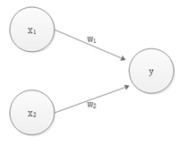

x1与x2是输入信号；y是输出信号；

w1与w2是权重。圆圈O代表”神经元”或者”节点”。

输入信号被送往神经元时，会被分别乘以固定的权重（w1 x1, w2 x2）。神经元会计算传送过来的信号总和，只有当这个总和超过某个界限值时，才会输出1，这称为==“神经元被激活”==。这里将界限值称为阈值，用θ符号表示。

权重越大，对应该权重的信号的重要性就越高。

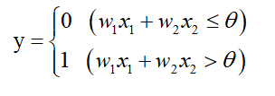

## 简单逻辑电路

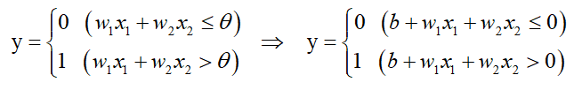

将θ用-b代替。b称为偏置，w1与w2称为权重

## 与门（AND gate）

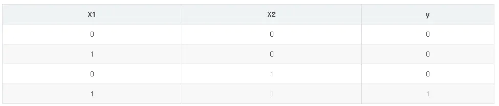

满足条件的(w1,w2, θ)有很多，如（0.5，0.5，0.7）

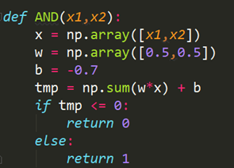

## 与非门（NAND gate）

NAND 表示not AND，即将与门结果颠倒。

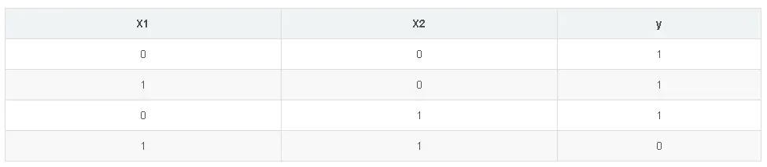

可以用(w1,w2, θ) =（-0.5，-0.5，-0.7）实现.

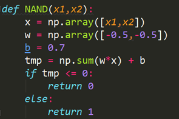

## 或门（OR gate）

NAND 表示not AND，即将与门结果颠倒。

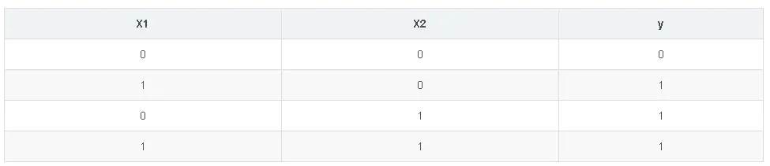

可以用(w1,w2, θ) =（0.5，0.5，0.2）实现

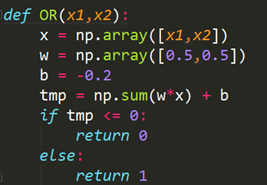

==结论：==

1）构造相同，只是参数（权重和阈值）不同实现3个不同的电路；

2）w1与w2时控制输入信号的重要参数，偏置是调整神经元被激活的容易程度（输出为1）的参数。

3）有时也将w1与w2，b统称为权重。

# 感知机局限性

## 异或门 (XOR gate)

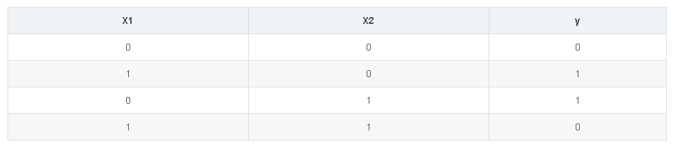

单层感知机只能表示线性空间。

线性空间：直线分割成的空间；

非线性空间：曲线分割成的空间。

**或门的输出**

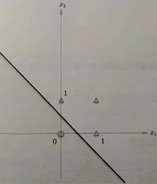

**异或门的输出**

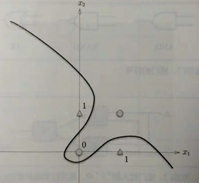

异或门的输出

异或门的输出，无法用线性切割。与门、与非门、或门均可用线性切分。

## 多层感知机实现异或门

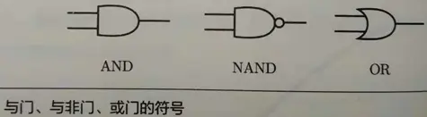

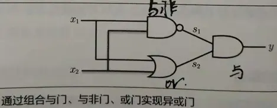

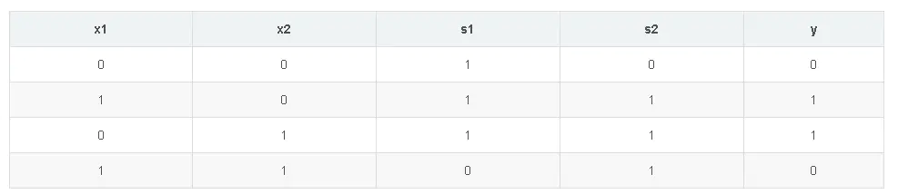

代码实现：

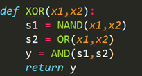

异或门是一种多层神经网络，如下图：

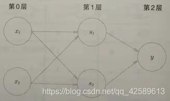

结论：

1）单层感知机只能表示线性空间，多层感知机可以表示多层空间；

2）多层感知机在理论上可以表示计算机.

# 神经网络

对于感知机权重参数wi的设定，是由人工来进行确定的，即确定合适的、能够符合预期的输入与输出的权重。但是实际的神经网络可以在训练过程中**自动的从数据中学习到合适的权重参数。**

## 从感知机到神经网络

下面我们主要介绍一下神经网络的组成，如下图，是一个典型的神经网络结构，0层：**输入层**；1层：**中间层（隐藏层）**；2层：**输出层**。该网络由**3层神经元**构成，但只有2层神经元有权重（即输入层与中间层），因此称其为“2层网络”

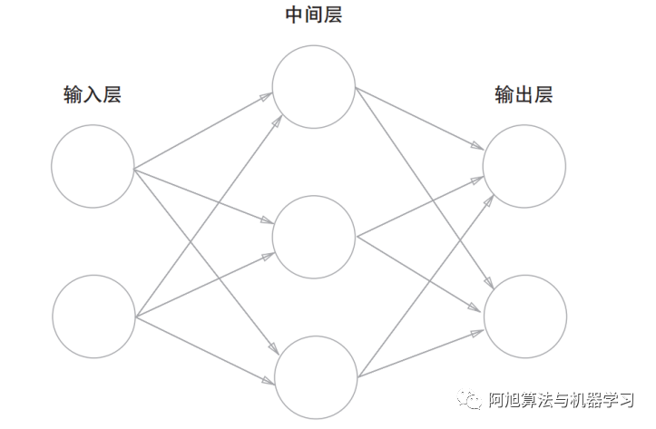

回顾一下，感知机接收两个输入信号x1,x2，然后输出y。输入层加上偏置b的话则形式如下图。

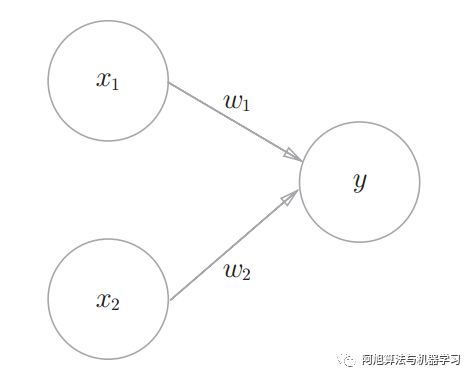

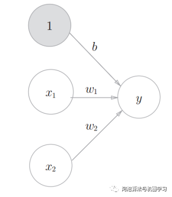

上述加上偏置b的数学表达式如下：

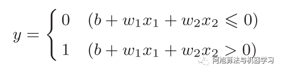

其中，b被称之为偏置，用于控制神经元被激活的难易程度，加入b值越大，则输入信号的越难大于0，即越不容易被激活（即将y值变为1）；w1,w2表示各个信号的权重参数。

我们引入函数h(x)将上述公式简化如下：（即将（b + w1x1 + w2x2）看做一个整体）

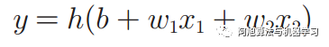

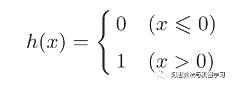

输入信号会被函数h(x)转换，转换后的值就是输出y。这里的函数h(x)即为神经网络中的激活函数。

## 激活函数

**上述h(x)函数**会将输入信号的总和转换为输出信息，这种函数称之为**激活函数**。

激活函数的**作用**在于决定如何来激活输入信号的总和。

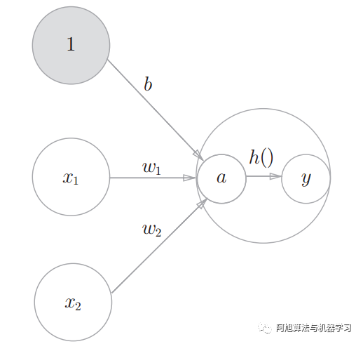

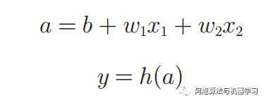

**信号加权和为节点a,节点a被激活函数h()转换成节点y**。

a与y称为节点（神经元）。h()为激活函数。

**激活函数是连接感知机和神经网络的桥梁。**

一般而言，“朴素感知机”是指单层网络，指的是激活函数使用了阶跃函数 A 的模型。

“多层感知机”是指神经网络，即使用sigmoid 函数等**平滑的激活函数**的多层网络。

在神经网络中，激活函数主要有以下几种：

## 1.阶跃函数

**阶跃函数**是指一旦输入超过阈值，就切换输出的函数。上述感知机中使用的就是该种激活函数，一旦a大于0则，输出变为1.

上述感知机的阶跃函数图形如下，从图中可以看出该阶跃函数以0为界，输出从0切换为1（或从1切换为0），值呈阶梯式变化，因此称为阶跃函数。

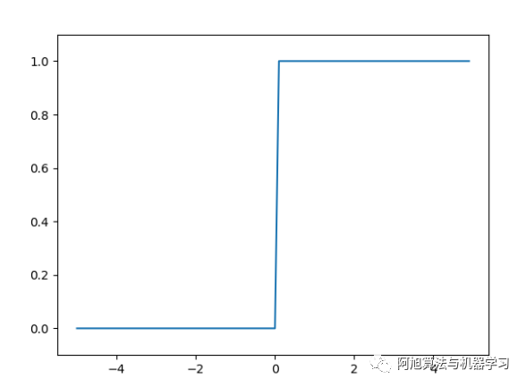

实现代码：

```python
import numpy as np
import matplotlib.pyplot as plt


def step_function(x):
    """
        x>0转换为一个布尔类型的矩阵
        dtype再将数据转化为int类型
    """
    return np.array(x > 0, dtype=np.int)


x = np.arange(-5, 5, 0.1)
y = step_function(x)
plt.plot(x, y)
# 设置yz轴的范围
plt.ylim(-0.1, 1.1)
plt.show()
```


## 2.sigmoid函数

Sigmoid函数的数学表达式如下：

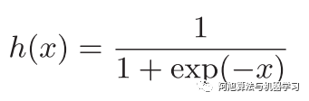

函数图像如下所示：

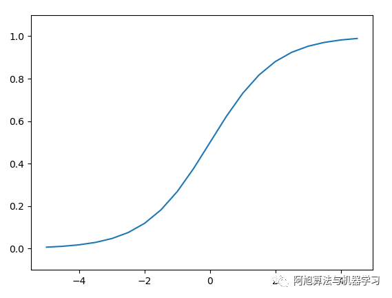

实现代码：

```python
def sigmoid(x):
    return 1 / (1 + np.exp(-x))


x = np.arange(-5, 5, 0.5)
y = sigmoid(x)
plt.plot(x, y)
plt.ylim(-0.1, 1.1)
plt.show()
```

==注意：==**神经网络的激活函数必须使用非线性函数**。这是为什么呢？原因如下：

**线性函数的问题在于，不管如何加深层数，总是存在与之等效的“无隐藏层的神经网络”。举例：我们考虑把线性函数 h(x) = cx 作为激活函数，把y(x) = h(h(h(x)))的运算对应3层神经网络 A。这个运算会进行y(x) = c × c × c × x的乘法运算，但是同样的处理可以由y(x) = ax（注意，a = c3）这一次乘法运算（即没有隐藏层的神经网络）来表示。如本例所示，使用线性函数时，无法发挥多层网络带来的优势。因此，为了发挥叠加层所带来的优势，激活函数必须使用非线性函数。**

## 3.ReLU函数

ReLU（ Rectifed Linear Unit）函数：ReLU函数在输入大于0时，直接输出该值；在输入小于等于0时，输出0。数学表达式如下：

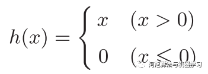

图形如下所示：

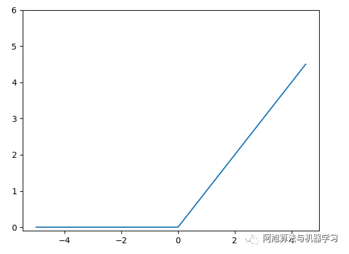

实现代码：	

```python
def relu(x):
    # maximum返回0和x之间最大的值
    return np.maximum(0, x)


x = np.arange(-5, 5, 0.5)
y = relu(x)
plt.plot(x, y)
plt.ylim(-0.1, 6)
plt.show()
```

## 4. softmax函数

softmax函数，又称**归一化指数函数。**它是二分类函数sigmoid在多分类上的推广，目的是将多分类的结果以概率的形式展现出来。


下面为大家解释一下为什么softmax是这种形式。

首先，我们知道概率有两个性质：

+ 非负性：预测的概率为非负数；

+ 归一性：各种预测结果概率之和等于1。

softmax就是将在负无穷到正无穷上的预测结果按照这两步转换为概率的。

**1）将预测结果转化为非负数**

下图为y=exp(x）的图像，我们可以知道**指数函数**的值域取值范围是零到正无穷。**softmax第一步就是将模型的预测结果转化到指数函数上，这样保证了概率的非负性。**


**2）各种预测结果概率之和等于1**

为了确保各个预测结果的概率之和等于1。我们只需要将转换后的结果进行归一化处理。方法就是==将转化后的结果除以所有转化后结果之和，可以理解为转化后结果占总数的百分比==。这样就得到近似的概率。

下面为大家举一个例子，假如模型对一个三分类问题的预测结果为-3、1.5、2.7。我们要用softmax将模型结果转为概率。步骤如下：

1. 将预测结果转化为非负数

   y1 = exp(x1) = exp(-3) = 0.05

   y2 = exp(x2) = exp(1.5) = 4.48

   y3 = exp(x3) = exp(2.7) = 14.88

2. 各种预测结果概率之和等于1

   z1 = y1/(y1+y2+y3) = 0.05/(0.05+4.48+14.88) = 0.0026

   z2 = y2/(y1+y2+y3) = 4.48/(0.05+4.48+14.88) = 0.2308

   z3 = y3/(y1+y2+y3) = 14.88/(0.05+4.48+14.88) = 0.7666

总结一下softmax如何将多分类输出转换为概率，可以分为两步：

1. 分子：通过指数函数，将实数输出映射到零到正无穷。

2. 分母：将所有结果相加，进行归一化。

**代码实现**

**输入向量x加上一个常数c后求softmax结算结果不变**，即:


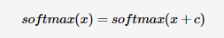

```python
def softmax(a):
    c = np.max(a)
    exp_a = np.exp(a-c)
    sum_exp_a = np.sum(exp_a)
    y = exp_a / sum_exp_a
    return y
 
def _softmax(x):
    if x.ndim == 2:
        x = x.T
        x = x - np.max(x, axis=0)
        y = np.exp(x) / np.sum(np.exp(x), axis=0)
        return y.T
 
    x = x - np.max(x) # 溢出对策
    return np.exp(x) / np.sum(np.exp(x))
 
def __softmax(x):
    orig_shape=x.shape
    print("orig_shape",orig_shape)
 
    if len(x.shape)>1:
        #矩阵
        tmp=np.max(x,axis=1)
        x-=tmp.reshape((x.shape[0],1))
        x=np.exp(x)
        tmp=np.sum(x,axis=1)
        x/=tmp.reshape((x.shape[0],1))
        print("matrix")
    else:
        #向量
        tmp=np.max(x)
        x-=tmp
        x=np.exp(x)
        tmp=np.sum(x)
        x/=tmp
        print("vector")
    return x
 
 
print(softmax(np.array([1,2,3,4,5])))
print(softmax(np.array([[1,2,3,4,5],[1,2,4,3,5]])))
print(_softmax(np.array([1,2,3,4,5])))
print(_softmax(np.array([[1,2,3,4,5],[1,2,4,3,5]])))
print(__softmax(np.array([1,2,3,4,5])))
print(__softmax(np.array([[1,2,3,4,5],[1,2,4,3,5]])))
```


## 神经网络的内积计算方式

我们使用numpy矩阵来完成神经网络的神经元及权重之间的计算。 	

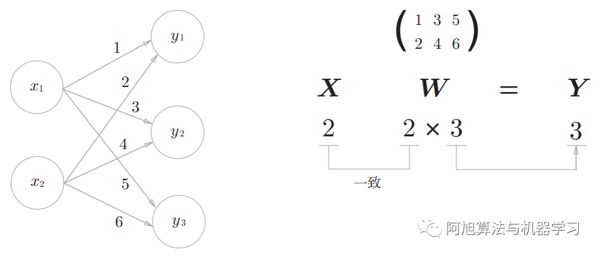

## 3层神经网络的实现

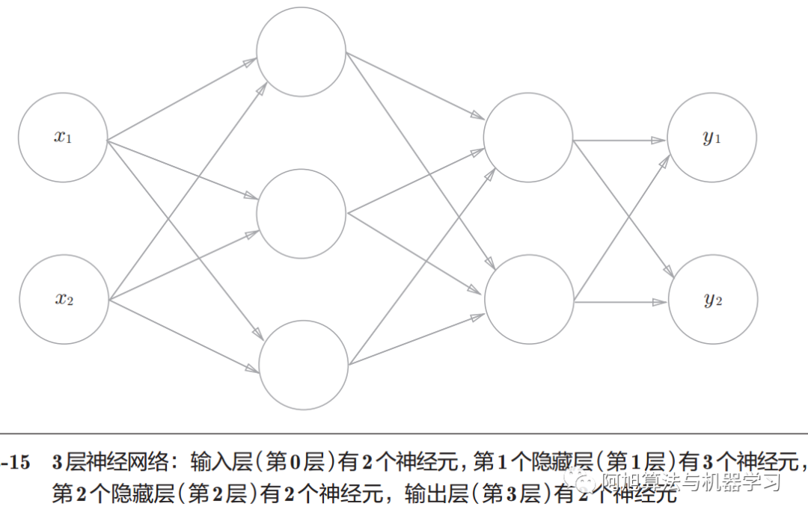

权重的符号：

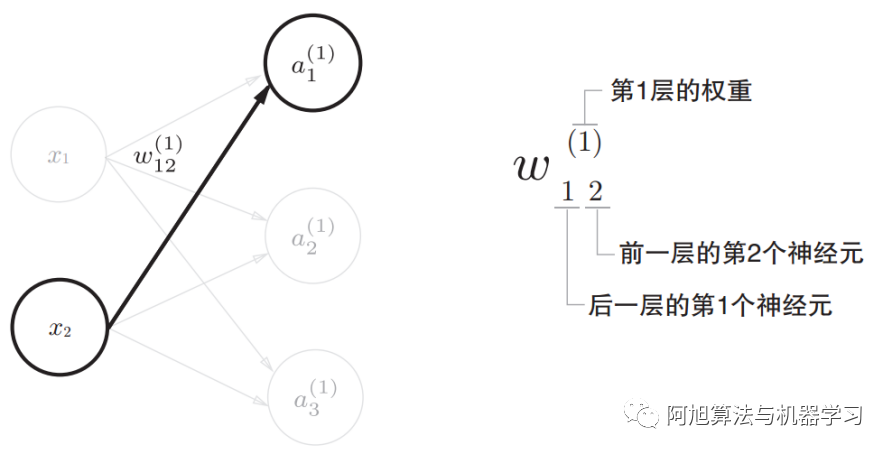

各层间信号的传递：

从第0层到第1层：

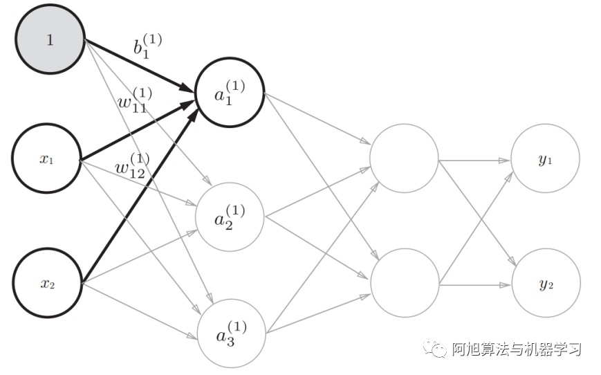

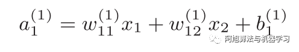

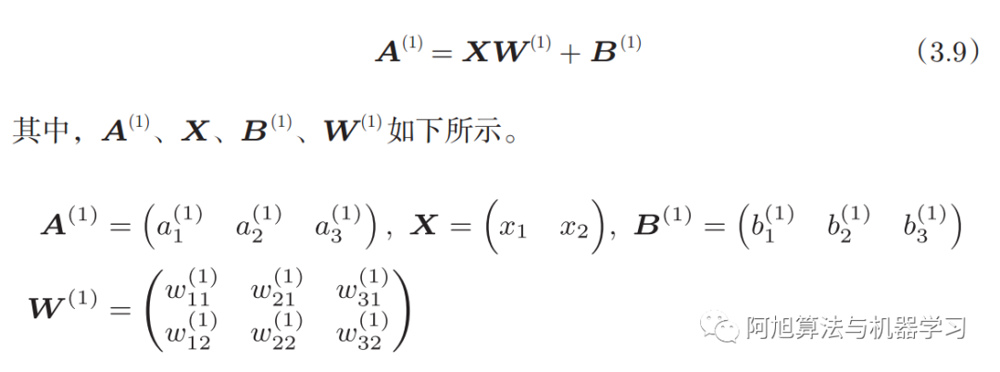

B的个数是由该层输出神经元的个数决定的。

从第1层到第2层：

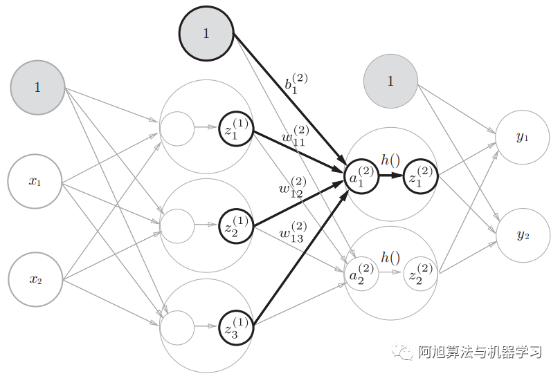

从第2层到第3层：

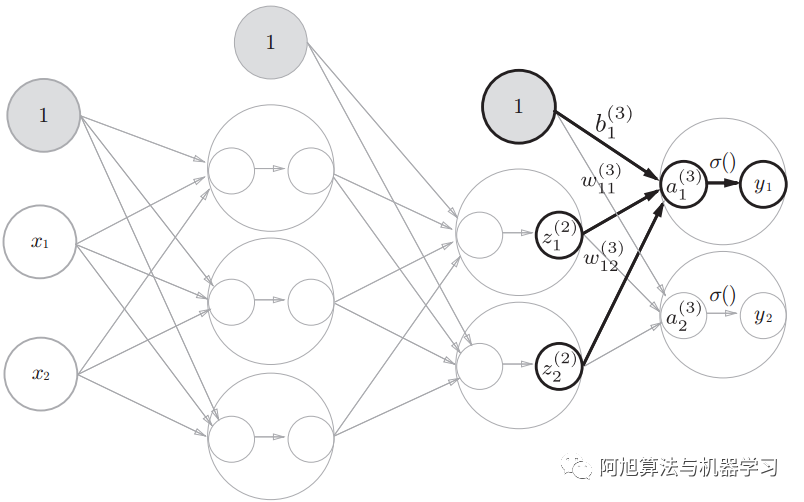

输出层的激活函数用σ()表示，不同于隐藏层的激活函数*h*()（ σ读作sigma）

**用σ（）表示输出层的激活函数。h()表示隐藏层的激活函数。**


3层神经网络的具体代码实现：

```python
import numpy as np

"""
    三层神经网络的实现
"""


def sigmoid(x):
    return 1 / (1 + np.exp(-x))


"""
    identity_function是一个恒等函数，将其作为输出层的激活函数(保持流程的统一性)
"""


def identity_function(x):
    return x


def init_network():
    # 对权值和偏置进行初始化，并保存在一个字典中
    network = {}
    network['w1'] = np.array([[0.1, 0.3, 0.5], [0.2, 0.4, 0.6]])
    network['b1'] = np.array([0.1, 0.2, 0.3])
    network['w2'] = np.array([[0.1, 0.4], [0.2, 0.5], [0.3, 0.6]])
    network['b2'] = np.array([0.1, 0.2])
    network['w3'] = np.array([[0.1, 0.3], [0.2, 0.4]])
    network['b3'] = np.array([0.1, 0.2])
    return network


def forward(network, x):
    w1, w2, w3 = network['w1'], network['w2'], network['w3']
    b1, b2, b3 = network['b1'], network['b2'], network['b3']
    print(w1)
    print(x)
    a1 = np.dot(x, w1) + b1
    z1 = sigmoid(a1)
    print(z1)
    a2 = np.dot(z1, w2) + b2
    z2 = sigmoid(a2)
    a3 = np.dot(z2, w3) + b3
    y = identity_function(a3)
    return y


network = init_network()
x = np.array([1.0, 5.0])
y = forward(network, x)
print(y)
```

# 神经网络的核心驱动力--[损失函数]

# 神经网络的学习目标

神经网络的“学习”是指从训练数据中自动获取**最优权重参数**的过程，即神经网络自我训练的过程。为了使神经网络能进行学习，将导入**损失函数**这一指标。通过使损失函数最小，来寻找最优权重参数。**学习的目的就是以该损失函数为基准，找出能使它的值达到最小的权重参数**

**从数据中学习**

---

神经网络的特征就是可以从数据中学习。所谓“从数据中学习”，是指可以由数据自动决定权重参数的值。以如何实现数字5的识别为例，下图给出了三种方式：

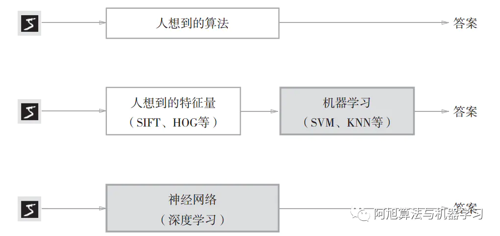

1，通过人想的算法；
 2，通过人为的进行特征量的提取，然后使用机器学习算法；
 3，直接通过神经网络深度学习，此处**没有人的介入，不需要人来进行特征选择。**
 **注：深 度 学 习 有 时 也 称 为\** 端 到 端 机 器 学 习（end-to-end machine learning）**。这里所说的端到端是指从一端到另一端的意思，也就是从原始数据（输入）中获得目标结果（输出）的意思。神经网络的优点是对于所有问题都可以用同样的流程来进行解决。


# 训练数据和测试数据

机器学习中，一般将数据分为**训练数据**和**测试数据**两部分来进行学习和实验等。首先，使用训练数据进行学习，寻找最优的参数；然后，使用测试数据评价训练得到的模型的实际能力。为什么需要将数据分为训练数据和测试数据呢？因为我们追求的是模型的**泛化能力**。为了正确评价模型的泛化能力，就必须划分训练数据和测试数据。另外，训练数据也可以称为**监督数据**。

**泛化能力**是指处理未被观察过的数据（不包含在训练数据中的数据）的能力。获得泛化能力是机器学习的最终目标。仅仅用一个数据集去学习和评价参数，是无法进行正确评价的。这样会导致可以顺利地处理某个数据集，但无法处理其他数据集的情况。只对某个数据集过度拟合的状态称为**过拟合（ over fitting）。

# 损失函数

在神经网络的学习中，神经网络需要以**某个指标**为线索寻找最优参数（权重和偏置），而这个指标就是**损失函数（ loss function）。**更新参数的方向是以损失函数的值尽可能小为参考标准。为了找到使损失函数的值尽可能小的地方，需要计算参数的导数（确切地讲是**梯度**），然后以这个导数为指引，逐步更新参数的值。假设有一个神经网络，现在我们来关注这个神经网络中的某一个权重参数。此时，**对该权重参数的损失函数求导**，表示的是“**如果稍微改变这个权重参数的值，损失函数的值会如何变化**”。如果导数的值为负，通过使该权重参数向正方向改变，可以减小损失函数的值；反过来，如果导数的值为正，则通过使该权重参数向负方向改变，可以减小损失函数的值。不过，当导数的值为0时，无论权重参数向哪个方向变化，损失函数的值都不会改变，此时该权重参数的更新会停在此处。一般用**均方误差**和**交叉熵误差**等。损失函数是表示神经网络性能的“恶劣程度”的指标。

## 均方误差

均方误差的数学公式如下：

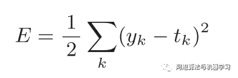

yk是表示神经网络的输出， tk表示监督数据， k表示输出目标数据的维数。

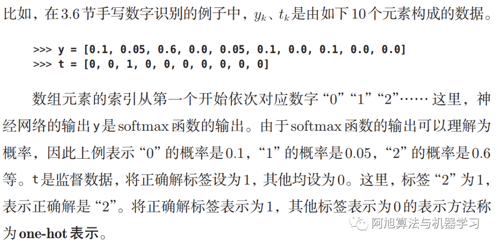

## 交叉熵误差

**交叉熵误差（ cross entropy error）**的数学公式如下：

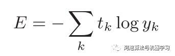

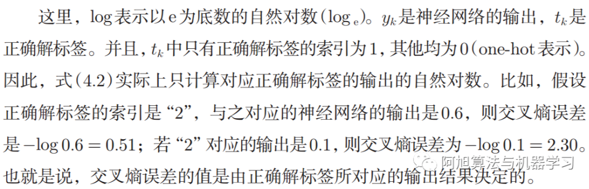

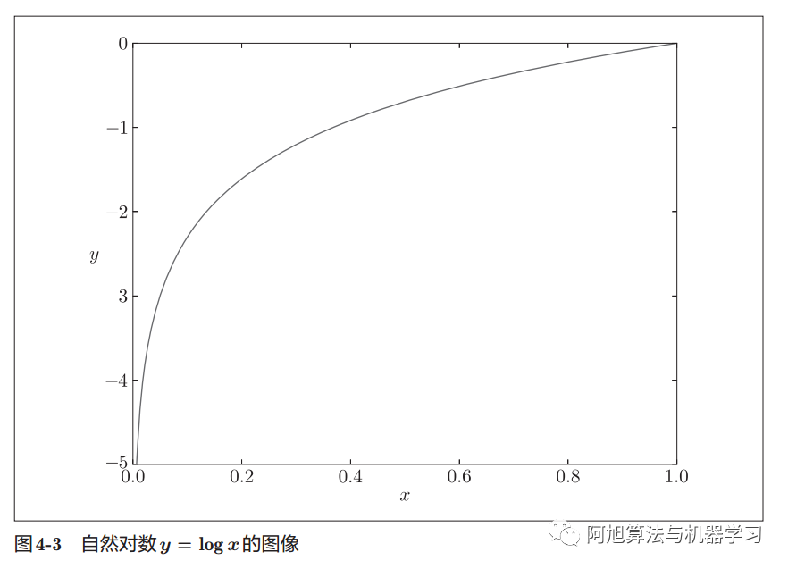

如图所示， x等于1时， y为0；随着x向0靠近， y逐渐变小。因此，正确解标签对应的输出越大，式（ 4.2）的值越接近0；当输出为1时，交叉熵误差为0。此外，如果正确解标签对应的输出较小，则式的值较大。

==One_Hot==代码实现交叉熵误差：

```python
def cross_entropy_error(y, t):
    delta = 1e-7
    return -np.sun(t * np.log(y + delta))
```

==非One-hot编码==

```python
def cross_entropy_error(y, t):
	delta = 1e-7
	return -np.log(y + delta)

```


## min-batch学习损失函数计算

上述仅对单个数据进行了损失函数的计算，而机器学习需要对大批量的数据进行训练，因此在计算损失函数时必须将所有的训练数据作为对象。也就是说，如果训练数据有100个的话，我们就要把这100个损失函数的总和作为学习的指标。如果有N个数据，则将平均损失函数作为训练目标，可以获得和训练数据的数量无关的统一指标：

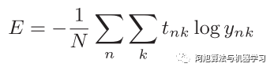

假设数据有N个， t~nk~表示第n个数据的第k个元素的值（ y~nk~是神经网络的输出， t~nk~是监督数据）。通过除以N可以求得单个数据的**平均损失函数**，与训练数据的数量无关。但是如果数据量非常大，比如 MNIST数据集的训练数据有60000个，要是以全部数据为对象求损失函数的和，则计算过程需要花费较长的时间。再者，如果遇到大数据，数据量会有几百万、几千万之多，这种情况下以全部数据为对象计算损失函数是不现实的。因此，我们从全部数据中选出一部分，作为全部数据的“近似”。神经网络的学习也是从训练数据中选出一批数据（称为**mini-batch,小批量**），然后对每个mini-batch进行学习。比如，从60000个训练数据中随机选择100笔，再用这100笔数据进行学习。这种学习方式称为**mini-batch学习。**

```python
t_train, x_train, t_test, x_test = load_mnist()
x_train_size = x_train.shape[0]
batch_size = 10
batch_mask = np.random.choice(x_train_size, batch_size)
x_batch = x_train[batch_mask]
t_batch = t_train[batch_mask]
```

## min-batch版交叉熵误差的代码实现：

==One-Hot编码==

```python
# 可以同时处理单个数据和批量数据
def cross_entropy_error(y, t):
	'''判断维数，将单个数据和批量数据处理成同样的形式，
	方便后面shape[0]取出batch_size'''
    if y.ndim == 1:
        t = t.reshape(1, t.size)
        y = y.reshape(1, y.size)

	# shape[0]即最外层的个数，即batch_size（每一批的数据量）
    batch_size = y.shape[0]
    print("y.shape[0]:", y.shape[0])
    print("y.shape:", y.shape)
    # 返回平均交叉熵误差
    return -np.sum(t * np.log(y + 1e-7)) / batch_size

```

其中，y为神经网络的输出，t为监督数据，y+1e-7主要是为了防止y为0时，出现负无穷大，导致计算失败的情况。

首先判断维数

当维数为1时

```python
# 我们将十个数看做一组数据
t = [0, 0, 1, 0, 0, 0, 0, 0, 0, 0]
y = [0.1, 0.05, 0.6, 0.0, 0.05, 0.1, 0.0, 0.1, 0.0, 0.0]
temp = cross_entropy_error(np.array(y), np.array(t))
print(temp)

```

运行结果：

```python
y.shape[0]: 1
y.shape: (1, 10)
0.510825457099338
```

可以看出shape[0]为输入数据的batch_size,但是如果不进行判断，不对一维情况处理。

```python
def cross_entropy_error(y, t):
    # if y.ndim == 1:
    #     t = t.reshape(1, t.size)
    #     y = y.reshape(1, y.size)

    batch_size = y.shape[0]
    print("y.shape[0]:", y.shape[0])
    print("y.shape:", y.shape)
    return -np.sum(t * np.log(y + 1e-7)) / batch_size

t = [0, 0, 1, 0, 0, 0, 0, 0, 0, 0]
y = [0.1, 0.05, 0.6, 0.0, 0.05, 0.1, 0.0, 0.1, 0.0, 0.0]
temp = cross_entropy_error(np.array(y), np.array(t))
print(temp)
```

运行结果：

```python
y.shape[0]: 10
y.shape: (10,)
0.0510825457099338
```

可以看出shape[0]为10，而正确batch_size为1，没有得到正确的值

归根结底，此判断就是为了能够统一单个数据和多个数据，求单个数据的交叉熵误差时，需要改变数据的形状。

==非One-hot==

```python
def cross_entropy_error(y, t):
	if y.ndim == 1:
		t = t.reshape(1, t.size)
		y = y.reshape(1, y.size)
	batch_size = y.shape[0]
	return -np.sum(np.log(y[np.arange(batch_size),t] + 1e-7)) / batch_size

```


# 神经网络参数的训练方式

# 梯度法

神经网络必须在学习时找到最优参数（权重和偏置），即使损失函数取最小值时的参数。通过巧妙地**使用梯度来寻找函数最小值（或者尽可能小的值）的方法就是梯度法**。需要注意的是，梯度表示的是各点处的函数值减小最多的方向。因此，无法保证梯度所指的方向就是函数的最小值或者真正应该前进的方向。实际上，在复杂的函数中，梯度指示的方向基本上都不是函数值最小处。虽然梯度的方向并不一定指向最小值，但沿着它的方向能够最大限度地减小函数的值。因此，在寻找函数的最小值（或者尽可能小的值）的位置的任务中，要以梯度的信息为线索，决定前进的方向。此时梯度法就派上用场了。在梯度法中，函数的取值从当前位置沿着梯度方向前进一定距离，然后在新的地方重新求梯度，再沿着新梯度方向前进，如此反复，不断地沿梯度方向前进。像这样，通过不断地沿梯度方向前进，逐渐减小函数值的过程就是**梯度法（ gradient method）**。

==注：==根据目的是寻找最小值还是最大值，梯度法的叫法有所不同。严格地讲，寻找最小值的梯度法称为**梯度下降法（gradient descent method）** ，寻找最大值的梯度法称为**梯度上升法（gradient ascent method）**。但是通过反转损失函数的符号，求最小值的问题和求最大值的问题会变成相同的问题，因此“下降”还是“上升”的差异本质上并不重要。**一般来说，神经网络（深度学习）中，梯度法主要是指梯度下降法。

梯度法的数学表达式如下:

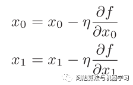

η表示更新量，在神经网络的学习中，称为**学习率（ Learning Rate）**。学习率决定在一次学习中，应该学习多少，以及在多大程度上更新参数。**学习率需要事先确定为某个值，比如0.01或0.001**。一般而言，这个值过大或过小，都无法抵达一个“好的位置”。**在神经网络的学习中，一般会一边改变学习率的值，一边确认学习是否正确进行了**。梯度下降法的实现代码如下：

```python
def numerical_gradient(f, x):
    """
        求每一个参数得梯度
    """
    # 定义学习率
    h = 1e-4
    # 初始化所有梯度为0
    grad = np.zeros_like(x)

    for idx in range(x.size):
        # 遍历每一个自变量索引，tmp_val保存当前自变量值
        tmp_val = x[idx]
        # 计算f(x+h)
        x[idx] = float(tmp_val) + h
        fxh1 = f(x)
        # 计算f(x-h)
        x[idx] = tmp_val - h
        fxh2 = f(x)
        # 计算偏导数
        grad[idx] = (fxh1 - fxh2) / (2 * h)
        # 将当前自变量xi的值还原，继续计算后续x[i+1]的导数值
        x[idx] = tmp_val

    return grad


def gradient_descent(f, init_x, lr=0.01, step_num=100):
    # lr:学习率设为0.01
    # 梯度下降的步数step_num = 100
    x = init_x
    for i in range(step_num):
        # 对每个参数进行100次梯度下降计算
        grad = numerical_gradient(f, x)
        x -= lr * grad
    return x
```

其中：参数 f是要进行最优化的函数， init_x是初始值， lr是学习率learningrate， step_num是梯度法的重复次数。numerical_gradient(f,x)会求函数的梯度，用该梯度乘以学习率得到的值进行更新操作，由 step_num指定重复的次数。

## 神经网络的梯度计算

神经网络的学习训练过程也是通过求梯度来一步步求得最优参数值的。这里的梯度指损失函数关于权重参数的梯度。比如，有一个只有一个形状为2 × 3的权重W的神经网络，**损失函数用\*L*表示**。此时，梯度的数学式表示如下所示。

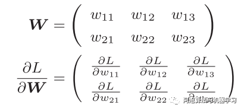

下面先以简单的单层神经网络为例，实现梯度的计算：

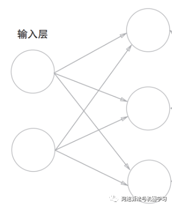