# 数据基础运算

## N维数组样例

+ N维数组是机器学习和神经网络的主要数据结构

  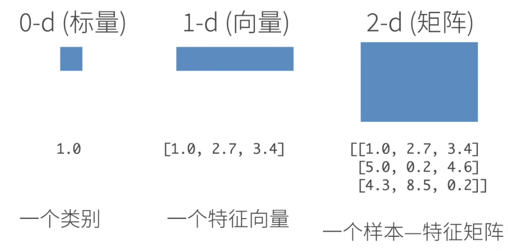

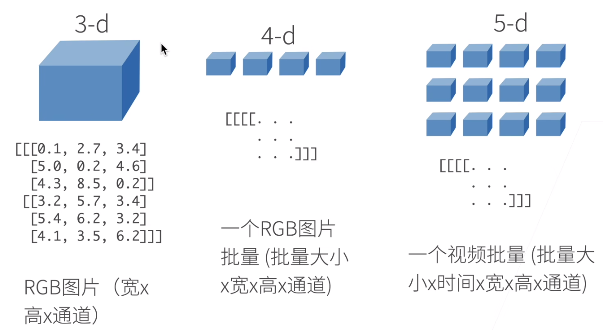


## 访问元素

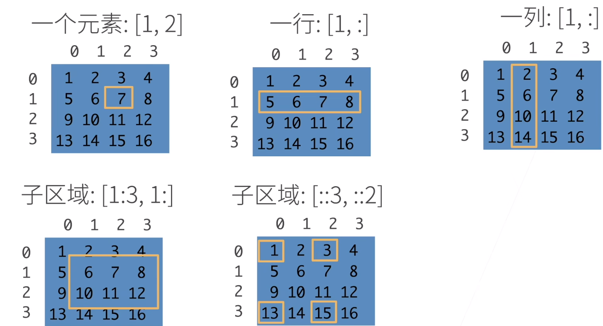


## 张量的基础操作

**张量表示一个数值组成的数组**

```python
x = torch.arange(12)
```

**可以通过张量的`shape`属性来访问张量的形状和张量元素的总和**

```python
x.shape
```

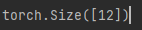

**元素的种数**

```python
x.numel()  // 12
```

**可以调用`reshape`函数，改变一个张量的形状而不改变元素的数量和元素值**

```python
x = x.reshape(3, 4)
```

**通过提供包含数值的Python列表(或嵌套列表)来为所需张量中的每个元素赋值**

```python
x = torch.tensor([[2, 1, 4, 3], [1, 2, 3, 4], [4, 3, 2, 1]])
```

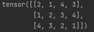

**常见的标准运算+ - * /都可以升级为按元素运算**

```python
torch.exp(x)
```

**可以把多个张量连结在一起**

```python
x = torch.arange(12, dtype=torch.float32).reshape(3, 4)
y = torch.tensor([[2.0, 1, 4, 3], [1, 2, 3, 4], [4, 3, 2, 1]])
x1 = torch.cat((x, y), dim=0)
y1 = torch.cat((x, y), dim=1)
print(x1)
```

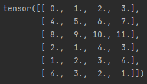

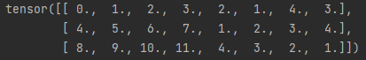

**通过逻辑运算符构建二元张量**

```python
z = (x == y)
```

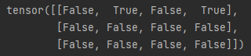

**对张量中的所有元素进行求和**

```python
x.sum()
```

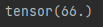

**即使形状不同，我们仍然可以通过调用广播机制(broadcasting mechanism)来执行按元素操作**

## 内存分配问题

**创建了一个新的y**

```python
before = id(y)
y = y + x
id(y) == before
```

**执行原地操作**

```python
z = torch.zeros_like(y)
print("id(z):", id(z))
z[:] = x + y
print("id(z):", id(z))
```

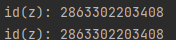

**如果在后续计算中没有重复使用x，可以使用`x[:] = x + y`或`x += y`来减少操作的内存消耗**

## 与numpy进行相互转换

```python
a = x.numpy()
b = torch.tensor(a)
print(type(a))
print(type(b))
```

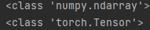

## 将大小为1的张量转换为Python标量

```python
a = torch.tensor([3.5])
a.item()
float(a)
```

# 数据预处理

**创建一个人工数据集，并存储在csv文件**

```python
import os
os.makedirs(os.path.join('..', 'data'), exist_ok=True)
data_file = os.path.join('..', 'data', "house_tiny.csv")
with open(data_file, 'w') as f:
    f.write("NumRooms, Ally, Price\n")
    f.write("NA, Pave, 127500\n")
    f.write("2, NA, 106000\n")
    f.write("4, NA, 178100\n")
    f.write("NA, NA, 140000\n")
```

**pandas对缺失值进行处理**

```python
inputs, outputs = data.iloc[:, 0:2], data.iloc[:, 2]
inputs = inputs.fillna(inputs.mean(numeric_only=True))

inputs = pd.get_dummies(inputs, dummy_na=True)
```

**inputs和outputs中的所有条目都是数值类型，他们可以转换为张量格式**

```python
import torch
x, y = torch.tensor(inputs.values), torch.tensor(outputs.values)
```

**标量由只有一个元素的张量表示**

```python
x = torch.tensor([3.0])
y = torch.tensor([2.0])
```

**计算总和或均值时，保持轴数不变**

```python
sum_A = A.sum(axis=1, keepdims=True)
A / sum_A
```

**Θ和点积**

```python
a * b
torch.dot(a, b)
```

**累加求和**

```python
A = torch.arange(20).reshape(5, 4)
A.cumsum(axis=0)
```

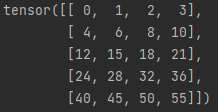

**L~2~范数是向量元素平方和的平方根**

```python
A = torch.tensor([3.0], -4.0)
torch.norm(A)
```

