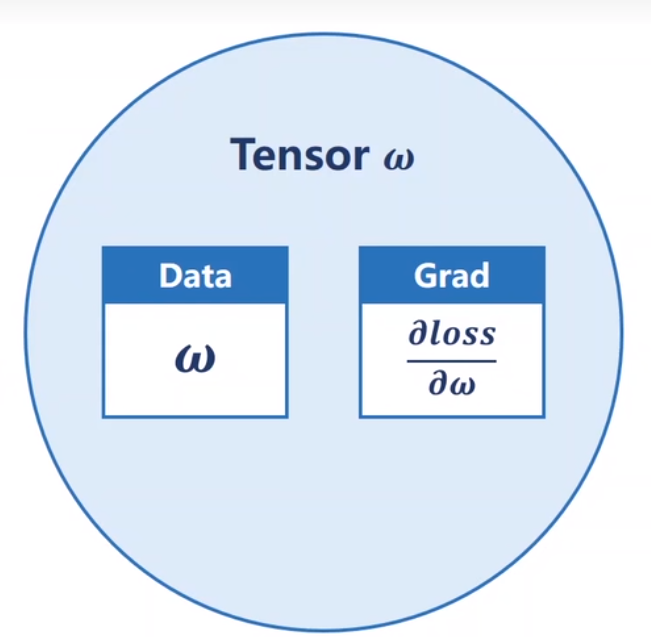
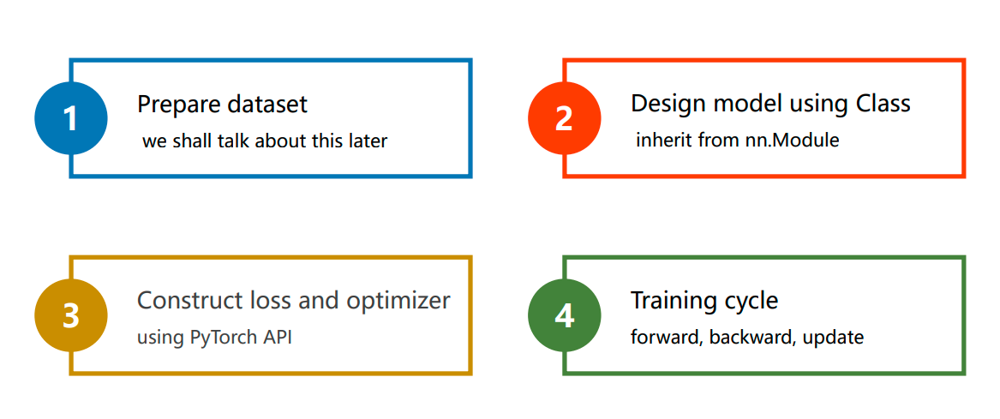
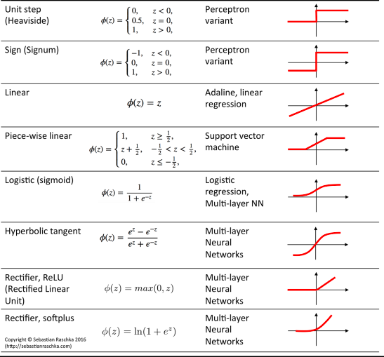

# 什么是pytorch

是一个基于python的一个科学计算包

+ numpy的替代品，可以利用GPU的性能进行计算
+ 深度学习平台，具有足够的灵活性和速度

==要有都文档的能力，有基本的架构理念==

# tensor(张量)

## tensor自动微分

**1. 用来保存网络中数据的类，其中grad也是一个tensor,因此要想取得梯度的值需要tensor.data**




```python
import torch 
x_data = [1.0, 2.0, 3.0]
y_data = [2.0, 4.0, 6.0]

w = torch.tensor([1.0])
```

**2. 权重需要计算梯度时，设置为True用来跟踪与w相关的计算,默认是不需要计算梯度的**

```python
w.requires_grad = True
```

+ **.grad**

  张量的梯度将会累积到.grad属性中，可以调用backword()计算所有梯度
  
  ```python 
  # 将梯度保存在w中，然后计算图释放
  loss.backword()
  ```
  
  每次更新完梯度之后将所有梯度清零
  
  ```python
  # 将所有梯度清零
  w.grad.zero()
  ```
  
  

+ .grad_fn


## tersor数据类型转换

+ **数据存储位置转换**

  CPU张量---->GPU张量，使用`data.cuda()`

  GPU张量---->CPU张量，使用`data.cpu()`

+ **与numpy数据类型转换**

  tensor---->numpy, 使用`data.numpy()`，data为tensor变量

  numpy---->tensor, 使用`torch.from_numpy(data)`, data为numpy变量

+ **与python数据类型转换**

  tensor---->单个python数据，使用`data.item()`，data为tensor变量且只能包含单个数据
  
  tensor---->python list,使用`data.tolist()`, data为tensor变量，返回shape相同的可嵌套的list

## tensor创建

```python
from __future__ import print_function
import torch
```

1. 构造一个5*3的矩阵，不初始化

```python
x = torch.empty(5, 3)
print(x)
```

2. 构造一个随机初始化的矩阵

```python
x = torch.rand(5,3)
```

3. 构造一个全零的矩阵

```python
z = torch.zeros(5, 3, dtype=torch.long)
print(z)
```

4. 构造一个张量（直接使用数据）

```python
x = tensor([5.5, 3])
```


## tensor运算

1. 按元素相除时，必须先将数据转换为浮点型，否则计算结果只有整数部分

```python
x.float() / y,float()
```

2. 使用@做矩阵乘法

```python 
# x 与 y的转置做矩阵乘法
x @ y.t()
```

3. 使用条件判别可以生成元素为0或1的新tensor,在numpy中生成的是True和False


# pytorch使用


## 导入torch

**为了避免数据类型错误，将tensor的默认数据类型统一设置为double类型**

```python
import torch
torch.set_default_tensor_type(torch.DoubleTensor)
```




==神经网络的本质是寻找一种非线性的空间变换函数==

 

## 准备数据(prepare dataset)


### 糖尿病数据集

```python
# 读取数据
xy = np.loadtxt("../dataset/diabetes.csv.gz", delimiter=',', dtype=np.float32)
# 读取前八列
x_data = torch.from_numpy(xy[:, :-1])
# 加中括号，取出的数据是一个矩阵,否则取出的是一个向量
y_data = torch.from_numpy(xy[:, [-1]])
```

+ 随机梯度下降性能很好，但是速度很慢
+ batch速度快，但是性能较差
+ 通常使用mini-batch


### 读取数据集

1. Dataset是一个抽象类
2. DataLoader是用来加载数据，并进行shuffle，batch_size的操作

```python
import torch
from torch.utils.data import Dataset
from torch.utils.data import DataLoader
```

3. 如果数据集较小，可以在初始化时，一次性读入
4. 多线成读取时windows下会出问题，解决方法将训练代码包裹在`if __name__ == "__main__":`中

```python
class DiabetesDataset(Dataset):

    def __init__(self, filepath):
        xy = np.loadtxt(filepath, delimiter=",", dtype=np.float32)
        self.len = xy.shape[0]
        self.x_data = torch.from_numpy(xy[:, :-1])
        self.y_data = torch.from_numpy(xy[:, [-1]])

    # 实例化的类可以支持下标操作,使用索引取出数据
    def __getitem__(self, index):
        return self.x_data[index], self.y_data[index]

    # 获得数据的数量
    def __len__(self):
        return self.len

dataset = DiabetesDataset("../dataset/diabetes.csv.gz")
# num_workers是否使用多线程读取数据,DataLoader会将读取的数据自动转换为tensor
train_loader = DataLoader(dataset=dataset, batch_size=32, shuffle=True,
                          num_workers=2)
```


## 设计模型(Design Model)

### 线性模型

```python
class LinearModel(torch.nn.Module):
    
    def __init__(self):
        super().__init__()
        # 构造一个对象
        self.linear = torch.nn.Linear(1, 1)

    def forward(self, x):
        y_pred = self.linear(x)
        return y_pred
```

### 逻辑回归模型

```python
class LinearModel(torch.nn.Module):
    
    def __init__(self):
        super().__init__()
        # 构造一个对象
        self.linear = torch.nn.Linear(1, 1)

    def forward(self, x):
        y_pred = torch.sigmoid(self.linear(x))
        return y_pred
```

### 多特征值输入

1. 网络层数越多，则网络对于非线性变换的学习能力越强，但有可能过拟合
2. 用超参数搜索的方式来确定最优的网络模型

```python
class Model(torch.nn.Module):

    def __init__(self):
        super(Model, self).__init__()
        self.linear1 = torch.nn.Linear(8, 6)
        self.linear2 = torch.nn.Linear(6, 4)
        self.linear3 = torch.nn.Linear(4, 1)
        self.sigmoid = torch.sigmoid

    def forward(self, x):
        x = self.sigmoid(self.linear1(x))
        x = self.sigmoid(self.linear2(x))
        x = self.sigmoid(self.linear3(x))
        return x
```

#### 激活函数




## 构造损失函数和优化器(Construct loss and optimizer)

### 损失函数

1. MSELoss-均方误差

```python
# 实例化模型
model = LinearModel()
criterion = torch.nn.MSELoss(size_average=False)
```

2. BCELoss-交叉熵误差

```python
criterion = torch.nn.BCELoss(reduction="mean")
```


### 优化器

```python
# model.parameters()会检查model中的所有参数
optimizer = torch.optim.SGD(model.parameters(), lr=0.01)
```


## 训练(Training cycle)

```python
for epoch in range(100):
    epoch_list.append(epoch)
    y_pred = model(x_data)
    loss = criterion(y_pred, y_data)
    print(epoch, loss.item())
    loss_list.append(loss.item())

    optimizer.zero_grad()
    loss.backward()
    optimizer.step()
```


### Epoch

所有训练样本都进行一次前馈和一次反向传播为一个epoch

### Batch-Size

进行一次前馈一次反馈一次 更新所用样本的大小

### Iteration

每个epoch需要多少次迭代

```python
for epoch in range(100):
    for i, data in enumerate(train_loader, 0):
        inputs, labels = data
        y_pred = model(inputs)
        loss = criterion(y_pred, labels)
        print(epoch, i, loss.item())
        optimizer.zero_grad()
        loss.backward()
        optimizer.step()
```

# 与numpy协同操作

## tensor转numpy

```python
a = torch.ones(5)
b = a.numpy()
```

## numpy 转tensor

```python
a = numpy.ones(5)
b = torch.from_numpy(a)
```

 