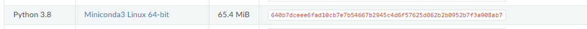
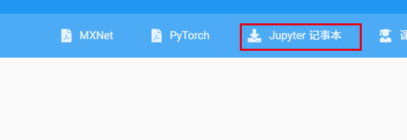

# 安装环境

## 安装基础环境

```linux
sudo apt update

sudo apt install build-essential
```

## 安装miniconda

https://docs.conda.io/en/latest/miniconda.html



右键复制链接

```linux
wget https://repo.anaconda.com/miniconda/Miniconda3-py38_23.1.0-1-Linux-x86_64.sh

bash Miniconda3-py38_23.1.0-1-Linux-x86_64.sh

# 进入conda环境
bash   

# 查看python版本
python --version

# 安装需要的包
pip install jupyter d2l torch torchvison
```

## 记事本文件

http://zh-v2.d2l.ai/



```linux
wget https://zh-v2.d2l.ai/d2l-zh.zip

sudo apt install zip

```


## conda 创建新环境

