# 张量

1. 张量表示一个数值组成的数组，这个数组可能有多个维度

```python
x = torch.arange(12)
x.shape
x.numel()
x.reshape(3, 4)
```

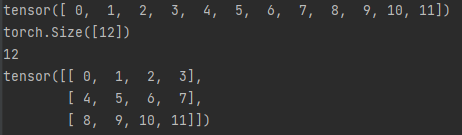


2. 创建全零或全一的张量

```python
torch.zeros((2, 3, 4))
torch.ones((2, 3, 4))
```


3. 通过提供包含数值的python列表(或嵌套列表)来为所需的张量中的每一个元素赋予确定的值

```python
x = torch.tensor([[2, 1, 4, 3], [1, 2, 3, 4], [4, 3, 2, 1]])
```


4. 常见的标准算数运算符(+  -  *  /  **)都可以被升级为按元素运算

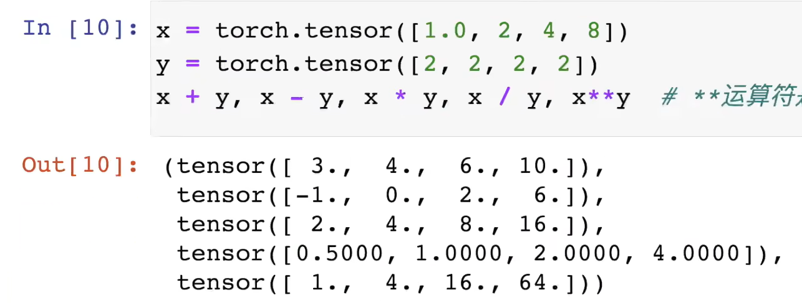


5. 把多个张量连接在一起

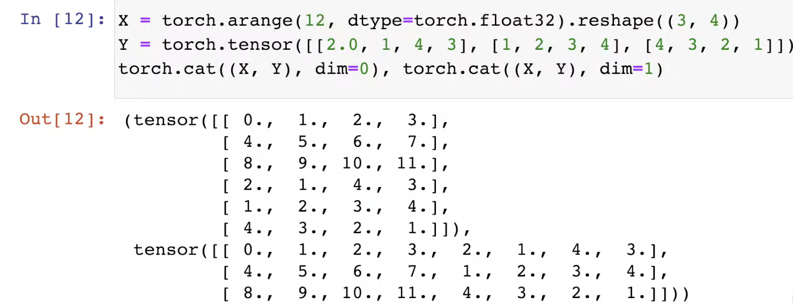


6. 通过逻辑运算符来构建二元张量

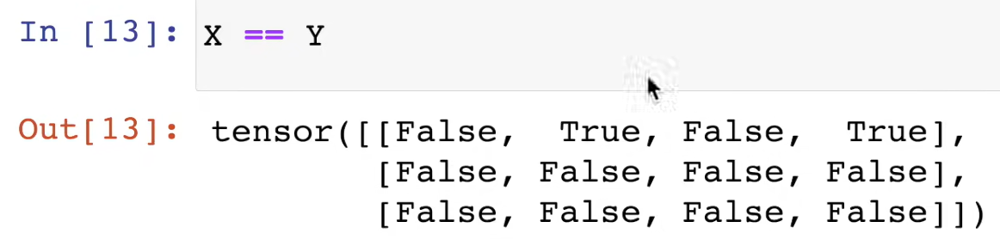


7. 对张量中的所有元素进行求和会产生一个只有一个元素的张量

```python
X.sum()
```

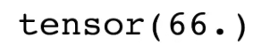


8. 即使形状不同，我们仍然可以通过调用广播机制(broadcasting mechanism)来执行按元素操作

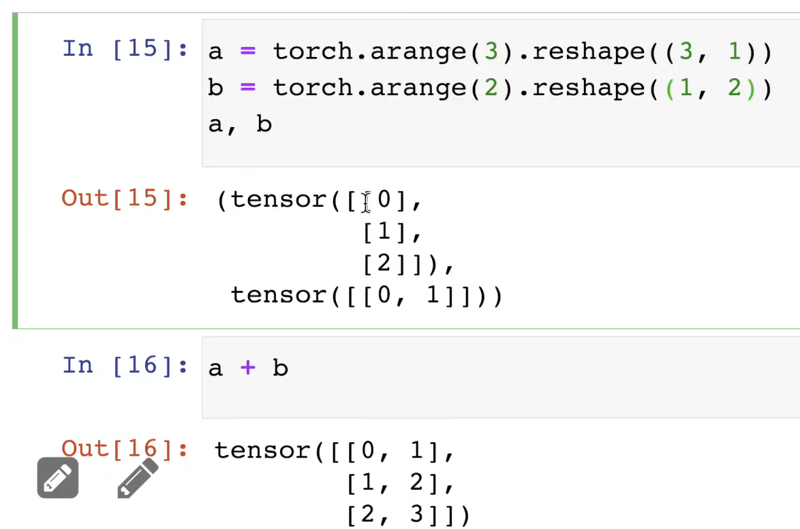


9. 可以用[-1]选择最后一个元素，可以用[1:3]选择第二个和第三个元素

   

10. 除读取外，我们还可以通过指定索引来将元素写入矩阵


11. 为多个元素赋相同的值，我们只需要索引所有元素，然后为它们赋值

    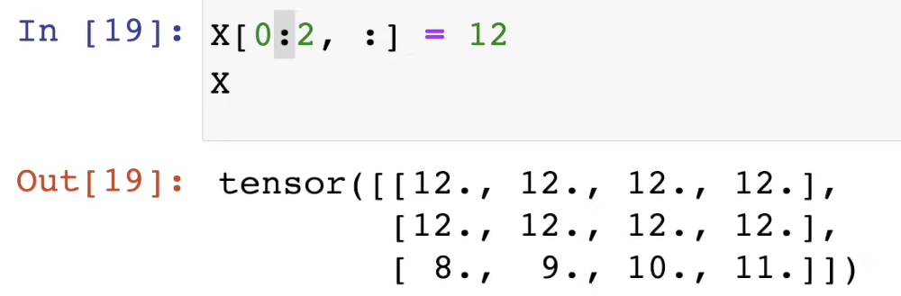

12. 运行一些操作可能会导致为新结果分配内存

    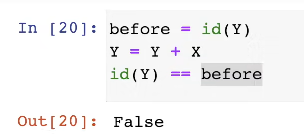

    执行原地操作

    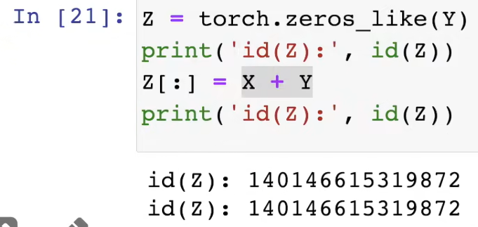

    如果在后续的计算中没有重估使用X，我们也可以使用X[:] = X + Y或X += Y来减少操作的内存开销

    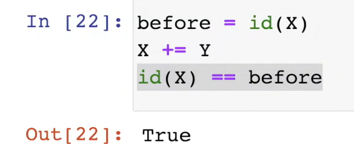

13. 与numpy和python的转换

    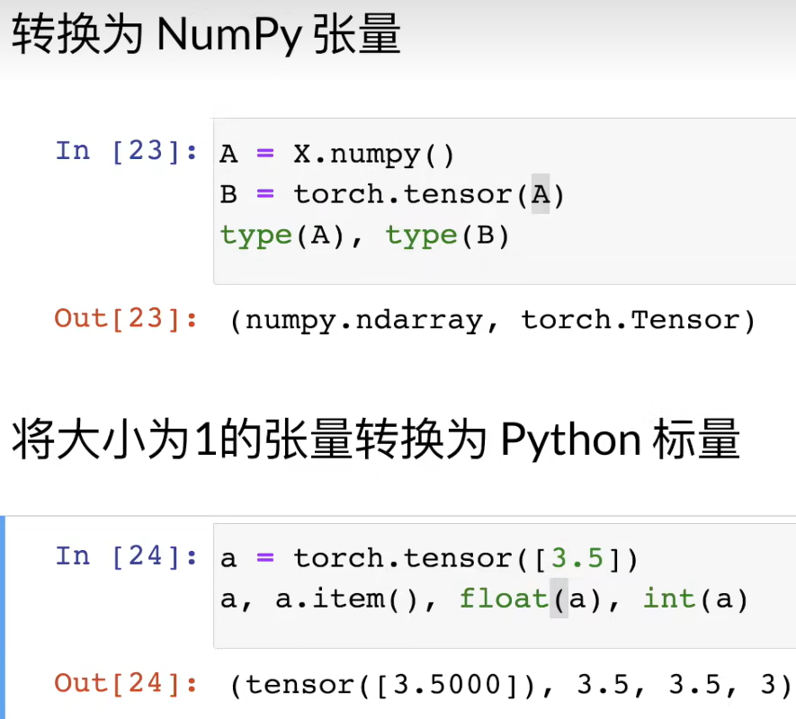

# 数据预处理

1. 创建一个人工数据集，并存储在csv（逗号分隔）文件

```python
import os

os.makedirs(os.path.join('..', 'data'), exist_ok=True)
data_file = os.path.join('..', 'data', "house_tiny.csv")
with open(data_file, 'w') as f:
    f.write("NumRooms, Ally, Price\n")
    f.write("NA, Pave, 127500\n")
    f.write("2, NA, 106000\n")
    f.write("4, NA, 178100\n")
    f.write("NA, NA, 140000\n")
```


2. 从创建的csv文件中加载原始数据集

```python
import pandas as pd
data = pd.read_csv(data_file)
```

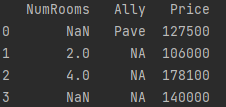


3. 对缺失值进行处理

```python
inputs, outputs = data.iloc[:, 0:2], data.iloc[:, 2]
inputs = inputs.fillna(inputs.mean(numeric_only=True))
```


