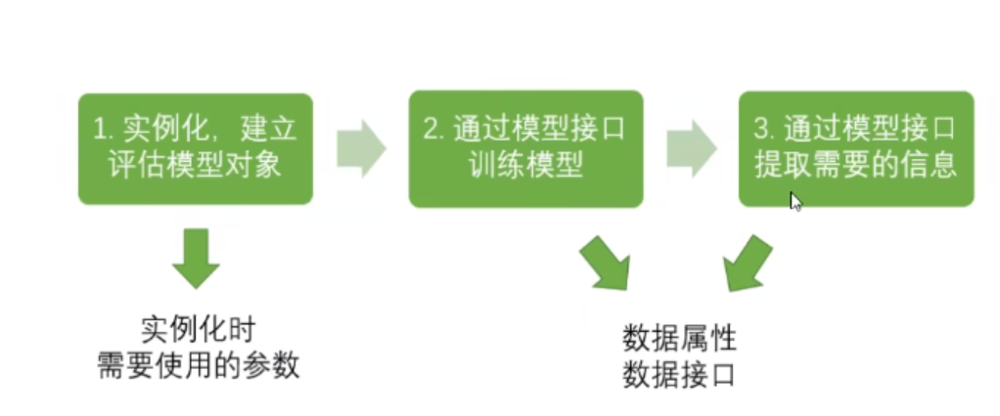

# sklearn中的决策树

## sklearn的建模流程



在这个流程下，分类树对应的代码是：

```python
from sklearn import tree								# 导入需要的模块

clf = tree.DecisionTreeClassifier()						# 实例化
clf = clf.fit(X_train, y_train)							# 用训练集数据训练模型
result = clf.score(X_test, y_test)						# 导入测试集，从接口中调用需要的信息
```

