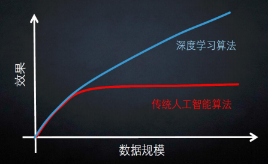
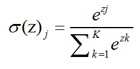
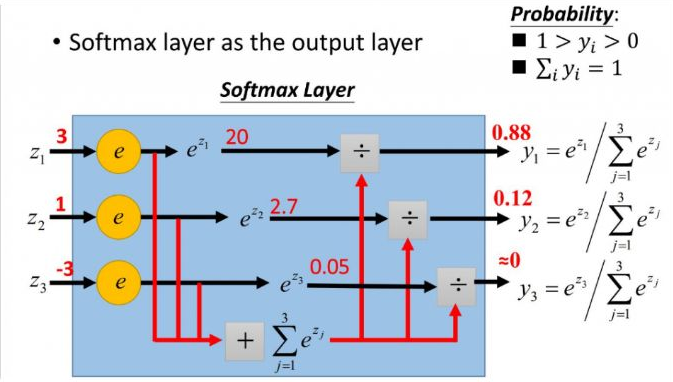
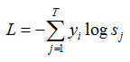
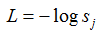

# 1，什么样的资料集不适合用深度学习？

- **数据集太小**，数据样本不足时，深度学习相对其它机器学习算法，没有明显优势。
- **数据集没有局部相关特性，**目前深度学习表现比较好的领域主要是图像／语音／自然语言处理等领域，这些领域的一个共性是局部相关性。图像中像素组成物体，语音信号中音位组合成单词，文本数据中单词组合成句子，这些特征元素的组合一旦被打乱，表示的含义同时也被改变。对于没有这样的局部相关性的数据集，不适于使用深度学习算法进行处理。举个例子：预测一个人的健康状况，相关的参数会有年龄、职业、收入、家庭状况等各种元素，将这些元素打乱，并不会影响相关的结果。

　　其实这里我感觉用下面这张图表示最合适不过了：

# 2，softmax函数的数学推导及Python实现

## 2.1 Softmax函数的原理及其数学推导

　　softmax用于多分类过程中最后一层，它将多个神经元的输出，映射到（0, 1）区间内，可以看成概率来理解，从而来进行多分类！

　　假设我们有一个数组V，Vi 表示 V 中第 i 个元素，那么这个元素的 Softmax值就是：

　更形象的如下图表示：

softmax 直白来说就是讲原来输出是 3, 1, -3 通过 softmax 函数一作用，就映射成为（0， 1）的值，而这些值的累和为1，那么我们就可以将其理解成概率，在最后选取输出节点的时候，我们可以选取概率最大的节点，作为我们的预测目标！

## 2.2 Softmax函数中的损失函数（cross entropy loss）

说完了Softmax，下面来学习一下 softmax loss。softmax loss如下：

首先 L 是损失，Sj是Softmax的输出向量S的第 j 个值，表示这个样本属于第 i 个类别的概率。yi前面有个求和符号，j的范围是也是1到类别数T，因此 y 是一个 1*T 的向量，里面的 T个值，而且只有 1个值是1，其他 T-1个值都是0。那么哪个位置的值是1呢？答案是真实标签对应的位置的那个值是1，其他都是0。所以这个公式其实有一个更简单的形式：

当然此时要限制 j 是指向当前样本的真实标签。

　　下面举个例子，假设一个五分类问题，然后一个样本 I 的标签 y = [0, 0, 0, 0, 1, 0]，也就是说样本 I 的真实标签是 4，假设模型预测的结果概率（softmax的输出 ） p = [0.1, 0.15, 0.05, **0.6**, 0.1]，可以看出这个预测是对的，那么对应的损失 L= - log(0.6)，也就是说当这个样本经过这样的网络参数产生这样的预测 p 时，它的损失是 -log(0.6)。那么假设 p = [0.15, 0.2, 0.4, **0.1**, 0.15]，这个预测结果就很离谱了，因为真实标签是 4，而你觉得这个样本是 4的概率只有 0.1 （远不如其他概率高，如果是在测试阶段，那么模型就会预测该样本属于类别3），对应损失 L = - log(0.1)。那么假设 p = [0.05, 0.15, 0.4, **0.3**, 0.1]，这个预测结果虽然也错了，但是没有前面那么离谱，对应的额损失 L = -log(0.3)。我们知道 log函数在输入小于1的时候是个负数，而 **log函数是递增函数**， **所以-log(0.6) < -log(0.3) < -log(0.1)。简单讲就是你预测错比预测对的损失要大，预测错得离谱比预测错得轻微的损失要大**

#### 2.3 Softmax的Python实现