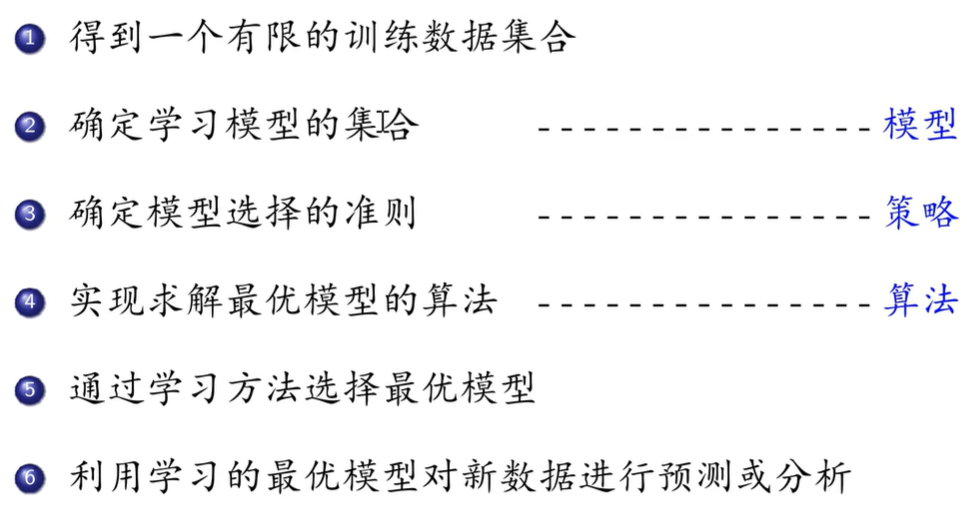
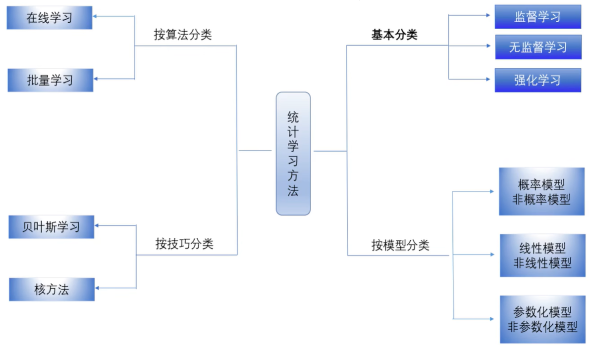
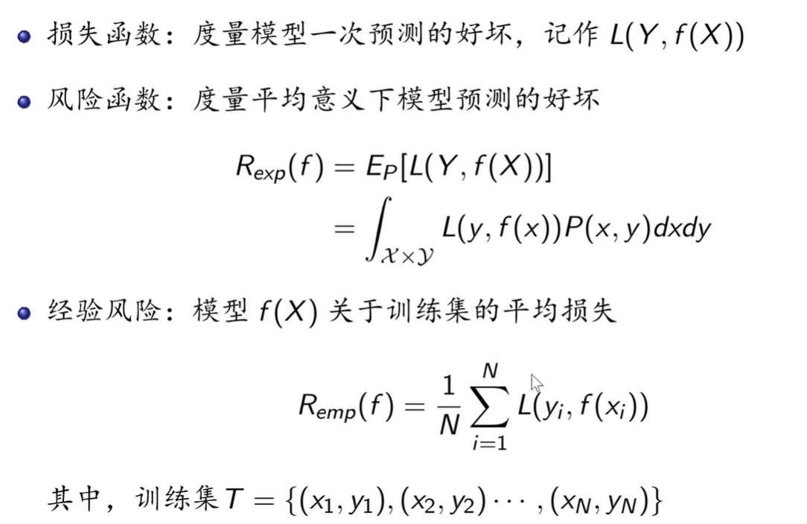
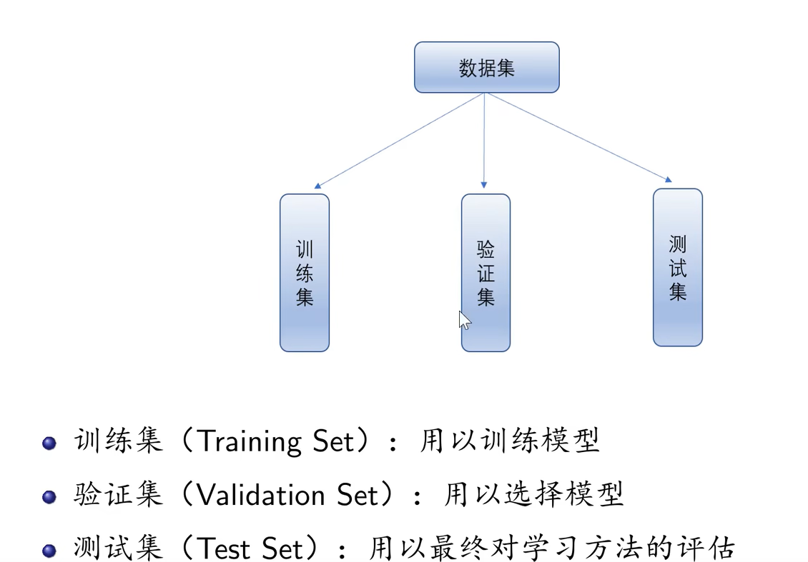
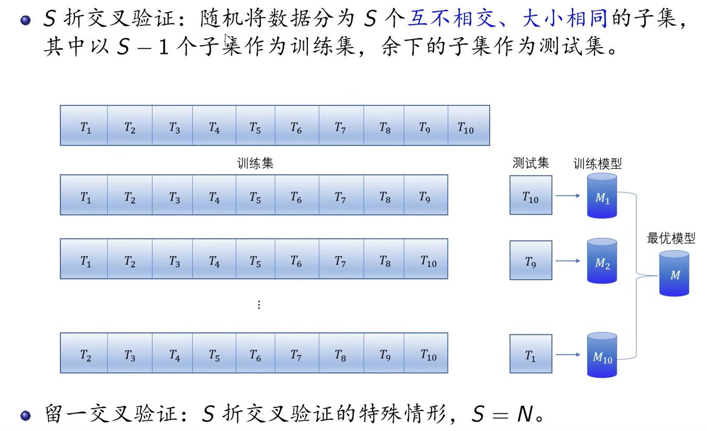
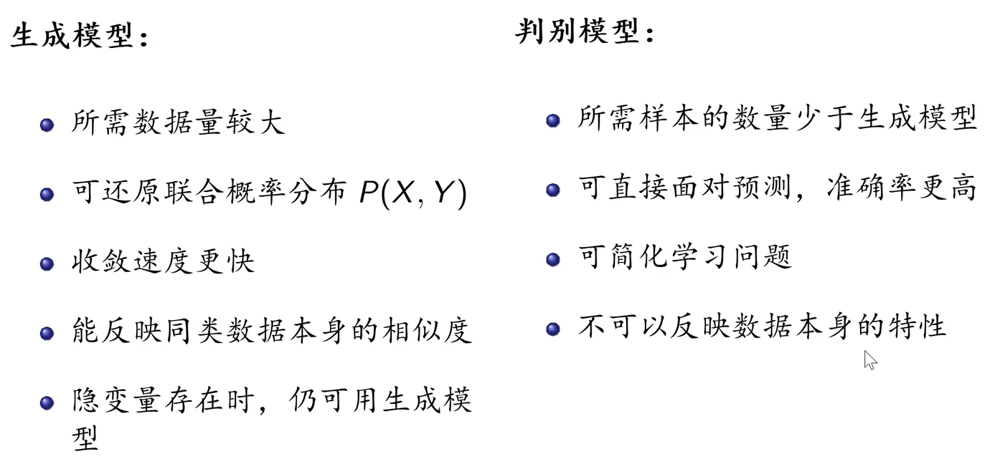

# 统计学习的概念

统计学习(Statistical Machine Learning)是关于计算机基于数据构建概率统计模型并运用模型对数据进行预测与分析的一门学科。

# 统计学习方法的步骤

# 统计学习的分类

# 监督学习

监督学习(Supervised Learning)是指从标注数据中学习预测模型的机器学习问题，其本质是学习输入到输出的映射规律

# 无监督学习

无监督学习(Unsupervised Learning)是指从无标注数据中学习预测模型的机器学习问题，其本质是学习数据中的统计规律或潜在结构

# 强化学习

# 统计学习方法的三要素

**机器学习方法**

从给定的、有限的、用于学习的训练数据(training data)出发，假设数据是独立同分布产生的；并且假设要学习的模型属于某个函数集合，称为假设空间(hypothesis space)；应用于某个评价准则(evaluation criterion)，从假设空间中选取一个最优模型，使它对已知的训练数据及未知的测试数据(test data)在给定评价准则下有最优的预测；最优模型的选取由算法实现。

这样，机器学习方法包括：模型的假设空间，模型的选择准则以及模型的学习算法。称其为机器学习方法的三要素，简称为**模型**(model)、**策略**(stratery)、和**算法**(algorithm)(如：梯度下降算法)。

**假设空间**（Hypothesis Space）:所有可能的条件概率分布或决策函数

**策略**

# 正则化

在模型选择时，选择所有可能模型中，能很好解释已知数据并且十分简单的模型。

# 数据集

# 交叉验证

数据不足的情况下

1. 简单交叉验证：随机将数据分为两部分，即训练集和测试集

   

# 生成模型和判别模型

