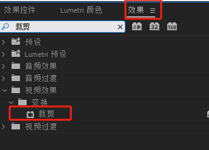
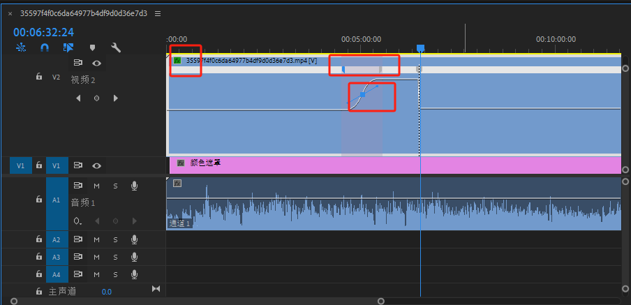

# 基础操作

## 素材播放

空格

## 时间轴

+ 加减
+ Alt+滚轮
+ 反斜杠

## 裁剪视频

+ c  减   v  选择   delete  删除

  

+ q 删除剪切线前面的部分， w删除剪切线后面的部分

+ 上下移动蓝线到下一个剪切线

+ 锁定之后防止被减

  

## 缩放视频画面

+ 双击监控器

+ 有多个素材时，在时间轴选中要调节的素材，然后再效果控件处选择运动

  

+ 想要对其素材可以再效果控件处复制源素材的参数，粘贴到目标素材（ctrl + c, ctrl + shift +v）

## 裁剪视频画面

选择要裁剪的素材，再效果处找的裁剪，然后再效果控件处裁剪画面

## 调节视频速率

CTRL　＋　ｒ

**变加速视频**

