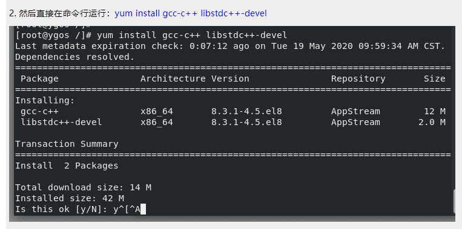
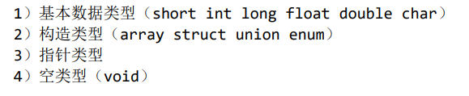
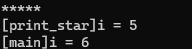
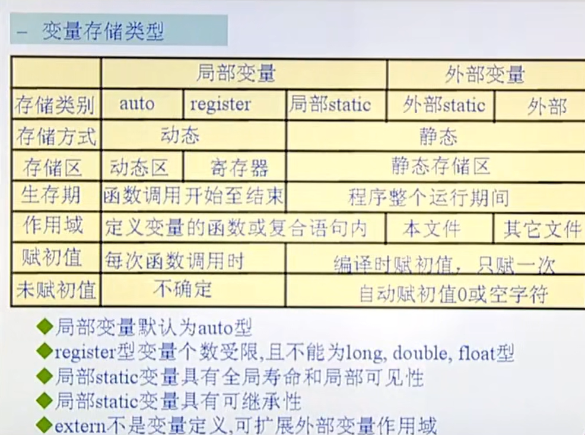
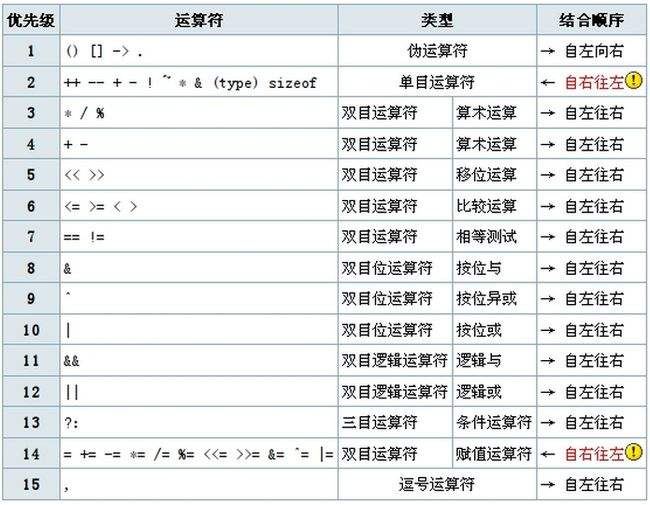
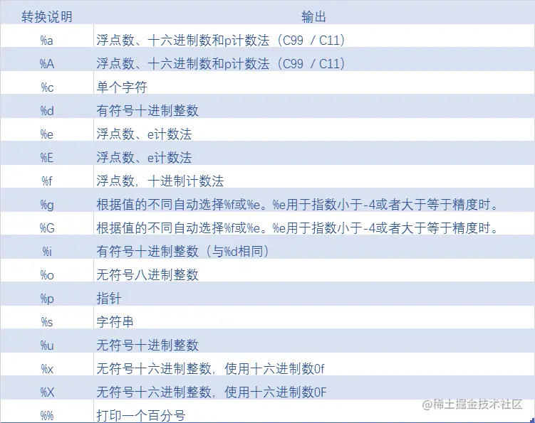
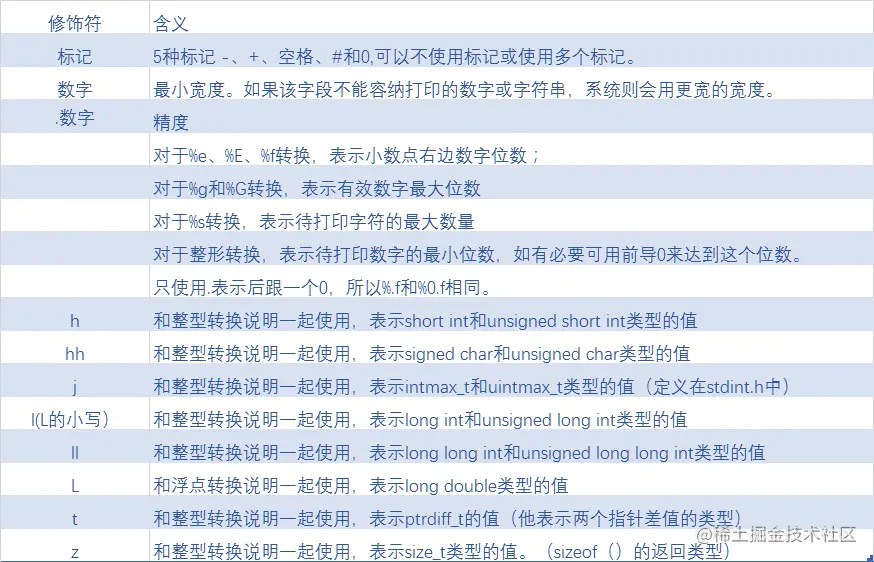
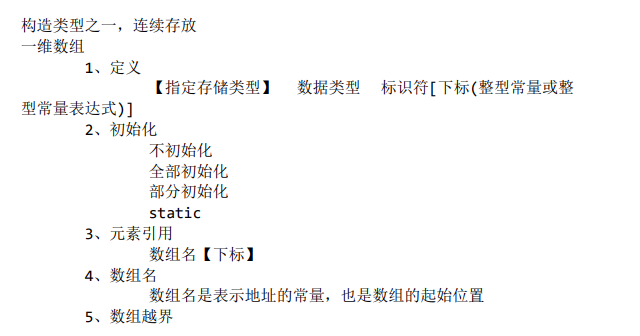

# C语言概述

## C语言发展史

1960	原型A语言	-> ALGOL语言

1963	CPL语言

1967	B语言

1973	C语言

## C语言特点

1. 基础性语言
2. 语法简洁，紧凑，方便，灵活（指针的使用）
3. 运算符丰富，数据结构丰富
4. 结构化，模块化编程思想
5. 移植性好，执行效率高
6. 允许直接对硬件操作

## C语言学习建议

1. 概念的正确性
2. 动手能力
3. 阅读优秀的程序段
4. 大量练习，面试题


# .c程序到可执行文件

C源文件 - 预处理 - 编译 - 汇编 - 链接 - 可执行文件

```c
#include <stdio.h>
#include <stdlib.h>

int main(void) {

    printf("Hello world!\n");
    
    exit(0);
}
```

## gcc

```linux
gcc -E hello.c > hello.i   // 预处理 以#开头的都是在预处理阶段完成的 （重定向保存，预处理文件后缀为.i）
gcc -S hello.i   // 编译   (默认产生后缀为.s的目标文件)
gcc -c hello.s   // 汇编	 （默认产生后缀为.o的目标文件）
gcc hello.o -o hello  // 链接 (指定生成可执行文件的名字)
./hello         // 运行  （执行当前目录下的可执行文件）

// 一行编译生成可执行文件
gcc hello.c
gcc -o hello hello.c
gcc hello.c -o hello

//打印出所有的警告
gcc hello.c -Wall

// sqrt 在链接的时候应该加上-lm
gcc -o test test.c -lm
//或者用makefile
vim makefile
CFLAGS+=-lm
```

### gcc提供的函数

`__FUNCTION__`    当前执行的函数

`__LINE__`  当前函数的第几行

```c
int main()
{
    char ch = 65;

    printf("%c\n", ch);


    printf("[%s:%d] before while()\n", __FUNCTION__, __LINE__);
    while(1);
    printf("[%s:%d] after while()\n", __FUNCTION__, __LINE__);

    exit(0);
}
```


## make

```linux
// 用make编译
make hello
```

## linux安装g++




## 修改.vimrc

```c
cp /etc/vim/vimrc ~/.vimrc
    
cd ~/.vimrc
```

## vim操作

```c
v 进入可视化模式，按方向键选择代码，按=格式化代码
    
// 跳转至行首
0

// 跳转至行尾
A    

// 跳转到20行
20gg

    
// 转至下一行
o
    
// 取消高亮
:set noh
    
// 继续打开文件
:tabnew 新文件名
    
// 查看函数原型   返回按 qq
shift + k  
```

## linux 命令

### 打开多个终端并切换

`ctrl shift t`    打卡新的选项卡

`ctrl +alt 数字`  切换选项卡


### 打开多个文件，并切换

```shell
touch main.c tool.c tool.h
vim * -p  // 打开全部文件
gt // 切换到下一个文件
gT // 切换至上一个文件
```

### 基本命令

```shell
// print work directory
pwd 

// 拷贝文件
cp file1.c to file2.c

// 递归创建文件夹
mkdir -p line/list/arr

// 递归的删除文件夹，r表示目录下所有文件全部删除，f表示强制删除
rm -rf 文件夹
```


## shell命令

```shell
// 打印上一条语句的执行状态
echo $?   
```


# 基本概念

1. 以`helloworld`为例对写程序的思路提出如下要求

   ```C
   #include <stdio.h>
   #include <stdlib.h>
   
   int main(){
   
       printf("Hello world!\n");
   
       exit(0);
   }
   ```

+ 头文件正确包含的重要性

+ 以函数为单位进行程序编写

+ 声明部分+实现部分

+ `return 0;`  结束当前函数

+ 多用空行和空格

+ 添加注释

  ```c
  #if 0
  
  #endif
  ```

2. 算法：解决问题的方法（流程图、NS图、有限状态机FSM）
3. 程序：用某种语言实现算法
4. 进程：32位环境下，一个进程最多占用4G空间
5. 防止写越界，防止内存泄漏:  谁打开谁关闭，谁申请谁释放。

# 数据类型



作以下思考：

1. 不同数据类型所占字节数（标准C并未严格规定各类型所占字节数）
2. 存储区别（signed unsigned）
3. 不同类型的数据间进行转换（隐式，显示转换）
4. 特殊性: 
   1. 布尔型bool
   2. float类型数无法和一确切的数比较是否相等（float类型本身并不精确）
   3. char型是否有符号并未定义
   4. 数据类型与后续代码中所使用的输入输出要相匹配

**`bool`值可以使用`int`值代替**

```c
#include <stdio.h>
#include <stdlib.h>
#include <stdbool.h>

int main() {
    bool a = false;

    printf("a = %d\n", a);

    exit(0);
}
```

# 变量与常量

## 常量

**定义**：在程序执行过程中值不会发生变化的量

**分类**：整型常量，实型常量，字符常量，字符串常量，标识符常量

+ 整形常量：1790，34，56
+ 实型常量：3.14，2.56，0.67
+ 字符常量：单引号引起来的单个字符或转义字符，如'a', 'D', '\n', '\0', '\ddd' (三位八进制数)，'\xhh'(两位16进制数)

+ 字符串常量：由双引号引起来的一个或多个字符组成的序列，例：""表示一个空串，只包含一个'\0'占用一个字节

+ 标识符常量：处理在程序的预处理阶段，占编译时间，好处：一改全改

  缺点：不检查语法，只是单纯的宏体与宏名之间的替换

数组名是一个典型的常量


### define

```c
#include <stdio.h>
#include <stdlib.h>

#define PI          3.14
#define ADD         (2 + 3)
#define MAX(a, b)   ((a) > (b) ? (a) : (b))
#define MAXT(a, b)  ({typeof(a) A = a, B = b;((A) > (B) ? (A) : (B));})

#if 0
int max(int a, int b)
{
    return a > b ? a : b;
}
#endif

int main()
{

    int i = 5, j = 3;

    printf("i = %d\tj = %d\t", i , j);
    printf("%d\n", MAXT(i++, j++));
    printf("i = %d\tj = %d\t", i , j);


    exit(0);
}
```


## 变量

**定义**：用来存储一些特定内容，在程序执行过程中值随时会变化的量

[存储类型]	数据类型	标识符	= 	值

**标识符**：由字母，数字，下划线组成且不能以数字开头的一个标识序列

**数据类型**：基本数据类型+构造类型

**存储类型**：auto	static	register	extern

+ auto: 默认，自动分配空间，自动回收空间	

+ register: （建议型）寄存器类型，只能定义局部变量，不能定义全局变量，大小有限制（32位机器只能定义32位大小的数据类型），寄存器没有地址，所以一个寄存器类型的变量无法打印出地址查看或使用

+ static: 静态型，自动初始化为0值或空值，并使其变量的值有继承性，另外常用于修饰变量或函数（防止当前函数对外扩展）

  > `main.c`

  ```c
  #include <stdio.h>
  #include <stdlib.h>
  
  #include "proj.h"
  
  static int i = 10;
  
  int main()
  {
      printf("[%s]:i = %d\n", __FUNCTION__, i);
      call_func();
      exit(0);
  }
  ```
  
  
  
> `proj.c`

```c
  #include <stdio.h>
#include <stdlib.h>
  
  static int i = 100;
  
  static void func(void)
  {
      printf("[%s]:i = %d\n", __FUNCTION__, i);
      exit(0);
  
  }
  
  void call_func(void)
  {
      func();
  }
```

  

  > `proj.h`

```c
  #ifndef PROJ_H___
#define PROJ_H___
  
void call_func(void);
  
  #endif
```

  

+ extern: 说明型，意味着不能改变被说明的变量的值或类型

  > main.c

  ```c
  #include <stdio.h>
  #include <stdlib.h>
  
  
  #include "proj.h"
  
  
  int i = 10;
  
  int main()
  {
      printf("[%s]:i = %d\n", __FUNCTION__, i);
      func();
      exit(0);
  }
  ```

  

  > proj.c

  ```c
  #include <stdio.h>
  #include <stdlib.h>
  
  
  extern int i;
  
  void func(void)
  {
      printf("[%s]:i = %d\n", __FUNCTION__, i);
      exit(0);
  }
  ```

  

  > proj.h

  ```c
  #ifndef PROJ_H___
  #define PROJ_H___
  
  void func(void);
  
  #endif
  ```

  

**变量的声明周期和作用范围**

+ 全局变量和局部变量  内部变量屏蔽外部变量

```c
int i = 0;

void print_star(void)
{
    for (i = 0; i < 5; i++)
        printf("*");
    printf("\n");
    // gcc提供的函数可以显示当前函数的名称
    printf("[%s]i = %d\n", __FUNCTION__, i);
}

int main()
{

    for(i = 0; i < 5; i++)
        print_star();
    printf("[%s]i = %d\n", __FUNCTION__, i);


    exit(0);
}
```



+ 局部变量和局部变量

+ 参考图片

  


# 运算符

## 优先级



## 短路原则

逻辑与左边为假时，右边不进行计算

### sizeof

```c
#include <stdio.h>
#include <stdlib.h>

int main()
{
    printf("%d\n", sizeof(int));

    printf("%d\n", sizeof(double));
}
```

### 位运算的重要意义

1. 将操作数中第n位置1，其他位置不变：`num | 1 << n`
2. 将操作数中第n位置0，其他位置不变：`num & ~(1 << n)`
3. 测试第n位：`if(num & 1 << n)`

# I/O操作

## 格式化输入输出函数：scanf, printf



### 修饰符



**define宏计算一年有多少秒**

```c
#define (60LL * 60LL * 24LL * 365LL)
```

### 缓冲区

原本应该是全缓冲模式，现在用到了终端设备，所以编程了行缓冲模式，所以`printf`是在遇到`\n`才刷新的，所以`before while()`打印不出来 	

或者等缓冲区满了之后，自动刷新

```c
#include <stdio.h>
#include <stdlib.h>
/*
 *printf("%[修饰符]格式字符", 输出表项)
 *
 * */

int main()
{
    char ch = 65;

    printf("%c\n", ch);


    printf("[%s:%d] before while()", __FUNCTION__, __LINE__);
    while(1);
    printf("[%s:%d] after while()", __FUNCTION__, __LINE__);

    exit(0);
}
```

### scanf

1. `scanf`用%s是一种危险的行为，如果数组越界的话不会报错；且如果输入中含有分隔符`\n tab 空格`都会终止输入
2. `scanf`放在循环里面一定要加校验

```c
#include <stdio.h>
#include <stdlib.h>


/*
 *int scanf(const char *format, 地址表)
 *
 * */

int main()
{
    int i;
    float j;
    int ret;
    while(1)
    {
        ret = scanf("%d", &i);
        if(!ret)
        {
            printf("Enter errot!\n");
            break;
        }
        printf("i = %d\n", i);
    }


    scanf("%d%f", &i, &j);
    printf("i=%d", i);
    printf("j=%f", j);


    exit(0);
}
```

2. 将中间的分隔符吃掉

```c
int i;
char ch;

// 用抑制符吃
scanf("%d", &i);
scanf("%*c%c", &ch);
printf("%d, %d", i, ch);

// 用getchar吃
scanf("%d", &i);
getchar();
scanf("%c", &ch);
printf("%d, %d", i, ch);
```


## 字符输入输出函数：getchar, putchar

```c
// 为了在输入错误时返回EOF，所以用int作为返回值
int char;
char = getchar();
putchar(char);
```

## 字符串输入输出函数：gets(!), puts

gets()对缓冲区不进行检查，可以用以下函数代替

```c
fgets();
// gnu c 库中的函数
getline();
```

**案例**

```c
#include <stdio.h>
#include <stdlib.h>
#include <math.h>


static void area(void)
{
    float a, b, c;
    float s, area;

    printf("Please input:");
    scanf("%f%f%f", &a, &b, &c);

    s = 1.0 / 2 * (a + b +c);

    if(a + b <= c || a + c <= b || b + c <= a)
    {
        fprintf(stderr, "ENIVAL\n");
        exit(1);
    }

    area = sqrt(s* (s - a) * (s - b) * (s -c));
    printf("area is %f", area);

}


int main()
{

    area();
    exit(0);
}
```

# 流程控制

## if-else

```C
#include <stdio.h>
#include <stdlib.h>


int main()
{
    int score;

    printf("Please enter the score:\n");
    scanf("%d", &score);

    if (score > 100 || score < 0)
    {
        fprintf(stderr, "Input errot!\n");
        exit(1);
    }
    if(score <= 100 && score >= 90)
    {
        puts("A");
    }
    else if(score < 90 && score >= 80)
    {
        puts("B");
    }
    else if(score < 80 && score >= 70)
    {
        puts("C");
    }
     else if(score < 70 && score >= 60)
    {
        puts("D");
    }
     else
    {
        puts("E");
    }

    exit(0);
}
```

## switch

```c
switch(表达式)
{
	case 常量表达式:
        statement；
        break;
    case 常量表达式:
        statement；
        break;
    defatult:
        statement;
        break;    
}
```

# 数组

## 一维数组



```c
#define M   3

int main()
{
	int arr[M] = {1, 2, 3};
	for(i = 0; i < M; i++)
    	printf("%p --> %d", &arr[i], arr[i])；  
    
    exit(0);
}
```

**fibonacci逆序存放**

```c
#include <stdio.h>
#include <stdlib.h>

#define MAXSIZE     10
static void fibonacci()
{
    int i, j, temp;

    int fib[MAXSIZE] = {1, 1};
    for(i = 2; i < MAXSIZE; i++)
    {
        fib[i] = fib[i - 1] + fib[i - 2];
    }
    for(i = 0, j = sizeof(fib)/sizeof(fib[0]) - 1; i < j; i++, j--)
    {
        temp = fib[i];
        fib[i] = fib[j];
        fib[j] = temp;
    }
    for(i = 0; i < sizeof(fib)/sizeof(fib[0]); i++)
    {
        printf("%d ", fib[i]);
    }
    printf("\n");

    return ;
}

int main()
{
    fibonacci(10);


    exit(0);
}
```

**选择排序**

```c
int main()
{
    int a[MAXSIZE] = {23, 45, 90, 76, 13, 55, 76, 45, 3, 8};
    int i, j, k, temp;

    for(i = 0; i < MAXSIZE; i++)
    {
        printf("%d ", a[i]);
    }
    printf("\n");

    for(i = 0; i < MAXSIZE - 1; i++)
    {
        k = i + 1;
        for(j = i; j < MAXSIZE; j++)
        {
            if(a[j] < a[k])
            {
                k = j;
            }
        }
        temp = a[i];
        a[i] = a[k];
        a[k] = temp;
    }

    for(i = 0; i < MAXSIZE; i++)
    {
        printf("%d ", a[i]);
    }
    printf("\n");

    exit(0);
}
```

**删除法求质数**

```c
static void primer(void)
{
    int i, j;
    char primer[1001] = {0};
    for(i = 2; i < 1001; i++)
    {
        if(primer[i] == 0)
        {
            for(j = i * 2; j < 1001; j+=i)
            {
                primer[j] = -1;
            }
        }
    }

    for(i = 2; i < 1001; i++)
    {
        if(primer[i] == 0)
        {
            printf("%d ", i);
        }
    }
    printf("\n");
}
```

## 二维数组

```c
void print_arr(int (*p)[N], int m, int n)
{
    int i, j;

    for(i = 0; i < m; i++)
    {
        for(j = 0; j < n; j++)
        {
            printf("%4d", *(*(p+i)+ j));
        }
        printf("\n");
    }
}


int main()
{
    int a[M][N] = {1, 2, 3, 4, 5, 6, 7, 8, 9, 10, 11, 12};

    print_arr(a, M, N);
	
    // sizeof(a): 48,  sizeof(*a):16
    printf("size of a:%d\n size of *a%d\n", sizeof(a), sizeof(*a));
    // a 和 *a地址相同
    printf("place of a:%p\n place of *a%p\n", a, *a);
    exit(0);
}
```


## 字符数组

```c
#include <stdio.h>
#include <stdlib.h>
#include <string.h>


/*
 * strlen & sizeof
 *strcpy & strncpy
 *strcat & strncat
 *strcmp & strncmp
 * */


#define STRSIZE     12

int main()
{

    char str[12] = "hello\0world";
    puts(str);
    // strlen以\0为结束标志
    printf("%d\n", strlen(str));
    printf("%d\n", sizeof(str));

    strcpy(str, "abcdefg");
    puts(str);

    strncpy(str, "abcdefghjklm", STRSIZE -1);
    puts(str);

    exit(0);
}
```

# 指针

## 空指针

**定义**：指针变量指向内存中编号为0的空间

**用途**：初始化指针变量

**注意**：空指针指向的内存是不可以访问的，一旦访问汇报段错误

## 野指针

**定义**：指针变量指向非法的内存空间，定义指针时，如果没有将其指向一块确定的空间将称为野指针

指针一旦被定义出来就应该指向一块确定的空间；如果没有，应该将指针置为空，否则可能成为野指针，报段错误。

## 空类型

任何类型的指针都可以赋给`void *`，`void *`也可以赋给任何类型的指针

```c
void *q = NULL;
```

## 定义与初始化规则

 ```c
int *p = NULL;
 ```


## 指针运算

`*`   `&  `   关系运算  `++`    `--`

## 指针与数组

### 指针与二维数组

```c
int a[2][3] = {1, 2, 3, 4, 5, 6};
int *p;
// p = a;   (warning)
// a 是一个行指针，p只能表示列指针

// 方式一
p = *a;  // 相当于*(a+0)
// 方式二
p = &a[0][0];
```


### 指针与字符数组

```c
#include <stdio.h>
#include <stdlib.h>
#include <string.h>


int main()
{

    char *str = "world";
    printf("strlen(str) = %d, sizeof(str) = %d\n", strlen(str), sizeof(str));

    str = "hello";
    // strcpy(str, "world");   段错误，将str指向的是一个字符串常量，字符串常量不能变
    puts(str);


    char str1 [] = "hello";
    printf("strlen(str1) = %d, sizeof(str1) = %d\n", strlen(str1), sizeof(str1));

    // str1 = "world";  // 段错误，str1 是一个地址常量，地址常量不能改变指向
    strcpy(str1, "world");
    puts(str1);

    exit(0);
}
```


### 数组指针

【存储类型】数据类型  （*指针名）[长度]  = 值

``` c
int a[i][j] = {1, 2, 3, 4, 5, 6}
a[i][j] // 等价于 *(*(a+i)+j)
    
int *p = *a;
int (*q)[3] = a;
```

### 指针数组

【存储类型】数据类型  *数组名  [长度]  = 值

```c
#include <stdio.h>
#include <stdlib.h>
#include <string.h>

#define MAXSIZE     5


int main()
{
    char *arr[5] = {"Follow me", "Basic", "Great", "Fortran", "Computer"};
    int i, j, k;
    char *temp = NULL;

    for(i = 0; i < MAXSIZE - 1; i++)
    {
        k = i;
        for(j = i + 1; j < MAXSIZE; j++)
        {
            if(strcmp(arr[j], arr[k]) < 0)
            {
                k = j;
            }
        }
        if(k != i)
        {
            temp = arr[i];
            arr[i] = arr[k];
            arr[k] = temp;
        }
    }
    for(i = 0; i < MAXSIZE; i++)
    {
        printf("%s\n", arr[i]);
    }

    exit(0);
}
```


## const与指针

### const修饰一个常规变量

```c
#include <stdio.h>
#include <stdlib.h>


int main()
{
    const float pi = 3.14;

    float *p = &pi;
   // 程序会报一个warning
    *p = 3.14159;
    printf("%f\n", pi);

    exit(0);
}
```

### 常量指针

指针指向的值不能变

```c
const int *p;
int const *p;


int i = 1;
const int *p = &i;
// *p = 10;   error
i = 10;
printf("%d", i);
```


### 指针常量

指针的指向不能变化

```c
int *const p;
```

### 常量指针常量

```c
const int *const p = &i;
```


# 函数

## main函数

+ argc 表示从命令行接收的参数的个数
+ argv 存储从命令行接收的所有参数

```c
int main(int argc, char *argv[])
{
    for(i = 0; argv[i] != NULL; i++)
    {
        puts(argv[i]);
    }
}
```

## 声明

```c
// 函数声明
void print_hello(void);

// 函数定义
void print_hello(void)
{
    printf("hello!\n")
}
```

## 函数与一维数组

```c
void print_arr(int *p, int n);
void print_arr(int p[], int n);  // 一个*就等于一个[]


int main()
{
    int a[] = {1, 3, 5, 7, 9};
}
```

## 函数与二维数组

<span style="color:red">二维数组参与传参是形参的定义</span>

```c
/*
 * int a[M][N] = {...}
 * int *p = *a
 * int (*q)[N] = a
 *
 * a[i][j]		*(a+i)+j		a[i]+j		p[i]		*p   
 * q[i][j]		*q				q			p+3			q+2
 *
 * int			int *			int *		int    		int 
 * int			int *			int (*)[N]	int *		int (*)[N]	
 *
 * */
```


```c
// 传递数组指针
// void print_arr(int (*p)[N], int m, int n)
void print_arr(int p[][N], int m, int n)      sizeof(p) 是8个字节，即使写成数组的样子，也不是在定义数组 	
{
    int i, j;

    for(i = 0; i < m; i++)
    {
        for(j = 0; j < n; j++)
        {
            printf("%4d", *(*(p+i)+ j));
        }
        printf("\n");
    }
}
// 传递int *
void print_arr1(int *p, int m, int n)
{
    int i, j;

    for(i = 0; i < m; i++)
    {
        for(j = 0; j < n; j++)
        {
            printf("%4d", *(p + i * n + j));
        }
        printf("\n");
    }
}


int main()
{
    int a[M][N] = {1, 2, 3, 4, 5, 6, 7, 8, 9, 10, 11, 12};

    print_arr(a, M, N);
    print_arr1(*a, M, N);
    exit(0);
}
```

## 函数与指针

### 指针函数

返回值为指针的函数

### 函数指针

类型   (*指针名)    (形参)；

```c
#include <stdio.h>
#include <stdlib.h>

int add(int a, int b)
{
    return a + b;
}

int main()
{
    int a, b;
    int res;
    a = 5, b = 6;
    int (*p)(int, int);
    p = add;

    res = p(a, b);
    printf("%d\n", res);
}
```

### 函数指针数组

类型  (*数组名[下标])   (形参);

```c
#include <stdio.h>
#include <stdlib.h>

#define M   2

int add(int a, int b)
{
    return a + b;
}

int sub(int a, int b)
{
    return a - b;
}


int main()
{
    int a, b, i;
    int res;
    a = 5, b = 6;
    int (*arr[M]) (int, int);

    arr[0] = add;
    arr[1] = sub;

    for(i = 0; i < sizeof(arr)/sizeof(arr[0]); i++)
    {
        res = arr[i](a, b);
        printf("res=%d\n", res);
    }
    
    exit(0);
}
```

# 构造类型

## 结构体定义

```c
#define NAMESIZE  16

struct birthday_st
{
    int year;
    int month;
    int day;
};

struct student_st
{
    int id;
    char name[NAMESIZE];
    struct birthday_st birth;
    int math;
    int chinese;

};

int main()
{
    // c语言中创建结构体变量时，struct不可以省略
    struct student_st stu = {
        2201, "Alen", {2011, 11, 11}, 98, 97
    };
    printf("%d %s %d-%d-%d %d %d", stu.id, stu.name, stu.birth.year, stu.birth.month, stu.birth.day, stu.math, stu.chinese);

    exit(0);
}
```

## 成员引用

变量名.成员名

指针 -> 成员名

## 共用体

```c
union test_un
{
    int i;
    float f;
    char ch;
};
```

## 共用体嵌套结构体

```c
#include <stdio.h>
#include <stdlib.h>
#include <stdint.h>

union
{
    struct
    {
        uint16_t i;
        uint16_t j;
    }x;
    uint32_t y;
}a;

int main()
{
    a.y = 0X11223344;
    printf("%X", a.x.i + a.x.j);
    exit(0);
}
```

## 位域

```c
union
{
    struct
    {
        char a:1;
        char b:2;
        char c:1;
    }x;
    char y;
}w;

int main()
{
    w.y = 6;
    printf("%d\n", w.x.b);   // -1
}
```

# 动态内存管理

```c
void *malloc(size_t size);
void free(void *ptr);
void *calloc(size_t nmemb, size_t size);
void *realloc(void *ptr, size_t size);
void *reallocarray(void *ptr, size_t nmemb, size_t size);
```


## **`malloc`**

```c
#include <stdio.h>
#include <stdlib.h>

int main()
{
    int *p = NULL;
    p = malloc(sizeof(int));
    if(p == NULL)
    {
        printf("malloc() error!\n");
        exit(1);
    }

    *p = 10;
    printf("%d\n", *p);
    free(p);


    exit(0);
}
```

<span style="color:red">**谁申请谁释放**</span>

```c
#include <stdio.h>
#include <stdlib.h>

#if 1
void func(int **p, int n)
{
    *p = malloc(n * sizeof(int));
    if(*p == NULL)
        exit(1);
    return ;
}

#else
void *func(int *p, int n)
{
    p = malloc(n * sizeof(int));
    if(p == NULL)
        exit(1);
    return p;
}

#endif

int main()
{
    int num = 100;
    int *p = NULL;

    func(&p, num);
    //p = func(p, num);
    free(p);

    exit(0);
}
```

## `free`

free只是解除了p对原空间的引用权限，（改空间的内容还在，空间也在）

```c
free(p);
p = NULL; // free之后可以将指针置为NULL避免野指针
```

# typedef

```c
 /*
 *#define INT int
 * typedef int INT;
 * 
 * INT i;  -->  int i;
 * ------------------
 * #define IP int *
 * typedef int *IP;
 * 
 * IP p, q;  --> int *p, q;
 * IP p, q;  --> int *p, *q;
 * ------------------------
 * typedef int ARR[6]   -->  int[6] -> ARR
 * 
 * ARR a;  -->  int a[6];
 * ----------------------
 * struct node_st
 * {
 *     int i;
 *     float f;
 * };
 * typedef struct node_st NODE;
 * typedef struct node_st *NODEP;
 * 
 * NODE a;  -->  struct node_st a;
 * NODE *p;  -->  struct node_st *p;
 * NODEP p;  -->  struct node_st *p;
 * ---------------------------------
 * typedef struct
 * {
 *     int i;
 *     float f;
 * }NODE, *NODEP;
 * ---------------
 * typedef int FUNC(int);   -->   int (int) -> FUNC
 * 
 * FUNC f;  -->  int f(int);
 * -------------------------
 * typedef int *FUNCP(int);   -->  int *(int) -> FUNCP
 * 
 * FUNCP p;  -->  int *p(int);
 * ---------------------------
 * typedef int (*FUNCP)(int);   -->   int (int) -> (*FUNCP)
 * 
 * FUNCP p;  -->  int (*p)(int);
 * -----------------------------
 * typedef int *(*FUNCP)(int);   -->   int *(int) -> (*FUNCP)
 * 
 * FUNCP p;  -->  int *(*p)(int);
 * ------------------------------
 * /
```

# makefile

```c
mytool:main.o tool1.o tool2.o
    gcc main.o tool1.o tool2.o -o mytool

main.o:main.c
    gcc main.c -c -Wall -g -o main.o
tool1.o:tool1.c
    gcc tool1.c -c -Wall -g -o tool1.o
tool2.o:tool2.c
    gcc tool2.c -c -Wall -g -o tool2.o

clean:
    rm *.o mytool -rf
```

```c
make 
    
make clean
```

==**简写**==	

```makefile
OBJS=main.o tool1.o tool2.o
CC=gcc
CFLAGS+=-c -Wall -g


mytool:$(OBJS)
    $(CC) $^ -o $@

%.o:%.c
    $(CC) $^ $(CFLAGS) -o $@

clean:
    $(RM) *.o mytool -r
```

**-g**:  生成调试信息

**-c**: 预处理-编译-汇编  生成obj文件

**-S**: 预处理-编译 生成汇编文件

**-E**: 预处理，不生成文件 可以重定向

`gcc -E hello.c > hello.txt`