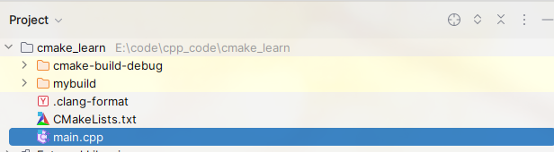
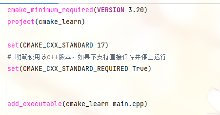
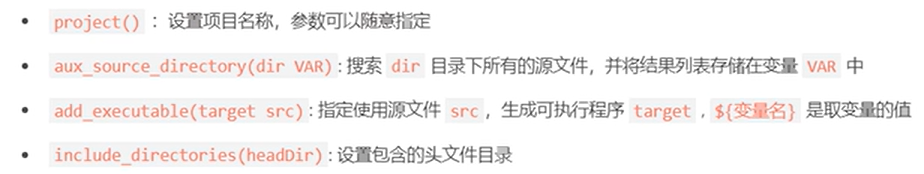

# make基础使用






## 生成项目构建系统

以当前目录 . 作为项目源目录，mybuild作为构建目录

```c++
cmake -S . -B mybuild
```

## 构建项目

```c++
cmake --build mybuild
```

## 运行可执行文件

```c++
mybuild/cmake_learn
```


## cmake基础函数



