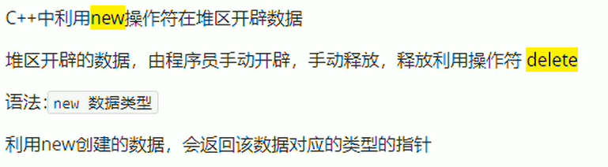

# 	命名空间

```c++
// 定义一个命名空间
namespace spaceA {
    int g_a = 10;
}

// 方式2
using spaceA::g_a;

// 方式3
using namespace spaceA

int main()
{	
    // 方式1
    cout << spaceA::g_a <<endl:
    return 0
}
```


# 变量

+ 未初始化的变量都被分配到bss段，初始化为0；

+ c++语言不允许重定义，而c语言不进行检测
+ c语言创建结构体变量要写struct关键字 ,  c++可以不用加

# 关键字


# 数据类型

## 整型


## bool运算符增强

+ true  1

+ false 0

+ 占用一个字节

## sizeof关键字


# 三目运算符增强

左值：可以放在赋值运算符左边

右值：放在赋值运算符右边

+ 在c语言中三目运算符只能做右值
+ 在c++中三目运算符可以做左值


# `const`增强

+ c语言中`const` 修饰的变量可以通过指针修改

+ <span style="color:red">c++中`const` 修饰的变量没有地址，如果对其取地址会临时开辟一个空，变将指针指向这个临时空间</span>

  c++在常量区开辟一个符号表，在编译阶段将常量a替换为10（编译器处理）

+ 宏定义常量是预处理器处理的


```c++
const int a = 10;
int *p = (int *)&a;
*p = 20;
cout << a << endl;    // c 语言中a 的值被改变了，c++中没有改变
cout << *p << endl;
```

## `const`修饰成员变量

只能通过初始化列表初始化


# 枚举的增强

## c

```c
enum season
{
    SPR = 0;
    SUM,
    AUT,
    WIN,
    WIN1,
    WIN2,
    ...
};
void test()
{
    enum season s = 2;
}
```

## c++

```c++
enum season
{
    SPR = 0;
    SUM,
    AUT,
    WIN
};

void test()
{
    enum season s = 3;  // invalid
    enum season s = WIN;  // valid
}
```


# 循环

## 基于范围的for循环

```cpp
int arr[] = {1, 2, 3};
for (auto &value:arr)
{
    cout << value << endl;
}
```


# 内存分区

+ 代码区：存放函数体的二进制代码，有操作系统进行管理
+ 全局区：存放全局变量和静态变量以及常量
+ 栈区：由编译器自动分配释放，存放函数的参数值，局部变量等
+ 堆区：由程序员分配和释放，若程序员不释放，程序结束时由操作系统回收

## 程序运行前

**代码区**

+ 存放CPU执行的机器指令
+ 代码区是共享的，共享的目的是对于频繁被执行的程序，只需要在内存中有一份代码即可
+ 代码区是只读的，使其只读的原因是防止程序意外地修改了它的指令

**全局区**

+ 全局变量和静态变量存放在此
+ 全局区还包含了常量区，字符常量和其他常量也存放在此
+ 该区域的数据在程序结束后由操作系统释放

## 程序运行后

**栈区**

+ 由编译器自动分配释放，存放函数的参数值，局部变量等
+ 注意事项：不要返回局部变量的地址，栈区开辟的数据由编译器自动释放

```cpp
int *func()
{
    int a = 10;
    return &a;
}

int main()
{
    int *p = func();
    cout << *p << endl; // 第一次可以打印正确的数字，是因为编译器做了保留
    cout << *p << endl; // 第二次这个数据就不再保留了
    
    system("pause");
}
```

**堆区**

+ 由程序员分配释放，若程序员不释放，程序结束时由操作系统回收
+ 在c++中主要利用new在堆区开辟内存

```cpp
int *func()
{
    int *p = new int(10);
    return p;
}

int main()
{
    int *p = func();
    cout << *p << endl; 
    cout << *p << endl;
     
    system("pause");
}
```


## new操作符



**基本语法**

```cpp
int *func()
{
    int *p = new int(10);
    return p;
}

int main()
{
    int *p = func();
    cout << *p << endl; 
    delete p;
    
    cout << *p << endl;  // 读取访问冲突(非法操作)
     
    system("pause");
}
```

**在堆区开辟数组**

```cpp
void test01()
{
    int *arr = new int[10];
    for(int i = 0; i < 10; i++)
    {
        arr[i] = i;
    }
    for(int i = 0; i < 10; i++)
    {
        cout << arr[i] <<endl;
    }
    
    
    // 释放内存
    delete[] arr;
}
```

# 引用

1. 引用没有定义，是一种关系型声明，声明它和原有某一变量的关系。故而类型与原类型保持一致，且不分配内存，与被引用的变量有相同的地址

2. <span style="color:red">声明的时候必须初始化，一经声明，不可变更</span>

   `int &b;`  错误

3. 可对引用再次引用。多次引用的结果，是某一变量具有多个别名

4. &符号前有数据类型时，是引用。其它皆为取地址

```c++
int a = 10;
int &re = a;
re = 50; // re是a的引用，可以对a进行修改，re就是a的一个别名
```

## 引用作为函数参数

```cpp
void swap(int &a, int &b)
{
    int temp = a;
    a = b;
    b = temp;
}

int main()
{
    int a = 10; 
    int b = 20;
    
    swap(a, b);
    
    return 0;
}
```

## 引用作为函数返回值

+ 不要返回局部变量的引用
+ 函数的调用可以作为左值

```　cpp
// 不要返回局部变量的引用
int &test01()
{
    int a= 10;
    return a;
}

int main()
{
    int &ref = tes01();
    cout << ref << endl;
    cout << ref << endl;
}


// 函数的调用可以作为左值
int &test01() {
    static int a = 10;
    return a;
}

int main() {
    int &ref = test01();
    cout << ref << endl;
    
    test01() = 1000;
    cout << ref << endl;    
}
```

## 引用的本质

==指针常量==

```cpp
int &ref = a;  // 自动转换为int *const ref = &a;
ref = 20; // 内部发现ref是引用，自动转换为*ref = 20;
```

## 指针引用

```cpp
#include <iostream>
#include <cstring>
#include <cstdlib>
using namespace std;

struct teacher
{
    int id;
    char name[64];
};


int get_member(struct teacher **tp)
{
    // 对指针的指向进行了修改，所以要传一个二级指针或者指针的引用
    // 如果是修改指针指向的内容，直接用一级指针来接收即可
    (*tp) = (teacher *)malloc(sizeof(teacher));
    if (*tp == nullptr)
    {
        return -1;
    }
    (*tp) -> id = 100;
    strcpy((*tp)->name, "zhang");
    return 1;
}

teacher * get_member(int id, const char * name)
{
    teacher *tp;
    tp = (teacher *)malloc(sizeof(teacher));
    if (tp == nullptr)
    {
        cout << "malloc is failed..." << endl;
        return tp;
    }
    tp -> id = id;
    strcpy(tp->name, name);
    return tp;
}


// 指针引用
int get_member1(struct teacher * & t)
{
    t = (teacher *) malloc(sizeof(teacher));
    if (t == nullptr)
    {
        return -1;
    }
    t -> id = 10;
    strcpy(t->name, "lisi");
    return 1;
}

void teacher_free(teacher **t)
{
    if (*t != nullptr)
    {
        free(*t);
        *t = nullptr;
        cout << "Memory is freed..." << endl;
    }
    else
        return;
}

// 指针引用
void free_teacher(teacher * &t)
{
    if (t != nullptr)
    {
        free(t);
        t = nullptr;
        cout << "Memory is freed..." << endl;
    }
    else
        return;
}

int main()
{
    // 动态内存分配
    struct teacher *tp = nullptr;
    tp = get_member(100, "ZhangSan");
    cout << "id: " << tp->id << ", name: " << tp->name << endl;
    free_teacher(tp);

    get_member(&tp);
    cout << "id: " << tp->id << ", name: " << tp->name << endl;
    teacher_free(&tp);
    cout << tp << endl;
    get_member1(tp);
    cout << "id: " << tp->id << ", name: " << tp->name << endl;
    free_teacher(tp);
    cout << tp << endl;


    exit(0);
}
```


## 常量引用

<span style="color:red">非常量可以赋给常量引用，常量不可以赋给非常量引用</span>

**错误**

```cpp
const int a = 10;
int &ref = a;  // 错误 

int &ref = 10;  // 错误
```

**修改**

```cpp
// 引用必须引一块合法的内存空间
const int &ref = 10;  // int temp = 10; const int &ref = temp;
```

**修饰形参防止误操作**

```cpp
void showValue(const int& val)
{
    // 在函数体中，不能对实参进行修改  val = 1000;
    cout << val << endl;
}
```


# 指针

## `void *`

1. 任何类型的指针都可以直接赋值给`void *`,无需进行强制类型转化

2. `void *`不能直接赋给任意类型的指针

3. 如果函数的参数可以是任意类型的指针，那么应声明其参数为`void *`

   典型的如内存操作函数`memcpy`和`memset`的函数原型分别为

   ```cpp
   void * memcpy(void *dest, const void *src, size_t len);
   void * memset(void *buffer, int c, size_t num);
   ```

   


# 函数

## 内联函数

+ 内联函数声明时inline关键字必须和函数定义结合在一起，否则编译器会直接忽略内联请求

+ <span style="color:red">c++编译器直接将函数体插入在函数调用的地方</span>

+ 内联函数没有普通函数调用时的额外开销（压栈，跳转，返回）

+ 内联函数是一种特殊的函数，具有普通函数的特征（参数检查，返回类型等）

+ <span style = "color:#9333FF">内联函数由编译器处理</span>，直接将编译后的函数体插入调用的地方，

  <span style="color:#9333FF">宏代买片段由预处理器处理</span>，进行简单的文本替换，没有任何编译过程

+ c++中内联编译的限制：

  ​	不能存在任何形式的循环语句

  ​	不能存在过多的条件判断语句

  ​	函数体不能过于庞大

  ​	不能对函数进行取值操作

  ​	函数内联声明必须在调用语句之前

+ 编译器对于内联函数的限制并不是绝对的，内联函数相对于普通函数的优势只是省去了函数调用时压栈，跳转和返回的开销。因此<span style="color:#9333FF">当函数体的执行开销源大于压栈，跳转和返回所用的开销时，那么内联函数将无意义。</span>


```cpp
inline printAB(int a, int b);

int main()
{
    
    int a = 10;
    int b = 20;
    
    for (int i = 0; i < 1000; i++)\
    {
        a++;
        b++;
        printAB(a, b);
    }
    
    exit(0);
}

inline printAB(int a, int b);
{
    cout << "a = " << a << ", b = " << b << endl;
}
```


## 默认参数

如果函数声明有默认参数，函数实现就不能有默认参数

```cpp
int fun(int a = 10, b = 20);

int fun(int a, int b)
{
    return 0;
}
```

## 占位参数

占位参数可以有默认参数，（暂时无用，只有亚元使用）

```cpp
void func(int a, int)  // 第二个形参就是占位参数
{
    
}
```

## 函数重载

## 函数重载满足条件

+ 同一个作用域下
+ 函数名称相同
+ 函数参数类型不同， 或者个数不同，  或者顺序不同

**注意**：函数的返回值不可以作为函数重载的条件

```cpp
void func()
{
    cout << "func()" <<endl;
}

void func(int a)
{
	cout << "func(int a)" << endl;
}
```

## 注意事项

1. 引用作为重载的条件

```cpp
void func(int &a)
{
    cout << "func(int &a)" << endl;
}

void func(const int &a)
{
    cout << "func(const int &a)" << endl;
}

int main()
{
    int a = 10;
   	func(a);
    
    func(10);
}
```


2. 函数重载时碰到默认参数

```cpp
int fun(int a, b = 20)
{
    return 0;
}

int fun(int a)
{
    return 0;
}

int main()
{
    func(10);  // 出错
}
```

## 重载底层实现

c++利用name magling (倾轧) 技术，来改变函数名，区分参数不同的同名函数

实现原理：用vcifld表示void char int float long double 及其引用

```cpp
void func(char a);                   // func_c(char a)
void func(char a, int b, double c);  // func_cid(char a, int b, double c)
```


## 函数指针

函数指针只能指向确定类型的函数，不能使用重载之后的函数

```cpp
int func(int a, int b);

// 直接定义一个函数类型int(int, int),类型名为MY_FUNC
typedef int(MY_FUNC)(int, int);
typedef int(* MY_FUNC_P)(int, int);

int main()
{
    int a = 10;
    int b = 20;
    // 方法一
    MY_FUNC *f1 = func;
    f1(a, b);   // 等价于(*f1)(a, b);  取星和不取星是一样的，因为编译器做了优化
    // 方法二 不建议用，因为使用时看不出是指针，不直观
    MY_FUNC_P f2 = func;
    f2(a, b);
    // 方法三
    int (*f3)(int, int) = func;
    f3(a, b);
    exit(0);
}

int func(int a, int b)
{
    cout << "func" << endl;
    return 0;
}
```


## 回调函数

简称回调（callback）被主函数调用运算后会返回主函数，是指通过参数将函数传递到其他代码的，某一块可执行代码的调用。

```cpp
double add(double a, double b)
{
    cout << __FUNCTION__ << " is called..." << endl;
    return a + b;
}

double sub(double a, double b)
{
    cout << __FUNCTION__ << " is called..." << endl;
    return a - b;
}

double mult(double a, double b)
{
    cout << __FUNCTION__ << " is called..." << endl;
    return a * b;
}

double div(double a, double b)
{
    cout << __FUNCTION__ << " is called..." << endl;
    return a / b;
}

double calculate(double (*cal) (double, double), double a, double b)
{
    return cal(a, b);
}

typedef double (MY_CAL)(double, double);

int main()
{
    MY_CAL * mult_cal = mult;
    MY_CAL * div_cal = div;
    MY_CAL * sub_cal = sub;
    MY_CAL * add_cal = add;
    double a = 10.0;
    double b = 2.0;
    auto mult_res = calculate(mult_cal, a, b);
    auto div_res = calculate(div_cal, a, b);
    auto sub_res = calculate(sub_cal, a, b);
    auto add_res = calculate(add_cal, a, b);
    cout << "a * b = " << mult_res << endl;
    cout << "a / b = " << div_res << endl;
    cout << "a - b = " << sub_res << endl;
    cout << "a + b = " << add_res << endl;

    exit(0);

```

# 随机数

```cpp
#include <ctime>

int main()
{
    srand((unsigned int)time(0));
    int num = rand() % 41 + 60;   // 60 - 100
}
```


# 类和对象

+ c++面向对象的三大特性为：封装，继承，多态

## 封装

### 封装的意义

+ 将属性和行为作为一个整体，表现生活中的事物
+ 将属性和行为加以权限控制

```cpp
#include <iostream>
#include <string>
using namespace std;

class Student
{
// 公共权限
public:
    // 成员变量
    string m_Name;
    int m_Id;

	// 成员方法
    void showStudent()
    {
        cout << "name: " << m_Name << "m_Id: " << m_Id << endl;
    }

    void setName(string name)
    {
        m_Name = name;
    }
};

int main()
{
    Student s1;
    s1.setName("celery");
    s1.m_Id = 1;
    s1.showStudent();
}
```

### 访问权限

+ 公共权限	public    类内可以访问	类外可以访问
+ 保护权限    protected    类内可以访问    类外不可以访问
+ 私有权限    private    类内可以访问    类外不可以访问

### class 和 struct

**唯一区别**

class 默认权限是私有权限

struct 默认权限是公有权限


## 成员函数

<span style="color:red">类内定义的成员函数默认为内联函数</span>

## 构造函数


>  对象的初始化和清理是两个非常重要的安全问题
>
>  一个对象或者变量没有初始状态，对其使用后果是未知
>
>  同样的使用完一个对象或变量，没有及时清理，也会造成一定的安全问题


c++利用了构造函数和析构函数解决上述问题，这两个函数将会被编译器自动调用，完成对象初始化和清理工作。对象的初始化和清理工作是编译器强制要我们做的事情，因此如果我们不提供构造和析构，编译器会提供。

<span style="color:red">**构造函数：**</span>

+ 主要作用在于创建对象时为对象的成员属性赋值

+ 构造函数没有返回值也不写void
+ 函数名称与类名相同
+ 构造函数可以有参数，因此可以发生重载
+ 程序在调用对象的时候会自动调用构造，无须手动调用，而且只会调用一次

### 分类及调用

+ 默认构造函数：只要显示的提供构造函数（显示无参构造，显示有参，显示拷贝构造），默认构造函数都会失效
+ 有参构造函数
+ 拷贝构造函数：默认写法：`Test(const Test & another) {}`       <span style="color:red">参数必须为`const 类名 &`</span>
+ 默认拷贝构造函数：当没有显示的拷贝构造时失效

```cpp
#include <iostream>

using namespace std;


class Person {
public:
    // 默认构造
    Person(){
        cout << "Calling default constructor..." << endl;
    }

    // 有参构造
    Person(int n){
        cout << "Calling parameter constructor..." << endl;
        age = n;
    }

    // 拷贝构造
    Person(const Person &p){
        age = p.age;
        cout << "Calling copy constructor..." << endl;
    }
    int getAge(){
        return age;
    }

private:
    int age;
};


// 调用
int main() {

#if 0
    // 括号法
    Person p1;  // 默认构造不要写()
    Person p2(18);
    Person p3(p2);
#endif

    // 显示法
    Person p1;
    Person p2 = Person(10);
    Person p3 = Person(p2);

    Person(10); // 匿名对象  特点：当前执行结束后，系统会立即回收掉匿名对象

    // 注意事项2
    // 不要利用拷贝构造函数初始化匿名对象  编译器会认为Person (p3)  ===  Person p3;、
    

    // 隐式转换法
    Person p4 = 10;
    Person p5 = p4;
    cout << "p3's age is " << p3.getAge() << endl;
    exit(0);
}
```

### 拷贝构造函数调用时机

```cpp
#include <iostream>
using namespace std;

class Person
{
public:
    Person()
    {
        cout << "Person 默认构造函数调用..." << endl;
    }

    Person(int age)
    {
        m_Age = age;
    }
    Person(const Person &p)
    {
        cout << "Person 拷贝构造函数调用..." << endl;
    }
    int getAge()
    {
        return m_Age;
    }
    ~Person()
    {
        cout << "Person 析构函数调用..." << endl;
    }
private:
    int m_Age;
};

// 使用一个已经创建完毕的对象来初始化一个新对象
void test01()
{
    Person p1(20);
    Person p2(p1);
    cout << "p2的年龄为" << p2.getAge() << endl;
}

// 值传递的方式给函数参数传值
void doWork(Person p) {}

void test02()
{
    Person p;
    doWork(p);
}

// 值方式返回局部对象
Person doWork2()
{
    Person p1;
    return p1;
}
void test03()
{
    Person p = doWork2();
}
```

**细节说明：**

```c++
Person p1;
Person p2(p1); // 调用拷贝构造函数
Person p3 = p2; // 调用拷贝构造函数
Person p4;
p4 = p2; // 并非调用拷贝构造函数，而是操作符重载 （因为这里已经不是初始化，而是赋值）
```


### 构造函数调用规则

+ 创建一个类，c++编译器会给每个类都添加至少三个函数（默认构造函数，析构函数，拷贝构造函数）
+ 如果用户定义有参构造函数，c++不再提供默认无参构造函数，但是会提供默认拷贝构造函数
+ 如果用户定义拷贝构造函数，c++不会再提供其他构造函数

## 析构函数

<span style="color:red">**析构函数：**</span>

+ 主要作用在于对象销毁前系统自动调用，并执行一些清理工作
+ 析构函数没有返回值也不写void
+ 函数名称与类名相同，在名称前加上符号~
+ 析构函数不可以有参数，因此不可以发生重载
+ 程序在对象销毁前会自动调用析构，无需手动调用，而且只会调用一次

+ **默认析构函数：**当有显示析构函数时，默认析构函数失效

```cpp
class Person
{
public:
	Person(){}   
    ~Person(){}
};
```

+ **<span style="color:red">析构函数并不是用来销毁对象的，因为创建一个对象时，空间开辟在栈上，使用完毕后，由操作系统释放。析构函数是用来释放对象开辟在堆上的内存的</span>**

+  返回一个匿名对象，当一个函数返回一个匿名对象的时候，函数外部没有任何变量去接收它，这个匿名对象将不会再被使用，编译器会直接将这个匿名对象会收掉，而不是等待整个函数执行完毕再回收

## 浅拷贝与深拷贝

**浅拷贝**


```cpp
#include <iostream>
using namespace std;

class Person
{
public:
    Person()
    {
        cout << "Person 默认构造函数调用..." << endl;
    }

    Person(int age, int height)
    {
        m_Age = age;
        m_Height = new int(height);
    }

    int getAge()
    {
        return m_Age;
    }
    int *getHeight()
    {
        return m_Height;
    }
    ~Person()
    {
        // 析构代码，将堆区开辟数据做释放操作
        cout << "Person 析构函数调用..." << endl;
        if(m_Height != NULL)
        {
            delete m_Height;
            m_Height = NULL;
        }
    }

private:
    int m_Age;
    int *m_Height;
};

void test04()
{
    Person p1 = Person(20, 175);
    Person p2 = Person(p1);

    cout << "the age of p1 is: " << p1.getAge() << " the height of p1 is: " << *p1.getHeight() << endl;
    cout << "the age of p2 is: " << p2.getAge() << " the height of p2 is: " << *p2.getHeight()<< endl;
}
int main()
{
    test04();
    exit(0);
}
```

==问题==：重复释放堆区内存。p1为指针，指向的数据存放在堆区；执行浅拷贝后，两个指针指向同一块内存；函数调用结束后，p2先释放，此时p1再释放，为非法操作。


**深拷贝**


```cpp
#include <iostream>
using namespace std;

class Person
{
public:
    Person()
    {
        cout << "Person 默认构造函数调用..." << endl;
    }

    Person(int age, int height)
    {
        m_Age = age;
        m_Height = new int(height);
    }
    Person(const Person &p)
    {
        cout << "Person 拷贝构造函数调用..." << endl;
        m_Age = p.m_Age;
//        m_Height = p.m_Height;    编译器默认实现就是这行代码
        // 深拷贝操作
        m_Height = new int(*p.m_Height);
    }
    int getAge()
    {
        return m_Age;
    }
    int *getHeight()
    {
        return m_Height;
    }
    ~Person()
    {
        // 析构代码，将堆区开辟数据做释放操作
        cout << "Person 析构函数调用..." << endl;
        if(m_Height != NULL)
        {
            delete m_Height;
            m_Height = NULL;
        }
    }

private:
    int m_Age;
    int *m_Height;
};


void test04()
{
    Person p1 = Person(20, 175);
    Person p2 = Person(p1);

    cout << "the age of p1 is: " << p1.getAge() << " the height of p1 is: " << *p1.getHeight() << endl;
    cout << "the age of p2 is: " << p2.getAge() << " the height of p2 is: " << *p2.getHeight()<< endl;
}
int main()
{
    test04();

    exit(0);
}
```

## 初始化列表

对类中的属性进行初始化

```cpp
class Person
{
public:
	Person(int a, int b): m_A(a), m_B(b) {}
private:
    m_A;
    m_B;
};


int main()
{
    Person p(12, 13);
    exit(0);
}
```

## 类对象作为类成员

当其他类对象作为本类成员，构造时候先构造类对象，再构造自身，析构的顺序与构造相反

## new 和delete

**区别：**

+ malloc free是函数，标准库，`stdio.h`

+ new在对上初始化一个对象的时候，会触发对象的构造函数，malloc不能
+ free并不能触发一个对象的析构函数


```cpp
// c语言
void test01()
{
    int * p = (int *) malloc(sizeof(int));
    *p = 10;
    free(p);
    p = nullptr;


    // 数组
    int *q;
    q = (int *)malloc(sizeof(int) * 10);
    for (int i = 0; i < 10; i++)
    {
        q[i] = i;
    }

    for (int i = 0; i < 10; i++)
    {
        cout << "q[" << i << "] = " << i << endl;
    }
    free(q);
    q = nullptr;
}

// c++
void test02()
{
    int * p = new int;
    *p = 10;
    delete p;
    p = nullptr;

    // 数组
    int *q;
    q = new int[10];
    for (int i = 0; i < 10; i++)
    {
        q[i] = i;
    }

    for (int i = 0; i < 10; i++)
    {
        cout << "q[" << i << "] = " << i << endl;
    }
    delete [] q;
    q = nullptr;
} 
```

 

## 静态成员

静态成员就是在成员变量和成员函数前加上关键字static，称为静态成员

静态成员分为：

+ 静态成员变量

  + 所有对象共享同一份数据

  ```cpp
  void test02(){
      // 静态成员变量 不属于某个对象，所有对象都共享同一份数据
      // 因此静态成员变量有两种访问方式
  
      // 1.通过对象进行访问
      Person p;
      cout << p.m_A << endl;
  
      // 2.通过类名进行访问
      cout << Person::m_A << endl;
  
  }
  ```

  + 在编译阶段分配内存，且内存分配在静态区，求类的大小是并不包含在内
  + 类内声明，类外初始化

  ```cpp
  class Person
  {
  public:
      static int m_A;
  };
  
  int Person::m_A = 100;
  ```

+ 静态成员函数
  + 所有对象共享同一个函数
  + <span style="color:red">静态成员函数只能访问静态成员变量</span>

## c++对象模型和this指针

### 成员变量和成员函数分开存储

c++编译器会给每一个空对象也分配一个字节空间，是为了区分空对象占内存的位置

每个空对象也应该有一个个独一无二的内存地址

```c
#include <iostream>
using namespace std;


// 成员变量和成员函数分开存储
class Person
{
    int m_Age; // 非静态成员变量  // 属于类的对象上
    static int m_B; // 静态成员变量  不属于类对象上
    void func() {} // 非静态成员函数  不属于类对象上
    static void func2() {}
};


void test01()
{
    cout << "空对象Person所占字节数：" << sizeof(Person) << endl;
}
int main()
{
    test01();


    exit(0);
}
```

+ c++中成员变量和成员函数是分开存储的
+ 每一个非静态成员函数只会诞生一份函数实例，也就是说多个同类型的对象会共用一块代码

### this指针

+ c++通过提供特殊的对象指针，this指针，来解决同一个类型对象共用一块代码（这块代码如何区分是那个对象调用的自己）**this指针指向被调用的成员函数所属的对象**
+ <span style="color:red">this指针的本质是指针常量，指向不可以修改</span>    如：不能`this++`

==用途==

+ 当形参和成员变量同名时，可用this指针来区分
+ 在类的非静态成员函数中返回对象本身，可使用`return *this`

```cpp
#include <iostream>
using namespace std;

class Person
{
public:
    Person(int age)
    {
        this->age = age;
    }

    int age;
};

void test01()
{
    Person p1(18);
    cout << "p1的年龄为：" << p1.age;
}

int main()
{
    test01();

    exit(0);
}
```

### 空指针访问成员函数

```cpp
#include <iostream>

using namespace std;

class Person {
public:
    void showClassName() {
        cout << "this is Person class" << endl;
    }

    void showPersonAge() {
        if (this == NULL) {
            return;
        }
        cout << "the age is: " << this->m_Age << endl;
    }

    int m_Age;
};

void test01() {
    Person *p = NULL;

    p->showClassName();
    p->showPersonAge();
}

int main() {
    test01();
    
    exit(0);
}
```

### `const`修饰成员函数

**常函数：**

+ 成员函数后加`const`后我们称这个函数为常函数
+ 常函数内不可以修改成员属性
+ 成员属性声明时加关键字`mutable`后，在常函数中依然可以修改

```cpp
class Person
{
public:
    // this 指针的本质是指针常量，指针的指向是不可以修改的
    // 在成员函数后面加const, 修饰的是this的指向，让指针指向的值也不可以修改
    void showPerson() const
    {
        this -> m_B = 100;
    }
    int m_A;
    mutable int m_B;
};
void test01()
{
    Person p;
    p.showPerson();
}
```


**常对象：**

+ 声明对象前加`const`称该对象为常对象
+ 常对象只能调用常函数

```cpp
#include <iostream>
using namespace std;

class Person
{
public:
    Person(){}
    // this 指针的本质是指针常量，指针的指向是不可以修改的
    // 在成员函数后面加const, 修饰的是this的指向，让指针指向的值也不可以修改
    void showPerson() const
    {
        this -> m_B = 100;
    }
    void func(){}
    int m_A;
    mutable int m_B;
};

void test02()
{
    const Person p;
//    p.m_A = 10;
    p.m_B = 123;  // m_B是特殊值，在常对象下也可以修改
//    p.func();  //  常对象只能调用常函数
}
```

## 友元

<span style="color:red">破坏了类的封装性</span>

### 全局函数做友元

​        采用类的机制后实现了数据的隐藏与封装，类的数据成员一般定义为私有成员，成员函数一般定义为公有的，以此提供类与外界间的通信接口。但是有时需要定义一些函数，这些函数不是类的一部分，担忧需要频繁地访问类的数据成员，这是可以将这些函数定义为该函数的友元函数。

```cpp
#include <iostream>
using namespace std;

class Building
{
    // goodFriend全局函数是Building的好朋友，可以访问Building中的私有成员
    friend void goodFriend(Building *building);
public:
    Building()
    {
        m_SittingRoom = "客厅";
        m_BedRoom = "卧室";
    }

public:
    string m_SittingRoom;
private:
    string m_BedRoom;
};


// 全局函数
void goodFriend(Building *building)
{
    cout << "好朋友全局函数正在访问..." << building->m_SittingRoom << endl;
    cout << "好朋友全局函数正在访问..." << building->m_BedRoom << endl;
}

void test01()
{
    Building building;
    goodFriend(&building);
}

int main()
{
    test01();

    exit(0);
}
```

### 类做友元

<span style="color:red">要将类的声明和类的定义分开写，否则回报错（找不到一些成员）</span>

```cpp
#include <iostream>
using namespace std;

class Building;

class GoodGay
{
public:
    void visit();  // 参观函数  访问Builing中的属性
    GoodGay();

public:
    Building *building;
};

class Building
{
    // GoodGay类是本类的好朋友，可以访问奔雷中私有成员
    friend class GoodGay;
public:
    Building();
public:
    string m_SittingRoom; // 客厅

private:
    string m_BedRoom;  // 卧室
};

// 类外写成员函数
Building::Building()
{
    m_SittingRoom = "客厅";
    m_BedRoom = "卧室";
}

GoodGay::GoodGay() {
    // 创建建筑物对象
    building = new Building;
}

void GoodGay::visit() {
    cout << "GoodGay is visiting ..." << building->m_SittingRoom << endl;
    cout << "GoodGay is visiting ..." << building->m_BedRoom<< endl;
}

void tesst01()
{
    GoodGay gg;
    gg.visit();
}

int main()
{
    tesst01();

    exit(0);
}
```

### 成员函数作为友元

```cpp
#include <iostream>
using namespace std;

class Building;

class GoodGay
{
public:
    GoodGay();

    void visit();
    void visit2();

    Building *building;
};

class Building
{
    friend void GoodGay::visit();
public:
    Building();
public:
    string m_SittingRoom;
private:
    string m_BedRoom;

};
Building::Building() {
    m_SittingRoom = "客厅";
    m_BedRoom = "卧室";
}
GoodGay::GoodGay() {
    building = new Building;
}

void GoodGay::visit() {
    cout << "visit function is visiting :" << building->m_SittingRoom << endl;
    cout << "visit function is visiting :" << building->m_BedRoom << endl;
}
void GoodGay::visit2() {
    cout << "visit function is visiting :" << building->m_SittingRoom << endl;
}

void test01(){
    GoodGay gg;
    gg.visit();
    gg.visit2();
}

int main()
{
    test01();

    exit(0);
}
```


**注意事项：**

+ 友元关系不能被继承
+ 友元关系是单向的，不具有交换性。若类B是类A的友元，类A不一定是类B的友元，要看在类中是否有相应的声明
+ 友元关系不具有传递性。若类B是类A的友元，类C是类B的友元，类C不一定是类A的友元，同样要看类中是否有相应的声明

## 操作符重载

### 加号运算符重载

```cpp
class Person
{
public:
    int m_A;
    int m_B;

    //成员函数运算符重载
//    Person operator+(Person &p)
//    {
//        Person temp;
//        temp.m_A = this->m_A + p.m_A;
//        temp.m_B = this->m_B + p.m_B;
//        return temp;
//    }
};


// 全局函数重载
Person operator+(Person &p1, Person &p2)
{
    Person temp;
    temp.m_A = p1.m_A + p2.m_A;
    temp.m_B = p1.m_B + p2.m_B;
    return temp;
}

// 运算符重载也可以发生函数重载
Person operator+(Person &p, int num){
    Person temp;
    temp.m_A = p.m_A + num;
    temp.m_B = p.m_B + num;
    return temp;
}

```

### 重载自增运算符

```cpp
class Complex
{
    friend Complex &operator++(Complex &);
private:
    int real;
    int virt;
public:
    Complex(int r, int v)
    {
        real = r;
        virt = v;
    }
    Complex()
    {

    }
    void showComplex() const
    {
        cout << "( " << real << ", " << virt << "i )" << endl;
    }
    Complex operator++(int)     // int为占位符(亚元)
    {
        Complex temp = *this;
        this->virt++;
        this->real++;
        return temp;
    }
};
Complex &operator++(Complex &c1)
{
    ++c1.real;
    ++c1.virt;
    return c1;
}
```


### 左移运算符重载

+ 左移运算符只能写在全局，不能写在成员方法中，否则调用顺序会改变

```cpp
#include <iostream>
using namespace std;

class Person
{
public:
    int m_A;
    int m_B;

    // 左移运算符不能通过成员函数重载，重载结果为 p << cout
};

ostream &operator<<(ostream &cout, Person &p)
{
    cout << "p.m_A = " << p.m_A << " p.m_B = " << p.m_B;
    return cout;
}

void test01()
{
    Person p{};
    p.m_A = 5;
    p.m_B = 6;
    cout << p << endl;
}

int main()
{
    test01();

    exit(0);
}
```

### 右移运算符重载

```cpp
// 头文件
class MyString {
    friend ostream &operator<<(ostream & os, MyString &s);

    friend istream &operator>>(istream &is, MyString &str);
public:
    MyString();
    MyString(int len);  // 创建一个长度是len的string对象
    MyString(const char *str);
    MyString(const MyString &another);

    // 重载操作符[]
    char &operator[](int index);

    // 重载操作符=
    MyString & operator=(const MyString &another);

    // 重载操作符+

    // 重载操作符==

    // 重载操作符!=

    ~MyString();
    int length();

private:
    int len;
    char * str;
};

// 重载左移运算符
ostream &operator<<(ostream & os, MyString &s);

// 重载操作符>>
istream &operator>>(istream &is, MyString &str);
```


注意：<span style="color:red">不能直接`is >> s.str`, 因为`str`如果为空的话，直接写会出错</span>

```cpp

istream &operator>>(istream &is, MyString &s)
{
    // 将s之前的字符串释放掉
    if (s.str != nullptr)
    {
        delete [] s.str;
        s.str = nullptr;
        s.len = 0;
    }
    char temp_str[4096] = { 0 };
    // 通过cin添加新的字符串
    is >> temp_str;
    s.len = strlen(temp_str);
    s.str = new char[s.len + 1];
    strcpy(s.str, temp_str);
    return is;
}
```


### 等号操作符重载

```cpp
class Student
{
    friend ostream & operator<<(ostream &os, Student s);

public:
    Student()
    {
        this->id = 0;
        this->name = nullptr;
    }

    Student(int id, char *name)
    {
        this->id = id;
//        this->name = name;
        int len = strlen(name);
        this->name = new char[len+1];
        strcpy(this->name, name);
    }
    Student(const Student &s)
    {
        this->id = s.id;
        int len = strlen(s.name);
        this->name = new char[len+1];
        strcpy(this->name, s.name);
    }

    Student &operator=(const Student &another)
    {
        if (this == &another)
        {
            return *this;
        }

        // 先将自身的额外开辟空间回收掉
        if (this->name != nullptr)
        {
            delete [] this->name;
            this->name = nullptr;
            this->id = 0;
        }

        // 执行深拷贝
        this->id = another.id;
        int len = strlen(another.name);
        this->name = new char[len + 1];
        strcpy(this->name, another.name);
        return *this;
    }


    ~Student()
    {
        if (this->name != nullptr)
        {
            delete [] this->name;
            this->name = nullptr;
            this->id = 0;
        }
    }
private:
    int id;
    char *name;
};

ostream & operator<<(ostream &os, Student s)
{
    os << "id = " << s.id << ", name = " << s.name << endl;
    return os;
}

void test01()
{
    // 传递一个字符串常量（right）
//    Student s1(1, "zhang");
//    cout << s1 << endl;
    // 开辟在栈上 (fail)
//    char name[64] = "zhangsan";
//    Student s2(2, name);
//    cout << s2 << endl;

    // 开辟在堆上 (fail)
    char *name1 = new char[64];
//    name1 = "lisi";  // 错误,但是为什么
    strcpy(name1, "lisi");
    Student s3(3, name1);
    cout << s3 << endl;
    delete [] name1;
    cout << &name1 << endl;
    name1 = nullptr;
    cout << s3 << endl;

    char *name2 = "wangwu";
    name2 = "hah";
    cout << &name2 << endl;
    name1 = name2;
    cout << &name1 << endl;
    cout << s3 << endl;
    cout << &name2 << endl;
}
```


### 仿函数

+ 重载（）运算符
+ 由于重载后使用的方式非常像函数的调用，因此称为仿函数
+ 仿函数没有固定的写法，非常灵活

```cpp
·#include <iostream>
using namespace std;

class MyPrint{

public:
    void operator()(string test)
    {
        cout << test << endl;
    }

};

void test01()
{
    MyPrint myprint;
    myprint("hello world");
    // 匿名函数对象
    MyPrint()("Good");
}

int main()
{
    test01();

    exit(0);
}
```

### 重载new和delete


### &&  ||

不建议重载`&&`  `||`,  因为不会发生短路现象


### 能指针

```cpp
class MyAutoPtr
{
public:
    MyAutoPtr(void * ptr)
    {
        cout << "构造函数调用..." << endl;
        this->ptr = ptr;  // ptr = new A(10)
    }
    ~MyAutoPtr()
    {
        cout << "析构函数调用..." << endl;
        if (this->ptr != nullptr)
        {
            delete this->ptr;
            this->ptr = nullptr;
        }
    }
    
    int &operator[](int index)
    {
        return ((int *)this->ptr)[index];
    }

private:
    void * ptr;
};


void test01()
{
    MyAutoPtr ptr(new (int [5]));
    for (int i = 0; i < 5; i++)
    {
        ptr[i] = i;
    }
    for (int i = 0; i< 5; i++)
    {
        cout << ptr[i] << endl;
    }
}
```


## 继承

​    在c++中<span style="color:red">可重用性</span>（software reusability）是通过继承（inheritance）这一机制来实现的

### 类与类之间的关系

```cpp
class A
{
public:
    void func()
    {
        cout << "funcA" << endl;
    }
    int a;
};

// 类B拥有类A的成员变量，B has A //类B 依赖于 类A
class B
{
public:
    void funcB()
    {
        cout << "funcB" << endl;
    }
    A a;
};

// 类C 的成员方法 需要类A的形参， C use A, // 类C 依赖于 类A
class C
{
public:
    void funcC(A *a)
    {
        cout << "funcC" << endl;
    }

};

// D继承于A   类D如果时继承类A， D is A, // 类D 继承于 类A
class D :public A
{
public:
    void funcD()
    {
        cout << a << endl;
    }
};

```


### 继承基本语法

```cpp
class Student
{
public:
    Student(int id, const string &name)
    {
        this->id = id;
        this->name = name;
    }

    virtual void printStudent()
    {
        cout << "id = " << this->id << ", name = " << this->name;
    }
private:
    int id;
    string name;
};

class Student1:public Student
{
public:
    // 通过父类进行构造
    Student1(int id, const string &name, int score) :Student(id, name)
    {
        this->score = score;
    }
    void printStudent() override
    {
        Student::printStudent();
        cout << ", score = " << this->score << endl;
    }
private:
    int score;
};


void test01()
{
    Student stu(1, "LiLiZi");
    stu.printStudent();
    Student1 stu1(2, "ToQieQie", 90);
    stu1.printStudent();
}
```

### 继承方式

+ public 在类的内部和外部都可以访问
+ protected在类的内部可以访问，在类的外部不可以访问
+ private在类的内部可以访问，在类的内部不可以访问


+ 只要时父类中的private成员，不管是什么继承方式，子类都不能访问
+ 如果是public继承，子类中的访问权限保持不变
+ 如果是protected继承，子类中父类的public和protected成员在子类中都是protected
+ 如果是private继承，子类中父类的public和protected成员在子类中都是private


### 类的赋值兼容原则

+ 子类对象可以当作父类对象使用
+ 子类对象可以直接赋值给父类对象
+ 子类对象可以直接初始化父类对象
+ 父类指针可以直接指向子类对象
+ 父类应用可以直接引用子类对象


### 构造和析构的顺序


### 继承同名成员处理方式

+ 子类对象可以直接访问到子类中同名成员
+ 子类对象加作用域可以访问到父类同名成员
+ 当子类与父类拥有同名成员函数，子类会隐藏父类中同名成员函数，加作用域可以访问到父类中同名函数
+ 如果子类中访问父类中重名的私有变量，可以在父类中提供一个公有函数来访问

```cpp
#include <iostream>
using namespace std;

class Base
{
public:
    void func()
    {
        cout << "Base-func 调用..." << endl;
    }
    void func(int a)
    {
        cout << "Base-func(int a) 调用..." << endl;
    }
};


class Son : public Base
{
public:
    void func()
    {
        cout << "Son-func 调用..." << endl;
    }
};

void test01()
{
    s1.func();

    // 如果子类中出现和父类同名的成员函数，子类的同名成员会隐藏掉父类中所有同名成员函数
    // 如果想访问父类中被隐藏的同名函数，应该加作用域
    s1.Base::func(100);
    s1.Base::func();
}

int main()
{
    test01();

    exit(0);
}
```

### 静态成员变量

子类和父类共享

```cpp
class A
{
public:
	static int a;
private:
}

class B :public A
{
public:
private:
}

int A::a = 10;
```


### 同名静态成员处理

```cpp
#include <iostream>

using namespace std;

class Base {
public:
    static int m_A;

    static void func() {
        cout << "function of Base recalled..." << endl;
    }
};

int Base::m_A = 100;

class Son : public Base {
public:
    static int m_A;

    static void func() {
        cout << "function of Son recalled..." << endl;
    }
};

int Son::m_A = 200;

int test01() {
    Son s;
    cout << "visiting by object..." << endl;
    cout << "s.m_S = " << s.m_A << endl;
    cout << "s.Base::m_A = " << s.Base::m_A << endl;
    cout << endl;
    cout << "visiting by class..." << endl;
    cout << "Son::m_A = " << Son::m_A << endl;
    cout << "Base::m_A = " << Son::Base::m_A << endl;
    return 0;
}

int main() {
    test01();

    exit(0);
}
```

### 多继承

语法：class 子类 ：继承方式  父类1， 继承方式  父类2

### 菱形继承

继承前加`virtual`关键字后，变为<span style="color:red">虚继承</span>, 使相同的数据只保留一份

```cpp
#include <iostream>
using namespace std;

class Animal
{
public:
    int m_Age;
};

class Sheep : virtual public Animal {};

class Tuo : virtual public Animal {};

class SheepTuo : public Sheep, public Tuo {};

void test01()
{
    SheepTuo st;
    st.m_Age = 18;
    cout << "st.m_Age = " << st.m_Age << endl;
    cout << "st.Sheep::m_Age = " << st.Sheep::m_Age << endl;
    cout << "st.Tuo::m_Age = " << st.Tuo::m_Age << endl;
}

int main()
{
    test01();

    exit(0);
}
```

## 多态

### 多态的基本概念

**多态是c++面向对象三大特征之一**


**多态发生的三个必要条件**

1. 要有继承
2. 要有虚函数重写
3. 父类指针或引用指向子类对象

```cpp
#include <iostream>

class Animal
{
public:
    // 虚函数
    virtual void speak()
    {
        std::cout << "Animal is speaking." << std::endl;
    }
};

class Cat : public Animal
{
public:
    // 重写
    void speak() override
    {
        std::cout << "Cat is speaking." << std::endl;
    }
};

// 地址早绑定，地址在编译阶段确定
// 动态多态满足条件
// 1.有继承关系
// 2.子类重写父类的虚函数

// 动态多态使用
// 父类指针或者引用 指向子类对象
void doSpeak(Animal &animal)
{
    animal.speak();
}
void test01()
{
    Cat cat;
    doSpeak(cat);
}

int main()
{
//    using namespace std;
    test01();

    exit(0);
}
```

### 动态联编和静态联编

1. 联编是指一个程序模块、代码之间互相关联的过程
2. 静态联编（static binding），是程序的匹配、连接在编译阶段实现，也称为早期匹配。<span style="color:red">重载函数使用静态联编</span>
3. 动态联编是指程序联编推迟到运行时进行，所以又称晚期联编（迟绑定）。<span style="color:red">switch语句和if语句是动态联编</span>

多态分为两类

+ 静态多态：函数重载和运算符重载数据静态多态，复用函数名
+ 动态多态：派生类和虚函数实现运行时多态

静态多态和动态多态的区别

+ 静态多态的函数地址早绑定 - 编译阶段确定函数地址
+ 动态多态的函数地址晚绑定 - 运行阶段确定函数地址

### 多态的原理剖析

+ 当类中声明虚函数时，编译器会在类中生成一个虚函数表
+ 虚函数表是一个存储类成员函数指针的数据结构
+ 虚函数表是由编译器自动生成与维护的
+ virtual成员函数会被编译器放入虚函数表中
+ 存在虚函数时，每个对象中都有一个指向虚函数表的指针（`vptr`指针<span style="color:red">在64位系统中占8个字节</span>）


**重写**


**说明**

1. 通过虚函数表指针vptr调用重写函数是在程序运行时进行的，因此需要通过寻址操作才能确定真正应该调用的函数。而普通成员函数是在编译时就确定了调用的函数。在效率上，虚函数的效率要低很多
2. 处于效率考虑，没有必要将所有成员函数都声明为虚函数
3. c++编译器，执行run函数，不需要区分是子类对象还是父类对象，而是直接通过vptr指针所指向的对象函数执行即可

### vptr指针的分步初始化

```cpp
#include <iostream>
using namespace std;

class Parent
{
public:
    Parent(int a)
    {
        this->a = a;
        print();
    }
    virtual void print()
    {
        cout << "Parent print()..." << endl;
    }
private:
    int a;
};

class Child : public Parent
{
public:
    Child(int a, int b): Parent(a)  // 在调用父类构造器的时候，会将vptr指针当作父类来处理，此时会临时指向父类的虚函数表
    {
        // vptr指针从指向父类的虚函数表变成指向子类的虚函数表
        this->b = b;
    }
    void print() override
    {
        cout << "Child print()..." << endl;
    }

private:
    int b;
};

int main()
{
    Parent * p = new Child(10, 20);

    exit(0);
}
```


### 父类指针和子类指针的步长

两者步长不同，不能使用父类指针++来访问子类对象数组

```cpp
pp++; // pp + sizeof (Parent)
cp++; // cp + sizeof (Child)
```


### 多态实现计算机

<span style = "color:red">对扩展进行开放，对修改进行关闭</span>

```cpp
class AbstractCalculator
{
public:
    virtual int getResult()
    {
        return 0;
    }

    int m_Num1{};
    int m_Num2{};
};

class AddCalculator : public AbstractCalculator
{
public:
    int getResult() override
    {
        return m_Num1 + m_Num2;
    }
};

class SubCalculator : public AbstractCalculator
{
public:
    int getResult() override
    {
        return m_Num1 - m_Num2;
    }
};
class MulCalculator : public AbstractCalculator
{
public:
    int getResult() override
    {
        return m_Num1 * m_Num2;
    }
};

void test01()
{
    AbstractCalculator *abc = new AddCalculator;
    abc->m_Num1 = 15;
    abc->m_Num2 = 5;
    cout << abc->m_Num1 << "+" << abc->m_Num2 << "=" << abc->getResult() << endl;
    delete abc;
    abc = new SubCalculator;
    abc->m_Num1 = 15;
    abc->m_Num2 = 5;
    cout << abc->m_Num1 << "-" << abc->m_Num2 << "=" << abc->getResult() << endl;
    delete abc;
}
int main()
{
    test01();
    exit(0);
}
```

### 虚函数

<span style="color:red">为了发生多态时（用父类指针指向子类对象时），用父类指针调用的是子类方法而不是父类方法</span>

### 纯虚函数和抽象类

<span style="color:red">纯虚函数语法</span>：`virtual 返回值类型 函数名 （参数列表）= 0`

当类中有了纯虚函数，这个类也称为抽象类

**抽象类特点**：

+ 无法实例化对象
+ 子类必须重写抽象类中<span style="color:red">所有</span>的纯虚函数，否则也属于抽象类


```cpp
#include <iostream>
using namespace std;

class AbstractDrinking
{
public:
    // 煮水
    virtual void boil() = 0;
    // 冲泡
    virtual void brew() = 0;
    // 倒入杯中
    virtual void pourInCup() = 0;
    // 加入辅料
    virtual void putSomething() = 0;

    void makeDrinking()
    {
        boil();
        brew();
        pourInCup();
        putSomething();
    }
};

class Tea : public AbstractDrinking
{
public:
    // 煮水
    void boil() override
    {
        cout << "boil water..." << endl;
    }
    // 冲泡
    void brew() override
    {
        cout << "brew tea..." << endl;
    }
    // 倒入杯中
    void pourInCup() override
    {
        cout << "pour in the cup..." << endl;
    }
    // 加入辅料
    void putSomething() override
    {
        cout << "put some lemon..." << endl;
    }
};

class Coffee : public AbstractDrinking
{
public:
    // 煮水
    void boil() override
    {
        cout << "boil water..." << endl;
    }
    // 冲泡
    void brew() override
    {
        cout << "brew coffee..." << endl;
    }
    // 倒入杯中
    void pourInCup() override
    {
        cout << "pour in the cup..." << endl;
    }
    // 加入辅料
    void putSomething() override
    {
        cout << "put milk and sugar..." << endl;
    }
};
void doWork(AbstractDrinking *ad)
{
    ad->makeDrinking();
    delete ad;
}

void test01()
{
    doWork(new Coffee);
    cout << "-------------" << endl;
    doWork((new Tea));
}
```

### 虚析构和纯虚析构

多态使用时，如果子类中有属性开辟到堆区，那么父类指针在释放时无法调用到子类的析构代码

解决方式：将父类中的析构函数改为**虚析构**或者**纯虚析构**


虚析构和纯虚析构共性：

+ 都可以<span style="color:red">解决父类指针释放子类对象</span>
+ 都需要有具体的函数实现

虚析构和纯虚析构区别：

+ 如果是纯虚析构，该类属于抽象类，无法实例化对象


**虚析构**

```cpp
#include <iostream>
using namespace std;

class Animal
{
public:
    Animal()
    {
        cout << "Animal's constructor is called..." << endl;
    }
    // 利用虚析构可以解决父类指针释放对象时不干净的问题
    virtual ~Animal()
    {
        cout << "Animal's destructor is called..." << endl;
    }

    // 纯虚函数
    virtual void speak() = 0;
};

class Cat : public Animal
{
public:
    explicit Cat(string name)
    {
        m_Name = new string(std::move(name));
    }
    void speak() override
    {
        cout << *m_Name << " Cat says miao miao miao" << endl;
    }
    ~Cat() override
    {
        if(m_Name != nullptr)
        {
            cout << "Cat's destructor is called..." << endl;
            delete m_Name;
            m_Name = nullptr;
        }
    }

    string *m_Name;
};

void test01()
{
    Animal *animal = new Cat("Tom");
    animal->speak();
    delete animal;
}
```

**纯虚析构**

如果纯虚析构只写了声明没写实现，则会报（无法解析的外部命令错误 [链接阶段的错误]）

```cpp
#include <iostream>
using namespace std;

class Animal
{
public:
    Animal()
    {
        cout << "Animal's constructor is called..." << endl;
    }

    // 纯虚析构
    // 有了纯虚析构之后，这个类也属于抽象类，无法实例化对象
    virtual ~Animal() = 0;

    // 纯虚函数
    virtual void speak() = 0;
};
Animal::~Animal()
{
    cout << "Animal trivial destructor is called..." << endl;
}


class Cat : public Animal
{
public:
    explicit Cat(string name)
    {
        m_Name = new string(std::move(name));
    }
    void speak() override
    {
        cout << *m_Name << " Cat says miao miao miao" << endl;
    }
    ~Cat() override
    {
        if(m_Name != nullptr)
        {
            cout << "Cat's destructor is called..." << endl;
            delete m_Name;
            m_Name = nullptr;
        }
    }

    string *m_Name;
};

void test01()
{
    Animal *animal = new Cat("Tom");
    animal->speak();
    delete animal;
}
```

## 重载重写重定义

1. 重载：一定是同一个作用域下
2. 重定义：是发生在两个不同的类中，一个是父类，一个是子类
   			 	1. 普通函数重定义    如果父类的普通成员函数，被子类重写，说是重定义
         	2. 虚函数重写    如果父类中的虚函数，被子类重写，就是虚函数重写，这个函数会发生多态

# 标准输入流

+ `cin.get()`  从缓冲区读取一个字符

+ `cin.get(buf, len)`    读取字符串，换行符留在缓冲区

+ `cin.getline()`    读取字符串，丢弃换行符

+ `cin.ignore(n)`    忽略n个字符

+ `cin.peek()`    从缓冲区偷窥第一个字符，并不会取走

  ```cpp
  char c = cin.peek();
  cout << c;
  c = cin.get();
  cout << c;
  ```

+ `cin.putback(ch)`   放回到缓冲区原来的位置


# 标准输出流

```cpp
char buf[1024];
cin.get(buf, 1024);
cout.write(buf, static_cast<int>(strlen(buf)));
```


# 文件操作


## 文本文件

### 写文件

写文件步骤：

1. 包含头文件
2. 创建流对象
3. 打开文件
4. 写数据
5. 关闭文件


文件打开方式


```cpp
// 1. 包含头文件
#include <fstream>

// 文本文件 写文件

void test01()
{
    // 2. 创建输出流对象
    ofstream ofs;
    // 3. 打开文件
    ofs.open("./test.txt", ios::out);
    // 4. 写入数据
    ofs << "name: lili" << endl;
    ofs << "性别： 女" << endl;
    ofs << "age: 18" << endl;

    // 5. 关闭文件
    ofs.close();
}
```

### 读文件

读文件步骤：

1. 包含头文件
2. 创建流对象
3. 打开文件并判断文件是否打开成功
4. 读数据
5. 关闭文件

```cpp
#include <fstream>

void test01()
{
    ifstream ifs;
    ifs.open("./test.txt", ios::in);

    if (!ifs.is_open())
    {
        cout << "file open failed!" << endl;
        return;
    }

    // 4.读数据
#if 0
    // 方法一
    char buf[1024] = {0};
    while (ifs >> buf)
    {
        cout << buf << endl;
    }
	// 方法二
    char buf[1024] = { 0 };
    while (ifs.getline(buf, sizeof buf))
    {
        cout << buf << endl;
    }
	// 方法三
    string buf;
    while(getline(ifs, buf))
    {
        cout << buf << endl;
    }

    //char buf[1024] = {0};
    //while (!ifs.eof())
    //{
    //    ifs.getline(buf, strlen(buf));
    //    cout << buf << endl;
    //}
#endif
	// 方法四
    char c;
    while ( (c = char(ifs.get())) != EOF)
    {
        cout << c;
    }

    ifs.close();

}
```

## 二进制文件

以二进制的方式进行读写操作

打开方式要指定为`ios::binary`

### 写文件

二进制方式写文件主要利用流对象调用成员函数write

函数原型：`ostream& write(const char *buffer, int len);`

参数解释：字符指针buffer指向内存中一段存储空间，len是读写字节数

```cpp
#include <fstream>
using namespace std;

#include <fstream>
#include <string>

class Person
{
public:
    char m_Name[64];
    int m_age;
};

void test01()
{
    // 创建输出流对象
    ofstream ofs("./person.txt", ios::out | ios::binary);

    Person p = {"zhangsan", 28};


    ofs.write((const char *)&p, sizeof p);
}
```

### 读文件

二进制方式读文件主要利用流对象调用成员函数read

函数原型：`istream& read(char *buffer, int len);`

参数解释：字符指针buffer指向内存中一段存储空间。len是读写字节数

```cpp
#include <iostream>
using namespace std;
#include <fstream>

class Person{
public:

    char m_Name[64];
    int m_Age;
};

void test01()
{
    ifstream  ifs;
    ifs.open("person.txt", ios::in | ios::binary);
    if (!ifs.is_open())
    {
        cout << "the file open failed!";
        return ;
    }

    Person p;
    ifs.read((char *)&p, sizeof(Person));

    cout << "name: " << p.m_Name << " age: " << p.m_Age << endl;

    ifs.close();

}
```


# 模板

## 函数模板的基本语法

```cpp
template <typename T>
void my_swap(T & a, T & b)
{
    T temp = a;
    a = b;
    b = temp;
}

int main()
{
    int a = 10;
    int b = 20;
    cout << "a = " << a << ", b = " << b << endl;
    // 自动类型推导
    my_swap(a, b);
    cout << "a = " << b << ", b = " << b << endl;

    // 显示指定类型
    my_swap<int>(a, b);
    cout << "a = " << b << ", b = " << b << endl;
    exit(0);
}
```

## 函数模板和普通函数调用规则

+ 函数模板可以像普通函数那样被重载
+ c++编译器优先考虑普通函数
+ 如果函数模板可以产生一个更好的匹配，那么选择模板
+ 可以通过空模板实参列表的语法限定编译器只能通过模板匹配

```cpp
template <typename T>
void my_swap(T & a, T & b)
{
    T temp = a;
    a = b;
    b = temp;
}

void my_swap(int a, int b)
{
    int temp = a;
    a = b;
    b = temp;
}

int main()
{ 
    int a = 10;
    int b = 20;
	
    // 强制使用函数模板
    my_swap<>(a, b);
}
```

## 函数模板机制

1. 编译器并不是吧函数模板处理成能够处理任何类型的函数
2. 函数模板通过具体类型产生不同的函数
3. 编译器会对函数模板进行两次编译，在声明的地方对模板代码本身进行编译，在调用的地方对参数替换后的代码进行编译

## 模板的局限性

对于一些自定义数据类型，模板有时候并不能实现预期的效果

**解决方法：**

<span style="color:red">利用具体化Person函数，告诉编译器走Person对比代码</span>

```cpp
// 如果要定义一个比较是否相等的函数,如
class Person
{
public:
    Person(const char * name, int age) : name(name), age(age) {}
public:
    const char * name;
    int age;
};

template <typename T>
bool compare(T & a, T & b)
{
    if (a == b)
    {
        return true;
    }
    return false;
}

// 利用具体化Person函数，告诉编译器 走Person对比代码
template<> bool compare<Person>(Person & p1, Person & p2)
{
    if (p1.name == p2.name && p1.age == p2.age)
    {
        return true;
    }
    return false;
}


void test01()
{
    Person p1("zhangsan", 22);
    Person p2("lisi", 23);
    cout << compare(p1, p2);
}

int main()
{
    test01();

    exit(0);
}
```


## 类模板

**语法：**

```cpp
template <类型参数列表>
class 类模板名
{
    成员函数和成员变量
}
```

**类型参数列表的写法**

```cpp
typename T1, typename T2....
```

**类模板中的成员函数放到类模板定义外面写时的语法**

```cpp
template <类型参数列表>
返回值类型 类模板名<类型参数列表>::成员函数名(参数列表)
```

**类模板定义对象的写法**

```cpp
类模板名<真实参数列表> 对象名(构造函数实际参数表);
```

**如果类模板有无参构造函数，那么也可以使用如下写法**

```cpp
类模板名<真实参数列表> 对象名;
```

**类模板中可以有默认参数**

```cpp
timplate<class NAMETYPE, class AGETYPE = int>
```


```cpp
#include <iostream>
using namespace std;

template <typename T1, typename T2>
class Student
{
public:
    Student(T1 id, T2 name) :id(id), name(name) {}

    bool operator<(const Student<T1, T2> & stu) const;
private:
    T1 id;
    T2 name;
};

void test01()
{
    // 类模板在使用的时候不可以用自动类型推导，必须显示指定类型
    Student<int, char *> stu1(12, "张三");
    Student<int, char *> stu2(7, "李四");
    cout << (stu2 < stu1) << endl;
}

int main()
{
    test01();

    exit(0);
}
template <typename T1, typename T2>
bool Student<T1, T2>::operator<(const Student<T1, T2> &stu) const
{
    return this->id < stu.id;
}
```

## 泛型编程

<span style="color:red">类型参数化</span>


## 类模板中成员函数创建时机

类模板中的成员函数并不是一开始创建出来的，而是运行阶段才被创建出来的


## 类模板作为函数参数

+ 指定参数类型 （**常用**）
+ 参数模板化
+ 整个类模板化

```cpp
template<class NAMETYPE, class AGETYPE>
class Person
{	
public:
    Person(NAMETYPE name, AGETYPE age) : name(name), age(age) {}
    NAMETYPE name;
    AGETYPE age;
};

// 1.指定传入类型
void doWork(Person <string, int> & p)
{
    cout << "name = " << p.name << ", age = " << p.age << endl;
}

// 2.参数模板化
template <typename T1, typename T2>
void doWork2(Person<T1, T2> & p)
{
    cout << "name = " << p.name << ", age = " << p.age << endl;
}

// 3.整个类模板化
template <typename T>
void doWork3(T & p)
{
    cout << "name = " << p.name << "age = " << p.age << endl;
}

void test01()
{
    Person <string, int> p("zhang", 20);
    doWork(p);
    doWork2(p);
    doWork3(p);
}
```

`typeid(p).name()`  <span style="color:red">查看p的数据类型</span>

## 类模板与继承

```cpp
#include <iostream>
using namespace std;

template <typename T1, typename T2>
class Student
{
public:
    Student(T1 id, T2 name) :id(id), name(name) {}

    bool operator<(const Student<T1, T2> & stu) const;
private:
    T1 id;
    T2 name;
};

// 派生普通类  
class PrimerStudent : public Student<int, char *>
{
    // 子类在创建的时候必须要知道T1, T2的类型，才能给父类中的成员变量分配内存
};
// 派生类模板 
template <typename T1, typename T2>
class SeniorStudent :public Student<T1, T2>
{
    
};
```

## 类模板分文件编写

<span style="color:red">类模板不建议做分文件编写，因为成员函数创建实际是在运行阶段，使用时候必须要包含.cpp文件</span>

如果分文件编写会报错

**解决方法：** 将声明和实现放在一个文件中，将后缀名改为`.hpp`


## 类模板与友元函数

### 类内实现

```cpp
template <typename NAMETYPE, typename AGETYPE>
class Person
{
    friend void showPerson(Person<NAMETYPE, AGETYPE> & p)
    {
        cout << "name = " << p.name << ", age = " << p.age << endl;
    }
public:
    Person(NAMETYPE name, AGETYPE age);
private:
    NAMETYPE name;
    AGETYPE age;
};

void test01()
{
    Person<string, int> p("zhangsan", 20);
    showPerson(p);
}
```

### 类外实现

```cpp
#include <iostream>
using namespace std;

#include <string>
#include <utility>
// 告诉编译器 有一个Person模板类，先不要报错
template <typename NAMETYPE, typename AGETYPE>
class Person;

// 告诉编译器 有一个模板函数的声明
template <typename NAMETYPE, typename AGETYPE>
void showPerson(Person<NAMETYPE, AGETYPE> & P);

template <typename NAMETYPE, typename AGETYPE>
class Person
{
    // 全局函数 配合友元做类外实现
    friend void showPerson<>(Person<NAMETYPE, AGETYPE> & p);
public:
    Person(NAMETYPE name, AGETYPE age);
private:
    NAMETYPE name;
    AGETYPE age;
};

void test01()
{
    Person<string, int> p("zhangsan", 20);
    showPerson(p);
}

int main()
{
    test01();

    exit(0);
}

template <typename NAMETYPE, typename AGETYPE>
Person<NAMETYPE, AGETYPE>::Person(NAMETYPE name, AGETYPE age) : name(std::move(name)), age(age){}

template <typename NAMETYPE, typename AGETYPE>
void showPerson(Person<NAMETYPE, AGETYPE> & p)
{
    cout << "name = " << p.name << ", age = " << p.age << endl;
}
```


# c++类型转换

## 静态类型转换（static_case）

+ 用于类层析结构中基类和派生类之间指针或引用的转换
  + 进行上行转换（把派生类转换为基类）是安全的
  + 进行下行转换时，由于没有动态类型检查，所以是不安全的
+ 用于基本类型之间的转换

```cpp
void test01()
{

    char a = 'a';
    double d = static_cast<double>(a);
    cout << d << endl;
}

class Base
{};
class Son :public Base
{};
class Other
{};
void test02()
{
    // 自定义数据类型
    Base *base = nullptr;
    Son *son = nullptr;

    // base 转换为Son *类型  向下类型转换， 不安全
    Son *son2 = static_cast<Son *>(base);

    // son 转换为Base*类型  向上类型转换  安全
    Base *base2 = static_cast<Base *>(son);

    // base 转换为Other *
    // 没有父子关系的两个类型之间不能互相转化
    // Other *other = static_cast<Other *>(base);
}
```


## 动态类型转换（dynamic_cast）

+ 不支持内置类型的转换
+ 主要用于类层次间的上行转换和下行转换
+ 在类层次间进行上行转换时，`dynamic_cast`和`static_cast`的效果是一样的
+ 
+ 在进行下行转换时，`dynamic_cast`具有类型检查功能，比`static_cast`更安全
+ <span style="color:red">只要发生多态，那么父子之间的转换总是安全的</span>


## 常量转换（const_cast）

+ 常量指针被转换成非常量指针，并且依然指向原来的对象
+ 常量引用被转换成非常量引用，并且依然指向原来的对象

<span style="color:red">注意:</span> 不能直接对非指针和非引用的变量使用`const_cast`操作符去直接移除它的`const`


```cpp
void test04()
{
    const int * p = nullptr;
    int * p2 = const_cast<int *>(p);
    const int * p3 = const_cast<const int *>(p2);

    // 引用之间的转换
    const int a = 10;
    const int & ref = a;
    int & ref2 = const_cast<int &>(ref);
    const int &a2 = const_cast<const int &>(ref2);
}
```

## 重新解释转换（reinterpret_cast）

最不安全的一种转换


## `const char *`和`string`

`char *`   to   `string`      string(char*)  string的有参构造

`string `   to  `const  char * `      .c_str()


# 异常

## 异常的基本语法

c++异常机制相比c语言异常处理的优势

+ 函数的返回值可以忽略，但异常不可忽略，如果程序出现异常，但是没有被捕获，程序就会终止，这多少会促使程序员开发出来的程序更健壮一点。而如果使用c语言的errno宏或者函数返回值，调用者都有可能忘记检查，从而没有对错误进行处理，结果造成程序莫名其妙的终止或出现错误的结果
+ 整形返回值没有任何语义信息。而异常却包含语义信息，有时从类名就能够体现出来
+ 整形返回值缺乏相关的上下问信息。异常作为一个类，可以拥有自己的成员，这些成员就可以传递足够的信息
+ 异常处理可以在<span style="color:red">调用跳级</span>，这是一个代码编写时的问题：假设在有多个函数的调用栈中出现了某个错误，使用整形返回码要求你在每一级函数中都要进行处理。而使用异常处理的栈展开机制，只需要在一处进行处理就行了，不需要每一级函数都处理。


```cpp
int divided(int a, int b)
{
    if (b == 0)
    {
//        return -1;
        // 抛出异常
        throw 'a';
    }
    return a / b;
}

void test01()
{
    int a = 10;
    int b = 0;
    try
    {
        int res = divided(a, b);
        cout << "res = " << res << endl;
    }
    catch (int)
    {
        // 继续向上抛出
        throw;
        cout << "int类型异常" << endl;
    }
    catch (...)
    {
        cout << "其他类型的异常" << endl;
    }
    cout << "test01() continue..." << endl;
}

int main()
{
    try {
        test01();
    }
    catch (int)  // 异常必须要有人处理，如果没有任何处理，程序会自动调用一个terminate函数，让程序中断掉
    {
        cout << "main()函数捕获异常" << endl;
    }
    
    exit(0);
}
```

## 自定义异常

```cpp
class MYException
{
public:
    void printExcetiion()
    {
        cout << "divided zero exception..." << endl;
    }
};

int divided(int a, int b)
{
    if (b == 0)
    {
        throw MYException();  // 抛出匿名对象
    }
    return a / b;
}

void test01()
{
    int a = 10;
    int b = 0;
    try
    {
        int res = divided(a, b);
        cout << "res = " << res << endl;
    }
    catch (MYException e)
    {
        e.printExcetiion();
    }

}
```

## 栈解旋(unwinding)

异常被抛出后，从进去try块起，到异常被抛出前，这期间在栈上构造的所有对象，都会被自动析构，析构的顺序和构造的顺序相反，这一过程称为栈解旋

```cpp
#include <iostream>
using namespace std;
class MYException
{
public:
    void printExcetiion()
    {
        cout << "divided zero exception..." << endl;
    }
};

class Person
{
public:
    Person()
    {
        cout << "Person 的构造函数..." << endl;
    }
    ~Person()
    {
        cout << "Preson 的析构函数..." << endl;
    }
};

int divided(int a, int b)
{
    if (b == 0)
    {

        // 栈解旋，异常被抛出后，从进去try块起，到异常被抛出前，这期间在栈上构造的所有对象，都会被自动析构，析构的顺序和构造的顺序相反，这一过程称为栈解旋
        Person p1;
        Person p2;
        cout << "aaa" << endl;
        throw MYException();  // 抛出匿名对象
    }
    return a / b;
}


void test01()
{
    int a = 10;
    int b = 0;
    try
    {
        int res = divided(a, b);
        cout << "res = " << res << endl;
    }
    catch (MYException e)
    {
        e.printExcetiion();
    }

}
```

## 异常的接口声明

+ 如果只允许函数体中抛出某种类型的异常，可以使用异常的接口声明
+ `void func() throw(类型)`, 如果throw(空)代表不允许抛出异常


## 异常变量的生命周期

```cpp
class MyException
{
public:
    MyException()
    {
        cout << "MyException构造函数调用" << endl;
    }

    MyException(const MyException & e)
    {
        cout << "MyException拷贝构造函数调用" << endl;
    }
    ~MyException()
    {
        cout << "MyException析构函数调用" << endl;
    }
};

void doWork()
{
    throw MyException();
}

void test01()
{
    try
    {
        doWork();
    }
    // MyException e 会调用拷贝构造
    // MyException &e 引用方式接收  建议用这种方式，节省开销
    // MyException *e指针方式接收 抛出 &MyException匿名对象，对象被释放掉，不可以再操作e
    // MyException *e指针方式接收 抛出 new MyException; 堆区创建的对象， 记得手动释放 delete e;
    catch (MyException &e)  // 拷贝构造
    {
        cout << "MyException的异常捕获" << endl;
    }
}
```

## 异常的多态使用

```cpp
class BaseException
{
public:
    virtual void printError() = 0;
};

class NULLPointerException: public BaseException
{
public:
    void printError() override
    {
        cout << "空指针异常" << endl;
    }
};

class OutOfRangeException: public BaseException
{
public:
    void printError() override
    {
        cout << "越界异常" << endl;
    }
};

void doWork()
{
//    throw NULLPointerException();
    throw OutOfRangeException();
}

void test01()
{
    try {
        doWork();
    }
    catch (BaseException & e)
    {
        e.printError();
    }
}
```


## c++系统标准异常

+ 包含头文件`<stdexcept>`
+ 可以用`what()`方法打印异常信息
+ 可以用父类引用`exception &`捕获异常

```cpp
class Person
{
public:
    explicit Person(int age)
    {
        if (age < 0 || age > 150)
        {
            throw out_of_range("年龄必须在0-150之间。");
        }
        this->age = age;
    }
private:
    int age;
};

void test01()
{
    try
    {
        Person p1(152);
    }
    catch (out_of_range &e)
    {
        cout << e.what() << endl;
    }
}
```

## 继承标准异常


# STL

STL(Standard Template Library,标准模板库):分为<span style="color:red">容器(container)，算法(algorithm)，迭代器(iterator)</span>。

## STL六大组件

### 容器

各种数据结构，`vector`、`list`、`deque`、`set`、`map`等，用来存放数据，从实现角度来看，STL容器是一种class template

### 算法

各种常用算法，`sort`、`find`、`copy`、`for_each`。从实现的角度来看，STL算法是一种function template

### 迭代器

扮演了容器与算法之间的胶合剂，公有五种类型，从实现的角度来看，迭代器是一种将`operator*`,`operator->`,`operator++`,`operator--`等指针相关操作予以重载的class template,所有STL容器都附带自己专属的迭代器，只有容器的设计者才知道如何遍历自己的元素。原生指针(native pointer)也是一种迭代器。


### 仿函数

行为类似函数，可作为算法的某种策略，从实现的角度来看，仿函数是一种重载了`operator()`的class 或者class template

### 适配器

一种用来修饰容器或者反函数或迭代器接口的东西

### 空间配置器

负责空间的配置与管理，从实现的角度看，适配器是一个实现了动态空间配置、空间管理、空间释放的class template


##  迭代器


```cpp
#include <iostream>
using namespace std;
#include <vector>
#include <algorithm>
#include <string>

// 普通指针也属于一种迭代器
void test01()
{
    int arr[5] = {1, 5, 2, 7, 3};
    int * p = arr;
    for (int i = 0; i < 5; i++)
    {
        cout << *(p++) << endl;
    }
}

void myPrint(int val)
{
    cout << val << endl;
}

void test02()
{
    vector<int> v;  // 声明一个vector容器

    // 向容器中添加数据
    v.push_back(10);
    v.push_back(20);
    v.push_back(30);
    v.push_back(40);

    // 通过迭代器可以遍历容器
    // 每个容器都有自己专属的迭代器
//    vector<int>::iterator itBegin = v.begin();  // 起始迭代器
//    vector<int>::iterator itEnd = v.end();
//
//    while (itBegin != itEnd)
//    {
//        cout << *itBegin << endl;
//        itBegin++;
//    }

    // 第二种方式
//    for (auto it = v.begin(); it != v.end(); it++)
//    {
//        cout << *it << endl;
//    }

    // 第三种方式
    for_each(v.begin(), v.end(), myPrint);   // 需提供头文件<algorithm>


    // 第四种遍历方式
//    for (auto & val : v)
//    {
//        cout << val << endl;
//    }

}

class Person
{
public:
    Person(string name, int age):name(name),age(age) {}
    string name;
    int age;
};

void test03()
{
    vector<Person> v;
    Person p1("lili", 18);
    Person p2("xiaozhu", 18);
    Person p3("xiaochan", 16);
    Person p4("xiangxiang", 19);
    v.push_back(p1);
    v.push_back(p2);
    v.push_back(p3);
    v.push_back(p4);

    for (auto it = v.begin(); it != v.end(); it++)
    {
        cout << "姓名: " << (*it).name << "， 年龄：" << it->age << endl;
    }
}

void test04() {
    // 容器嵌套容器
    vector<vector<int>> v;
    vector<int> v1;
    vector<int> v2;
    vector<int> v3;


    for (int i = 0; i < 10; i++)
    {
        v1.push_back(i);
        v2.push_back(i + 10);
        v3.push_back(i + 100);
    }
    // 将小容器插入到大容器中
    v.push_back(v1);
    v.push_back(v2);
    v.push_back(v3);

    for (vector<vector<int>>::iterator it = v.begin(); it != v.end(); it++)
    {
        for(vector<int>::iterator vit = (*it).begin(); vit != (*it).end(); vit++)
        {
            cout << *vit << " ";
        }
        cout << endl;
    }
}

int main()
{
//    test01();
//    test02();
//    test03();
    test04();

    exit(0);
}
```


## string容器

### 匹配字串

```cpp
#include <iostream>
using namespace std;

#include <string>
#include <stdexcept>
#include <vector>

void test01()
{
    string s1(10, '*');
    cout << s1 << endl;

    string s2;
    s2.assign("abcdef", 3);
//    s2.assign(s1, 6);
    cout << s2 << endl;

    for (int i = 0; i < s2.size(); i++)
    {
        // []访问异常直接挂掉,at访问越界,会抛出一个异常
        cout << s2.at(i) << endl;
    }

    try
    {
        s2.at(13);
    }
    catch (out_of_range & e)
    {
        cout << e.what() << endl;
    }
}

// string 子串
void test02()
{
    string str = "abcde";
    string substr = str.substr(1, 3);
    cout << substr << endl;
    string email = "zhagnsan@sina.com";
    auto pos = email.find('@');
    string userName = email.substr(0, pos);
    cout << userName << endl;
}
// 截取网址单词
void test03()
{
    string str = "www.itcast.com.cn";
    vector<string> vec;
    int start = 0;
    while (true)
    {
        auto pos = str.find('.', start);
        if (pos == -1)
        {
            // 将最后一个单词截取
            string tmp = str.substr(start, str.size() - start);
            vec.push_back(tmp);
            break;
        }
        string tmp = str.substr(start, pos - start);
        vec.push_back(tmp);
        start = pos + 1;
    }
    for (auto val : vec)
    {
        cout << val << endl;
    }

}

int main()
{
//    test01();
//    test02();
    test03();
    string str = "hello.hfle.fhjld";
    vector<string> v;
    v.push_back(str);

    exit(0);
}
```

### string 与C-style字符串

<span style="color:red">在c++中，存在一个从`const char *` 到string的隐式类型转换，却不存在一个从string对象到`const char *`的自动类型转换。对于string类型的字符串，可以通过`c_str()`函数返回string对应的c_string.</span>

```cpp
void test04()
{
    char * str = const_cast<char *>("hello");
    string s(str);
    char * str2 = const_cast<char *>(s.c_str());
    cout << str2 << endl;

    exit(0);
}
```

**注意**

为了修改string字符串的内容，下标操作符[]和at都会返回字符的引用，但当字符串的内存被重新分配后，可能发生错误。

## vector容器

Vector是动态空间，随着元素的加入，他的内部机制会自动扩充空间以容纳新元素。

 


### 利用swap收缩容量

```cpp
void test06()
{
    vector<int> v;
    for (int i = 0; i < 10000; i++)
    {
        v.push_back(i);
    }
    cout << "v的容量" << v.capacity() << endl;
    cout << "v的大小" << v.size() << endl;
    v.resize(3);
    cout << "v的容量" << v.capacity() << endl;
    cout << "v的大小" << v.size() << endl;

    // 收缩容量
    vector<int>(v).swap(v);
    cout << "v的容量" << v.capacity() << endl;
    cout << "v的大小" << v.size() << endl;
}

```


 

### 巧用reserve预留空间

```cpp
// 巧用reserve预留空间
void test07()
{
    vector<int> v;
    int num = 0;
    int *p = nullptr;
    v.reserve(8000);
    for (int i = 0; i < 100000; i++)
    {
        v.push_back(i);
        if (p != &v[0])
        {
            p = &v[0];
            num++;
        }
    }
    cout << "num = " << num << endl;
}
```

### 逆序遍历

```cpp
void test08()
{
    vector<int> v;
    v.push_back(10);
    v.push_back(20);
    v.push_back(30);
    v.push_back(40);
    cout << "正序遍历结果" << endl;
    printVector(v);
    cout << "逆序遍历结果" << endl;
    for (vector<int>::reverse_iterator it = v.rbegin(); it != v.rend(); it++)
    {
        cout << *it << endl;
    }
}
```

### 如何判断容器是否支持随机访问

```cpp
void test09()
{
    vector<int> v;
    v.push_back(10);
    v.push_back(20);
    v.push_back(30);
    v.push_back(40);
    vector<int>::iterator itBegin = v.begin();
    itBegin = itBegin + 1;  // 如果语法通过  支持随机访问
}
```


## deque容器


```cpp
void printDeque(const deque<int> &d)
{
    // iterator 普通迭代器
    // reverse 逆序迭代器
    // const_iterator 只读迭代器
    for (deque<int>::const_iterator it = d.begin(); it != d.end(); it++)
    {
        cout << *it << endl;
    }
}

void test()
{
    deque<int> d;
    d.push_back(10);
    d.push_back(20);
    d.push_back(30);
    d.push_back(40);
    d.push_back(50);
    printDeque(d);
}
```

### 逆序排序

```cpp
#include <algorithm>

bool myCompare(int v1, int v2)
{
    return v1 > v2;
}

void test()
{
    deque<int> d;
    d.push_back(10);
    d.push_back(20);
    d.push_back(30);
    d.push_back(40);
    d.push_back(50);
	
    // 从小到大
    sort(d.begin(), d.end());
    
    // 从大到小
    sort(d.begin(), d.end(), myCompare)
}
```

## stack容器


```cpp
#include <stack>

int main()
{

    stack<int> s;
    // 入栈
    s.push(1);
    s.push(2);
    s.push(3);
    while (!s.empty())
    {
        // 输出栈顶元素
        cout << s.top() <<endl;
        // 出栈
        s.pop();
    }

    exit(0);
}
```


## queue容器


```cpp
int main()
{
    queue<int> q;
    q.push(1);
    q.push(2);
    q.push(3);
    while (!q.empty())
    {
        // 获取队头元素
        cout << q.front() << endl;

        // 获取队尾元素
        cout << q.back() << endl;

        // 出队
        q.pop();
    }
    cout << "队列大小" << q.size() << endl;

    exit(0);
}
```

## list容器

**双向循环链表**


```cpp
void test01()
{
    list<int> l;
    list<int> l2(10, 10);
    list<int> l3(l2.begin(), l2.end());

    list<int> l4;
    l4.push_back(1);
    l4.push_back(2);
    l4.push_front(3);
    l4.push_front(4);

    for (list<int>::iterator it = l4.begin(); it != l4.end(); it++)
    {
        cout << *it << endl;
    }
    for (list<int>::reverse_iterator it = l4.rbegin(); it != l4.rend(); it++)
    {
        cout << *it << endl;
    }

    l4.insert(l4.begin(), 1000);
    for (list<int>::iterator it = l4.begin(); it != l4.end(); it++)
    {
        cout << *it << endl;
    }
    l4.remove(2);   // 删除list中所有匹配的元素
    printList(l4);
    l4.assign(3, 10);
    printList(l4);
}
void test02()
{
    // 反转
    list<int> l;
    l.push_back(1);
    l.push_back(2);
    l.push_front(3);
    l.push_front(4);
    l.reverse();
    printList(l);

    // 排序
    // 所有系统提供的标准算法  使用的容器提供的迭代器必须支持随机访问
    // 不支持随机访问的迭代器，内部会对应提供相应的算法的接口
    l.sort();
    printList(l);
    // 从大到小排序
    l.sort(myCompare);
    printList(l);
}
```

### 自定义数据类型排序

```cpp
class Person
{
public:
    Person(string name, int age, int height): name(name), age(age), height(height) {}
    string name;
    int age;
    int height;
};

bool myComparePerson(Person & p1, Person & p2)
{
    if (p1.age == p2.age)
    {
        return p1.height > p2.height;
    }
    return p1.age < p2.age;
}
void printPersonList(list<Person> & l)
{
    for (auto it = l.begin(); it != l.end(); it++)
    {
        cout << "name: " << (*it).name << ", age: " << (*it).age << ", height: " << (*it).height << endl;
    }
}

void test03()
{
    Person p1("xiaozhu", 18, 163);
    Person p2("xiangxiang", 18, 165);
    Person p3("xiaochan", 16, 166);
    Person p4("gongjin", 25, 174);
    Person p5("bofu", 25, 175);

    list<Person> list_Person;
    list_Person.push_back(p1);
    list_Person.push_back(p2);
    list_Person.push_back(p3);
    list_Person.push_back(p4);
    list_Person.push_back(p5);
    printPersonList(list_Person);
    cout << "------------------------" << endl;
    list_Person.sort(myComparePerson);
    printPersonList(list_Person);
}
```


## set/multiset容器

底层实现为红黑树

### set

+ set不允许两个元素有相同的键值
+ 不可以通过迭代器修改set中的值

### multiset

+ multiset允许有相同的键值

```cpp
void printSet(set<int> & s)
{
    for (set<int>::iterator it = s.begin(); it != s.end(); it++)
    {
        cout << *it << "\t";
    }
    cout << endl;
}

void test01()
{
    set<int> s;
    s.insert(10);
    s.insert(20);
    s.insert(40);
    s.insert(30);
    s.insert(50);

    printSet(s);
    s.erase(10);
    printSet(s);
}

void test02()
{
    set<int> s;
    s.insert(10);
    s.insert(20);
    s.insert(40);
    s.insert(30);
    s.insert(50);

    set<int>::iterator pos = s.find(10);
    if (pos != s.end())
    {
        cout << "找到了" << *pos << endl;
    } else
    {
        cout << "没找到" << endl;
    }
    cout << s.count(10);

    set<int>::iterator res = s.lower_bound(25); //  返回第一个key >= keyElem元素的迭代器
    if (res != s.end())
    {
        cout << "找到了lower_bound的值" << *res << endl;
    }
    else
    {
        cout << "没找到" << endl;
    }
    res = s.upper_bound(30);  // 返回第一个key > keyElem元素的迭代器
    if (res != s.end())
    {
        cout << "找到了upper_bound的值" << *res << endl;
    }
    else
    {
        cout << "没找到" << endl;
    }
    
    
	// 返回是一个对组
    pair<set<int>::iterator, set<int>::iterator> it = s.equal_range(30); // 返回容器中key = keyElem相等的上下限的两个迭代器
    if (it.first != s.end())
    {
        cout << "找到equal_range中的lower_bound的值为：" << (*it.first) << endl;
    }
    else
    {
        cout << "未找到" << endl;
    }
    if (it.second != s.end())
    {
        cout << "找到equal_range中的upper_bound的值为:" << (*it.second) << endl;
    }
    else
    {
        cout << "未找到" << endl;
    }

}
```

### 对组

```cpp
void test03()
{
    pair<string, int> p(string("tom"), 25);
    cout << "姓名: " << p.first << " 年龄:" << p.second << endl;

    // 第二种声明方式
    pair<string, int> p2 = make_pair("jerry", 20);
    cout << "姓名: " << p2.first << " 年龄:" << p2.second << endl;
}
```

### insert的返回值

```cpp
void test04()
{
    set<int> s;
    pair<set<int>::iterator, bool> ret = s.insert(10);
    if (ret.second)
    {
        cout << "第一个插入成功" << endl;
    }
    else
    {
        cout << "第一次插入失败" << endl;
    }
    ret = s.insert(10);
    if (ret.second)
    {
        cout << "第二个插入成功" << endl;
    }
    else
    {
        cout << "第二个插入失败L" << endl;
    }
    printSet(s);
}
```

### 利用仿函数指定set排序规则

```cpp
// 利用仿函数  指定set容器的排序规则
class myCompare
{
public:
    bool operator()(int v1, int v2)
    {
        return v1 > v2;
    }
};

void test05()
{
    set<int, myCompare> s;
    s.insert(10);
    s.insert(20);
    s.insert(40);
    s.insert(30);
    s.insert(50);
    for (set<int, myCompare>::iterator it = s.begin(); it != s.end(); it++)
    {
        cout << *it << endl;
    }
}
```

### 插入自定义数据类型

```cpp
class comparePerson
{
public:
    bool operator()(const Person & p1, const Person & p2)
    {
        return p1.age < p2.age;
    }

};

void test06()
{
    set<Person, comparePerson> s;
    Person p1("aaa", 10);
    Person p2("bbb", 30);
    Person p3("ccc", 50);
    Person p4("ddd", 20);
    Person p5("eee", 40);
    s.insert(p1);
    s.insert(p2);
    s.insert(p3);
    s.insert(p4);
    s.insert(p5);
    for (set<Person, comparePerson>::iterator it = s.begin(); it != s.end(); it++)
    {
        cout << "name: " <<  (*it).name << ", age: " << it->age << endl;
    }

```


## map容器

底层为红黑树，不可以修改键值，可以修改实值

```cpp
void test01()
{
    map<int, int> m;
    m.insert(pair<int, int>(1, 20));
    m.insert(make_pair(2, 20));
    m.insert(map<int, int>::value_type(3, 30));
    m[4] = 40;
    for (map<int, int>::iterator it = m.begin(); it != m.end(); it++)
    {
        cout << "key = " << it->first << ", value = " << it->second << endl;
    }
}


void test02()
{
    map<int, int> m;
    m.insert(pair<int, int>(1, 20));
    m.insert(make_pair(2, 20));
    m.insert(map<int, int>::value_type(3, 30));
    m[4] = 40;

    m.erase(3);
    for (map<int, int>::iterator it = m.begin(); it != m.end(); it++)
    {
        cout << "key = " << it->first << ", value = " << it->second << endl;
    }

    // 查找
    map<int, int>::iterator pos = m.find(2);
    if (pos != m.end())
    {
        cout << "找到了key为: " << (*pos).first << ", value为: " << pos->second << endl;
    }
    else
    {
        cout << "未找到" << endl;
    }

    map<int, int>::iterator ret = m.lower_bound(3);
    if (ret != m.end())
    {
        cout << "找到了lower_bound的key为：" << ret->first << " value: " << ret->second << endl;
    }
    else
    {
        cout << "未找到" << endl;
    }

    pair<map<int, int>::iterator, map<int, int>::iterator> it2 = m.equal_range(3);
    if (it2.first != m.end())
    {
        cout << "找到了equal_range中的lower_bound的key为：" << it2.first->first << " value: " << it2.first->second << endl;
    }
    else
    {
        cout << "未找到equal_range中的lower_bound" << endl;
    }
    if (it2.second != m.end())
    {
        cout << "找到了equal_range中的upper_bound的key为：" << it2.second->first << " value: " << it2.second->second << endl;
    }
    else
    {
        cout << "未找到equal_range中的upperwer_bound" << endl;
    }
}
class myCompare
{
public:
    bool operator()(int v1, int v2)
    {
        return v1 > v2;
    }
};

void test03()
{
    map<int, int, myCompare> m;
    m.insert(pair<int, int>(1, 10));
    m.insert(make_pair(2, 20));
    m.insert(map<int, int>::value_type(3, 30));
    m[4] = 40;

    for (map<int, int, myCompare>::iterator it = m.begin(); it != m.end(); it++)
    {
        cout << "key = " << it->first << ", value = " << it->second << endl;
    }
}
```


## 容器的使用时机


# 常用算法

## 函数对象

1. 函数对象一般不定义构造函数和析构函数，所以在构造和析构时不会发生任何问题
2. 函数对象超出普通函数的概念，函数对象可以有自己的状态
3. 函数对象可以内联编译，性能好， 用函数指针几乎不可能
4. 模板函数对象使函数对象具有通用性


## 谓词

谓词是指普通函数或重载的`operator()`返回值是bool类型的函数对象（仿函数）。如果operator接收一个参数，那么叫做一元谓词，如果接收两个参数，叫做二元谓词，谓词可作为一个判断式。

**一元谓词**

```cpp
class GraterTan20
{
public:
    bool operator()(int val)
    {
        return val > 20;
    }
};

int main()
{
    vector<int> v;
    v.push_back(10);
    v.push_back(20);
    v.push_back(30);
    v.push_back(40);

    vector<int>::iterator pos = find_if(v.begin(), v.end(), GraterTan20());
    if (pos != v.end())
    {
        cout << "找到大于20的数字为" << *pos << endl;
    }
    else
    {
        cout << "未找到" << endl;
    }

    exit(0);
}
```


**二元谓词**

```cpp
class MyCompare
{
public:
    bool operator()(int v1, int v2)
    {
        return v1 > v2;
    }
};
void test02()
{
    vector<int> v;
    v.push_back(50);
    v.push_back(20);
    v.push_back(30);
    v.push_back(40);

    sort(v.begin(), v.end());
    printVector(v);
    sort(v.begin(), v.end(), MyCompare());

    for_each(v.begin(), v.end(), [](int val){ cout << val << '\t'; });
}
```


## 内建函数对象

```cpp
#include <functional>
#include <vector>
#include <algorithm>


void test01()
{
    negate<int> n;
    cout << n(10) << endl;

    plus<int> n1;
    cout << n1(1, 2) << endl;
}

void test02()
{
    vector<int> v;
    v.push_back(10);
    v.push_back(30);
    v.push_back(50);
    v.push_back(20);
    v.push_back(60);
    sort(v.begin(), v.end(), greater<int>());
    for_each(v.begin(), v.end(), [](int val){ cout << val << '\t' << endl; });
}
```

## 适配器

### 函数对象适配器

```cpp
// 2. 做继承
class MyPrint :public binary_function<int, int, void>
{
public:
    // 3. 重载(), 加const
    void operator()(int val, int start) const
    {
        cout << val + start << endl;
    }
};


void test01()
{
    vector<int> v;
    for (int i = 0; i < 10; i++)
    {
        v.push_back(i);
    }
    int num = 100;
    // 1.将参数进行绑定
    for_each(v.begin(), v.end(), bind2nd(MyPrint(), num));
}
```

### 取反适配器

```cpp
class GreaterThanFive: public unary_function<int, bool>
{
public:
    bool operator()(int val) const
    {
        return val > 5;
    }
};

void test02()
{
    vector<int> v;
    for (int i = 0; i < 10; i++)
    {
        v.push_back(i);
    }
    // 取反适配器
    // 一元取反 not1
    // 继承 unary_function<类型1, 返回值类型>
    // 加const
    vector<int>::iterator pos = find_if(v.begin(), v.end(), not1(GreaterThanFive()));
    // vector<int>::iterator pos = find_if(v.begin(), v.end(), not1(bind2nd(greater<int>(), 5)));
    if (pos != v.end())
    {
        cout << "小于5的数字为：" << *pos << endl;
    }
    else
    {
        cout << "未找到" << endl;
    }
}
```


### 函数指针适配器

```cpp
void myPrint3(int val, int start)
{
    cout << val + start << endl;
}

void test03()
{
    vector<int> v;
    for (int i = 0; i < 10; i++)
    {
        v.push_back(i);
    }
    cout << "请输入起始累加值:" << endl;
    int num = 3;
    cin >> num;
    // 函数指针适配器，将函数指针 适配成函数对象
    for_each(v.begin(), v.end(), bind2nd(ptr_fun(myPrint3), num));
}
```


### 成员函数适配器

```cpp
class Person
{
public:
    Person(string name, int age) : name(std::move(name)), age(age) {}

    void showPerson()
    {
        cout << "成员函数: " << endl;
        cout << "姓名: " << this->name << ", 年龄: " << this->age << endl;
    }
    string name;
    int age;
};

void printPerson(Person &p)
{
    cout << "姓名: " << p.name << ", 年龄: " << p->age << endl;
}
void test04()
{
    vector<Person> v;
    Person p1("xiaozhu", 18);
    Person p2("xiaochan", 16);
    Person p3("axiang", 18);
    Person p4("xiaoqiao", 17);
    Person p5("daqiao", 18);
    v.push_back(p1);
    v.push_back(p2);
    v.push_back(p3);
    v.push_back(p4);
    v.push_back(p5);
//    for_each(v.begin(), v.end(), printPerson);
    for_each(v.begin(), v.end(), mem_fun_ref(&Person::showPerson));
}
```

## 常用遍历算法

```cpp
class MyPrint
{
public:
    bool operator()(int val)
    {
        cout << val << endl;
        count++;
    }
    int count = 0;
};

void test01()
{
    vector<int> v;
    for (int i = 0; i < 10; i++)
    {
        v.push_back(i);
    }
    MyPrint mp = for_each(v.begin(), v.end(), MyPrint());
    cout << "count = " << mp.count << endl;
}

class MyPrint2 : public binary_function<int, int, void>
{
public:
    void operator()(int val, int start) const
    {
        cout << val + start << endl;
    }
};
void test02()
{
    vector<int> v;
    for (int i = 0; i < 10; i++)
    {
        v.push_back(i);
    }
    for_each(v.begin(), v.end(), bind2nd(MyPrint2(), 5));
}
```

## 搬运transform

```cpp
class MyTransform
{
public:
    int operator()(int val)
    {
        return val;
    }
};
void test03()
{
    vector<int> v;
    for (int i = 0; i < 10; i++)
    {
        v.push_back(i);
    }
    vector<int> target;
    // 重新指定target的容量
    target.resize(10);
    transform(v.begin(), v.end(), target.begin(), MyTransform());
    for_each(target.begin(), target.end(), [](int val){ cout << val << endl; });
}
```


# c++新特性

## 初始化列表

`return {}`   表示”返回一个用空   <span style="color:green">列表初始化器</span>   初始化的函数返回类型的对象“。确切的行为取决于返回对象的类型。

如果返回对象为一个vector,则{}将初始化一个vector


# 左值与右值

> 在c++中，当你尝试将一个右值（Rvalue）绑定到非常量左值引用（Non-const Lvalue reference）时，编译器会报错。右值是指那些临时的、不可修改的值，例如表达式或者临时对象

例如，这段代码会导致类似的错误：

```c++
void function(int& x) {
    // some operation
}

int main() {
    function(5); // 这里 5 是右值，无法直接绑定到非常量左值引用
    return 0;
}
```

这个错误意味着你尝试将一个右值（5）绑定到一个非常量左值应用（int &）上，而在c++中，非常量引用无法直接绑定到右值


# 关于读写，输入输出


#  