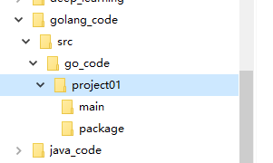

# 0.windows下搭建Go开发环境

## 0.1 SDK  Software Development Kit

官网下载安装(新建一个目录安装就行)

cmd  看到下面的提示信息，表示安装成功


   ## 0.2配置环境变量


==新建一个GOPATH,保存go项目地址==


==**说明**==

**golang环境变量配置的作用**

GOROOT: 指定go sdk安装目录

Path:指令 sdk\bin 目录： go.exe  godoc.exe  gofmt.exe

GOPATH：就是golang的工作目录：我们项目的源码都放在这个目录下

**go程序编写、编译、运行**

golang编写就是写源码

编译就是生成一个二进制可执行文件

运行：对可执行文件运行


# 1. 开始

## 1.1 第一个go程序

go的目录结构




```go
// 要求开发一个hello.go程序，可以输出 "hello,wi=orld!"

package main
import "fmt"
func main() {
	fmt.Println("hello,world!")
}
```

==代码说明==

1. go文件的后缀是.go

2. package main

   表示hello.go 文件所在的包是main，在go中，每个文件都必须归属于一个包

3. import "fmt"

   表示：引入一个包，包名为fmt,引入该包后，就可以使用fmt包的函数，比如：fmt.Println

4. func main() {

   }

   func 是一个关键字，表示一个函数

   main是函数名，是一个主函数，即我们的程序入口

5. fmt.Println("hello")

   表示调用fmt包的函数Println输出"hello,world!"

6. 使用go build命令对该go文件进行编译，生成exe文件

   

7. 运行hello.exe文件即可

   

 

8. go run命令直接编译加运行


## 1.2 go语言语法要求和注意事项

1. go应用程序的执行入口时main函数
2. go语言严格区分大小写
3. go方法由一条条语句构成，每个语句后不需要分号(go语言会自动在每行后自动加分号)
4. go编译器是一行一行编译的，所以一行只写一条语句
5. ==go语言定义的变量，或者import引入的包没有用到，代码不能通过==
6. 大括号必须成对出现

## 1.3 转义字符

和其他语言一样

## 1.4 go语言的注释

// 行注释

/* */块注释

## 1.5 规范的代码风格

1. 推荐使用行注释
2. 要有正确的缩进 gofmt -w main.go 格式化代码(在命令行执行)
3. 运算符两边习惯加空格
4. go语言代码风格{}大括号行尾风格


# 2. 变量


