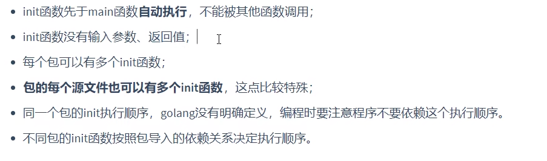
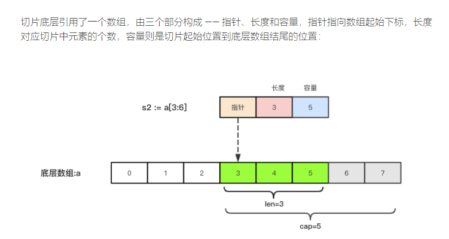
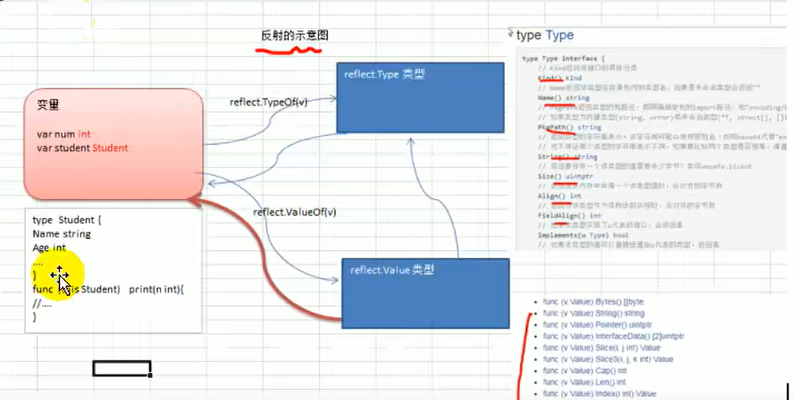

# 0.windows下搭建Go开发环境

## 0.1 SDK  Software Development Kit

官网下载安装(新建一个目录安装就行)

cmd  看到下面的提示信息，表示安装成功


   ## 0.2配置环境变量


==新建一个GOPATH,保存go项目地址==新版本go不要GOPATH，使用go mod管理项目


==**说明**==

**golang环境变量配置的作用**

GOROOT: 指定go sdk安装目录

Path:指定sdk\bin 目录： go.exe  godoc.exe  gofmt.exe

~~GOPATH：就是golang的工作目录：我们项目的源码都放在这个目录下~~

**go程序编写、编译、运行**

golang编写就是写源码

编译就是生成一个二进制可执行文件

运行：对可执行文件运行

## 0.3配置go环境(郭)

```cmd
go env
set GO111MODULE=on
set GOPROXY=https://goproxy.io,direct  改为 set GOPROXY=https://goproxy.cn
```

==**使用go mod管理库**==

## 0.4安装git（郭）

直接下一步

添加环境变量

## 0.5开发环境（郭）

vscode

安装go插件

安装code runner插件

cmd 

mkdir go_pro

cd .\go_pro\

code .


# 1. 开始

## 1.1 第一个go程序


```go
// 要求开发一个hello.go程序，可以输出 "hello,wi=orld!"

package main
import "fmt"
func main() {
	fmt.Println("hello,world!")
}
```

==代码说明==

1. go文件的后缀是.go

2. package main

   表示hello.go 文件所在的包是main，在go中，每个文件都必须归属于一个包

3. import "fmt"

   表示：引入一个包，包名为fmt,引入该包后，就可以使用fmt包的函数，比如：fmt.Println

4. func main() {

   }

   func 是一个关键字，表示一个函数

   main是函数名，是一个主函数，即我们的程序入口

5. fmt.Println("hello")

   表示调用fmt包的函数Println输出"hello,world!"

6. 使用go build命令对该go文件进行编译，生成exe文件

   

7. 运行hello.exe文件即可

   

 

8. go run命令直接编译加运行
9. go get下载并安装包和依赖

## 1.2Vscode 下创建新项目的步骤

1. 创建项目并初始化

   `新建文件夹 --->cmd----> code . --->打开终端--->go mod init 文件夹名`

2. 创建包，创建模块相互调用


## 1.3 go 代码组织

1. go应用包和模块来组织代码

2. 包： 文件夹

3. 模块： .go 文件

4. 一个包中有多个模块或多个子包

## 1.4 go语言语法要求和注意事项

1. go应用程序的执行入口时main函数
2. go语言严格区分大小写
3. go方法由一条条语句构成，每个语句后不需要分号(go语言会自动在每行后自动加分号)
4. go编译器是一行一行编译的，所以一行只写一条语句
5. ==go语言定义的变量，或者import引入的包没有用到，代码不能通过==
6. 大括号必须成对出现

## 1.5 转义字符

和其他语言一样

## 1.6 go语言的注释

// 行注释

/* */块注释

## 1.7 go 标识符、关键字、命名规则

### 标识符(identifier)

**通俗的讲就是给变量，常量，函数，方法，结构体，数组，切片，接口起名字**

1. 标识符由数字、字母和下划线组成

2. 只能以字母和下划线开头

3. 标识符区分大小写

4. 包名，保持package的名字和目录保持一致，尽量采取有意义的，简短，不要和标准库冲突

5. 变量名，函数名，常量名：采用驼峰命名法

6. 如果变量名，函数名，常量名首字母大写，则可以被其他的包访问；

   如果首字母小写，则只能在本包中使用

   （注：可以简单理解成首字母大写是公开的public,首字母小写是私有的private）

### 关键字


### 命名规则

1. 包名称

   保持package的名字和目录保持一致，尽量采取有意义的包名，简短，有意义，尽量不要和标准库冲突。包名应该为**小写**单词，不要使用下划线或者混合大小写

2. 文件命名

   尽量采用有意义的文件名，简短，有意义，应该为**小写**单词，使用下划线分隔各个单词

3. 结构体命名

   采用**驼峰命名法**，首字母根据访问控制大写或者小写

4. 接口命名

   命名规则基本上和上面的结构体类型一致

   单个函数的结构名以"er"作为后缀，例如`Rader`

   ```go
   type Rader interface {
       Read(p []byte) (n int, err error)
   }
   ```

   

## 1.8 规范的代码风格

1. 推荐使用行注释
2. 要有正确的缩进 gofmt -w main.go 格式化代码(在命令行执行)
3. 运算符两边习惯加空格
4. go语言代码风格{}大括号行尾风格

## 1.9 golangAPI

Aplication Programming Interface   应用程序编程接口提供编程所用的各种函数

# 2. 变量

变量是计算机语言中能存储计算结果或能表示值的抽象概念。不同的变量保存的数据类型可能会不一样

## 变量使用

```go
func main(){
	var i int
	// 第一种：指定变量类型，声明后若不赋值，使用默认值
	fmt.Println("i=", i)

	// 第二种，根据值自行判定变量类型(类型推导)
	var num = 10.11
	fmt.Println("num",num)
}
```

## 短变量声明

```go
func main(){
	// 第三种，短变量声明，只能用在函数内部，在函数外部不能使用
    // 省略var，注意 := 左侧的变量不应该是已声明过的，狗则会导致编译错误
	// 下面的方式等价 var name string  name = "tom"
	name := "tom"
}
```


## 多变量声明

```go
// 多变量声明
var n1, n2, n3 int
fmt.Println("n1=",n1, "n2=",n2, "n3=",n3)

var n1, name, n3 = 100, "tom", 888
fmt.Println("n1=", n1, "name=", name, "n3=", n3)
```

## 匿名变量

如果我们接收到多个变量，有一些变量用不到 ，可以使用下划线表示变量名称，这种变量叫做匿名变量。例如

```go
package main
import "fmt"

func getNameAndAge() (string, int) {
    return "老郭"， 30
}

func main() {
    name, _ := getNameAndAge()
    fmt.Println(name)
}
```


## 定义多个全局变量

```go
var (
	n3 = 300
	n4 = 900
	name2 = "mary"
)
```

## 变量的格式化输出

```go
package main

import (
	"fmt"
	"project01/user"
)

func main() {

	s := user.Hello()
	fmt.Printf("s: %v\n", s)
	// var name string = "Wednesday"
	// var age int = 20
	// var email string = "1750218633@qq.com"
	var (
		name  string = "Wednesday"
		age   int    = 20
		email string = "1750218633@qq.com"
	)

	fmt.Printf("name=%v, age=%d, email=%v", name, age, email)

}
```

### 查看变量的数据类型

```go
fmt.printf("n1= %T", n1)
```

### 查看占用字节大小

```go
package main

import (
	"fmt"
	"unsafe"
)

func main() {
	n1 := 20
	fmt.Printf("n1占用字节的大小为:%d", unsafe.Sizeof(n1))
}
```


## 变量的数据类型


### 注意事项

1. 变量在某一个区域内，数据值可以在同一个类型内不断变化
2. 变量在一个作用域得不能重名
3. 变量 = 变量名 + 值 + 数据类型
4. 变量如果没有赋初始值，golang会自动赋初值

### 查看变量类型和占用字节数

```go
package main
import (
	"fmt"
	"unsafe"
	"reflect"
)

func main(){
	var i int = 10
	i = 10
	i = 50
	fmt.Println("i=", i)
	// i = 1.2
	fmt.Println("i 的类型是：", reflect.TypeOf(i), "i 占用的字节数是", unsafe.Sizeof(i))
}
```

### 整型变量

1. go的整型默认为int型(占8个字节，64位，和int64一样，但type是int )
2. 保小不保大

### 浮点型

1. 默认是float64

2. 支持科学计数法

   `num := 5.1234e2`

### 字符类型

1. 用byte（占1个字节，8位，等价于uint8）来保存
2. go的字符串是由单个字节连接起来的，也就是对于传统的字符串是由字符构成的，而go的不同，它是由字节组成的
3. %c输出码值对应的字符

```go
package main

import (
	"fmt"
)

func main() {
	var c1 byte = 'a'
	var c2 byte = '0'
	fmt.Printf("c1: %c\n", c1)
	fmt.Printf("c2: %c\n", c2)
}
```

### bool类型

bool类型只能是true和false，不能用0 和 非0来表示布尔值

### string 类型

1. 字符串一旦赋值，字符串就不能改变了
2. 双引号会识别转义字符
3. ==使用反引号，可以将内容原样输出==
4. 当拼接操作很长时，可以分行写，但是将+号保存到上一行

#### 字符串连接

**`strings.Join()`**

```go
import (
	"strings"
)
func mainn() {
    name := "tom"
    age := "20"
    msg := strings.Join([]string{name, age}, ",")
    fmt.Printf("msg: %v\n", msg)
}
```

join会线根据字符串数组的内同计算出一个拼接之后的长度，然后申请对应大小的内存，一个一个字符串填入，在已有一个数组的情况下，这种效率会很高，但是本来没有，去构造这个数据的代价也不小

**`buffer.WriteString()`**

```go
import (
	"bytes"
    "fmt"
)
func main() {
    var buffer bytes.Buffer
    buffer.WriteString("tom")
    buffer.WriteString(",")
    buffer.WriteString("20")
    fmt.Printf("buffer.String(): %v\n", buffer.String())
}
```

这个比较理想，可以当成可变字符串使用哦个，对内存的增长也有优化，如果能预估字符串的长度，还可以用`buffer.Grow()`接口来设置capacity	

#### 字符串分割

```go
s := "hello world"
fmt.Printf("strings.Split(s, \" \"): %v\n", strings.Split(s, " ")) // 输出的是一个数组
```


### 基本数据类型的默认值


### 数据类型转换

#### 基本数据类型的相互转换

==不同类型的变量之间赋值时需要显式转换==

```go
package main

import "fmt"

func main() {
	var i int8 = 32
	var n1 float32 = float32(i)
	var n2 = int32(i)
	fmt.Printf("i= %v, n1= %v, n2= %v", i, n1, n2)
}
```


#### 基本数据类型转字符串

##### **方法一**`fmt.Sprintf`

```go
package main

import "fmt"

func main() {
	var num1 int = 99
	var num2 float64 = 23.456
	var b bool = true
	var mychar byte = 'h'
	var str string

	// 第一种方法
	str = fmt.Sprintf("%d", num1)
	fmt.Printf("str type %T str=%v\n", str, str)
	str = fmt.Sprintf("%f", num2)
	fmt.Printf("str type %T str=%v\n", str, str)
	str = fmt.Sprintf("%t", b)
	fmt.Printf("str type %T str=%v\n", str, str)
	str = fmt.Sprintf("%c", mychar)
	fmt.Printf("str type %T str=%v\n", str, str)

}
```

##### **方法二**`strconv`

```go
	var num3 int = 99
	var num4 float64 = 23.456
	var b2 bool = true
	str = strconv.FormatInt(int64(num3), 10)
	fmt.Printf("str type: %T, str=%v\n", str, str)
	str = strconv.FormatFloat(num4, 'f', 10, 64)
	fmt.Printf("str type: %T, str=%v\n", str, str)
	str = strconv.FormatBool(b2)
	fmt.Printf("str type: %T, str=%v\n", str, str)
```

#### string类型转基本数据类型

```go
package main

import (
	"fmt"
	"strconv"
	"unsafe"
)

func main() {

	var str string = "true"
	var b bool
	b, _ = strconv.ParseBool(str)
	fmt.Printf("b type is %T, b = %t\n", b, b)

	var str2 string = "123456"
	var n1 int64
	n1, _ = strconv.ParseInt(str2, 10, 0)
	fmt.Printf("n1 type is %T n1 = %v\n", n1, n1)
}
```

### 值类型和引用类型

1. 值类型：基本数据类型 int， float, bool, string, 数组和结构体

   变量直接存储值，内存通常在==栈==中分配

2. 引用类型： 指针， slice切片， map， 管道chan, interface等都是引用类型

   变量存储的是一个地址，这个地址对应的空间才是真正存储数据（值）,内存通常在==堆==上分配，当没有任何变量引用这个地址时，该地址对应的数据空间就成为一个垃圾，这时由GC回收

```go
package main

import "fmt"

func main() {
	var i int = 10
	fmt.Println("i的地址为:", &i)

	var ptr *int = &i
	fmt.Printf("ptr: %v\n", ptr)
	fmt.Printf("ptr存的值为:%v", *ptr)
}
```

## 常量

1. 定义一个常量用const关键字

2. 不需要全部大写
3. 仍然荣国首字母大小写来控制常量的访问范围

`const constantName type = 3`

```go
func main() {
	const PI float32 = 3.14
	const R = 5
	var area = PI * R
	fmt.Printf("area: %v\n", area)

	const (
		a = 100
		b = 200
	)
	fmt.Printf("a: %v\n", a)
	fmt.Printf("b: %v\n", b)

	const m, n = 10, 20
	fmt.Printf("m: %v\n", m)
	fmt.Printf("n: %v\n", n)
}
```

### iota

1. 从0 开始，每次调用一次自动加1

```go
const (
	a = iota
    b = iota
    c = iota
)
```

2. 可以跳过

```go
const (
	a = iota   // 0
    _
    b = iota   // 2
)
```

3. 中间插队

```go
const (
	a = iota   // 0
    b = 100
    c = iota   // 2
)
```

## 类型定义

```go
type MyInt int
var i MyInt = 100
fmt.Printf("i:%T, %v", i, i) // i:main.MyInt, 100
```

## 类型别名

```go
type MyInt = int
var i MyInt
fmt.Printf("i:%T, %v". i, i)  //  i:int, 0
```


# 3. 运算符

## 算数运算符


==注意事项：==

>  10 % 3 = 10 - 10 / 3 * 3
>
> 自增自减只能当作一个独立的语句使用，不能当作结果赋值，且只能写在变量后面

## 赋值运算符


## 比较运算符/关系运算符


## 逻辑运算符

用于连接多个关系运算符，运算结果也是一个bool值


==注意事项：==

>&& 逻辑与也叫短路与，如若第一个条件为假，则第二段代码不会执行
>
>|| 逻辑或也叫短路或，如果第一个条件为真，则第二段代码不会执行

## 位运算符


## 取值运算符/取址运算符


# 4. 输入输出

```go
	// 要求从控制台接收用户信息，[姓名，年龄，薪水， 是否通过考试]
	// 方式一 fmt.Scanfln
	// 先声明需要的变量
	var name string
	var age byte
	var salary float32
	var isPass bool
	fmt.Println("请输入姓名：")
	fmt.Scanln(&name)
	fmt.Println("请输入年龄：")
	fmt.Scanln(&age)
	fmt.Println("请输入薪水：")
	fmt.Scanln(&salary)
	fmt.Println("请输入是否通过考试：")
	fmt.Scanln(&isPass)
	fmt.Printf("%v,年龄：%v,月工资：%v,是否通过考试：%v", name, age, salary, isPass)
	//方式二 按照指定的格式输入
	fmt.Println("请输入你的姓名，年龄，薪水，是否通过考试，用空格分开")
	fmt.Scanf("%s %d %f %t", &name, &age, &salary, &isPass)
	fmt.Printf("%v,年龄：%v,月工资：%v,是否通过考试：%v", name, age, salary, isPass)
```

## 格式化输出

```go
type Website struct {
	Name string
}

func main() {
	site := Website{Name: "duoke"}
	fmt.Printf("site: %v\n", site)
	fmt.Printf("dite: %#v\n", site)
}
```


# 5. 进制


# 6. 位运算

## 原码，反码，补码

**运算规则：**

1. 二进制的最高位是符号位：**0表示正数，1表示负数**
2. **正数的原码、反码、补码都一样(三码合一)**
3. **负数的反码 = 它的原码符号位不变，其它位取反**
4. **负数的补码 = 它的反码+1，负数的反码 = 负数的补码 - 1**
5. 0的反码，补码都是0
7. ==计算机运算的时候，都是以补码的方式来运算的==
8. ==看运算结果的时候，要看他的原码==

## 按位运算


## 移位运算


# 7. 流程控制

## 单分支

```go
if 条件表达式 {
    代码执行块
}
```

==细节说明:==

<span style="color:red">go的if还有一个强大的地方就是条件判断语句里面允许 声明一个变量，这个变量的作用域只能在该条件逻辑块内，其他地方就不起作用了</span>

```go
if age := 20; age > 18 {
    fmt.Print("你年龄大于18岁，要对自己的行为负责")
}
```

## 双分支

```go
if 条件表达式 {
    代码执行块
} else {
    代码块
}
```

**判断是否是闰年**

```go 
var year int = 2022
if year%4 == 0 && year%100 != 0 || year%400 == 0 {
    fmt.Printf("%v是闰年", year)
} else {
    fmt.Printf("%v不是闰年", year)
}
```

## 多分支

```go 
if 条件表达式1 {
    代码块
} else if 条件表达式2 {
    代码块
} else {
    代码块
}
```

## switch分支

1. switch分支用于基于不同条件执行不同的动作，每一个case分支都是唯一的，从上到下逐一测试，直到匹配为止。
2. 匹配项后面不需要再加break

3. golang的case后的表达式可以有多个，用逗号隔开

4. case后面的各个表达式的值的数据类型，必须和switch的表达式数据类型一致

5. case后面的表达式如果是常量值，则要求不能重复

6. default语句不是必须的

7. switch后面也可以不带表达式，类似于if-else分支来使用

   ```go 
   var age int = 10
   switch {
   case age == 10:
       fmt.Println("age == 10")
   case age == 20:
       fmt.Println("age == 20")
   default :
       fmt.Println("没有匹配到")
   }
   ```

8. switch 后也可以直接声明/定义一个变量， 分号结束

   ```go
   switch score := 80; {
   case score > 90 :
       fmt.Println("成绩优秀")
   case score >= 70 && score <= 90 :
       fmt.Println("成绩良好")
   case score >= 60 && score <= 70 :
       fmt.Println("成绩及格")
   default ：
       fmt.Println("不及格")
   }
   ```

9. switch 穿透-fallthrought

   ```go
   var num int = 10
   switch num {
   case 10:
       fmt.Println("ok1")
       fallthrough
   case 20:
       fmt.Println("ok2")
   }
   ```

10. tyoe switch


# 8. for 循环

1. 基本用法

   ```go
   func main() {
   	for i := 1; i <= 10; i++ {
   		fmt.Println("你好，老韩")
   	}
   }
   ```

2. 用法二

   ```go 
   j := 1
   for j <= 10 {
       fmt.Println("你好")
       j++
   }
   ```

3. 死循环，配合break使用

   ```go
   	k := 1
   	for {
   		if k <= 10 {
   			fmt.Println("ok")
   		} else {
   			break
   		}
   		k++
   	}
   ```

**注意事项：**

1. for循环条件必须是bool值

2. for-range遍历字符串

   ```go
   var str string = "Hello, world!"
   for i := 0; i < len(str); i++ {
       fmt.Printf("%c", str[i])
   }
   
   for index, value := range str {
       fmt.Printf("index:%d, val:%c\n", index, value)
   }
   ```

   ==如果字符串中有中文，那么传统的遍历字符串的方式会出错。原因是传统的对字符传的遍历，是按字节遍历的，而一个汉字占三个字节==

# 9. while

## for 循环实现while

```go
func main() {
	var i int = 1
	for {
		if i > 10 {
			break
		}
		fmt.Println(i)
		i++
	}
```

## for 循环实现do-while

```go 
var j int = 1
for {
    fmt.Println(j)
    if j > 10 {
        break
    }
    j++
}
```

# 10. 跳转控制语句

## break

```go
func main() {

	var count int = 0

	for {
		rand.Seed(time.Now().UnixNano())
		n := rand.Intn(100) + 1
		fmt.Println(n)
		count++
		if n == 99 {
			break
		}
	}
	fmt.Println(count)
}
```

### break使用注意事项


break语句出现在多层嵌套的语句块中时，可以通过标签指明要终止的是那一层语句块

```go
tag1:
	for i := 0; i < 4; i++ {
		for j := 0; j <= 10; j++ {
			if j == 2 {
				break tag1
			}
			fmt.Println("j=", j)
		}
	}
```


## continue

1. 用于结束本次循环，接续执行下一次循环

2. continue语句出现在多层嵌套循环语句体中时，可以通过标签指明要跳过的是那一层循环

## goto

1. 语言的goto语句可以无条件地转移到程序中指定的行。
2. goto语句通常与条件语句配合使用，可用来实现条件转移，跳出循环体等功能
3. 在go程序设计中一半不主张使用goto语句，以免造成程序流程的混乱，使理解和调试程序产生困难

```go
func main() {
	n := 11
	fmt.Println("ok1")
	if n > 10 {
		goto label1
	}
	fmt.Println("ok2")
	fmt.Println("ok3")
	fmt.Println("ok4")
label1:
	fmt.Println("ok5")
}
```

## return

return 使用在方法或者函数中，表示跳出所在的方法或函数

# 11. 函数

## golang函数简介

函数是go语言中的**一级公民**，我们把所有的功能单元都定义在函数中，可以重复使用。函数包含函数的名称、参数列表和返回值类型，这些构成了函数的签名(signature)。

## 基本语法

```go 
func 函数名 (形参列表) (返回值列表) {
    执行语句...
    return 返回值列表
}
```

```go
func getSumAndSub(n1 int, n2 int) (int, int) {
	return n1 + n2, n1 - n2
}

func main() {
	var number1 int = 12
	var number2 int = 5
	var sum int
	var sub int
	sum, sub = getSumAndSub(number1, number2)
	fmt.Println("sum:", sum, "sub:", sub)
}
```


1. 如果返回多个值时，在接收时，希望忽略某个返回值，则使用`_`符号表示占位忽略

   ```go
   _, sub2 := getSumAndSub(number1, number2)
   fmt.Println("sub2:", sub2)
   ```

2. 返回值只有一个，返回值类型列表可以不写()

3. 形参列表和返回值列表的数据类型可以是值类型和引用类型

4. 函数命名遵循标识符命名规范，首字母不能是数字，首席木大写函数可以被本包文件和其他套文件使用；首字母小写，只能被本包文件使用

5. 函数中的变量是局部的，函数外不能调用

6. 基本数据类型和数组默认都是值传递，即进行值拷贝。在函数内修改，不会应影响到原来的值

7. 如果希望函数内的变量能修改函数外的变量，可以传入变量的地址&，函数内以指针的方式操作变量

   ```go
   func test(n1 *int) {
   	*n1 = *n1 + 1
   	fmt.Println("test_n1:", *n1)
   }
   
   func main() {
   	var n1 int = 3
   	test(&n1)
   	fmt.Println("main_n1:", n1)
   }
   
   ```

8. go函数不支持重载

9. go中，函数也是一种数据类型，可以赋给一个变量，则该变量就是一个函数类型的变量了，通过该变量可以对函数调用

   ```go
   func getSum(n1 int, n2 int) int {
   	return n1 + n2
   }
   func main() {
   	a := getSum
   	res := a(10, 50)
   	fmt.Println("res:", res)
   }
   ```

   

10. 函数既然是一种数据类型，因此在go中，函数可以作为形参，并且调用

    ```go
    func getSum(n1 int, n2 int) int {
    	return n1 + n2
    }
    func myFunc(funvar func(int, int) int, n1 int, n2 int) int {
    	return funvar(n1, n2)
    }
    func main() {
    	res2 := myFunc(getSum, 10, 50)
    	fmt.Println("res2:", res2)
    }
    ```

    

11. 为了简化数据类型定义，go支持自定义数据类型

    在go中，myInt 和int虽然都是int类型，但是go认为myInt和int是两个类型

    ```go
    type myInt int
    var number myInt
    ```

    案例：

    ```go
    func getSum(n1 int, n2 int) int {
    	return n1 + n2
    }
    func myFunc(funvar func(int, int) int, n1 int, n2 int) int {
    	return funvar(n1, n2)
    }
    
    type myFunType func(int, int) int
    
    func myFunc2(funvar myFunType, n1 int, n2 int) int {
    	return funvar(n1, n2)
    }
    func main() {
    	res3 := myFunc2(getSum, 10, 50)
    	fmt.Println("res3:", res3)
    }
    ```

12. 支持对函数返回值命名

    ```go
    func getSumAndSub(n1 int, n2 int) (sum int, sub int) {
        sum = n1 + n2
        sub = n1 - n2
        return
    }
    
    sum, sub := getSumAndSub(12, 13)
    fmt.Println("sum:", sum, "sub", sub)
    ```

13. ==支持可变参数==

    ```go
    func sum(n1 int, args ...int) int {
    	sum := n1
    	for i := 0; i < len(args); i++ {
    		sum += args[i]
    	}
    	return sum
    }
    func main() {
    	res := sum(1, 2, 3, 4, 5)
    	fmt.Println("res:", res)
    }
    ```

    

## 调用机制


1. 在调用一个函数时，会给还函数分配一个新的空间，编译器会通过自身的处理让这个新的空间和其他的栈的空间区分开
2. 在每个函数对应的栈中，数据空间是独立的，不会混淆
3. 当一个函数调用完毕，程序会销毁这个函数对应的栈空间

## 递归

```go
func fibonacci(n int) int {
	if n == 0 {
		return 0
	} else if n == 1 {
		return 1
	} else {
		return fibonacci(n-1) + fibonacci(n-2)
	}
}

func main() {
	var n int = 6
	for i := 1; i <= n; i++ {
		res := fibonacci(i)
		fmt.Println(res)
	}
}
```

## init函数

​         每一个源文件都可以包含一个init函数，该函数会在main函数执行前，被go运行框架调用，也就是说init会在main函数前被调用，实现包级别的一些初始化操作。

**go初始化顺序**

变量初始化，init(), main()

1. 通常可以在init函数中进行初始化工作

```go
// 
func init() {
	fmt.Println("init()...")
}
func main() {
	fmt.Println("main()...")
}
```

2. 如果一个文件同时包含全局变量定义，init函数和main函数，则执行流程是，变量定义->init函数->main函数

   ```go
   var age int = test()
   
   func test() int {
   	fmt.Println("test()...")
   	return 90
   }
   
   // 通常可以在init函数中进行初始化工作
   func init() {
   	fmt.Println("init()...")
   }
   func main() {
   	fmt.Println("main()...age=", age)
   }
   ```

3. 执行流程

   

**主要特点**



## 高阶函数

go语言的函数，可以作为函数的参数，传递给另外一个函数，可以作为另外一个函数的返回值

### go语言函数作为参数

```go
func sayHello(name string) {
    fmt.Printf("Hello, %s", name)
}
func f1(name string, f func(string)) {
    f(name)
}
```

### go语言函数作为返回值

```go
func add(x, y int) int {
    return x + y
}
func sub(x, y int) int {
    return x - y
}

func cal(operator string) func(int, int) int {
    switch s: {
    case "+":
        retrun add
    case "-":
        return sub
    }
    default:
    	return nil
}
```


## 匿名函数

1. 如果一个函数只希望使用一次，可以考虑匿名函数，匿名函数也可以调用多次

2. 调用方式

   + 匿名函数在定义时就直接调用，这种方式的匿名函数只能调用一次

   ```go
   func main() {
   	res1 := func(n1 int, n2 int) int {
   		return n1 + n2
   	}(10, 20)
   	fmt.Println("res1:", res1)
   }
   ```

   + 将匿名函数赋给一个变量，再通过该变量来调用匿名函数

   ```go
   func main() {
   	a := func(n1 int, n2 int) int {
   		return n1 - n2
   	}
   	res2 := a(10, 12)
   	fmt.Println("res2:", res2)
   }
   ```

3. 全局匿名函数

   ```go
   var (
   	fun1 = func(n1 int, n2 int) int {
   		return n1 * n2
   	}
   )
   
   func main() {
   	res3 := fun1(4, 9)
   	fmt.Println("res3:", res3)
   }
   ```

## 闭包

闭包可以理解为定义一个函数内部的函数。本质上，闭包是将函数内部和函数外部连接起来的桥梁。或者说是函数和其引用环境的组合体。<span style="color:red">闭包就是一个函数和与其相关的引用环境组合的一个整体(实体)</span>

```go
// 累加器
func AddUpper() func(int) int {
	var n int = 10
	return func(x int) int {
		n = n + x
		return n
	}
}
func main() {
	f := AddUpper()
	fmt.Println(f(1))
	fmt.Println(f(2))
	fmt.Println(f(3))
}
```

1. AddUpper是一个函数，返回的数据类型是fun (int) int 

2. 闭包的说明

   

   返回的是一个匿名函数，但是这个匿名函数引用到函数外的n，因此这个匿名函数就和n形成一个整体，形成闭包

3. 当反复调用f函数时，因为n是只初始化一次，因此每调用一次就进行累计

**案例：**

```go
// 文件名拼接
func makeSuffix(suffix string) func(string) string {
	return func(file string) string {
		if !strings.HasSuffix(file, suffix) {
			return file + suffix
		} else {
			return file
		}
	}
}

func main() {
	var suffix string = ".jpg"
	var file string = "cat.jpg"
	f := makeSuffix(suffix)
	fmt.Println("fileName:", f(file))
	fmt.Println("fileName:", f("dog"))
}
```

1. `strings.HasSuffix(fileName, suffixName)`判断fileName是否有后缀suffixName
2. 如果使用传统的方法，也可以轻松实现这个功能，但是传统方法需要每次都传入一个后缀名，比如：.jpg，而闭包因为可以保留上次引用的某个值，所以我们传图一次就可以反复使用

## defer

go语言中的defer语句会将其后面跟随的语句进行延迟处理。在defer归属的函数即将返回时，将延迟处理的语句按defer定义的==逆序==进行执行，也就是说，先被defer的语句最后被执行，最后被defer的语句，最先被执行。

**为什么需要defer**

在函数中，程序员经常需要创建资源(比如，数据库连接、文件句柄、锁等)，为了<span style="color:red">在函数执行完毕后，及时的释放资源</span>，go的设计者提供defer(延时机制)

```go
func test() {
    // 关闭文件资源
    file = openfile(文件名)
    defer file.close()
    // 其他代码
}

func test2() {
    // 释放数据库资源
    connect = openDatabase()
    defer connect.close()
    // 其他代码
}
```


1. 当执行到defer时，暂时不执行，会将defer后面的语句压入到独立的栈中(defer栈)
2. 当函数执行完毕后，再从defer栈，按照先入后出的方法出栈，执行

```go
func sum(n1 int, n2 int) int {
	defer fmt.Println("ok1 n1=", n1) // 3
	defer fmt.Println("ok2 n2=", n2) // 2

	res := n1 + n2
	fmt.Println("ok3 res=", res) // 1
	return res
}
func main() {
	res := sum(10, 20)
	fmt.Println("ok4 res=", res) // 4
}
```

3. 在defer将语句放入栈时，也会将相关的值拷贝同时入栈

### defer的用途

1. 关闭文件句柄
2. 锁资源释放
3. 数据库连接释放

## 函数参数传递方式

不管是那种传递方式，传递给函数的都是变量的副本，不同的是，值传递是值的拷贝，引用传递的是地址的拷贝，一般来说，地址拷贝效率高，因为数据量小，而值拷贝取决于拷贝的数据大小，数据越大，效率越低

## 字符串常用系统函数

1. 统计字符串长度

   ```go
   str := "hello山西"
   fmt.Println("str len=", len(str))
   ```

2. 字符串遍历，同时处理有中文的问题

   ```go
   r := []rune(str)
   for i := 0; i < len(r); i++ {
       fmt.Printf("字符=%c\n", r[i])
   }
   ```

3. 字符串转整数

   ```go
   n, err := strconv.Atoi("123")
   if err != nil {
       fmt.Println("转换错误", err)
   } else {
       fmt.Printf("n=%v", n)
   }
   ```

4. 整数转字符串

   ```go
   str = strconv.Itoa(12345)
   fmt.Printf("类型是：%T, 转换结果:%v", str, str)
   ```

5. 字符串转[]byte

   ```go
   var bytes = []byte("hello.go")
   fmt.Printf("bytes=%v\n", bytes)
   // bytes=[104 101 108 108 111 46 103 111]
   ```

6. []byte转字符串

   ```go
   str = string([]byte{97, 98, 99})
   fmt.Printf("str= %v\n", str)
   ```

7. 十进制转其他进制

   ```go
   str = strconv.FormatInt(123, 2)
   fmt.Printf("123对应的二进制是：%v", str)
   str = strconv.FormatInt(123, 16)
   fmt.Printf("123对应的十六进制是：%v", str)
   ```

8. 查找字符串是否在指定的字符串中

   ```go
   var tag = strings.Contains("seefood", "foo")
   fmt.Println(tag)
   ```

9. 统计一个字符串中有几个指定的字串

   ```go
   num := strings.Count("cheese", "e")
   fmt.Printf("num: %v\n", num)
   ```

10. 不区分大小写的字符串比较(==是区分字母大小写的):

    ```go
    strings.EqualFold("abc", "Abc")
    ```

11. 返回字串在字符串中第一次出现的index值，如果没有返回-1

    ```go
    index := strings.Index("NLT_abc", "abc")
    ```

12. 返回字符串在字符串中最后一次出现的Index值

    ```go
    index := strinf.LastIndex("NLT_abcabc", "abc")
    ```

13. 将指定的子串替换成另外一个字串

    ```go
    srtings.Replace("go go hello", "go", "go语言"， 1)
    str = strings.Replace("go go hello", "go", "go语言", -1)
    fmt.Printf("str: %v\n", str)
    ```

14. 按照指定的某个字符为分割标识，将一个字符串拆分成字符串数组，

    ```go 
    strArr := strings.Split("hello,world,ok", ",")
    fmt.Printf("strArr: %v\n", strArr)
    ```

15. 将字符串进行大小写的转换

    ```go
    str = "goLang Hello"
    str = strings.ToLower(str)
    fmt.Printf("str: %v\n", str)
    ```

16. 将字符串两边的空格去掉

    ```go
    str = strings.TrimSpace(" tn a lone gopher ntrn   ")
    fmt.Printf("str: %v\n", str)
    ```

17. 将字符串左右两边指定的字符去掉

    ```go
    // 将左右两边的!和空格去掉
    str = strings.Trim("! hello ! ", " !")
    fmt.Printf("str: %q\n", str)
    ```

18. `strings.TrimLeft()`

19. `strings.TrimRight()`

20. 判断字符串是否以指定的字符串开头

    ```go
    flag := strings.HasPrefix("frp://192.168.10.1", "ftp")
    fmt.Printf("flag: %v\n", flag)
    ```

21. 判断字符串是否以指定的字符串结尾

    ```go
    flag = strings.HasSuffix("NLT_abc.jpg", "abc")
    fmt.Printf("flag: %v\n", flag)
    ```

## 时间和日期相关函数

1. time.Time类型用来表示时间

2. 获取当前时间的方法

   ```go
   now := time.Now()
   fmt.Printf("now=%v now type=%T", now, now)
   ```

 3. 格式化输出时间

    ```go
    fmt.Printf("年=%v\n", now.Year())
    fmt.Printf("月=%v\n", now.Month())
    fmt.Printf("日=%v\n", now.Day())
    fmt.Printf("时=%v\n", now.Hour())
    fmt.Printf("分=%v\n", now.Minute())
    fmt.Printf("秒=%v\n", now.Second())
    ```

    方法二：

    ```go
    fmt.Printf("当前时间为：%d-%d-%d %d:%d:%d\n", now.Year(), now.Month(),
    		now.Day(), now.Hour(), now.Minute(), now.Second())
    
    dateStr := fmt.Sprintf("当前时间为：%d-%d-%d %d:%d:%d", now.Year(), now.Month(),
            now.Day(), now.Hour(), now.Minute(), now.Second())
    fmt.Printf("dateStr:%v\n", dateStr)
    ```

    方法三：

    ```go
    fmt.Print(now.Format("2006-01-02 15:04:05"))
    fmt.Println()
    fmt.Print(now.Format("2006-01-02"))
    fmt.Println()
    fmt.Print(now.Format("15:04:05"))
    fmt.Println()
    ```

4. 时间的常量

   ```go
   const{
       Nanosecond Duration = 1
       Microsecond = 1000 * Nanosecond // 微秒
       Millisecond = 1000 * Microsecond // 毫秒
       Second = 1000 * Millisecond // 秒
       Minute = 60 * Second // 分钟
       Hour = 60 * Minute // 小时
       
   }
   ```

5. 休眠

    ```go
    i := 0
    for i <= 10 {
        fmt.Println(i)
        time.Sleep(time.Second)
        i++
    }
    ```

6. unix 和unixNano的使用

   ```go
   fmt.Printf("unix:%v, unixNano:%v", time.Now().Unix(), time.Now().UnixNano())
   ```

## 内置函数

1. len()

2. new()用来分配内存，主要用来分配值类型，返回的是指针

   ```go
   func main() {
   	num := new(int)
   	fmt.Printf("num的类型:%T, num的地址:%v,num: %v\n", num, &num, num)
   	fmt.Println(*num)
   }
   ```

   

3. make()用来分配内存，主要用来分配引用类型

# 12. 指针

go语言中的指针操作非常简单，只需要记住两个符号：`&`（取地址）`*`(根据地址取值)

## 指向数组的指针

```go
var ptr [MAX]*int  // 表示数组里面的元素的类型是指针类型
```

**实例演示**

```go
func main() {
	a := [...]int{1, 2, 3}
	var pa [3]*int

	fmt.Printf("pa: %v\n", pa)

	for i := 0; i < len(a); i++ {
		pa[i] = &a[i]
	}
	fmt.Printf("pa: %v\n", pa)
}
```


# 13. 包

## 基本概念

go的每一个文件都是属于一个包的，也就是说go以包的形式来管理文件和项目目录结构的

## 包的作用

1. 区分相同名字的函数、变量等标识符
2. 当程序文件很多时，可以很好的管理项目
3. 控制函数、变量等访问范围，即作用域

## 包的具体使用

1. 打包基本语法

   `package util`

2. 引入包的基本语法

   `import "包的路径"`


<span style="color:red">**路径的根目录是go.mod所在的文件夹**</span>

```go
package main

import (
	"fmt"
	"project01/packagedemo/utils"
)

func main() {
	var n1 float64 = 32
	var n2 float64 = 4
	var operator byte = '/'
	result := utils.Cal(n1, n2, operator)
	fmt.Println(result)
}
```

3. 包名通常和文件夹名一样(也可以不一样)，一般为小写字母

4. 为了让其他包的文件能够访问到本包的函数，函数名的首字母应该大写

5. 在访问其他包的函数，变量时，其语法是<span style="color:red">包名.函数名</span>

6. 如果包名过长，go支持给包取别名，取别名之后，原来的包名就不能使用了

   ```go
   package main
   
   import (
   	"fmt"
   	util "project01/packagedemo/utils"
   )
   
   func main() {
   	var n1 float64 = 32
   	var n2 float64 = 4
   	var operator byte = '/'
   	result := util.Cal(n1, n2, operator)
   	fmt.Println(result)
   }
   ```

7. 同一个包下的函数名不能重复，否则会报重复定义

8. 如果要编译生成一个可执行文件，就需要将这个报声明为main

   

# 14. 错误处理

1. 当错误(panic)出现的时候,程序就会退出

2. 如果我们希望，发生错误后可以捕获到错误，并进行处理，保证程序可以继续执行，还可以给管理员一个提示

   ```go
   func test() {
   	//  defer + recover来捕获和处理异常
   	defer func() {
   		err := recover()
   		if err != nil {
   			fmt.Println("err=", err)
   		}
   	}()
   	num1 := 10
   	num2 := 0
   	res := num1 / num2
   	fmt.Println("res=", res)
   }
   func main() {
   	test()
   	fmt.Println("继续运行")
   }
   ```

   发送预警信息，以及第二种写法

   ```go
   func test() {
   	//  defer + recover来捕获和处理异常
   	defer func() {
   		if err := recover(); err != nil {
   			fmt.Println("err=", err)
   			fmt.Println("发送邮件给admin@163.com")
   		}
   	}()
   	num1 := 10
   	num2 := 0
   	res := num1 / num2
   	fmt.Println("res=", res)
   }
   func main() {
   	test()
   	fmt.Println("继续运行")
   }
   ```

   ## 自定义错误

   go程序中，也支持自定义错误，使用errors.New和panic内置函数

   1. errors.New("错误说明")，会返回一个error类型的值，表示一个错误
   2. panic内置函数，接收一个interface{}类型的值作为参数。可以接收error类型的变量，输出错误信息，并退出程序

   ```go
   // 函数读取一个配置文件init.conf的信息
   // 如果文件名传入不正确,我们就返回一个自定义的错误
   func readConf(name string) (err error) {
   	if name == "config.ini" {
   		// 读取...
   		return nil
   	} else {
   		return errors.New("读取文件错误..")
   	}
   }
   
   func test02() {
   	err := readConf("config2.ini")
   	if err != nil {
   		// 如果读取文件发生错误，就输出这个错误，并终止程序
   		panic(err)
   	}
   	fmt.Println("test02继续执行...")
   }
   func main() {
   	test02()
   	fmt.Println("继续执行...")
   }
   ```

# 15. 数组和切片

## 数组

   数组是值类型。在go语言中数组是固定长度的，存放同一种数据类型。数组中包含的每个数据项被称为数组元素，一个数组包含的元素个数被称为数组的长度。

```go
var intArr [3]int
fmt.Printf("intArr的地址为：%p intArr[0]的地址为：%p", &intArr, &intArr[0])
```


   1. 数组的地址可以通过&intArr来获取
   2. 数组的地址和第一个元素地址一样
   3. 数组的各个元素的地址间隔是依据数组的类型决定

   ## 初始化

**1. 声明时初始化**

```go
var numArr01 [3]int = [3]int{1, 2, 3}
```

**2. 可以通过`:=`进行一次性声明和初始化**

```go
a := [2]int{2, 3}
```

**3. 省略数组长度的方式初始化(go会在编译时自动计算出 数组的长度）**

```go
var numArr03 = [...]int{1, 3, 4, 4}
```

**4. 指定位置方式初始化**

```go
var numArr04 = [...]int{1: 800, 0: 900}
```

**5.数组在初始化时，如果没有填满，则空位会通过对应的元素类型零值填充**

```go
a := [5]int{1, 2, 3}
fmt.Println(a)   // [1 2 3 0 0]
```


## for-range遍历

```go
for index, value := range numArr03 {
    fmt.Print("index:" + strconv.Itoa(index) + " value" + strconv.Itoa(value) + "\n")
}
```

## 注意事项

1. 数组是多个相同数据类型的组合，一个数组一旦声明了，其长度是固定的，不能动态变化

2. `var arr []int`是一个slice切片

3. 数组中的元素可以是任何类型，包括值类型，和引用类型

4. 数组创建后，如果没有赋值，则统一为默认值

5. 使用数组的步骤

   + 声明数组并开辟空间，
   + 给数组各个元素赋值（默认0值）
   + 使用数组

6. 数组的下标从零开始

7. go数组是值类型，在默认情况下是值传递，因此会进行值拷贝

   ```go
   func test01(arr [3]int) {
   	arr[0] = 88
   }
   func main() {
   	arr := [3]int{11, 22, 33}
   	test01(arr)
   	fmt.Println(arr)
   }
   //  运行结果[11, 22, 33]
   ```
   
8. 如果想在函数中改变原数组

   ```go
   func test02(arr *[3]int) {
   	(*arr)[0] = 88
   }
   func main() {
   	arr := [3]int{11, 22, 33}
   	test02(&arr)
   	fmt.Println(arr)
   
   }
   ```

## 二维数组

```go
func main() {
	var arr [4][6]int
	fmt.Printf("arr: %v\n", arr)
    
    var arr1 [2][3]int = [2][3]int{{1, 2, 3},{4, 5, 6}}
    var arr2 [2][3]int = [...][3]int{{1, 2, 3},{4, 5, 6}}
    var arr3 = [2][3]int{{1, 2, 3}, {4, 5, 6}}
    var arr4 = [...][3]int{{1, 2, 3},{4, 5, 6}}
}
```

**求二维数组长度**

```go
len(array)  // 求出的是有几行
len(array[i]) // 求出的是有几列
```

**乘法表**

```go
var multi [9][9]string
for i := 0; i < 9; i++ {
    for j := 0; j < 9; j++ {
        if i < j {
            continue
        }
        multi[i][j] = fmt.Sprintf("%d×%d=%d", i+1, j+1, (i+1)*(j+1))
    }
}
for _, v := range multi {
    for _, v2 := range v {
        fmt.Printf("%-8s", v2)
    }
    fmt.Println()
}
```


## 切片

<span style="color:red">切片是引用类型</span>

### 创建切片

**1. 基于数组创建**

切片可以基于一个已存在的数组创建，从这个层面来说，数组可以看作是切片的底层数组，而切片则可以看作是数组某个连续片段的引用。切片可以只使用数组的一部分元素或者整个数组来创建，甚至可以创建一个比所基于的数组还要大的切片。

```go
// 定义一个数组
months := [...]string{"January", "February", "March", "April", "May", "June", "July", "August", "September", "October", "November", "December"}

// 创建切片
q2 := months[3:6]
```




> **切片 slice 的长度和容量可通过表达式 len(slice) 和 cap(slice) 来获取**

```go
func main() {
	var intArr [5]int = [...]int{1, 22, 33, 66, 99}
	slice := intArr[0:3]
	fmt.Println(cap(slice))
	fmt.Println(&slice[0])  // 0xc0000103f0
	fmt.Printf("slice的地址:%p\n", &slice)	  // 0xc000008078
}
```


**2.基于切片创建**

```go
firsthalf := months[:6]
q1 := firsthalf[:3]  // 基于firsthalf的前三个元素创建新切片
```

基于firsthalf创建切片是，选择的范围可以超过firsthalf所包含的元素个数，比如

```go
q1 := firsthalf[:9]   // [January February March April May June July August September]
```


**3.直接创建**

创建类型为`float64`，长度为5，容量为10的切片

```go
var slice01 []float64 = make([]float64, 5, 10)
```

直接创建并初始化包含3个元素的数组切片

```go
var slice02 []string = []string{"tom", "jack", "marry"}
```

### 动态增加元素

切片比数组更强大之处在于支持动态增加元素，甚至可以在容量不足的情况下自动扩容。在切片类型中，元素个数和实际可分配的存储空间是两个不同的值，元素的个数即切片的实际长度，而可分配的存储空间就是切片的容量。

+ 对于基于的胡祖和切片创建的切片而言，默认容量是从切片起始索引到对应底层数组的结尾索引；
+ 对于内置make函数创建的切片而言，在没有指定容量参数的情况下，默认容量和切片长度一致。

**用append对切片进行动态追加(go底层会创建一个新的数组**

`append()`函数的第二个参数是一个不定参数，我们可以按自己需求添加若干元素，设置直接将一个切片追加到另一个切片的末尾

```go
var slice03 []int = []int{100, 200, 300}
// 通过append直接给slice03追加具体的元素
slice03 = append(slice03, 400, 500)
fmt.Printf("slice: %v\n", slice03)
// 通过append追加一个切片
var slice []int = []int{1, 2, 3}
slice03 = append(slice03, slice...)  // 注意末尾的...不能省略
fmt.Printf("slice03: %v\n", slice03)
```

### 自动扩容

+ 如果追加的元素个数超过原切片的默认容量，则底层会自动进行扩容；需要注意的时，`append()`函数并不会改变原来的切片，而是会生成一个容量更大的切片，然后把原有的元素和新元素一并拷贝到新切片中（<span style="color:red">重新分配内存</span>）

+ 扩容后容量为原容量的两倍；（假设原容量为3，扩容后为6，再次括容12）
+ 当原切片的长度大于或等于1024时，go会以原容量的1.25倍作为新容量的基准（==这个地方并非这么简单，具体怎么样还没弄清楚==）


### 切片的拷贝操作

如果直接赋值那么，修改第二个切片第一个也会跟着修改；如果用copy那么修改第二个切片，第一个不会改变

<span style="color:red">copy()成功后返回拷贝成功的元素个数</span>

```go
var a []int = []int{1, 2, 3, 4, 5}
var slice04 = make([]int, 10)
// 将a复制到slice4
copy(slice04, a)
fmt.Printf("slice04: %v\n", slice04)
```

copy时，如果容量不够，不会报错，容量有多大就copy几个元素

如果两个切片不一样大，就会按照其中较小的那个切片的元素个数进行拷贝

```go
slice1 := []int{1, 2, 3, 4, 5} 
slice2 := []int{5, 4, 3}

// 复制 slice1 到 slice 2
copy(slice2, slice1) // 只会复制 slice1 的前3个元素到 slice2 中
// slice2 结果: [1, 2, 3]
// 复制 slice2 到 slice 1
copy(slice1, slice2) // 只会复制 slice2 的 3 个元素到 slice1 的前 3 个位置
// slice1 结果：[5, 4, 3, 4, 5]
```


### 动态删除元素

切片除了支持动态增加元素之外，还可以动态删除元素，在切片中动态删除元素可以通过多种方式实现（其实时通过切片的切片实现的伪删除）

```go
func main() {
    var s1 = []int{1, 2, 3, 4}
    s1 = append(s1[:2], s1[3:]...)
    fmt.Println(s1)
}
```

### 数据共享问题

**切片的数据结构**

```go
type slice struct {
    array unsafe.Pointer //指向存放数据的数组指针
    len   int            //长度有多大
    cap   int            //容量有多大
}
```

**在结构体中使用指针存在不容实例的数据共享问题**

```go
slice1 := []int{1, 2, 3, 4, 5}

slice2 := slice1[1:3]
slice2[1] = 6

fmt.Println("slice1:", slice1)
fmt.Println("slice2:", slice2) //  slice1: [1 2 6 4 5]   slice2: [2 6]
```

**解决方案**

```go
slice1 := make([]int, 4)
slice2 := slice1[1:3]
slice1 = append(slice1, 0)
slice1[1] = 2
slice2[1] = 6

fmt.Println("slice1:", slice1)
fmt.Println("slice2:", slice2)
```

### 定义一个二维切片

```go
func main() {
	row, col := 0, 0
	res1 := make([][]int, row)
	for i := range res1 {
		res1[i] = make([]int, col)
	}
	a := []int{1, 2, 4}
	res1 = append(res1, a)
	res1 = append(res1, a)
	fmt.Println(res1)
	//[[1 2 4] [1 2 4]]
}

```


## string 和 slice

1. string底层是一个byte数组，因此string可以进行切片处理

```go
func main() {
	str := "hello@atguigu"
	slice := str[6:]
	fmt.Println("slice=", slice)
}
```

2. string 和切片在内存的形式

   

3. string是不可变的，str[0] = 'z'会报错

4. 如果需要修改字符，可以先将string转换为[]byte或者[]rune，然后再修改，最后重新转回string

   ```go
   arr1 := []byte(str)
   arr1[0] = 'z'
   str = string(arr1)
   fmt.Println("str=", str)
   ```

## 排序

**冒泡排序**

```go
func bubbleSort(arr []int) []int {
	for i := 0; i < len(arr)-1; i++ {
		for j := 0; j < len(arr)-1-i; j++ {
			if arr[j] > arr[j+1] {
				arr[j], arr[j+1] = arr[j+1], arr[j]
			}
		}
	}
	return arr
}
func main() {
	var arr []int = make([]int, 5)
	arr = []int{24, 69, 80, 57, 13}
	bubbleSort(arr)
	fmt.Printf("arr: %v\n", arr)
}

```

## 查找

### 顺序查找

func sequentialSearch(n int, arr []int) bool {

  var flag bool = false

  for i := 0; i < len(arr); i++ {

​    if arr[i] == n {

​      flag = true

​    }

  }

  return flag

}

### 二分查找

```go
func binaryFind(arr []int, liftPrior int, rightPrior int, value int) int {
	var mid int = (liftPrior + rightPrior) / 2
	if arr[mid] == value {
		return mid
	} else if arr[mid] > value && mid > liftPrior {
		return binaryFind(arr, liftPrior, mid-1, value)
	} else if arr[mid] < value && mid < rightPrior {
		return binaryFind(arr, mid+1, rightPrior, value)
	} else {
		return -1
	}
}
func main() {
	var arr []int = []int{1, 8, 10, 1000, 1234}
	a := binaryFind(arr, 0, 4, 1000)
	fmt.Print(a)
}
```


# 16. map


1. map在使用前一定要make
2. map的key是不能重复的，如果重复了，则以最后这个key-value为准
3. map的value是可以相同的
4. map的key-value是无序的

## 初始化

```go
func main() {
	var a map[string]string = make(map[string]string)
	a["no1"] = "宋江"
	a["no2"] = "吴用"
	a["no3"] = "吴用"
	fmt.Println(a)

	cities := make(map[string]string)
	cities["no1"] = "北京"
	cities["no2"] = "天津"
	cities["no3"] = "伤害"
	fmt.Println(cities)

    // 通过初始化列表的方式进行初始化时，不需要make
	var heroes map[string]string = map[string]string{
		"hero1": "宋江",
		"hero2": "卢俊义",
		"hero3": "花荣",
	}
	fmt.Println(heroes)
}
```

## 增删改查

```go
cities := make(map[string]string)
cities["no1"] = "北京"
cities["no2"] = "天津"
cities["no3"] = "上海"
fmt.Println(cities)
cities["no3"] = "深圳"
fmt.Println(cities)
// 删除，如果key不存在，也不会报错
delete(cities, "no1")
fmt.Println(cities)
```

## map一次删除所有

1. 遍历清空
2. 重新分配空间

## map查找

go语言中有一个判断map中键是否存在的特殊写法，格式如下：

```go
value, ok := map[key]
```

例：

```go
value, ok := cities["no2"]
if ok {
    fmt.Printf("有no2,值为%v", value)
} else {
    fmt.Printf("没有no2")
}
```

## map的遍历

1. for-range

```go
cities := make(map[string]string)
cities["no1"] = "北京"
cities["no2"] = "天津"
cities["no3"] = "上海"

for k, v := range cities {
    fmt.Println("key=", k, "value=", v)
}
```

## map的长度

```go
len(map) // 统计有多少键值对
```

## map切片

```go
monsters := make([]map[string]string, 2)
if monsters[0] == nil {
    monsters[0] = make(map[string]string, 2)
    monsters[0]["name"] = "牛魔王"
    monsters[0]["age"] = "800"
}
if monsters[1] == nil {
    monsters[1] = make(map[string]string, 2)
    monsters[1]["name"] = "玉兔精"
    monsters[1]["age"] = "300"
}
fmt.Println(monsters)
```

**动态增加**

```go
// 动态增加
newMonster := map[string]string{
    "name": "狐狸精",
    "age":  "300",
}
monsters = append(monsters, newMonster)
fmt.Println(monsters)
```

## 使用细节

1. map是引用类型，遵守引用类型传递的机制，在一个函数接收map，修改后，会直接修改原来的map

2. map的容量达到后，再想map增加元素 ，会自动扩容，并不会发生panic，也就是说map能动态增长键值对

   ```go
   func modify(map1 map[int]int, 2) {
   	map1[10] = 900
   }
   func main() {
   	map1 := make(map[int]int)
   	map1[1] = 90
   	map1[2] = 88
   	map1[10] = 1
   	map1[20] = 2
   	modify(map1)
   	fmt.Println(map1)
   
   }
   ```

   

3. map的value也经常使用struct类型，更适合管理复杂的数据

   ```go
   type Stu struct {
   	Name    string
   	Age     int
   	Address string
   }
   
   func main() {
   	map1 := make(map[int]int)
   	map1[1] = 90
   	map1[2] = 88
   	map1[10] = 1
   	map1[20] = 2
   	modify(map1)
   	fmt.Println(map1)
   
   	students := make(map[string]Stu, 10)
   	students["001"] = Stu{"tom", 18, "上海"}
   	students["002"] = Stu{"marry", 20, "北京"}
   	for key, value := range students {
   		fmt.Printf("学号：%v 信息：%v\n", key, value)
   	}
   }
   
   ```

# 17. 面向对象


## 结构体与结构体变量（实例/对象）的关系示意图


1. 将一类事物的特性提取出来(比如猫类)，形成一个新的数据类型，就是一个结构体
2. 通过这个结构体，我们可以创建多个变量（实例/对象）
3. 事物可以是猫类，也可以是Person，Fish，或是某个工具类

## 可爱猫猫类

```go
type CuteCat struct {
	Name  string
	Age   int
	Color string
	hobby string
}

func main() {
	var cat1 CuteCat
	fmt.Println(cat1)
	cat1.Name = "大白"
	cat1.Age = 3
	cat1.Color = "white"
	cat1.hobby = "吃<。)#)))≦"
	fmt.Println(cat1)
	fmt.Printf("喜欢%v", cat1.hobby)
}
```

## 字段/属性


 ```go
type Person struct {
	Name   string
	Age    int
	Scores [5]float64
	Ptr    *int              // 指针
	Slice  []int             // 切片
	Map1   map[string]string // 切片
}

func main() {
	var person1 Person
	if person1.Map1 == nil {
		fmt.Println("ok")
	}
	fmt.Println(person1)

	person1.Scores[0] = 100
	person1.Slice = make([]int, 1)
	person1.Slice[0] = 100
	person1.Map1 = make(map[string]string)
	person1.Map1["no1"] = "tom"
	fmt.Println(person1)
}
 ```

## 创建结构体变量和访问结构体字段

```go
func main() {
	p2 := Person{}
	p2.Name = "tom"
	p2.Age = 19

	p1 := Person{Name: "marry", Age: 21}
	fmt.Println(p1)

	var p3 *Person = new(Person)
	(*p3).Name = "smith"
	(*p3).Age = 22
	fmt.Println(*p3)

	var p4 *Person = new(Person)
	p4.Name = "john"
	p4.Age = 20
	fmt.Println(*p4)
    
 	var p5 *Person = &Person{}
	p5.Name = "scott"
	p5.Age = 21
	fmt.Println(*p5)

	var p6 *Person = &Person{"betty", 18}
	fmt.Println(*p6)   
    
}
```

## 匿名结构体

如果结构体是临时使用的，可以不用起名字，直接使用，

```go
func main() {
    var dog struct {
        id int
        name string
    }
    dog.id = 1
    dog.name = "平安"
    fmt.Printf("dog: %v\n", dog)
}
```


## 注意事项和细节

1. 结构体的所有字段在内存中是连续的
2. 结构体是用户单独定义的类型，和其他类型进行转换时需要有完全相同的字段

3. 结构体进行type重新定义(相当于取别名),golang认为是新的数据类型，但是相互之间可以强转

4. struct的每个字段上，可以写上一个tag，该tag可以通过反射机制获取，常见的使用场景就是序列化和反序列化


```go
import (
	"encoding/json"
	"fmt"
)

type Monster struct {
	Name  string `json:"name"`
	Age   int    `json:"age"`
	Skill string `json:"skill"`
}

func main() {
	monster := Monster{"牛魔王", 800, "变大"}
	jsonStr, err := json.Marshal(monster)
	if err != nil {
		fmt.Println("json处理错误", err)
	}
	fmt.Println("jsonStr", string(jsonStr))
}

```

## 方法


```go
type Person struct {
	Name string
}

func (someone Person) test() {
	fmt.Println("test()", someone.Name)
}
func main() {
	p1 := Person{Name: "tom"}
	p1.test()
}
```

说明：

​		1.func(p Person)test(){}...p表示哪个Person变量调用，这个p就是它的副本，这点和函数传参非常像

​		2.p这个形参名字，由程序员指定，不是固定的


**方法的定义声明**


**注意事项**

1. 结构体是值类型，在方法调用中，遵守值类型的传递机制

2. 如程序员希望在方法中修改结构体变量的值，可以==通过结构体指针的方式来处理==

   <span style= "color:red">调用时可以用标准形式调用，但是也可以用其等价方式调用</span>

   ```go
   type Circle struct {
       radius float64
   }
   
   func (c *Circle) area() float64 {
       return 3.14 * (*c).radius * (*c).radius
       // 等价于 return 3.14 * c.radius * c.radius
   }
   
   func main() {
       var c Circle
       c.radius = 5.0
       res := (&c).area()
       // 编译器底层做了优化，(&c).area() 等价于c.area()
       fmt.Println("res:", res)
   }
   ```

   

3. golang中的方法是作用在指定数据类型上的，因此自定义类型都可以有方法，而不仅仅是struct，

   ```go
   type integer int
   
   func (n integer) print() {
   	fmt.Println(n)
   }
   func main() {
   	var num integer
   	num.print()
   }
   ```

4. 方法的访问范围控制的规则，各函数一样。方法名首字母小写，自能在本包访问，方法首字母大写，可以在本包和其他包访问

5. 如果一个类型实现了String这个方法，那么fmt.Println默认会调用这个变量的String()进行输出

   ```go
   type Student struct {
   	Name string
   	Age  string
   }
   
   func (student *Student) String() string {
   	str := fmt.Sprintf("Name:%v Age:%v", student.Name, student.Age)
   	return str
   }
   func main() {
   	student := Student{Name: "marry", Age: "18"}
   	fmt.Println(&student)
   }
   ```

**方法和函数的区别**


<span style="color: red">最终传的是地址还是值由方法绑定处决定，绑定的是指针就是地址传递，绑定的是值，就是值传递</span>,值类型，接收者复制结构体副本；指针类型，不复制。

```go
type Person struct {
	Name string
}

func test01(p Person) {
	fmt.Println(p.Name)
}
func test02(p *Person) {
	fmt.Println(p.Name)
}

func (p Person) test03() {
	p.Name = "marry"
	fmt.Println(p.Name)
}
func (p *Person) test04() {
	p.Name = "jack"
	fmt.Println(p.Name)
}
func main() {
	p := Person{"tom"}
	test01(p)
	test02(&p)
	// test01(&p)
	p.test03()
	fmt.Println(p.Name)
	(&p).test03()
	fmt.Println(p.Name)
	// p.test04()
	fmt.Println(p.Name)
	(&p).test04()
	fmt.Println(p.Name)
}
```

## 创建结构体变量时指定字段

```go
// 方法一
var stu1 Student = {"tom", 19}
// 方法二
stu2 := Student = {"marry", 18}
// 方法三
var stu3 Stucent = {
    Name: "tom",
    Age: 19,
}
// 方法四
stu4 := Student{
    Name: "marry",
    Age: 18,
}
```

**返回结构体的指针类型**

```go
func main() {
	var stu5 = &Student{"小王", 20}
	fmt.Println(*stu5)
	stu6 := &Student{"小韩", 21}
	fmt.Println(*stu6)
	var stu7 = &Student{
		Name: "小李",
		Age:  22,
	}
	fmt.Println(*stu7)
	stu8 := &Student{
		Name: "小刘",
		Age:  23,
	}
	fmt.Println(*stu8)
}
```

## 工厂模式


**model包**

```go
package model

type student struct {
	Name  string
	Score float64
}

func NewStudent(name string, score float64) *student {
	return &student{
		Name: name,
		Score: score,
	}
}
```

**main包**

```go
package main

import (
	"fmt"
	"project01/factor/model"
)

func main() {
	var stu = model.NewStudent("marry", 98)
	fmt.Println(*stu)
}
```

==如果字段是小写怎么办==

**model包**

```go
package model

type teacher struct {
	name string
	age  int
}
// 如果score字段首字母小写，则在其他包不可以直接访问，我们可以提供一个方法
func (teac *teacher) GetAge() int {
	return teac.age
}
func (teac *teacher) GetName() string {
	return teac.name
}
```

**main包**

```go
import (
	"fmt"
	"project01/factor/model"
)

func main() {
	var teacher = model.NewTeacher("sherry", 25)
	fmt.Println("teacher's name:", teacher.GetName(), "teacher's age:", teacher.GetAge())
}
```

## 封装encapsulation

把抽象出的字段和对字段的操作封装在一起，数据别保护在内部，程序的其他包只有通过被授权的操作，才能对字段进行操作


**封装实现的步骤**


**model包**

```go
package model

import "fmt"

type person struct {
	Name   string
	age    int
	salary float64
}

// 创建一个工厂模式的函数，相当于构造函数
func NewPerson(name string) *person {
	return &person{
		Name: name,
	}
}

func (p *person) SetAge(age int) {
	if age > 0 && age < 150 {
		p.age = age
	} else {
		fmt.Println("年龄范围不正确")
	}
}

func (p *person) GetAge() int {
	return p.age
}
func (p *person) SetSalary(salary float64) {
	if salary >= 3000 && salary <= 30000 {
		p.salary = salary
	} else {
		fmt.Println("薪水范围不正确")
	}
}
func (p *person) GetSalary() float64 {
	return p.salary
}
```

**main包**

```go
import (
	"fmt"
	"project01/obj/encapsulation/model"
)

func main() {
	p := model.NewPerson("marry")
	p.SetAge(18)
	p.SetSalary(15000)
	fmt.Println(*p)
}

```

## 继承


```go

type Student struct {
	Name  string
	Age   int
	Score float64
}

func (stu *Student) ShowInfo() {
	fmt.Printf("学生姓名：%v\n年龄:%v\n成绩:%v\n", stu.Name, stu.Age, stu.Score)
}

func (stu *Student) SetScore(score float64) {
	stu.Score = score
}
type Pupil struct {
	Student
}
func (p *Pupil) testing() {
	fmt.Println("小学生正在考试...")
}
type Graduate struct {
	Student
}
func (g *Graduate) testing() {
	fmt.Println("大学生正在考试...")
}
func main() {
	pupil := &Pupil{}
	pupil.Student.Name = "tom"
	pupil.Student.Age = 10
	pupil.testing()
	pupil.SetScore(86.5)
	pupil.ShowInfo()

}
```

**说明**

1. 结构体可以使用嵌套匿名结构体所有的字段和方法，即：首字母大写或者小写的字段、方法都可以使用

2. 匿名结构体字段访问可以简化

3. 当结构体和匿名结构体有相同的字段或者方法时，编译器采用就近访问原则访问，如希望访问匿名结构体的字段和方法，可以通过匿名结构体名来区分

4. 结构体前途两个（或多个）匿名结构体，如两个匿名结构体有相同的字段和方法（同时结构体本身没有同名的字段和方法），在访问时，就必须明确指定匿名结构体名字，否则编译报错。

5. 如果一个struct结构嵌套了一个有名结构体，这种模式就是组合，如果是组合关系，那么在访问组合的结构体的字段或方法时，必须带上结构体的名字

6. 嵌套匿名结构体后，也可以在创建结构体变量时，直接指定各个匿名结构体

   ```go
   type Goods struct {
   	Name  string
   	Price float64
   }
   type Brand struct {
   	Name    string
   	Address string
   }
   type TV struct {
   	Goods
   	Brand
   }
   func main() {
   	tv := TV{Goods{Name: "电视机", Price: 5000.0}, Brand{Name: "海尔", Address: "山东"}}
   	fmt.Println(tv)
   	tv2 := TV{
   		Goods{
   			Name:  "电视2",
   			Price: 6000,
   		},
   		Brand{
   			Name:    "西门子",
   			Address: "深圳",
   		},
   	}
   	fmt.Println(tv2)
   }
   ```

   **指针方式**

   ```go
   
   type Goods struct {
   	Name  string
   	Price float64
   }
   type Brand struct {
   	Name    string
   	Address string
   }
   type PC struct {
   	*Goods
   	*Brand
   }
   func main() {
   	pc := PC{
   		&Goods{
   			Name:  "笔记本",
   			Price: 6000,
   		},
   		&Brand{
   			Name:    "联想",
   			Address: "四川",
   		},
   	}
   	fmt.Println(*pc.Goods, *pc.Brand)
   }
   ```

7. 结构体中可以嵌入基本数据类型

   ```go
   type Monster struct {
   	Name string
   	age  int
   }
   type Yosai struct {
   	Monster
   	int
   }
   func main() {
   	var e Yosai
   	e.Name = "狐狸精"
   	e.age = 300
   	e.int = 30
   	fmt.Println(e)
   }
   ```

   说明：

   + 如果一个结构体有int类型的匿名字段，就不能有第二个

   + 如果需要多个int字段，则必须给int字段指定名字

     ```go
     type Yosai struct {
     	Monster
     	int
         n int
     }
     ```

## 多重继承

一个结构体中嵌套多个匿名结构体

<span style="color:red">为了保持代码的简洁性尽量不要使用多继承</span>

## 接口（interface）

快速入门

```go
type Usb interface {
	// 声明了两个没有实现的方法
	Start()
	Stop()
}
type Phone struct {
}
type Camera struct {
}
type Computer struct {
}

func (p Phone) Start() {
	fmt.Println("手机开始工作...")
}
func (p Phone) Stop() {
	fmt.Println("手机停止工作...")
}
func (c Camera) Start() {
	fmt.Println("相机开始工作...")
}
func (c Camera) Stop() {
	fmt.Println("相机停止工作...")
}

// 编写一个working 方法，接收一个Usb接口类型变量
// 只要时实现了Usb接口，所谓实现Usb结构，就是指实现了Usb接口声明的所有方法
func (com Computer) Working(usb Usb) {
	usb.Start()
	usb.Stop()
}
func main() {
	computer := Computer{}
	phone := Phone{}
	camera := Camera{}
	computer.Working(phone)
	computer.Working(camera)
}
```


**细节说明**

1. 只要是自定义数据类型，就可以实现接口，不仅仅是结构体类型

2. 一个自定义类型可以实现多个接口

   ```go
   type aInterface interface {
   	say()
   }
   type bInterface interface {
   	run()
   }
   type Monster struct {
   }
   
   func (monster Monster) say() {
   	fmt.Println("monster say()")
   }
   func (monster Monster) run() {
   	fmt.Println("monster run()")
   }
   func main() {
   	var monster Monster
   	var a myInterface = monster
   	var b bInterface = monster
   	a.say()
   	b.run()
   }
   ```

3. golang的接口中不能有任何变量

4. 一个接口（比如A接口）可以继承多个别的接口（比如B，C接口），这时如果要实现A接口，也必须将B，C接口的方法也全部实现

   ```go
   type bInterface interface {
   	test01()
   }
   type cInterface interface {
   	test02()
   }
   type Ainterface interface {
   	bInterface
   	cInterface
   	test03()
   }
   type Stu struct {
   }
   
   func (stu Stu) test01() {
   }
   func (stu Stu) test02() {
   }
   func (stu Stu) test03() {
   }
   func main() {
   	student := Stu{}
   	student.test01()
   }
   ```

5. interface 类型默认时一个指针类型（引用类型），如果没有对interface初始化就使用，那么会输出nil

6. ==空接口interface{}没有任何方法，所有类型都实现了空接口，**空接口可以接收任何一个变量**==

   ```go
   type T interface{}
   func main() {
   	student := Stu{}
   	student.test01()
   	var stu Stu
   	fmt.Printf("stu: %v\n", stu)
   
   	var t T = stu 
   	fmt.Println(t)
   
   	var t2 interface{} = stu
   	fmt.Println(t2)
   
   }
   ```

## golang接口嵌套

```go
type Flyer interface {
	fly()
}

type Swimmer interface {
	swim()
}

type FlyFish interface {
	Flyer
	Swimmer
}

type Fish struct {
}

func (fish Fish) fly() {
	fmt.Println("fly...")
}

func (fish Fish) swim() {
	fmt.Println("swim...")
}
func main() {
    // 因为Fish实现了FlyFish，所以可以将Fish{}复制给FlyFish
	var ff FlyFish = Fish{}
	ff.fly()
	ff.swim()
}
```

## 接口编程的经典案例

```go
import (
	"fmt"
	"math/rand"
	"sort"
)

// 声明一个hero结构体
type Hero struct {
	Name string
	Age  int
}

// 声明一个Hero结构体切片
type HeroSlice []Hero

func (hero HeroSlice) Len() int {
	return len(hero)
}

// Less 决定按什么标准排序
func (hero HeroSlice) Less(i, j int) bool {
	return hero[i].Age > hero[j].Age
}

func (hero HeroSlice) Swap(i, j int) {
	hero[i], hero[j] = hero[j], hero[i]
}
func main() {
	var intSlice = []int{0, -1, 10, 7, 90}
	sort.Ints(intSlice)
	fmt.Println(intSlice)

	var heros HeroSlice
	for i := 0; i < 10; i++ {
		hero := Hero{
			Name: fmt.Sprintf("英雄~%d", rand.Intn(100)),
			Age:  rand.Intn(100),
		}
		heros = append(heros, hero)
	}
	sort.Sort(heros)
	for _, value := range heros {
		fmt.Println(value)
	}

}
```

## golang通过接口实现OCP设计原则

面向对象的可复用设计的第一块解释，便是所谓的"开-闭"原则（Open-Closed Principle），虽然，go不是面向对象语言，但是也可以模拟实现这个原则。（对扩展是开放的，对修改是关闭的）

```go
type Pet interface {
	eat()
	sleep()
}

type Animal struct {
	name string
}
type Dog struct {
	Animal
}

func (dog Dog) eat() {
	fmt.Printf("%v eat...\n", dog.name)
}

func (dog Dog) sleep() {
	fmt.Printf("%vsleep...\n", dog.name)
}

type Cat struct {
	Animal
}

func (cat Cat) eat() {
	fmt.Printf("%v eat...\n", cat.name)
}
func (cat Cat) sleep() {
	fmt.Printf("%v sleep...\n", cat.name)
}

type Person struct {
	Animal
}

func (person Person) care(pet Pet) {
	fmt.Printf("%v care a pet,\n", person.name)
	pet.eat()
	pet.sleep()
}

func main() {
	dog := Dog{Animal{"ping an"}}
	cat := Cat{Animal{"mao mi"}}
	fmt.Printf("dog: %T\n", dog)
	person := Person{}
	person.name = "hengheng"
	person.care(dog)
	person.care(cat)
}
```


## interface VS implement


```go
import "fmt"

type Monkey struct {
	Name string
}

func (monkey *Monkey) climbing() {
	fmt.Println(monkey.Name, "生来会爬树..")
}

type BirdAble interface {
	Flying()
}
type LittleMonkey struct {
	Monkey
}

func (monkey *LittleMonkey) Flying() {
	fmt.Println(monkey.Name, "会筋斗云")
}

func main() {
	monkey := LittleMonkey{
		Monkey{
			Name: "悟空",
		},
	}
	monkey.climbing()
	monkey.Flying()
}
```

## 多态


**多态数组**

```go
type Usb interface {
	// 声明了两个没有实现的方法
	Start()
	Stop()
}
type Phone struct {
	Name string
}
type Camera struct {
	Name string
}

func (p Phone) Start() {
	fmt.Println("手机开始工作...")
}
func (p Phone) Stop() {
	fmt.Println("手机停止工作...")
}
func (c Camera) Start() {
	fmt.Println("相机开始工作...")
}
func (c Camera) Stop() {
	fmt.Println("相机停止工作...")
}

func main() {
	var usbArr [3]Usb
	fmt.Println(usbArr)
	usbArr[0] = Phone{Name: "小米"}
	usbArr[1] = Phone{Name: "华为"}
	usbArr[2] = Camera{Name: "索尼"}

	fmt.Println(usbArr)
}
```

## golang构造函数

golang没有构造函数的概念，可以使用函数来模拟构造函数的功能

```go
type Person struct {
	name string
	age  int
}

func NewPerson(name string, age int) (*Person, error) {
	if name == "" {
		return nil, fmt.Errorf("name 不能为空")
	}
	if age < 0 {
		return nil, fmt.Errorf("age不能低于0")
	}
	return &Person{name: name, age: age}, nil
}

func main() {
	per, err := NewPerson("tom", 20)
	if err == nil {
		fmt.Printf("per: %v\n", per)
	}
}
```

## 断言（assert）


```go
type Point struct {
    x int 
    y int
}
func main() {
    var a interface{}
    var point Point = Point{1, 2}
    a = point
    var b Point
    b = a.(Point)
    fmt.Print(b)
}
```

<span style="color:red">在进行类型断言时，如果类型不匹配，就会报panic，因此进行类型断言时，要确保指向的就是断言类型</span>

**带检查机制的断言**

```go
type Point struct {
	x int
	y int
}

func main() {
	var x interface{}
	var c float32 = 1.1
	x = c
    // 方法一
	y, ok := x.(float64)
	if ok {
		fmt.Printf("y: %v\n,y 的类型时:%T", y, y)
	} else {
		fmt.Println("转换失败")
	}
	// 方法二
	if y, ok := x.(float64); ok {
		fmt.Printf("y: %v\n,y 的类型时:%T", y, y)
	} else {
		fmt.Println("转换失败")
	}

	fmt.Println("ok")
}
```

**断言实现案例**

```go
type Usb interface {
	// 声明了两个没有实现的方法
	Start()
	Stop()
}
type Phone struct {
	Name string
}
type Camera struct {
	Name string
}

func (p Phone) Start() {
	fmt.Println("手机开始工作...")
}
func (p Phone) Stop() {
	fmt.Println("手机停止工作...")
}
func (p Phone) Call() {
	fmt.Println("打电话...")
}
func (c Camera) Start() {
	fmt.Println("相机开始工作...")
}
func (c Camera) Stop() {
	fmt.Println("相机停止工作...")
}

type Computer struct {
}

func (computer Computer) Working(usb Usb) {
	usb.Start()
	if phone, ok := usb.(Phone); ok {
		phone.Call()
	}
	usb.Stop()
}
func main() {
	var usbArr [3]Usb
	fmt.Println(usbArr)
	usbArr[0] = Phone{Name: "小米"}
	usbArr[1] = Phone{Name: "华为"}
	usbArr[2] = Camera{Name: "索尼"}
	var computer Computer
	for _, value := range usbArr {
		computer.Working(value)
		fmt.Println()
	}
	fmt.Println(usbArr)
}
```

**案例二**

```go
func TypeJudge(items ...interface{}) {
	for index, value := range items {
		fmt.Printf("第%v个参数是%T类型,值是%v\n", index+1, value, value)
	}
}
func main() {
	var n1 float32 = 1.1
	var n2 float64 = 3.3
	var n3 int32 = 30
	var name string = "tom"
	address := "北京"
	n4 := 300
	TypeJudge(n1, n2, n3, name, address, n4)
}
```

## 断言实现类型判断

```go
func TypeJudge(items ...interface{}) { // 接收任意多个任意类型的参数
    for i, x := range items {
        switch x.(tuye) { // 这里type是一个关键字，固定写法
		case bool:
            fmt.Printf("param #%d is a bool 值是%v\n", i, x)
        case float64:
            fmt.Printf("param #%d is a float64 值是%v\n", i, x)
        case int, int64:
            fmt.Printf("param #%d is a int 值是%v\n", i, x)
        case nil:
            fmt.Printf("param #%d is a nil 值是%v\n", i, x)
        case string:
            fmt.Printf("param #%d is a string 值是%v\n", i, x)
        default:
            fmt.Printf("param #%d type is unknown 值是%v\n", i, x)
        }
    }
}
```


# 18. 项目流程

## 项目需求分析

1. 模拟实现基于文本界面的《客户信息管理软件》
2. 该软件能够实现对客户对象的插入、修改和删除(用切片实现)，并能够打印客户明细表

## 项目界面设计

**主菜单界面**


**添加用户界面**


**修改客户界面**


**删除客户界面**


**客户列表**


## 客户关系管理框架图


# 19. golang并发编程

go主线程（有的程序员直接称为线程/也可以理解成进程）：一个go线程上可以起多给我协程，可以将协程理解为是轻量级的线程

## 协程gotoutine

golang中的并发是函数相互独立运行的能力，Goroutines是并发运行的函数。Golang提供了Goroutines作为并发处理操作的一种方式。

**go协程的特点**

+ 有独立的栈空间
+ 共享程序堆空间
+ 调度由用户控制
+ 协程是轻量级的线程

创建一个协程非常简单

```go 
go task()
```

**实例**

```go
import (
	"fmt"
	"time"
)

func show(msg string) {
	for i := 1; i < 5; i++ {
		fmt.Printf("msg: %v\n", msg)
		time.Sleep(time.Millisecond * 100)
	}
}
func main() {
	go show("java")
	show("golang")
	fmt.Printn("end....")
}
```


**主线程和协程执行流程图**


## goroutine的调度模型


## 资源竞争


```go
package main

import (
	"fmt"
	_ "strconv"
	"time"
)

var fac map[int]int = make(map[int]int)

func factorial(n int) int {
	if n == 1 {
		return 1
	} else {
		return n * factorial(n-1)
	}
}
func test(n int) {
	fac[n] = factorial(n)
}

func main() {
	for i := 1; i < 200; i++ {
		go test(i)
	}
	time.Sleep(time.Second * 10)
	fmt.Println(fac)
}
```


运行`go build -race main.go`查看竞争信息

**解决方法**

<span style="color:red">对写操作加锁</span>

```go
package main

import (
	"fmt"
	_ "strconv"
	"sync"
	"time"
)

var (
	fac  map[int]int = make(map[int]int)
	lock sync.Mutex
)

func factorial(n int) int {
	if n == 1 {
		return 1
	} else {
		return n * factorial(n-1)
	}
}
func test(n int) {
	lock.Lock()
	fac[n] = factorial(n)
	lock.Unlock()
}

func main() {
	for i := 1; i < 60; i++ {
		go test(i)
	}
	time.Sleep(time.Second * 10)
	fmt.Println(fac)
}
```


## 通道(管道)channel 

### 为什么需要管道

   前面使用全局变量加锁同步来解决goroutine的通讯，但不完美

1. 主线程在等待所有goroutine全部完成的时间很难确定，上述案例设置十秒，仅仅是估算
2. 通过全局变量枷锁同步来实现通讯，也并不利于多个协程对全局变量的读写操作

### 基本介绍

1. channel 本质就是一个数据结构-队列
2. 数据是先进先出（FIFO）

3. 线程安全，多goroutine访问时，不需要加锁，就是说channel本身就是线程安全的
4. channel是有类型的，一个string的channel只能存放string类型的数据


### channel的初始化与读写

```go
func main() {
	var intChan = make(chan int, 3)
	intChan <- 10
	num := 211
	intChan <- num
	fmt.Printf("channel len:%v, cap :%v\n", len(intChan), cap(intChan))
	var num2 int = <-intChan
	fmt.Printf("num2: %v\n", num2)
}
```

**使用注意事项**


### 通道的发送和接收特性

==通道需要在协程中才能写入==

1. 对于同一个通道，发送操作之间是互斥的，接收操作之间也是互斥的
2. 发送操作和接收操作中对元素值的处理是不可分割的
3. 发送操作在完全完成之前会被阻塞，接收操作也是如此


```go
var values = make(chan int)

func send() {
	rand.Seed(time.Now().UnixNano())
	value := rand.Intn(10)
	fmt.Printf("send: %v\n", value)
	time.Sleep(time.Second * 5)
	values <- value
}
func main() {
	defer close(values)
	go send()
	fmt.Println("wait...")
	value := <-values
	fmt.Printf("receive:%v\n", value)
	fmt.Println("end...")
}
```

### 存放任意数据类型的管道 

```go
allChan := make(chan interface{}, 3)
	allChan <- 10
	allChan <- "小花"
	cat := Cat{
		Name: "小花",
		Age:  4,
	}
	allChan <- cat
	<-allChan
	<-allChan
	newCat := <-allChan
	fmt.Printf("newCat: %T, newCat: %v\n", newCat, newCat)
	a := newCat.(Cat)
	fmt.Println(a.Name)
}
```

### channel的关闭

使用内置函数close可以关闭channel，当channel关闭后，就不能再向channel写数据了，但是仍然可以从该channel读取 数据

```go
func main() {
	intChan := make(chan int, 3)
	intChan <- 10
	intChan <- 20
	close(intChan)
	// intChan <- 30
	a := <-intChan
	fmt.Printf("a: %v\n", a)
}
```

### channel遍历

+ 在遍历时，如果channel没有关闭，则会出现deadlock错误

+ 在遍历时，如果channel已经关闭，则会正常遍历数据，遍历完后，就会退出遍历
+ 遍历管道不能使用普通的for循环，因为每次从管道中取出，管道长度会减1

```go
intChan2 := make(chan int, 100)
for i := 0; i < 100; i++ {
    intChan2 <- i * 2
}

close(intChan2)
for v := range intChan2 {
    fmt.Println("v=", v)
}
```


```go
var c = make(chan int)

func main() {
	go func() {
		for i := 0; i < 2; i++ {
			c <- i
		}
		close(c)
	}()

	// r := <-c
	// fmt.Printf("r: %v\n", r)
	// r = <-c
	// fmt.Printf("r: %v\n", r)
	// r = <-c
	// fmt.Printf("r: %v\n", r)

	for i := 0; i < 2; i++ {
		r := <-c
		fmt.Printf("r: %v\n", r)
	}

    
	// for v := range c {
	// 	fmt.Printf("v: %v\n", v)
	// }
 
    
	// for {
	// 	v, ok := <-c
	// 	if ok {
	// 		fmt.Printf("v: %v\n", v)
	// 	} else {
	// 		break
	// 	}
	// }

}
```


### 协程求素数


```go
import (
	"fmt"
	"math"
	"time"
)

func isPrime(n int) bool {
	var flag1 bool
	for i := 2; i <= int(math.Sqrt(float64(n)))+1; i++ {
		flag1 = true
		if n%i == 0 || n == 1 {
			flag1 = false
			break
		}
	}
	return flag1
}
func main() {
	intChan := make(chan int, 1000)
	primeChan := make(chan int, 2000)
	exitChan := make(chan bool, 4)
	go func() {
		for i := 1; i < 80; i++ {
			intChan <- i
		}
		close(intChan)
	}()

	for j := 0; j < 4; j++ {
		go func() {
			for {
				num, ok := <-intChan
				if !ok {
					fmt.Println("协程退出。。。")
					exitChan <- true
					break
				}
				if isPrime(num) {
					primeChan <- num
				}
			}
		}()
	}

	for {
		if len(exitChan) == 4 {
			close(primeChan)
			break
		}
	}

	for v := range primeChan {
		time.Sleep(time.Millisecond * 10)
		fmt.Printf("v: %v\n", v)
	}
}
```


### 管道阻塞

如果只向管道写入数据，而没有读取，就会出现阻塞

### 管道使用注意事项

1. channel可以声明为只读或者只写

```go
// ch chan <- int, 这样ch就只能写操作了
func send(ch chan<- int, exitChan chan struct{}) {
    for i:= 0; i < 10; i++ {
        ch <- i
    }
    close(ch)
    var a struct{}
    exitChan <- a
}
// ch <- chan int, 这样ch就只能读操作了
func recv(ch <- chan int, exitChan struct{}) {
    for {
        v, ok := <- ch 
        if !ok {
            break
        }
        fmt.Println(v)
    }
    var a struct{}
	exitChan <- a
}
func main() {
    var ch chan int
    ch = make(chan int, 10)
    exitChan := make(chan struct{}, 2)
    go send(ch, exitChan)
    fo recv(ch, exitChan)
    var total = 0 
    for _ = range exitChan {
        total++
        if total == 2 {
            break
        }
    }
    fmt.Println("The end...")
}
```


2. select可以解决从管道取数据的阻塞问题

   

   

   

   > 通道关闭后，会随机进入一个case，读出来的会是默认值。通道没关闭，会进入default。通道没关闭并且没写default会死锁。

   

```go
func main() {
	// 使用selec可以解决从管道读取数据的阻塞问题

	// 1.定义一个管道 10个int数据
	intChan := make(chan int, 10)
	for i := 0; i < 10; i++ {
		intChan <- i
	}
	// 2.定义一个管道 5个string数据
	stringChan := make(chan string, 5)
	for i := 0; i < 5; i++ {
		stringChan <- "hello" + fmt.Sprintf("%d", i)
	}
	// 问题，在实际开发中，可能我们不好确定什么时候关闭管道
	// 可以使用select方式解决
	for {
		select {
		// 注意：这里，如果intChan一直没有关闭，不会一直阻塞而deadlock
		// 会自动到下一个case匹配
		case v := <-intChan:
			fmt.Printf("从intChan中读取数据%d\n", v)
			time.Sleep(time.Millisecond * 500)
		case v := <-stringChan:
			fmt.Printf("从stringChan中读取数据%s\n", v)
			time.Sleep(time.Millisecond * 100)
		default:
			fmt.Println("取完了,退出...")
			return
		}
	}
}
```


3. goroutine中使用recover，解决协程中出现panic,导致程序崩溃问题。

   如果我们起了一个协程，但是这个协程出现了panic，如果我们没有捕获这个panic，就会造成整个程序崩溃，这时我们可以在goroutine中使用recover来捕获panic,进行处理，这样即使这个协程发生问题，但是主协程仍然不受影响，可以继续执行。

## WaitGroup实现同步 

```go
import (
	"fmt"
	"sync"
)

func showMessage(n int) {
	defer wg.Done()
	fmt.Printf("n: %v\n", n)
}

var wg sync.WaitGroup

func main() {

	for i := 0; i < 10; i++ {
		wg.Add(1)
		go showMessage(i)
	}

	fmt.Println("End...")
	wg.Wait()
}
```

## runtime包

### runtime.Gosched()

有权利执行任务，但是让给其他子协程来执行

```go
import (
	"fmt"
	"runtime"
)

func show(msg string) {
	for i := 0; i < 2; i++ {
		fmt.Printf("msg: %v\n", msg)
	}
}
func main() {
	go show("java")
	for i := 0; i < 2; i++ {
		runtime.Gosched()
		fmt.Printf("\"golang\": %v\n", "golang")
	}
	fmt.Println("end...")
}
```

### runtime.Goexit()

```go
import (
	"fmt"
	"runtime"
	"time"
)
func show() {
	for i := 0; i < 10; i++ {
		fmt.Printf("i: %v\n", i)
		if i >= 5 {
			runtime.Goexit()
		}
	}
}
func main() {
	go show()
	time.Sleep(time.Second)
	fmt.Println("end...")
}
```

### runtime.GOMAXPROCS

`runtime.NumCPU()`查看cpu的数量

1.8版本之后不用设置使用多少个CPU，默认为多核

```go
import (
	"fmt"
	"runtime"
	"time"
)

func a() {
	for i := 0; i < 10; i++ {
		fmt.Printf("a: %v\n", i)
	}
}
func b() {
	for i := 0; i < 10; i++ {
		fmt.Printf("b: %v\n", i)
	}
}
func main() {
    // 查看cpu数量
	fmt.Printf("runtime.NumCPU():%v\n", runtime.NumCPU())
    // 设置最多占用多少cpu
	runtime.GOMAXPROCS(2)
	go b()
	go a()
	time.Sleep(time.Second)
}
```


## timer

timer顾名思义，就是定时器的意思，可以实现一些定时操作，内部也是通过channel来实现的

```go
	timer := time.NewTimer(time.Second * 2)
	fmt.Printf("time.Now(): %v\n", time.Now())
	t1 := <-timer.C // 阻塞的，直到时间到了
	fmt.Printf("t1: %v\n", t1)

	
	timer2 := time.NewTimer(time.Second * 2)
	// 可以只读不接收
	<-timer2.C
	fmt.Println("两秒后")
	// 如果指向单纯的等待的话，可以使用time.Sleep来实现 

	// 可以用time.After()
	<-time.After(time.Second * 2)
	fmt.Println("...")

	time3 := time.NewTimer(time.Second)
	go func() {
		t3 := <-time3.C
		fmt.Printf("t3: %v\n", t3)
	}()

	stop := time3.Stop() // 停止定时器
	// 阻止timer事件的发生，当该函数执行后，timer计时器停止，相应的事件不再执行
	if stop {
		fmt.Println(stop)
	}
	time.Sleep(time.Second * 3)

	fmt.Println("before")
	timer4 := time.NewTimer(time.Second * 5)
	timer4.Reset(time.Second * 1) // 重新设置时间，修改NewTimer的时间
	fmt.Println("after")
```

## Ticker

Timer只执行一次，Ticker可以周期的执行

```go
func main() {
	ticker := time.NewTicker(time.Second)

	// counter := 1
	// for _ = range ticker.C {
	// 	fmt.Println("ticker....")
	// 	counter++
	// 	if counter >= 5 {
	// 		ticker.Stop()
	// 		break
	// 	}
	// }

	chanInt := make(chan int)

	go func() {
		for _ = range ticker.C {
			select {
			case chanInt <- 1:
			case chanInt <- 2:
			case chanInt <- 3:
			}
		}
	}()

	sum := 0
	for v := range chanInt {
		fmt.Printf("收到%v...\n", v)
		sum += v
		if sum >= 10 {
			break
		}
	}
}
```

## 原子变量的引入

使用原子操作实现互斥操作

```go
import (
	"fmt"
	"sync/atomic"
	"time"
)

// var i int = 100

// var lock sync.Mutex

// func add() {
// 	lock.Lock()
// 	i++
// 	lock.Unlock()
// }

// func sub() {
// 	lock.Lock()
// 	i--
// 	lock.Unlock()
// }

var i int32 = 100

func add() {
	atomic.AddInt32(&i, 1)
}
func sub() {
	atomic.AddInt32(&i, -1)
}
func main() {

	for i := 0; i < 100; i++ {
		go add()
		go sub()
	}

	time.Sleep(time.Second * 1)
	fmt.Printf("i: %v\n", i)
}
```

## 原子操作详解

atomic提供的原子操作能够确保任意时刻只有一个gotoutine对变量进行操作，善用atomic能够避免程序中出现大量的锁操作

atomic常见的操作有：

+ 增减
+ 载入read
+ 比较交换cas
+ 交换
+ 存储write

### 增减操作

atomic包中提供了如下以Add为前缀的增减操作


### 载入操作


> 载入操作能够保证原子的读变量的值，当读取的时候，任何其他CPU操作都无法对该变量进行读写，其实现机制受到底层硬件的支持

### 比较并交换

返回一个布尔值，表示是否交换成功


> 该操作在进行交换之前首先确保变量的值未被更改，即仍然保持参数old所记录的值，满足此前提下才进行交换操作。CAS的做法类似操作数据库时常见的乐观锁机制

### 交换


> 相比于CAS，明显此类操作更为暴力直接，并不管变量的旧值是否被改变，直接赋予新值然后返回被替换的值

### 存储操作


```go
func test() {
	var i int32 = 100
	atomic.AddInt32(&i, 1)
	fmt.Printf("i: %v\n", i)
	atomic.AddInt32(&i, -1)
	fmt.Printf("i: %v\n", i)
}

func test_load_store() {
	var i int32 = 100
	atomic.LoadInt32(&i)
	fmt.Printf("i: %v\n", i)

	atomic.StoreInt32(&i, 200)
	fmt.Printf("i: %v\n", i)
}

func test_cas() {
	// cas
	var i int32 = 100
	b := atomic.CompareAndSwapInt32(&i, 100, 200)
	fmt.Printf("b: %v\n", b)
	fmt.Printf("i: %v\n", i)
}
```

# 20. OS模块-文件相关

OS标准库实现了平台（操作系统）无关的编程接口。

https://pkg.go.dev/std

## 创建文件

```go
func creatFile() {
	f, err := os.Create("test.txt")
	if err != nil {
		fmt.Printf("err: %v\n", err)
	} else {
		fmt.Printf("f.Name(): %v\n", f.Name())
	}
}
```

## 创建目录

```go
func makeDir() {
	err := os.Mkdir("test", os.ModePerm)
	if err != nil {
		fmt.Printf("err: %v\n", err)
	}

	err2 := os.MkdirAll("a/b/c", os.ModePerm)
	if err2 != nil {
		fmt.Printf("err2: %v\n", err2)
	}
}
```

## 删除文件或目录

```go
func remove() {
	err := os.Remove("a.txt")
	if err != nil {
		fmt.Printf("err: %v\n", err)
	} else {
		fmt.Println("删除成功")
	}
}

func removeAll() {
	err := os.RemoveAll("a")
	if err != nil {
		fmt.Printf("err: %v\n", err)
	} else {
		fmt.Println("删除成功")
	}
}
```

## 获得工作目录

```go
func getWd() {
	dir, err := os.Getwd()
	if err != nil {
		fmt.Printf("err: %v\n", err)
	} else {
		fmt.Printf("dir: %v\n", dir)
	}
}
```

## 修改工作目录

```go
func chWd() {
	err := os.Chdir("d:/")
	if err != nil {
		fmt.Printf("err: %v\n", err)
	} else {
		getWd()
	}
}
```

## 获得临时目录

```go
func getTemp() {
	s := os.TempDir()
	fmt.Printf("s: %v\n", s)
}

```

## 重命名文件

```go
func renameFile() {
	err := os.Rename("test.txt", "test2.txt")
	if err != nil {
		fmt.Printf("err: %v\n", err)
	}
}
```

## 读文件

```go
func readFile() {
	de, err := os.ReadFile("test2.txt")
	if err != nil {
		fmt.Printf("err: %v\n", err)
	} else {
		fmt.Printf("de: %v\n", string(de[:]))
	}
}
```

## 写文件

```go
func writeFile() {
	err := os.WriteFile("test2.txt", []byte("hello"), os.ModePerm)
	if err != nil {
		fmt.Printf("err: %v\n", err)
	}
}
```

## File文件读操作

1. 打开关闭文件

```go
func openFile() {
	// f, err := os.Open("a.txt")
	// if err != nil {
	// 	fmt.Printf("err: %v\n", err)
	// } else {
	// 	fmt.Printf("f.Name(): %v\n", f.Name())
	// 	f.Close()
	// }
	f2, err2 := os.OpenFile("a.txt", os.O_RDWR|os.O_CREATE, 755)
	if err2 != nil {
		fmt.Printf("err2: %v\n", err2)
	} else {
		fmt.Printf("f2.Name(): %v\n", f2.Name())
		f2.Close()
	}
}
```

2. 创建文件

```go
func createFile() {
    // 等价于：OpenFile(name, O_RDWR|OCREATE|O_TRUNC, 0666)
    f, _ := os.Create("a2.txt")
    fmt.Printf("f.Name(): %v\n", f.Name())
    // 第一个参数 目录默认：Temp；  第二个参数 文件名前缀
    f2, _ := os.CreateTemp("", "temp")
    fmt.Printf("f2.Name(): %v\n", f2.Name())
}
```


3. 读操作

```go
func readOps() {
	f, _ := os.Open("a.txt")
	for {
		buffer := make([]byte, 10)
		n, err := f.Read(buffer)
		if err == io.EOF {
			break
		} else {
			fmt.Printf("n: %v\n", n)
			fmt.Printf("string(buffer): %v\n", string(buffer))
		}
	}
	f.Close()
}
```

4. 1从某一个偏移量开始读取

```go
func readOps() {
	f, _ := os.Open("a.txt")
	buffer := make([]byte, 3)
	n, _ := f.ReadAt(buffer, 3)
	fmt.Printf("n: %v\n", n)
	fmt.Printf("string(buffer): %v\n", string(buffer))
}
```

4. 2指定文件位置访问

```go
func readFlie() {
	f, _ := os.Open("a.txt")
	buffer := make([]byte, 10)
	f.Seek(3, 0)
	n, _ := f.Read(buffer)
	fmt.Printf("n: %v\n", n)
	fmt.Printf("string(buffer): %v\n", string(buffer))
}
```

## File文件写操作

1. 写文件

```go
func write() {
	f, _ := os.OpenFile("a.txt", os.O_RDWR, 0777)
	f.Write([]byte("golang"))
	f.Close()
}
```

2. 追加

```go
func write() {
	f, _ := os.OpenFile("a.txt", os.O_RDWR|os.O_APPEND, 0777)
	f.Write([]byte("golang"))
	f.Close()
}
```

3. 覆盖

```go
func write() {
	f, _ := os.OpenFile("a.txt", os.O_RDWR|os.O_TRUNC, 0777)
	f.Write([]byte("golang"))
	f.Close()
}
```

4. 写字符串

```go
func writeString() {
	f, _ := os.OpenFile("a.txt", os.O_RDWR|os.O_TRUNC, 0755)
	f.WriteString("hello golang!")
	f.Close()
}
```

## 包进程相关操作

**UID**

UID 用户身份证明(User Identification)的缩写。UID用户在注册后，系统会自动的给你一个UID的数值。意思就是给这名用户编个号。

**PID**

PID（Process Identification）操作系统里指进程识别号，也就是进程标识符。操作系统里每打开一个程序都会创建一个进程ID，即PID。PID（进程控制符）英文全称为Process Identifier。PID是各进程的代号，每个进程有唯一的PID编号。它是进程运行时系统分配的，并不代表专门的进程。在运行时PID是不会改变标识符的，但是进程终止后PID标识符就会被系统回收，就可能会被继续分配给新运行的程序。
　　只要运行一程序，系统会自动分配一个标识。是暂时唯一：进程中止后，这个号码就会被回收，并可能被分配给另一个新进程。只要没有成功运行其他程序，这个PID会继续分配给当前要运行的程序。如果成功运行一个程序，然后再运行别的程序时，系统会自动分配另一个PID。


**PPID**

代表当前进程的父进程ID;

在[UNIX](https://zh.wikipedia.org/wiki/UNIX)里，除了[进程0](https://zh.wikipedia.org/wiki/Linux启动进程)（即PID=0的交换进程，*Swapper Process*）以外的所有进程都是由其他进程使用[系统调用](https://zh.wikipedia.org/wiki/系统调用)[fork](https://zh.wikipedia.org/wiki/Fork_(操作系统))创建的，这里调用fork创建新进程的进程即为父进程，而相对应的为其创建出的进程则为子进程，因而除了进程0以外的进程都只有一个父进程，但一个进程可以有多个子进程。

**案例**

```go
package main

import (
	"fmt"
	"os"
	"time"
)

func main() {
	// 获得当前正在运行的进程
	fmt.Printf("os.Getpid(): %v\n", os.Getpid())
	// 父id
	fmt.Printf("os.Getppid(): %v\n", os.Getppid())

	// 设置新进程的属性
	attr := &os.ProcAttr{
		// files指定新进程继承的活动文件对象
		// 前三个分别为，标准输入、标准输出、标准错误输出
		Files: []*os.File{os.Stdin, os.Stdout, os.Stderr},
		// 新进程的环境变量
		Env: os.Environ(),
	}

	// 开始一个新进程
	p, err := os.StartProcess("D:\\Application\\CloudMusic\\cloudmusic.exe",
		[]string{"D:\\Application\\CloudMusic\\cloudmusic.exe", "E:\\CloudMusic\\少司命 - 宿命.mp3"}, attr)
	if err != nil {
		fmt.Printf("err: %v\n", err)
	}
	fmt.Println(p)
	fmt.Println("进程id:", p.Pid)

	// 通过进程id查找进程
	p2, _ := os.FindProcess(p.Pid)
	fmt.Println(p2)

	// 等待10秒执行函数
	time.AfterFunc(time.Second*30, func() {
		// 向进程发送退出信号
		p.Signal(os.Kill)
	})

	// 等待进程p的退出，返回进程状态
	ps, _ := p.Wait()
	fmt.Printf("ps.String(): %v\n", ps.String())
}
```


# 21.文件

## 文件基本介绍


`os.File`结构体封装了与文件相关的操作

## 打开和关闭文件

```go
import (
	"fmt"
	"os"
)

func main() {
	file, err := os.Open("./poem.txt")
	if err != nil {
		fmt.Println("打开文件失败", err)
	} else {
		// os.ReadFile(file)
		fmt.Printf("file=%v", file)
	}
	file.Close()
}
```

## 带缓冲的Reader读文件

读取文件的内容并显示在终端（带缓冲区的方式）,使用`os.Open, file.Close, bufio.NewReader()， reader.ReadString`函数和方法

```go
import (
	"bufio"
	"fmt"
	"io"
	"os"
)

func main() {
	file, err := os.Open("./poem.txt")
	if err != nil {
		fmt.Println("打开文件失败", err)
	} else {
		// fmt.Printf("file=%v", file)
	}
	defer file.Close()

	// 创建一个＊Reader带缓冲的
	/* 	const (
		defaultBufSize = 4096  //默认缓冲区大小为4096
	) */
	reader := bufio.NewReader(file)
	// 循环的读取文件的内容
	for {
		str, err2 := reader.ReadString('\n') // 读到一个换行就结束
		if err2 == io.EOF {  // 读取到文件末尾停止读取
			break
		}
		fmt.Print(str)
	}
	fmt.Println("文件读取结束")
}
```

## 一次性读取文件

读取我呢见的内容并显示在终端(使用ioutil一次性将整个文件读入到内存中),这种方式适用于文件不大的情况。相关方法和函数(`ioutil.ReadFile`)

```go
// 使用ioutil.ReadFile一次性读取文件
// file := "./poem.txt"
// content, err := ioutil.ReadFile(file)
// if err != nil {
// 	fmt.Printf("err: %v\n", err)
// }
// fmt.Printf("%v", string(content))


// 上述方法在1.6版本之后弃用
content, err := os.ReadFile("./poem.txt")
if err != nil {
    fmt.Printf("err: %v\n", err)
}
fmt.Printf("%v", string(content))
```

## 创建文件并写入内容

  


**使用`os.OpenFile(),bufio.NewWriter(),*writer`的方法WriteString完成文件的写入**

```go
	file, err := os.OpenFile("./abc.txt", os.O_WRONLY|os.O_CREATE, 0666)
	if err != nil {
		fmt.Printf("open file err=%v", err)
		return
	}
	// 及时关闭file句柄
	defer file.Close()
	// 准备写入5句 "hello, Gardon"
	str := "hello,Gardon"
	// 写入时，使用带缓存的*Writer
	writer := bufio.NewWriter(file)
	for i := 0; i < 5; i++ {
		writer.WriteString(str)
	}

	// 因为writer是带缓存的，因此在调用WriterString方法时，其实内容是先写入到缓存的
	writer.Flush()
```

**打开一个存在的文件，将原来的内容覆盖成新的内容10句"你好，尚硅谷！"**

```go
	file, err := os.OpenFile("./abc.txt", os.O_WRONLY|os.O_TRUNC, 0666)
	if err != nil {
		fmt.Println("打开文件失败")
		fmt.Printf("err: %v\n", err)
	}
	defer file.Close()
	writer := bufio.NewWriter(file)
	str := "hello, 尚硅谷！\n"
	for i := 0; i < 10; i++ {
		writer.WriteString(str)
	}
	writer.Flush()
```

**打开一个存在的文件，在原来的内容追加内容"ABC!ENGLISH!"**

```go
	file2, err2 := os.OpenFile("./abc.txt", os.O_WRONLY|os.O_APPEND, 0666)
	if err2 != nil {
		fmt.Println("打开文件失败")
		fmt.Printf("err2: %v\n", err2)
	}
	defer file2.Close()

	writer2 := bufio.NewWriter(file2)
	str2 := "ABC!ENGLISH!\n"
	writer2.WriteString(str2)
	writer2.Flush()
```

**打开一个存在的文件，将原来的内容读出显示在终端，并追加5句"hello,北京!"**

```go
	file3, err3 := os.OpenFile("./abc.txt", os.O_RDWR|os.O_APPEND, 0666)
	if err3 != nil {
		fmt.Println("打开文件失败")
		fmt.Printf("err3: %v\n", err3)
	}
	defer file3.Close()
	reader3 := bufio.NewReader(file3)
	for {
		str, err4 := reader3.ReadString('\n')
		if err4 == io.EOF {
			fmt.Printf("err4: %v\n", err4)
			break
		}
		fmt.Print(str)
	}
	writer3 := bufio.NewWriter(file3)
	for i := 0; i < 5; i++ {
		writer3.WriteString("hello,北京！\n")
	}
	writer3.Flush()
```

## 判断文件是否存在


## 拷贝文件


```go
// 接收两个文件路径 srcFileName dstFileName
func CopyFile(dstFileName string, srcFileName string) (written int64, err error) {
	srcFile, err2 := os.Open(srcFileName)
	if err2 != nil {
		fmt.Printf("err2: %v\n", err2)
	}
	defer srcFile.Close()
	reader := bufio.NewReader(srcFile)
	dstFile, err3 := os.OpenFile(dstFileName, os.O_WRONLY|os.O_CREATE, 0666)
	defer dstFile.Close()
	if err3 != nil {
		fmt.Printf("err3: %v\n", err3)
		return
	}
	writer := bufio.NewWriter(dstFile)
	return io.Copy(writer, reader)
}
```

## ==统计字符个数(有问题)==

```go
package main

import (
	"bufio"
	"fmt"
	"io"
	"os"
)

type CharCount struct {
	chCount    int // 记录英文的个数
	numCount   int // 记录数字的个数
	spaceCount int // 记录空格的个数
	otherCount int // 其他字符的个数
}

func totalCharacter(file *os.File) CharCount {
	reader := bufio.NewReader(file)
	var count CharCount = CharCount{0, 0, 0, 0}
	for {
		str, err := reader.ReadString('\n')
		fmt.Println(str)
		if err == io.EOF {
			break
		}
		for _, v := range str {
			fmt.Println(v)
			if (65 <= v && v <= 90) || (97 <= v && v <= 122) {
				count.chCount++
			} else if 48 <= v && v <= 57 {
				count.numCount++
			} else if v == '\t' {
				count.spaceCount++
			} else {
				count.otherCount++
			}
		}
	}
	fmt.Println(count)
	return count
}
func main() {
	file, err := os.OpenFile("countChar/a.txt", os.O_RDWR|os.O_CREATE, 0666)
	// file, err := os.Open("file/countChar/a.txt")
	if err != nil {
		fmt.Println("打开文件失败")
		fmt.Printf("err: %v\n", err)
	}
	// fmt.Printf("file: %v\n", file)
	// count := totalCharacter(file)
	defer file.Close()
	// fmt.Print(count)
	reader := bufio.NewReader(file)
	var count CharCount = CharCount{0, 0, 0, 0}
	for {
		str, err := reader.ReadString('\n')
		fmt.Println(str)
		if err == io.EOF {
			break
		}
		for _, v := range str {
			fmt.Println(v)
			if (65 <= v && v <= 90) || (97 <= v && v <= 122) {
				count.chCount++
			} else if 48 <= v && v <= 57 {
				count.numCount++
			} else if v == '\t' {
				count.spaceCount++
			} else {
				count.otherCount++
			}
		}
	}
	fmt.Println(count)

}
```

# 22.命令行参数

我们希望能够获取到命令行输入的各种参数，需要使用到命令行参数

1. **`os.Args`是一个string的切片，用来存储所有的命令行参数**

```go
import (
	"fmt"
	"os"
)

func main() {
	fmt.Println("命令行的参数有", len(os.Args), "个:")
	for i, v := range os.Args {
		fmt.Printf("args[%v]=%v\n", i, v)
	}
}
```

2. **flag包解析，命令行参数**

```go
import (
	"flag"
	"fmt"
)

func main() {
	var user string
	var pwd string
	var host string
	var port int
	flag.StringVar(&user, "u", "", "用户名，默认为空")
	flag.StringVar(&pwd, "pwd", "", "密码，默认为空")
	flag.StringVar(&host, "h", "localhost", "主机名，默认为localhost")
	flag.IntVar(&port, "port", 3306, "端口号，默认为3306")
	
    // 有flag.Parse()时，会把用户传递的命令行参数解析为对应变量的值
	flag.Parse()
	fmt.Printf("user=%v  pwd=%v host=%v port=%v", user, pwd, host, port)
}
```

# 23.json


## json的数据格式


## json序列化

<span style= "color:red">json序列化是指，将有key-value结构的数据类型(比如结构体、map、切片)序列化成json字符串的操作</span>

### 结构体序列化

```go
import (
	"encoding/json"
	"fmt"
)

type Monster struct {
	Name     string
	Age      int
	Birthday string
	Salary   float64
	Skill    string
}

func testStruct() {

	monster := Monster{
		Name:     "牛魔王",
		Age:      800,
		Birthday: "100-1-1",
		Salary:   80000.0,
		Skill:    "牛魔拳",
	}

	// 将monster序列化
	data, err := json.Marshal(&monster)
	if err != nil {
		fmt.Printf("err: %v\n", err)
	}
	fmt.Printf("monster序列化后:%v\n", string(data))

}
```

### 将map序列化

```go
// 将map序列化
func testMap() {
	var a map[string]interface{} = make(map[string]interface{})
	a["name"] = "红孩儿"
	a["age"] = 30
	a["address"] = "火云洞"
	data, err := json.Marshal(a)
	if err != nil {
		fmt.Printf("err: %v\n", err)
	}
	fmt.Printf("a序列化后=%v\n", string(data))
}
```

### 将slice序列化

```go
// 对切片进行序列化
func testSlice() {
	var slice []map[string]interface{}
	var m1 map[string]interface{} = make(map[string]interface{})
	m1["name"] = "jack"
	m1["age"] = "7"
	m1["address"] = "北京"
	slice = append(slice, m1)

	var m2 map[string]interface{} = make(map[string]interface{})
	m2["name"] = "tom"
	m2["age"] = "17"
	m2["address"] = "上海"
	slice = append(slice, m2)

	data, err := json.Marshal(slice)
	if err != nil {
		fmt.Printf("err: %v\n", err)
	}
	fmt.Printf("data序列化后: %v\n", string(data))
}
```

## 序列化时tag的使用

浏览器反序列化时可以用小写的方式

```go
type Monster struct {
	Name     string `json:"name"`  // 反射机制
	Age      int    `json:"age"`
	Birthday string
	Salary   float64
	Skill    string
}
```

## json的反序列化

<span style="color:red">在反序列化一个json字符串时，要确保反序列化后的数据类型后原来序列化的数据类型一致</span>

如果json字符串是同通过程序获取到的，则不需要在对字符串进行转义处理

### 结构体反序列化

```go
import (
	"encoding/json"
	"fmt"
)

type Monster struct {
	Name     string `json:"name"`
	Age      int    `json:"age"`
	Birthday string
	Salary   float64
	Skill    string
}

// 将json字符串反序列化成struct
func unmarshalStruce() {
	str := "{\"name\":\"牛魔王\",\"Age\":500,\"Birthday\":\"2011-11-11\",\"Salary\":8000,\"Skill\":\"牛魔拳\"}"
	var monster Monster
	err := json.Unmarshal([]byte(str), &monster)
	if err != nil {
		fmt.Printf("err: %v\n", err)
	}
	fmt.Println(monster)
}
```

### map反序列化

```go
func unmarshalMap() {
	str := "{\"adress\":\"火云洞\", \"age\":30, \"name\":\"红孩儿\"}"
	var a map[string]interface{}
	err := json.Unmarshal([]byte(str), &a)
	if err != nil {
		fmt.Printf("err: %v\n", err)
	}
	fmt.Println(a)
}
```

### slice反序列化

```go
func unmarshalSlice() {
	str := "[{\"address\":\"北京\",\"age\":\"7\",\"name\":\"jack\"},{\"address\":\"上海\",\"age\":\"17\",\"name\":\"tom\"}]"
	var slice []map[string]interface{}
	err := json.Unmarshal([]byte(str), &slice)
	if err != nil {
		fmt.Printf("err: %v\n", err)
	}
	fmt.Println(slice)
}
```

# 24.单元测试

go语言中自带一个轻量级的测试框架testing和自带的`go test`命令来实现单元测试和性能测试，testing框架和其他语言中的测试框架类似，可以基于这个框架写针对相应函数的测试用例，也可以基于该框架写相应的压力测试用例。

```go
package main

import "testing"

// 编写的是用例

func TestAddUpper(t *testing.T) {
	res := addUpper(10)
	if res != 55 {
		// 输出日志的同时停止函数
		t.Fatalf("addUpper(10)执行错误，期望值%v 实际值%v", 55, res)
	}
	// 如果正确输出日志
	t.Logf("addUpper(10) 执行正确...")
}
```

**终端运行`go test -v`**


## 注意事项

1. 要编写一个新的测试套件，需要创建一个名称以_test.go结尾的文件，该文件包含`TestXxx`函数，如上所述。将该文件放在与被测试问的包相同的包中。该文件将被排除在正常的程序包之外，但运行`go test`命令时将被包含。

   

2. TestXxx（t *testing.T）的形参类型必须是`*testing.T`

3. 一个测试用例文件中给，可以有多个测试用例函数

4. 运行测试用例指令

   + go test 如果运行正确无日志，错误时，会输出日志
   + go test -v 运行正确或者错误都会输出日志

5. 当出现错误时，可以使用t.Fatalf来格式化输出错误信息，并退出程序

6. t.Logf方法可以输出相应的日志

7. PASS表示测试用例运行成功，FAIL表示测试用例运行失败

8. 测试单个文件，一定要带上被测试的源文件

   `go test -v cal_test.go cal.go`   测试文件名，和测试的原文件

9. 测试单个方法

   `go test -v -run=TestAddUpper`

## 案例


`monster.go`

```go
package main

import (
	"encoding/json"
	"fmt"
	"os"
)

type Monster struct {
	Name  string
	Age   int
	Skill string
}

func (m *Monster) Store() bool {
	data, err := json.Marshal(m)
	if err != nil {
		fmt.Printf("err: %v\n", err)
	} else {
		file, err2 := os.OpenFile("./data.txt", os.O_CREATE|os.O_WRONLY, 0666)
		if err2 != nil {
			fmt.Printf("err2: %v\n", err2)
		} else {
			file.WriteString(string(data))
		}
	}
	return true
}
func (m *Monster) ReStore() bool {
	file, err := os.ReadFile("./data.txt")
	if err != nil {
		fmt.Printf("err: %v\n", err)
	} else {
		err2 := json.Unmarshal(file, m)
		if err2 != nil {
			fmt.Printf("err2: %v\n", err2)
		}
	}
	return true
}
```


`store_test.go`

```go
package main

import "testing"

func TestStore(t *testing.T) {
	var monster Monster = Monster{
		Name:  "牛魔王",
		Age:   800,
		Skill: "牛魔拳",
	}
	res := monster.Store()
	if !res {
		t.Fatalf("序列化错误，期望值%v, 实际值:%v", "{\"Name\":\"牛魔王\",\"Age\":800,\"Skill\":\"牛魔拳\"}", res)
	}
	t.Logf("序列化成功...")
}
```


`restore_test.go`

```go
package main

import (
	"testing"
)

func TestReStore(t *testing.T) {
	var monster Monster
	res := monster.ReStore()
	if !res {
		t.Fatalf("反序列化失败，期望值：%v, 实际值: %v", "{牛魔王 800 牛魔拳}", res)
	}
	t.Logf("反序列化成功...")
}
```

# 25. 反射

## 反射的使用场景

**1.结构体的标签**


**2.使用反射机制，编写函数的适配器，桥连接**


## 反射的基本介绍

1. 反射可以在运行时动态获取变量的各种信息，比如变量的类型(type)，类别(kind)

2. 如果是结构体变量，还可以获取到结构体本身的信息(包括字段，方法)

3. 通过反射，可以修改变量的值，可以调用关联的方法

4. 使用反射，需要import（"reflect"）

5. 示意图

   


## 反射的相关函数和转换


 

## 入门案例

### 对基本数据类型、interface{}、reflect.Value进行反射的基本操作

```go
func reflectTest01(b interface{}) {
	// 通过反射获取传入的变量的type， kind, 值
	// 1. 先获取到reflect.Type
	rTyp := reflect.TypeOf(b)
	fmt.Println("rTyp=", rTyp)

	// 2. 获取到reflect.Value
	rVal := reflect.ValueOf(b)

	n2 := 2 + rVal.Int()
	fmt.Println("n2=", n2)

	fmt.Printf("rVal=%v rVal Type=%T", rVal, rVal)

	// 将rVal转成interface{}
	iv := rVal.Interface()

	// 将interface{}通过断言转成需要的类型
	num2 := iv.(int)
	fmt.Printf("num2: %v\n", num2)
}
```


### 对结构体类型、interface{}、reflect.Value进行反射的基本操作

```go
func reflectTest02(b interface{}) {
	// 通过反射获取传入的变量的type， kind, 值
	// 1. 先获取到reflect.Type
	rTyp := reflect.TypeOf(b)
	fmt.Println("rTyp=", rTyp)

	// 2. 获取到reflect.Value
	rVal := reflect.ValueOf(b)

	// 将rVal转成interface{}
	iv := rVal.Interface()

	fmt.Printf("iv的值: %v, iv的类型: %T\n", iv, iv)
	// 将interface{}通过断言转换程需要的类型
	iv1 := iv.(Student)
	fmt.Println(iv1.Name)
}
```

