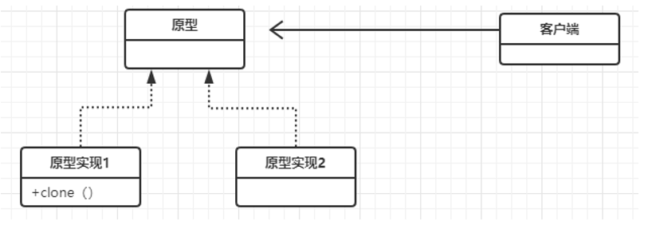

# 创建模式

<span style= "color:red">用来帮我们创建对象</span>

## 工厂模式(Factory Pattern)

```go
type Fruit interface {
	grant()
	pick()
}

type Apple struct {
	// name string
}

type Orange struct {
	// name string
}

func (a *Apple) grant() {
	fmt.Println("种植苹果")
}
func (a *Apple) pick() {
	fmt.Println("采摘苹果")
}

func (*Orange) grant() {
	fmt.Println("种植橘子")
}
func (*Orange) pick() {
	fmt.Println("采摘橘子")
}

// 多态  向上类型转换
func NewFruit(t int) Fruit {
	switch t {
	case 1:
		return &Apple{}
	case 2:
		return &Orange{}
	}
	return nil
}
func main() {
	apple := NewFruit(1)
	apple.grant()
	apple.pick()
}
```

## 单例设计模式(Singleton Pattern)

**通过单例模式可以保证系统中，应用该模式的类一个类只有一个实例。即一个类只有一个对象实例。例如：系统里面的垃圾回收器、数据库连接池等都是单例模式。**

<span style="color:red">Golang里面的单例模式是通过线程同步类，`sync.Once`来实现的</span>

```go
import (
	"fmt"
	"sync"
)

type Singleton interface {
	dosomething()
}

type singleton struct {
}

func (s *singleton) dosomething() {
	fmt.Println("do some thing")
}

var (
	once     sync.Once
	instance *singleton
)

func GetInstance() Singleton {
	once.Do(
		func() {
			instance = &singleton{}
		},
	)
	return instance
}
func main() {
	s1 := GetInstance()
	fmt.Printf("s1: %p\n", s1)
	s2 := GetInstance()
	fmt.Printf("s2: %p\n", s2)
}
```

## 抽象工厂设计模式(Abstract Factory Pattern)

```go
package main

import "fmt"

//Shape 形状接口
type Shape interface {
	Draw()
}

//Color 色彩接口
type Color interface {
	Fill()
}

//Circle 实现模型接口的圆形类
type Circle struct{}

//Square 实现模型接口的正方形类
type Square struct{}

//Draw Circle类的Draw方法
func (c Circle) Draw() {
	fmt.Println("画圆")
}

//Draw Square类的Draw方法
func (s Square) Draw() {
	fmt.Println("画正方形")
}

//Red 实现色彩接口的红色类
type Red struct{}

//Green 实现色彩接口的绿色类
type Green struct{}

//Fill 红色类的Fill方法
func (r Red) Fill() {
	fmt.Println("填充红色")
}

//Fill 绿色类的Fill方法
func (g Green) Fill() {
	fmt.Println("填充绿色")
}

//AbstractFactory 抽象工厂接口
type AbstractFactory interface {
	GetShape(shapeName string) Shape
	GetColor(colorName string) Color
}

//ShapeFactory 模型工厂的类
type ShapeFactory struct{}

//ColorFactory 色彩工厂的类
type ColorFactory struct{}

//GetShape 模型工厂实例获取模型子类的方法
func (sh ShapeFactory) GetShape(shapeName string) Shape {
	switch shapeName {
	case "circle":
		return &Circle{}
	case "square":
		return &Square{}
	default:
		return nil
	}
}

//GetColor 模型工厂实例不需要色彩方法
func (sh ShapeFactory) GetColor(colorName string) Color {
	return nil
}

//GetShape 色彩工厂实例不需要获取模型方法
func (cf ColorFactory) GetShape(shapeName string) Shape {
	return nil
}

//GetColor 色彩工厂实例，获取具体色彩子类
func (cf ColorFactory) GetColor(colorName string) Color {
	switch colorName {
	case "red":
		return &Red{}
	case "green":
		return &Green{}
	default:
		return nil
	}
}

//FactoryProducer 超级工厂类，用于获取工厂实例
type FactoryProducer struct{}

//GetFactory 获取工厂方法
func (fp FactoryProducer) GetFactory(factoryname string) AbstractFactory {
	switch factoryname {
	case "color":
		return &ColorFactory{}
	case "shape":
		return &ShapeFactory{}
	default:
		return nil
	}
}

//NewFactoryProducer 创建FactoryProducer类
func NewFactoryProducer() *FactoryProducer {
	return &FactoryProducer{}
}

func main() {

	superFactory := NewFactoryProducer()
	colorFactory := superFactory.GetFactory("color")
	shapeFactory := superFactory.GetFactory("shape")

	red := colorFactory.GetColor("red")
	green := colorFactory.GetColor("green")

	circle := shapeFactory.GetShape("circle")
	square := shapeFactory.GetShape("square")

	// 红色的圆形
	circle.Draw()
	red.Fill()

	// 绿色的方形
	square.Draw()
	green.Fill()

}
```

## 建造者模式(Builder Pattern)

```go
type Builder interface {
	BuildDisk()
	BuildeCpu()
	BuildeRom()
}

type superComputer struct{}
type miniComputer struct{}

func (*superComputer) BuildDisk() {
	fmt.Println("构建超大硬盘")
}

func (*superComputer) BuildeCpu() {
	fmt.Println("构建超大CPU")
}

func (*superComputer) BuildeRom() {
	fmt.Println("构建超大内存")
}

func (*miniComputer) BuildDisk() {
	fmt.Println("构建小型硬盘")
}
func (*miniComputer) BuildeCpu() {
	fmt.Println("构建小型CPU")
}
func (*miniComputer) BuildeRom() {
	fmt.Println("构建小型内存")
}

type Dirctor struct {
	builder Builder
}

func NewDirctor(builder Builder) *Dirctor {
	return &Dirctor{builder: builder}
}

func main() {
	sc := superComputer{}
	d := NewDirctor(&sc)
	d.builder.BuildDisk()
	d.builder.BuildeCpu()
	d.builder.BuildeRom()
	mc := miniComputer{}
	d2 := NewDirctor(&mc)
	d2.builder.BuildDisk()
	d2.builder.BuildeCpu()
	d2.builder.BuildeRom()
}
```

## 原型模式(Prototype Pattern)

原型模式用于创建重复对象。当一个类在创建时开销比较大时(比如大量数据准备，数据库连接)，我们可以缓存该对象，当下一次调用时返回改对象的克隆

用原型实例指定创建对象的种类，并且通过拷贝这些原型创建新对象。通过实现克隆clone()操作，快速和原型对象一样的实例



```go
import (
	"bytes"
	"encoding/gob"
	"fmt"
)

type Disk struct {
	Name string
}
type CPU struct {
	Name string
}

type Rom struct {
	Name string
}

type Computer struct {
	Disk Disk
	Cpu  CPU
	Rom  Rom
}

// 实现浅拷贝
func (cp *Computer) clone() *Computer {
	resume := *cp
	return &resume
}

func (s *Computer) BackUp() *Computer {
	pc := new(Computer)
	if err := deepCopy(pc, s); err != nil {
		panic(err.Error())
	}
	return pc
}
func deepCopy(dst, src interface{}) error {
	var buffer bytes.Buffer
	if err := gob.NewEncoder(&buffer).Encode((src)); err != nil {
		return err
	}
	return gob.NewDecoder(bytes.NewBuffer(buffer.Bytes())).Decode(dst)
}
func main() {
	cpu := CPU{"奔腾586"}
	rom := Rom{"金士顿"}
	disk := Disk{"三星"}

	c := Computer{
		Disk: disk,
		Cpu:  cpu,
		Rom:  rom,
	}

	c1 := c.BackUp()
	fmt.Println(*c1)
}
```

# 结构模式

<span style= "color:red">关注类和对象的结合</span>