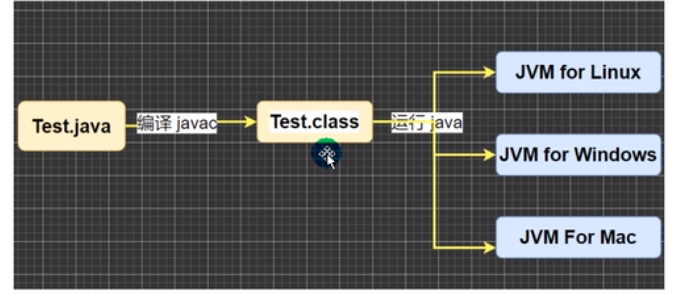
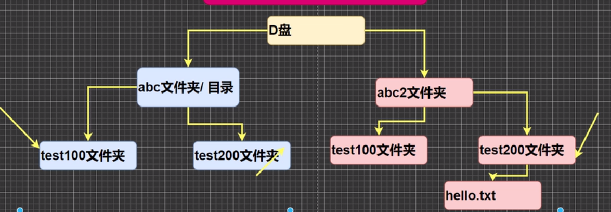
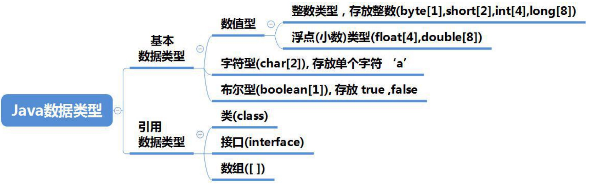
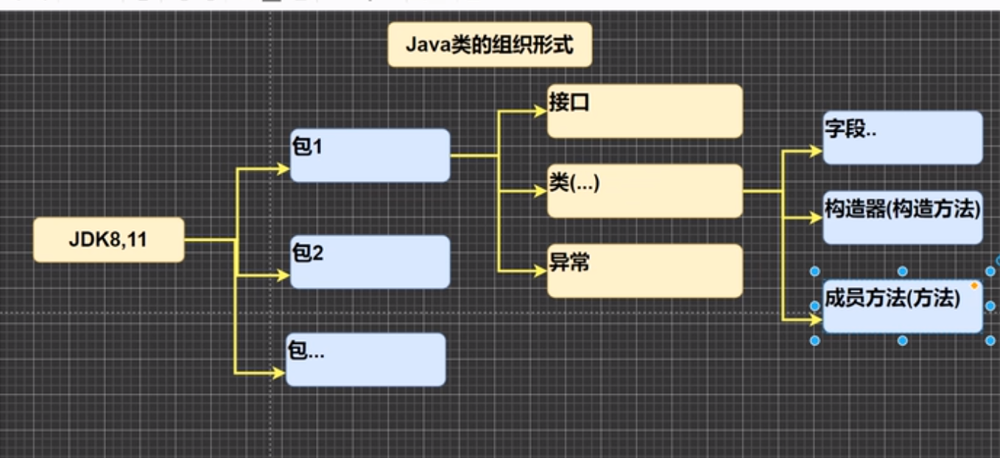
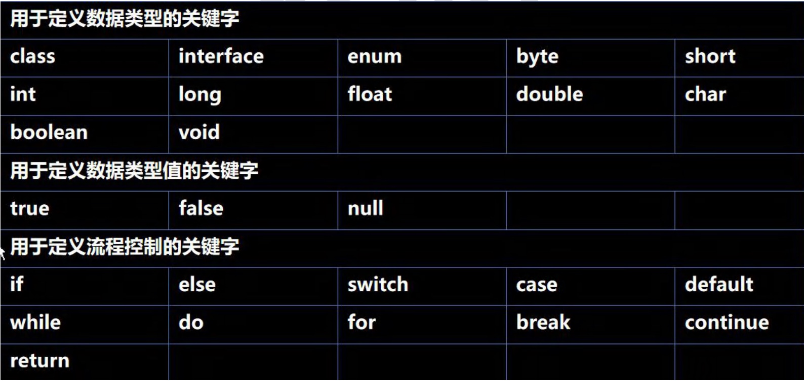
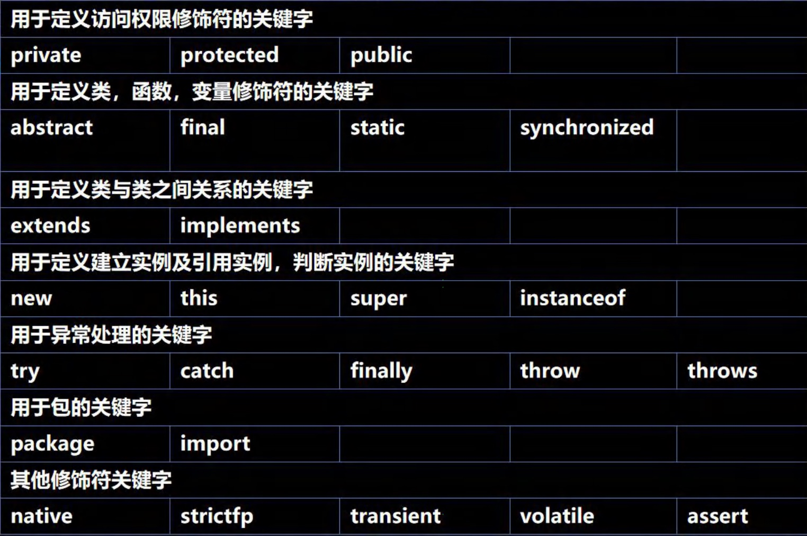
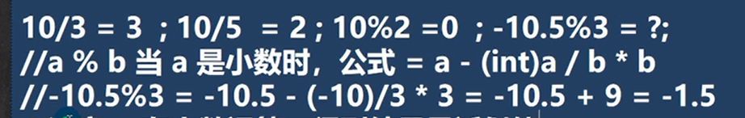
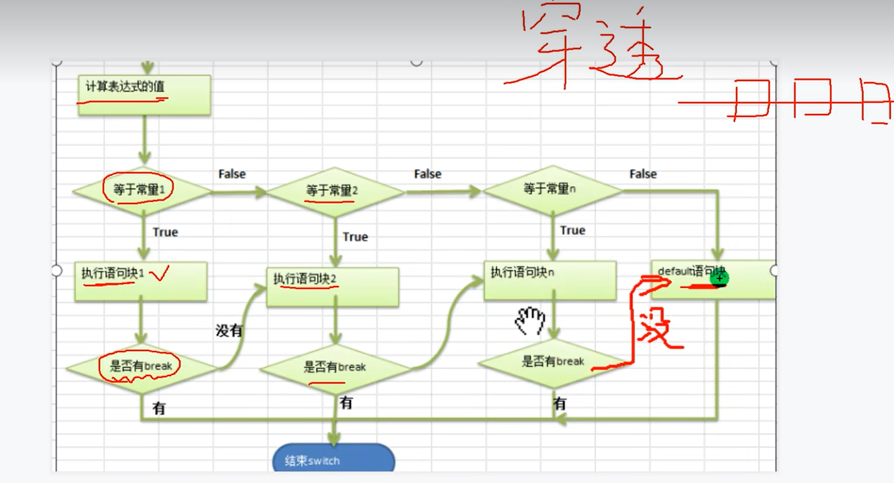

# 0.开始

## 0.1 Jdk

==JDK = JRE + java开发工具==

==JRE = JVM + 核心类库==

**Jdk**: Java Development Kit

### 卸载Jdk

java_Home  找到路径将包删除，将环境变量删除

### 安装jdk 

百度下载，双击安装

### 配置环境变量

1. 在系统变量中新建1.变量名JAVA_HOME  2.变量值jdk安装路径

2. path 中添加%JAVA_HOME%\bin     //%表示应用JAVA_HOME 的路径

cmd ->  Java -version

**Jre**:  Java Runtime  Environment
**Jvm**: Java  Virtual Machine

## 0.2 第一个程序

```java
// 这是java地快速入门 演示java地开发步骤
// 对代码的相关说明
// 1. public class Hello 表示Hello 是一个类，是一个public公有的类
// 2. Hello{}表示一个类的开始和结束
// 3.public static void main(String[] args)表示一个主方法
// 4.main(){}表示方法的开始和结束
// 5. System.out.println("hello,world~")表示输出一条”hello,world“到主屏幕
public class Hello {

    // 编写一个main方法
    public static void main(String[] args) {
        System.out.println("hello,world~")
    }
}
```

## 0.3 java编写到运行



### HelloWorld

1. 新建Hello.java文件

2. 编写代码

```java
public class Hello{
	public static void main(String[] args){
		System.out.print("Hello,World!");
	}
}
```

 ==注:==文件名必须与类名保持一致

3. 运行
   1. 在当前目录下打开cmd
   2. javac  Hello.java
   3. java  Hello.java

## 0.4java开发注意事项和细节说明

1. java源文件以.java为扩展名。源文件的基本组成部分是类（class）

2. Java应用程序的执行入口是main()方法。它有固定的书写格式：

   ```java
   public static void main(String[] args) {}
   ```

3. java语言严格区分大小写

4. java方法由一条条语句构成，缺一不可。

5. 一个源文件中最多只能有一个public类。其他类的个数不限。

6. ==如果源文件中只包含一个public类，则文件名必须按该类名命名==

7. 一个源文件中其他类的个数不限，也可以将main方法写在非public类中，然后指定运行非public 类，这样的入口方法就是非public类

## 0.5 转义字符

- \t  一个制表位，实现对齐功能
- \n  换行
- \\\  一个\
- \\"  一个" 
- \r  回车

## 0.6 注释

- 单行注释:  //注释文字
- 多行注释:  /\*注释文字\*/
- 文档注释:  

## 0.7 dos命令

+ 接受命令
+ 解析指令
+ 执行指令

### 相对路径

==从当前目录开始定位，形成的一个路径==

### 绝对路径

==从顶级目录d，开始定位，形成的路径==



**需求：从abc\test100访问hello.txt**

+ 相对路径： ..\\..\\abc2\test200\hello.txt
+ 绝对路径：d:\\abc2\test200\\hello.txt

### 常用dos命令

> 我对自己的了解如此之少，仅有的一点了解也矛盾不已

| 命令                        |                              |
| --------------------------- | ---------------------------- |
| dir                         | 列出当前目录下的文件夹       |
| md + 文件名                 | 创建文件夹                   |
| rd + 文件夹名               | 删除文件夹                   |
| cd  +  文件夹名             | 进入到一个文件夹             |
| cd..                        | 返回上级目录                 |
| cd\                         | 返回根目录                   |
| cd /d c:                    | 切换盘符                     |
| cd> a.txt                   | 创建文件                     |
| del  + 文件名               | 删除文件                     |
| d:                          | 进入d盘                      |
| cls                         | 清除屏幕                     |
| exit                        | 推出终端                     |
| ipconfig                    | 查看电脑配置                 |
| calc                        | 计算器                       |
| mspaint                     | 画图                         |
| notepad                     | 记事本                       |
| rd  /q/s ok200              | /q不询问 /s层级式   删除目录 |
| ==文件操作==                |                              |
| echo 文件名  > 指定目录文件 | 新建内容到文件               |
| copy 文件名 目录            | 复制文件（两文件同名）       |
| copy 文件名  目录\新文件名  | 复制文件（两文件不同名）     |
| move 文件名  路径           | 移动文件                     |
| del  文件名                 | 删除文件                     |
|                             |                              |
|                             |                              |
|                             |                              |

**cd(change directory)**

# 1.变量

## 1.1 变量的注意事项

1. 变量表示内存中的一个存储区域[不同的变量，类型不同，占用的空间大小不同]
2. 该区域有自己的名称[变量名]和类型[数据类型]
3. 变量必须先声明，后使用
4. 该区域的数据可以在同一类型范围内不断变化，不同类型则报错
5. **变量在同一个作用域内不能重名**
6. 变量=变量名＋值+数据类型

## 1.2 程序中+号的使用

1. 当左右两边都是数值型时，则做加法运算
2. 当左右两边有一方为字符串，则做拼接运算
3. 运算顺序从左到右

## 1.3 基本数据类型



- #### 整数类型  (byte [1]  short[2]  int[4]  long [8])

  1. Java的整型常量(具体值)**默认为 int 型**，声明long型常量须后加‘l’或‘L’
  2. java程序中变量常声明为int型，除非不足以表示大数，才使用long
  3. bit: 计算机中的最小存储单位，byte：算机中基本存储单元，1byte = 8 bit

- #### 浮点(小数)类型 (float [4]  double [8])

  1. 浮点数=符号位+指数位+尾数位

  2. 尾部可能丢失，造成精度损失

  3. Java 的浮点型常量(具体值)**默认为double型**，声明float型常量，须后加'f'或'F'

  4. 十进制数形式：5.12    512.0f    .512(必须有小数点)
     科学计数法形式：5.12e2    5.12E-2   
     
  5. ==当我们对运算结果是小数的进行相等判断时要小心==

     ```java
     double num1 = 2.7;
     double num2 = 8.1 / 3;
     System.out.println(num1);
     System.out.println(num2);
       
     if( num1 == num2) {
         // 此处判断两值不相等
         System.out.println("相等");
     }
     if(Math.abs(num1 - num2) < 0.000001){
         System.out.println("差值非常小，到我们的精度规定，认为相等...");
     }
     ```

     

- #### 字符型(Char[2])

  ```java
  public class char01 {
      public static void main(String[] args) {
          char c1 = 'a';
          char c2 = '\t';
          char c3 = '韩';
          char c4 = 97; // 字符串可以直接存放一个数字
          System.out.println(c1);
          System.out.println(c2);
          System.out.println(c3);
          System.out.println(c4);
      }
  }
  ```

  

  1. 使用单引号表示
  2. Java中还允许使用转义字符来将其后的字符转变为特殊字符型常量
  3. char的**本质是一个整数**，输出时是unicode码对应字符
  4. char类可以进行运算

- #### 布尔型(boolean[1])

  1. boolean类型数据只允许取值true和false，无null
  2. boolean类型占1个字节
  3. **不可以用0或非0的整数代替false和true，与C语言不同**
  
## 1.4 基本数据类型转换

  ### 自动类型转换

1. 转换规则：

   **<u>char<int<long<float<double</u>**

   <u>**byte<short<int<long<float<double**</u>

2. 有多种类型的数据混合运算时，系统首先自动将所有数据转换成容量最大的那种数据类型，再进行计算
3. byte    short    char    之间不会相互转换
4. **byte    short    char    计算是首先转换为int类型**
5. boolean不参与转换
6. 自动提升原则：表达式结果的类型自动提升为操作数中最大的类型

### 强制类型转换

1. 自动类型转换的逆过程，将容量大的数据类型转换为容量小的数据类型。使用时要加上强制转换符()，但可能造成精度降低或溢出，格外要注意

```java
int i = (int)8.8;
System.out.println(i);
```

2. 强转符号只针对于最近的操作数有效，往往会使用小括号提升优先级

```java
int y = int(10 * 3.5 + 6 * 1.5)
```

3. char类型可以保存 int的常量值，但不能保存int的变量值，需要强转

```java
int m = 100;
char c2 = m;//false
char c3 = (char)m; //true
```

4. **byte    short    char    类型在进行运算时，当做int类型处理**

## 1.5 基本数据类型和String类型转换

1. 基本类型转String类型

   语法：将基本类型的值 + ""

   ```java
   int n1 = 1;
   float n2 = 1.1f;
   double n3 = 3.4;
   boolean b1 = true;
   String s1 = n1 + "";
   String s2 = n2 + "";
   String s3 = n3 + "";
   String s4 = n4 + "";
   ```

2. String类型转基本数据类型
3. 语法通过基本类型的包装类调用parseXX方法

```java
String s5 = "123";
int num1 = Integer.parseInt(s5);
double num2 = Double.parseDouble(s5);
float num3 = Float.parseFloat(s5);
long num4 = Long.parseLong(s5);
byte num5 = Byte.parseByte(s5);
boolean num6 = Boolean.parseBoolean("true");
short num7 = Short.parseShort(s5);
```

4. 获得字符串的的一个字符

```java
System.out.println(s5.charAt(1));
```


## 1.6 java类的组织形式




# 2. 运算符

## 2.1 标识符的命名规则和规范

- #### 规则：

  1. 由26个英文字母大小写，0~9，\_或＄组成
  2. **数字不可开头**
  3. 不可以使用关键字和保留宇，但能包含关键字和保留字
  4. Java中严格区分大小写，长度无限制
  5. **标识符不能包含空格**

- #### 规范：

  1. 包名：多单词组成时所有字母都小写：aaa.bbb.ccc
  2. 类名、接口名：多单词组成时，所有单词的首字母大写：XxxYyyZzz==大驼峰==
  3. 变量名、方法名：多单词组成时，第一个单词首字母小写，第二个单河开始每个单词首字母大写：xxxYyyzzz==驼峰法==
  4. 常量名：所有字母都大写，多单词时每个单词用下划线连接：XXX_YYY_ZZZ

## 2.2 关键字






## 2.3 键盘输入

- #### 基本介绍：

  在编程中，需要接收用户输入的数据，就可以使用键盘输入语句来获取
  lnput.java，需要一个扫描器(对象)，就是 Scanner

- #### 步骤：

  1. 导入该类的包，java.util.*
  2. 创建该类的对象(声明变量)
  3. 调用里面的功能

```java
import java.util.Scanner;

public class Input {
    public static void main(String[] args) {
        // 演示接受用户输入
        // 步骤
        // Scanner类表示简单的文本扫描器，在java.util包
        // 1. 引入Scanner类所在的包
        // 2. 创建一个Scanner对象,new创建一个对象
        // myScanner 就是Scanner类
        Scanner myScanner = new Scanner(System.in);
        // 3. 接收用户的输入
        System.out.println("请输入名字：");
        String name = myScanner.next(); // 接收用户输入

        System.out.println("请输入年龄：");
        int age = myScanner.nextInt();

        System.out.println("请输入薪水：");
        double salary = myScanner.nextDouble();

        System.out.println("个人信息如下：");
        System.out.println("名字：" + name + " 年龄：" + age + " 薪水：" + salary);
    }
}
```

## 2.4 进制

- 二进制：0.1，满2进1，==以0b或0B开头==
- 十进制：0-9，满10进1
- 八进制：0-7，满8进1，==以数字0开头表示==
- 十六进制：0-9及A(10)-F(15)，满16进1.==以Ox或0x开头表示==，此处的A-F不区分大小写

### 其他转十进制

- 从最低位开始，将每个位上的数提取出来，乘以(几进制)的(位数-1)次方

  例：0b01011 = 1 * 2^(1-1) + 1 * 2^(2-1) + 0 * 2^(3-1) + 1 * 2^(4-1) = 1 + 2 + 0 + 8 =11

### 十进制转其他

- 将该数不断除(几进制)，直到商为0，每步余数倒写

### 二进制转八/十六

- 从低位开始，每三位一组，转成对应八进制
- 从低位开始，每四位一组，转成对应十六进制

### 八/十六进制转二

- 将八进制的每一位，转成对应的一个三位的二进制数
- 将十六进制的每一位，转成对应的一个四位的二进制数

## 2.5 原码  反码 补码

- #### 运算规则：

  1. 二进制的最高位是符号位：**0表示正数，1表示负数**
  2. **正数的原码、反码、补码都一样(三码合一)**
  3. **负数的反码 = 它的原码符号位不变，其它位取反**
  4. **负数的补码 = 它的反码+1，负数的反码 = 负数的补码 - 1**
  5. 0的反码，补码都是0
  6. java中的数都是有符号的
  7. ==计算机运算的时候，都是以补码的方式来运算的==
  8. ==看运算结果的时候，要看他的原码==

## 2.6 位运算符

- #### 位运算符

  - 按位与  &
  - 按位或  | 
  - 按位异或  ^  
  - 按位取反  ~ 
  - 算数右移  >>  低位溢出，符号位不变，并用符号位补溢出的高位(本质/2)
  - 算数左移  <<  符号位不变，低位补0(本质*2)
  - 逻辑右移  >>>  低位溢出，高位补0

- #### 位运算过程：

  1. 用原码得到补码
  2. 用补码进行相关逻辑运算
  3. 运算完毕将补码转换成原码

## 2.7 小数运算



# 3. 控制结构

## 3.1 分支控制

### 双分支

```java
if(条件表达式){
  执行代码块;
}else{
  执行代码块2;
}
```

### 多分支

```java
if(条件表达式){
  执行代码块;
}else if(条件表达式2){
  执行代码块2;
}
...
else{
  执行代码块n;
}
```

### switch分支

```java
switch(表达式){
    case 常量1:
      语句块1;
      break;
    
    case 常量2:
      语句块2;
      break;
    
    default:
      语句块;
      break;
}
```

**穿透**



案例：

```java
Scanner myScanner = new Scanner(System.in);
System.out.println("请输入一个字符（a-g）");
char c1 = myScanner.next().charAt(0);
// 在java中，只要有值返回就是一个表达式
switch(c1) {
    case 'a':
        System.out.println("今天星期一，猴子穿新衣");
        break;
    case 'b':
        System.out.println("今天星期二，猴子当小二");
        break;
    case 'c':
        System.out.println("今天星期三，猴子爬雪山");
        break;
    default:
        System.out.println("您的输入不正确");
```


