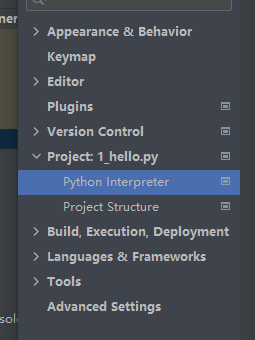
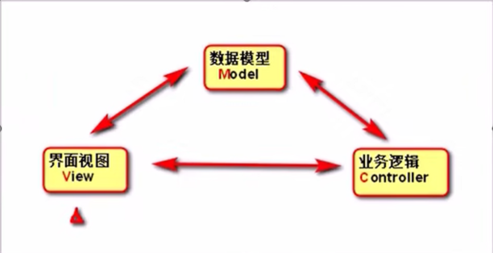

# 安装python 和pycharm

## 安装python

网址： www.python.org

点击下载windows版本

勾选 add python 3.10 to PATH  (自动添加环境变量)

检查是否安装

```cmd
cmd 窗口输入 python检查是否安装及python的版本
输入where python查看只能装路径
```

## 安装pycharm


==直接下一步，勾选上图两个方框，第一个时快捷方式，第二个是.py文件默认打开方式==

## pycharm配置python环境


==点击settings==




==第三步中只要找到python.exe的安装位置，点击ok即可==

# 虚拟环境

有时引文包的版本问题，可能会导致环境出现问题，为了不使主环境（base）环境出现问题，我们在每一个项目中创建一个虚拟环境

1. newproject

   

# print

## 基础输出

```python
# venv文件夹是该项目的虚拟环境
# 文件名数字、字母、下划线都可以，别用空格
print("Dad!")  # 单引号双引号都可以
# 退出代码为0表示没错

```

## 输出字符串

```python
# python读一行解释一行，所以不能随便换行
# """  """可以跨行打印
# ctrl + shift + F10 运行代码

print("I " + "love " + "lili")
print("我是第一行\n我是第二行")
print("""尽道隋亡为此河，
至今千里赖通波。
若无水殿龙舟事，
共禹论功不较多。""")

# sep为各数据之间如何连接，end以什么为结束，默认是换行
print(36, 37, 29, sep="=", end=".")
```

# 变量

```python
# 变量名只能用数字、字母、下滑线，但不能数字打头，不能用空格，不能用引号包裹
# 变量名是大小写敏感的
# user_name  UserName都是可以的
my_love = "13766666666"
greet = "你好，吃了吗？"
print(greet + "张三")
```

#  运算

## 数学运算

math库官方文档：https://docs.python.org/zh-cn/3/library/math.html

```python
import math  # 导入math库
result = math.log2(8)
print(result)
a = -1
b = -2
c = 3
print((-b + (b ** 2 - 4 * a * c) ** (1/2)) / (2 * a))
print((-b - math.sqrt(b ** 2 - 4 * a * c)) / (2 * a))
```

## 运算符

**1. 成员运算符**

```python
# 成员运算符
# in, not in
ages = [1, 2, 3, 4]
print(1 in ages)
```

**2.身份运算符***

```python
# 身份运算符
# 判断内存地址
# is, is not
a = 10
b = a
print(id(a))
print(id(b))
print(a is b)
print(a is not b)
```

**3. 位运算符**

```python
# & 位与， | 位或， ~ 非，  ^ 位异或， >> 右移， << 左移
```


# 注释

```python
# 单个#表示注释
# 选中一段代码ctrl + / 多行注释
# """可以用三引号来实现多行注释"""

```

# 数据类型

```python
len("hello")  # 求字符串的长度
"hello"[3]  # 返回对应位置的字符

# 布尔类型
b1 = True
b2 = False

# 空值类型
n = None

# 二进制
h = b"hello"

# 集合
set = {1, 2, 3}

# type函数
print(type(s))
print(type(b1))
print(type(n))

# id()得到内存地址
id(s)
```

# python交互模式

1. 在cmd中输入python
2. 

​    ==python console==


# input

```python
input("这里是给用户的一些提示：")

# input返回值是字符串
user_weight = float(input("请输入您的体重(单位：kg):"))
user_height = float(input("请输入您的身高(单位：m)"))
user_BMI = user_weight / (user_height) ** 2

# print只能输出字符串
print("您的BMI值为：" + str(user_BMI))
```

# 条件语句

## 单层条件

==if下可以写多行代码，但是要保证同样的缩进，否则出错==

```python
# ctrl + shift + F10 可以直接运行文件
# if下可以写多行代码，但是要保证同样的缩进，否则出错
mood_index = int(input("粒粒今天的心情指数是："))
if mood_index >= 60:
    print("恭喜，今晚应该可以打游戏，去吧皮卡丘")
    print("颜文字(✿◡‿◡)")
else:
    print("为了自个儿小命，还是别打了！")
```

## 嵌套条件语句

```python
# 如果第一个elif满足将不会继续执行同一级的elif语句
if user_BMI <= 18.5:
    print("此BMI值属于偏瘦范围")
elif 18.5 < user_BMI <= 25:
    print("此BMI值属于正常范围")
elif 25 < user_BMI <= 30:
    print("此BMI值属于偏胖范围")
else:
    print("此BMI值属于肥胖范围")
```

## 逻辑运算

```python
# （and 与）  （or 或）   （not 非）

house_work_count = int(input("本月做了多少次家务："))
red_envelope_count = int(input("本月给粒粒发了几次红包："))
shopping_count = int(input("本月陪粒粒逛街几次："))
has_been_angry = int(input("本月是否惹粒粒生气："))

if(house_work_count > 10 and red_envelope_count > 1 and shopping_count > 4 and not has_been_angry):
    print("摩拳擦掌等待switch！")
else:
    print("Switch随风散去。。。")
```


#  列表list

## 创建与操作列表

```python
shopping_list = []  # 一个方括号代表一个列表
shopping_list = ["键盘","键帽"]  # 存放数据

# append方法可以在列表中添加数据
shopping_list.append("显示器")

# python列表可以存放不同的数据 
["Hello", 66.6, True, None]

shopping_list = []
shopping_list.append("键盘")
shopping_list.append("键帽")
# remove方法可以根据值删除列表中的元素
shopping_list.remove("键帽") 
shopping_list.append("音响")
shopping_list.append("电竞椅")
shopping_list[1] = "硬盘"    # 改变列表中的值可以直接对对应位置进行赋值操作

print(shopping_list)  # ["键盘", "硬盘", "电竞椅"]
print(len(shopping_list))
print(shopping_list[0])

price = [799, 1024, 200, 800]
max_price = max(price)  # 求列表中的最大值
min_price = min(price)

# 对价格从小到大排序
sorted_price = sorted(price)
# 对价格从大到小排序
sorted_price = sorted(price, reverse = True)

print(max_price)
print(min_price)
print(sorted_price)

```

## 倒序获取列表元素

```python
# 倒序获取所有元素
for item in range(len(list02)-1, -1, -1):
    print(list02[item])
    
for item in range(-1, -len(list02)-1, -1)
	print(list02[item])
    
# 不建议用切片操作，因为复制了一遍列表
for item in list02[::-1]
	print(item)
```


## 复制列表

**在不使用任何索引的情况下，创建原列表的副本，并将副本赋给friend_foods**

```python
my_foods = ['pizza', 'falafel', 'carrot cake']
friend_foods = my_foods[:]
print(friend_foods)
friend_foods.append('ice cream')
print(friend_foods)
print(my_foods)
```

**不使用切片复制列表**

```python
friend_foods = my_foods # 行不通，这里两个变量指向的是同一个列表
```


## 列表推导式(列表解析)

==对现有的列表进行操作，生成新的列表==

==语法：==

> 变量 = [表达式 for 变量 in 可迭代对象]
>
> 变量 = [表达式 for 变量 in 可迭代对象  if 条件]

```python
# 一般for循环迭代列表
animal_park = ['Rabbit', 'Cat', 'Turtle', 'Dog', 'Kangaroo']
animal_doctor = []
for animal in animal_park:
    animal_doctor.append(animal)
print(animal_doctor)
# 使用列表推导式迭代列表
animal_doctor = [animal for animal in animal_park]
print(animal_doctor)

# 条件判断
animal_doctor = []
for animal in animal_park:
    if animal != 'cat' and animal != 'Dog'
    animal_doctor.append(animal)
print(animal_doctor)

animal_doctor = [animal for animal in animal_park if animal != 'Cat' and animal != 'Dog']
print(animal_doctor)  # ['Rabbit', 'Turtle', 'Kangaroo']
```

## 二维列表

**用for循环拿到每一行**

```python
map = [
    [2, 0, 0, 2],
    [4, 4, 2, 2],
    [2, 4, 0, 4],
    [0, 0, 2, 2],
]

# 打印每一行
for line in map:
    print(line)
```


## 方法和函数

| 方法                           | 函数               |
| ------------------------------ | ------------------ |
| 对象名.方法名(...)             | 函数名(对象)       |
| shopping_list.append("显示器") | len(shopping_list) |

==**方法**==

```python
# insert可以在指定位置插入元素，第一个参数填插入位置
list1 = ['green', 'yellow', 'blue']
list1.insert(1, 'red')  # ['green', 'red', 'yellow', 'blue']

# list.append("元素")可以追加一条数据
# list.remove("元素")可以移除一条指定数据

# pop移除指定位置的元素并返回
print(list1.pop(2))

# entend可以在列表中追加多个元素
list1.entend('black', 'white', 'pink')

# 可以使用方法sort()将列表原地排序而不需要新创建对象
a = [7, 2, 5, 1, 3]
a.sort()
print(a)
# 设置reverse =  True可以倒序
a.sort(reverse = True)

# 方法resever()可以将列表逆置
list1.reverse()

# 数值列表的方法
digits = [1, 2, 3, 4, 5, 6, 7, 8, 9, 0]
min(digits)
max(digits)
sum(digits)
```

==**函数**==

```python
# 函数sorted()函数保留原列表顺序，对列表临时排序
print(sorted(a))

# 函数len()可以用来获得列表的长度
len(a)
```


## 语句

```python
# 用del 语句删除列表中的元素
color = ['green', 'yellow', 'blue', 'black']
del color[0]
print(color)
```


## 字符串转换成大写

==列表的值是可变的，int, char, str 等是不可变的==

```python
s = "Hello"
print(s.upper())  #打印HELLO
print(s)    # 打印出s仍是Hello
s = s.upper()
print(s)    # 打印出HELLO

shopping_list = ["键盘", "键帽"]
shopping_list.append("电竞椅")
print(shopping_list) # ["键盘", "键帽", "电竞椅"]
shopping_list[1] = "硬盘"    # 改变列表中的值可以直接对对应位置进行赋值操作
print(shopping_list)  # ["键盘", "硬盘", "电竞椅"]
```


## 列表切片

```python
seq = [7, 2, 3, 7, 5, 6, 0, 1]
seq[:] # 表示从第一个元素开始到最后一个元素结束
seq[-3:] # 倒数第三个元素开始向到最后一个元素

```

==**注：**==**（切片使用来定位的）**

**1. 切片在读取时会生成一个新的列表**

```python
list_merge = line[::-1]
```

**2. 切片在写的时候不会生成新的列表**

```python
line[::-1] = list_merge
```


## 列表转字符串.join

```python
list01 = [str(item) for item in range(10)]
print(list01)

str01 = "".join(list01)
print(str01)
```

## 字符串转列表.split

```python
list01 = "102939212".split("")
```


# 元组tuple

**元组是由逗号标识的。如果要定义一个只包含一个元素的元组，必须在这个元素后面加逗号**

```python
my_t = (3,)
```


```python
# tuple
tup = (4, 5, 6)
print(tup)
# 不加小括号也可以定义一个元组
values = 1, 2, 4, 5

nested_tup = (4, 5, 6), (7, 8)
print(nested_tup)

# 用tuple可以将任意序列或迭代器转换为元组
tup1 = tuple([4, 0, 2])
print(tup1)  # (4, 0, 2)

tup2 = tuple('string')
print(tup2)  # ('s', 't', 'r', 'i', 'n', 'g')

# 使用方括号访问元组中的元素
print(tup[0], nested_tup[1], tup1[1], tup2[1])

# 元组中的对象可能是可变对象，一旦创建了元组，元组中的对象就不能修改了
tup3 = tuple(['foo', [1, 2], True])
tuple[2] = False  # 报错

# 如果元组的某个对象是可变的，可以在原位进行修改
tup3[1].append(3)
print(tup3)

# 可以用加号把元组串起来
tup4 = (4, None, 'foo') + (6, 0) + ('bar',)
print(tup4)  # (4, None, 'foo', 6, 0, 'bar')

# 元组乘一个整数
tup5 = ('foo', 'bar') * 4
print(tup5)  # ('foo', 'bar', 'foo', 'bar', 'foo', 'bar', 'foo', 'bar')
```

## 拆分元组

```python
tup = (4, 5, 6)
a, b, c = tup
print(a, b, c)  # 4 5 6

tup1 = 4, 5, (6, 7)
a, b, (c, d) = tup1
print(d)  # 7

# 变量替换
a = 1; b = 2
a, b = b, a
print(a, b)  # 2 1

# 变量拆分迭代元组或列表序列
seq =[(1, 2, 3), (4, 5, 6), (7, 8, 9)]
for a, b, c in seq:
    print(f"a={a}, b={b}, c={c}")
    
# 从元组的开头选取几个元素
values = 1, 2, 3, 4, 5
a, b, *rest = values
print(a)  # 1
print(a, b)  # 2
print(rest)  # [3, 4, 5]
```

## tuple方法

```python
# tuple方法
a = (1, 2, 2, 2, 3, 4, 2)
print(a.count(2))  # 4
```

## tuple作为函数返回值

```python
import math 
def move(x, y, step, angle=0):
    nx = x + step * math.cos(angle)
    ny = y - step * math.sin(angle)
    return nx, ny

x, y = move(100, 100, 60, math.pi/6)
print(x, y) # 151.96152422706632 70.0
```

==这其实是一种假象，python函数返回的仍然是单一值：==

```python
r = move(100, 100, 60, math.pi/6)
print(r)  # (151.96152422706632, 70.0)
```

返回值是一个tuple，但是，在语法上，返回一个tuple可以省略括号，而多个变量可以同时接收一个tuple,按位置赋给对应的值，所以，python的函数返回多值，其实就是返回一个tuple，但写起来方便

## tuple和列表可以相互转换


# 字典dict

==由键值对组成==

键(key)：值(value)

==键是不可变的，值是可变的==

```python
contacts = {"小明": "13700000000", "小花": "13700000001"}
# 获取某个键的值
print(contacts["小明"])

# 下面这种方法是不行的，因为键是不可变的，列表是可变的，故列表不能做为键
contacts = {["张伟",23]:"15000000000",
            ["张伟",34]:"15000000001"}

# 要想存多个张伟并作区分，可以用元组，tuple
# example_tuple = ("键盘", "键帽") 与列表很像，但是元组的值是不可变的
contacts = {("张伟", 23): "15000000000",
            ("张伟", 34): "15000000001"}

```


## 增加或删除键值对

==字典是可变的，可以增加或删除键值对==

```python
# 增加或删除键值对
contacts = {"小明": "13700000000", "小花": "13700000001"}
contacts["美女A"] = "13700000002"
# 查询一个键是否存在
print("小明" in "contacts")
# 删除一个键值对
del contacts["小明"]

slang_dict = {"觉醒年代": "2021热门电视剧",
              "yyds": "永远的神"}
slang_dict["双减"] = "进一步减轻义务教育阶段学生的作业负担和校外培训负担"
slang_dict["破防"] = "原指游戏中突破了对方的防御"
slang_dict["元宇宙"] = "源于小说《雪崩》的科幻概念"
slang_dict["绝绝子"] = "粉丝用绝绝子为选手加油，多用于赞美"
slang_dict["躺平"] = "面对压力时，内心无波澜，主动放弃"
slang_dict["伤害性不高，侮辱性极强"] = "一段网络视频中，两名男子互相夹菜"
slang_dict["我看不懂，但我大受震撼"] = "源自导演李安在纪录片《打扰伯格曼》"
slang_dict["强国有我"] = "源自建党百年天安门广场庆典上青年学子的庄严宣誓"

query = input("请输入您想要查询的流行语：")
if query in slang_dict:
    print("您查询的" + query + "含义如下：")
    print(slang_dict[query])
else:
    print("您查询的流行词未收录")
    print("当前本词典收录的词条数为：" + str(len(slang_dict)) + "条。")
```

## 字典的方法

### 获取所有的键

```python
temperature_dict = {"111":36.4, "112":36.6, "113":36.6 }
temperature_dict.keys() 
```

### 获取所有的值

```python
temperature_dict.values()
```

### 获取键值对

```python
temperature_dict.items()
```

### 使用get()来访问值

```python
alien_1 = {'color': 'green', 'speed': 'medium'}
```

**如果没有该键的话返回一个默认值，避免报错**

```python
point_value = alien_1.get('point', 'No point value assigned')
print(point_value)
```

## 字典推导式

```python
dict01 = {}
for item in range(1, 11):
    dict01[item] = item ** 2
print(dict01)

dict02 = {item: item ** 2 for item in range(1, 11)}
print(dict02)
```


# for循环

==for 变量名 in 可迭代对象==

```python
temperature_dict = {"111": 36.4, "112": 36.6, "113": 36.6, "114": 38 }
# 字典名.item()在for循环时键值对会被赋值为键和值组成的元组
for staff_id, temperature in temperature_dict.items():
    if temperature >= 38:
        print(staff_id)
# 打印1到30之间的奇数，第三个参数为步长
for y in range(1, 31, 2):
    print(y, end=" ")        
```

# while循环

```python
list1 = ["你", "好", "吗", "兄", "弟"]

for char in list1:
    print(char, end="")
print()

for i in range(len(list1)):
    print(list1[i], end="")
print()

i = 0
while i < len(list1):
    print(list1[i], end="")
    i += 1
print()


# 求平均值
print("哈喽呀！我是一个求平均值的程序。")
total = 0
count = 0
user_input = input("请输入数字（完成所有输入后，请输入q中止程序）")
while user_input != "q":
    num = float(user_input)
    total += num
    count += 1
    user_input = input("请输入数字（完成所有输入后，请输入q中止程序）")
if count == 0:
    result = 0
    total = 0
else:
    result = total / count
print("您输入的数字平均值为" + str(result))
```

# 迭代器和生成器

## 迭代器

==迭代器有两个基本的方法：**iter()** 和 **next()**。==

```python
# 迭代是逐个访问集合元素的一种操作
# 可迭代是对象的一种特征，如[],{},(),文件对象都是可迭代的
"""
迭代器是一个可以记住遍历的位置的对象。
迭代器对象从集合的第一个元素开始访问，直到所有的元素被访问完结束。迭代器只能往前不会后退。
"""
list1 = [1, 2, 3]
a = iter(list1)  # 创建迭代器对象
print(a)
print(next(a))  # 输出迭代器的下一个元素
```

## 生成器

==生成器是一个返回迭代器的函数，只能用于迭代操作，更简单点理解生成器就是一个迭代器。==

```python
# 特殊的迭代器
# iter1 = [i for i in range(5)]
ite1r = (i for i in range(5))
print(iter1)
print(next(iter1))

# 使用了 yield 的函数被称为生成器（generator）
# 在调用生成器运行的过程中，每次遇到 yield 时函数会暂停并保存当前所有的运行信息，
# 返回 yield 的值, 并在下一次执行 next() 方法时从当前位置继续运行。
def creat_genetator():
    my_list = range(3)
    for i in my_list:
        yield i * i

data = creat_genetator()
print(data)
print(next(data))
```


# 字符串

## 字符串常用方法

```python
name = "ada lovelace"
# 将所有字母转换为大写
print(name.upper())
# 将所有字母转换为小写
print(name.lower())
# 将首字母大写
print(name.title())
# 通过retrip()方法去掉字符串末尾的空白
favorite_language = ' python '
print(favorite_language)
favorite_language = favorite_language.rstrip()
print(favorite_language)
# 去掉开头的空白
print(favorite_language.lstrip())
# 去掉两边的空白
print(favorite_language.strip())

```


## 原始字符串

```python
a = r"\name\rank"
```


##  格式化字符串

**1. format方法格式化字符串**

```python
# 群发短信祝福
# format方法
year = input("请输入今年是什么年：")
name = input("请输入收件人姓名：")
message_content = """
律回新春，新元肇奇。
新岁甫至，福气东来。
金{0}贺岁，欢乐祥瑞。
金{0}敲门，五福临门。
给{1}及家人拜年啦！
新春快乐，{0}年大吉！
""".format(year, name)
print(message_content)

# 根据关键词指定替换的对象
message_content1 = """
律回新春，新元肇奇。
新岁甫至，福气东来。
金{current_year}贺岁，欢乐祥瑞。
金{current_year}敲门，五福临门。
给{current_name}及家人拜年啦！
新春快乐，{current_year}年大吉！
""".format(current_year=year, current_name=name)
print(message_content1)

# f-字符串
message_content2 = f"""
律回新春，新元肇奇。
新岁甫至，福气东来。
金{year}贺岁，欢乐祥瑞。
金{year}敲门，五福临门。
给{name}及家人拜年啦！
新春快乐，{year}年大吉！
"""
print(message_content2)
```

**2. 格式化数字**

```python
# 学生成绩
gpa_dict = {"小明": 3.251, "小花": 3.869, "小李": 2.683, "小张": 3.685}
for name in gpa_dict:
    print("{0}你好，你当前的绩点为：{1:.2f}".format(name, gpa_dict[name]))
   

gpa_dict = {"小明": 3.251, "小花": 3.869, "小李": 2.683, "小张": 3.685}
for name in gpa_dict:
    print(f"{name}你好，你当前的绩点为：{gpa_dict[name]:.2f}")
```

**3.占位符**

~~~python
name = "渣渣辉"
age = 50
# s = "你好，渣渣辉，年龄50，在贪玩蓝月中等你来砍我"

# %s %d %f
s = "你好，%s,年龄%d,在贪玩蓝月中等你来砍我" % (name, age)
print(s)

# format
s = "你好，{},年龄{},在贪玩蓝月中等你来砍我".format(name, age)
s = "你好，{n},年龄{a},在贪玩蓝月中等你来砍我".format(n=name, a=age)
print(s)

# b、d、o、x 分别是二进制、十进制、八进制、十六进制。
# 十进制的数一般是可以不带D的，默认就是十进制
# {2：<3}占三个位置，左对齐
str.format("{0:1}*{1:1}={2:<3}", i, j, i*j)

# f-string
s = f"你好，{name},年龄{age},在贪玩蓝月中等你来砍我"
print(s)
~~~


# 函数 don't repeat yourself

==语法：==

def 函数名(形式参数)：

​		函数体

==思想：==

+ 分而治之
+ 制作一件事


1. **调用函数，开辟一块内存空间，叫做栈帧**

   **用于存储在函数内部定义的变量**

   **函数执行完毕后，栈帧立即释放(其中定义的变量也会销毁)**

2. **传入的是可变对象**

   **函数体修改的是传入的对象**

```python
list02 = [43, 4, 5, 6, 7]


def list_ascending_sort(list01):
    for i in range(len(list01) - 1):
        for j in range(i + 1, len(list01)):
            if list01[i] < list01[j]:
                pass
            else:
                list01[j], list01[i] = list01[i], list01[j]
                # temp = list01[i]
                # list01[i] = list01[j]
                # list01[j] = temp


# 传入可变参数，修改的是传入的对象
list_ascending_sort(list02)
print(list02)
```


## 无返回值函数

如果没有return语句，函数执行完毕后也会返回结果，只是结果为None。return None可以简写为return

```python
# 计算扇形的面积
def calculate_sector(central_angle, radius):
    sector_area = central_angle / 360 * 3.14 * radius ** 2
    print(f"此扇形的面积为：{sector_area}")
calculate_sector(160, 30)
```

## 有返回值函数

```python
def calculate_BMI(weight, height):
    BMI = weight / (height ** 2)
    if BMI <= 18.5:
        category = "偏瘦"
        # print("您的BMI分类为：偏瘦")
    elif 18.5 < BMI <= 25:
        category = "正常"
        # print("您的BMI分类为：正常")
    elif 25 < BMI <= 30:
        category = "偏胖"
        # print("您的BMI分类为：偏胖")
    else:
        category = "肥胖"
    print(f"您的BMI分类为：{category}")
    return BMI

BMI = calculate_BMI(70, 1.8)
print(BMI)

# 计算中位数
def median(num_list):
    sorted_list = sorted(num_list)
    n = len(num_list)
    # 如果只有奇数个数字则取中间的数
    if n % 2 == 1:
        return sorted_list[n // 2]  ## 两个 // 表示除完之后向下取整
    # 如果一共有偶数个数字，取中间两个的平均值
    else:
        return (sorted_list[n / 2 - 1] + sorted_list[n / 2 + 1]) / 2

print(median([69, 124, -32, 27, 217]))

```

## 空函数

如果想定义一个什么事也不做的函数，可以使用pass语句

```python
def nop():
    pass
```

pass 语句什么也不做，实际上，pass可以用来作为占位符，比如现在还没想好怎么写函数的代码，就可以先放一个pass，让代码能运行起来

pass还可以放在其他语句里，比如：

```python
if age >= 18:
    pass
```

如果没有pass，代码运行就会报错


## 定义默认参数的函数

+ ==定义默认参数要牢记一点：默认参数必须指向不变对象==
+ 我们在编写程序时，如果可以设计一个不变对象，那就尽量设计成不变对象。
+ Python的函数具有非常灵活的参数形态，既可以实现简单的调用，又可以传入非常复杂的参数。
+ 默认参数一定要用不可变对象，如果是可变对象，程序运行时会有逻辑错误！
+ 要注意定义可变参数和关键字参数的语法：
+ `*args`是可变参数，args接收的是一个tuple；
+ `**kw`是关键字参数，kw接收的是一个dict。
+ 以及调用函数时如何传入可变参数和关键字参数的语法：
+ 可变参数既可以直接传入：`func(1, 2, 3)`，又可以先组装list或tuple，再通过`*args`传入：`func(*(1, 2, 3))`；
+ 关键字参数既可以直接传入：`func(a=1, b=2)`，又可以先组装dict，再通过`**kw`传入：`func(**{'a': 1, 'b': 2})`。
+ 使用`*args`和`**kw`是Python的习惯写法，当然也可以用其他参数名，但最好使用习惯用法。
+ 命名的关键字参数是为了限制调用者可以传入的参数名，同时可以提供默认值。
+ 定义命名的关键字参数在没有可变参数的情况下不要忘了写分隔符`*`，否则定义的将是位置  参数。

### 实参

```python
# 定义一个函数
def fun01(a, b, c, d):
    print(a)
    print(b)
    print(c)
    print(d)
```

1. 位置实参:实参与形参的位置依次对应


```python
fun01(1, 2, 3, 4)
```

2. 关键字实参:实参与形参根据名称对应

```python
fun01(b=1, d=2, c=3, a=4)
```

3. 序列实参：* 将序列拆分后按位置与形参进行对应
   
   如果参数很多，可以存储在序列（字符串/列表/元组）中，
   
   再通过*拆分，直接传入函数

```python
list01 = ["a", "b", "c", "d"]
# fun01(list01)
fun01(*list01)
```

4. 字典实参:**将字典拆分后按名称与形参进行对应

```python
dict01 = {"a": 1, "c": 3, "d": 4, "b": 2}
fun01(**dict01)
```

### 形参

```python
def fun01(a=0, b=0, c=0, d=0):
    print(a)
    print(b)
    print(c)
    print(d)


fun01(b=2, c=3)
```


## 作用域

在函数内部可以访问全局变量，但是要修改全局变量需要使用 ==globle==关键字


# python内置函数

## range()

~~~python
# range(start, stop, step)
# start: 计数从 start 开始。默认是从 0 开始。例如range（5）等价于range（0， 5）;
# stop: 计数到 stop 结束，但不包括 stop。例如：range（0， 5） 是[0, 1, 2, 3, 4]没有5
# step：步长，默认为1。例如：range（0， 5） 等价于 range(0, 5, 1)
~~~

## list()

```python
# list函数
tup = 1, 2, 3, 4, 5
print(list(tup))

# 实体化迭代器或生成器
gen = range(10)
print(gen)  # range(0, 10)
print(list(gen))  # [0, 1, 2, 3, 4, 5, 6, 7, 8, 9]
```

## isinstance() 

isinstance() 函数来判断一个==对象==是否是一个已知的类型，类似 type()。

**isinstance() 与 type() 区别：**

- type() 不会认为子类对象是一种父类类型，不考虑继承关系。
- isinstance() 会认为子类对象是一种父类类型，考虑继承关系。

如果要判断两个类型是否相同推荐使用 isinstance()。

```python
isinstance(object, classinfo)

a = 2
isinstance(a, int)
isinstance(a, (str, int, list))
```

## idsubclass()

判断一个类型是否属于一个类型


## strip() 和 split() 

### strip()

**函数原型**

声明：s为字符串，rm为要删除的字符序列

> s.strip(rm)    删除s字符串中开头、结尾处，位于 rm删除序列的字符

> s.lstrip(rm)   删除s字符串中开头处，位于 rm删除序列的字符

> s.rstrip(rm)   删除s字符串中结尾处，位于 rm删除序列的字符

**注意：**

+ 当rm为空时，默认删除空白符（包括'\n', '\r', '\t', ' ')

+ 这里的rm删除序列是只要边（开头或结尾）上的字符在删除序列内，就删除掉。

例如，

### split()

​    split函数通常是对字符串进行操作，操作完之后的结果，变成了一个字符串列表。split函数按照括号内给定的字符进行分割，如果括号内是空的，也就是没有指定具体的分割内容的话，那么就默认的按照空格进行分割

## zip()

zip()函数用于将可迭代对象作为参数，将对象中的元素打包成一个个元组，然后返回由这些元组组成的列表

```python
a = [1, 2, 3]
b = [4, 5, 6]

# 返回一个对象<zip object at 0x000001D843F457C0>
zipped = zip(a, b)
print(zipped)
# 可以将该对象转换为列表 [(1, 4), (2, 5), (3, 6)]
zipped = list(zipped)
print(zipped)
```

## enumerate()

enumerate() 函数用于将一个可遍历的数据对象(如列表、元组或字符串)组合为一个索引序列，同时列出数据和数据下标，一般用在 for 循环当中

```python
seq = ['one', 'two', 'three']
	for i, element in enumerate(seq):
	   print (i, element)

0 one
1 two
2 three
```


# 引入模块

## 引入模块的方法

==ctrl 点击函数名查看源代码==

模块中以单下划线开头的属性为隐藏成员，不能通过from XXX import * 导入

可以通过from XXX import _XXX导入

```python
# 方法一
import statistics
statistics.mdian([69, 124, -32, 27, 217])

# 方法二
from statistics import median, mean
print(mean([69, 124, -32, 27, 217]))

# 方法三 不推荐使用
from staticstics import *
print(mean([69, 124, -32, 27, 217]))
```

==pypi.org可以对第三方库进行搜索==

==在终端pip install 库名安装第三方库==

### 如果引发冲突

```python
import statistics as st
```


## 模块变量

### if \_\_name\_\_=='\_\_main\_\_':

```python
if __name__=='__main__':
    test()
```

当我们在命令行运行hello模块文件时，python解释器把一个特殊变量`__name__`置为`__main__`,而如果在其他地方导入该模块时，`__name__`是模块名，if判断将失败，因此，这种if测试可以让一个模块通过命令行运行时执行一些额外的代码，最常见的就是==运行测试==


### `__all__`

定义可导出成员

```python
__all__ = ["fun01", "MyCalss"]
```

### `__doc__`

可以通过该属性查看文档注释

```python
print(__doc__)
```

### `__file__`

返回当前文件的绝对路径，从系统根目录开始

```python
print(__file__)
```

## 内置模块

### time

```python
import time

# 获取当前时间戳
print(time.time())

# 时间元组
# 时间戳转换成时间元组
print(time.localtime(1668605308.1960697))

# 时间元组转换成时间戳
tuple_time = time.localtime()
print(time.mktime(tuple_time))

# 时间元组-->str
str_time01 = time.strftime("%y / %m / %d / %H:%M:%S", tuple_time)
print(str_time01)

# str --> 时间元组
tuple_time = time.strptime(str_time01, "%y / %m / %d / %H:%M:%S")
print(tuple_time)
```

### copy

1. **b = a:** 赋值引用，a 和 b 都指向同一个对象。

   

2. **b = a.copy():** 浅拷贝, a 和 b 是一个独立的对象，但他们的子对象还是指向统一对象（是引用）。

   

3. **b = copy.deepcopy(a):** 深度拷贝, a 和 b 完全拷贝了父对象及其子对象，两者是完全独立的。

   

### os模块

1. os.mkdirs()根据目录创建文件夹，exit_ok默认为False:如果文件夹存在时会抛出异常

```python
os.makedirs(os.path.join('..', 'data'), exist_ok=True)
```

2. os.path.join将路径进行拼接

```python
os.path.join('..', 'data')
```


# 包

## `__init__.py`

是包内必须存在的文件

会在包加载时被自动调用

可以配合`__all__`设置可导出的模块


# 面向对象(Object Oriented)

## 概述

面向过程：关注过程（例如：购物车）"干"

​					选择菜单-->购买-->打印商品信息-->创建订单-->...-->结算-->...

面向对象：关心解决问题的人    "找"

**OOA面向对象的分析**

**OOD面向对象的设计**

+ 从设计角度： 先有对象后又类

+ 从编码角度： 先有类后又对象

## 类和对象

1. 类： 一个==抽象的概念==，即生活中的”==类别==“
2. 对象：类的==具体实例==，即归属于某个类别的”==个体==“ 

```oython
类：类别
对象： 个体
		类与类的区别： 行为不同
		对象与对象的区别： 数据不同
语法: 
    class 类名： 
   		 def \_\_init\_\_(self, 参数)：
   		 # 数据成员
  		  self.数据1 = 参数
    # 行为成员
   		 def  方法名称()：
    		方法体
```


### 内存图


### 命名方法

**1.下划线命名法**

​	适用于变量名

​	user_name

​	total_distance

​	list_count

**2.Passcal命名法**

​	适用于类名

​	UserAccount

​	CustomerOrder

​	PermentData

### 可爱猫猫类

```python
# 可爱猫猫类
class CuteCat:
    # 接下来是一些定义类的代码
    # ...
    def __init__(self, cat_name, cat_age, cat_color):
        self.name = cat_name
        self.age = cat_age
        self.color = cat_color
    # self可以让我们获取或修改和对象绑定的属性
    def speak(self):
        # 接下来是定义方法的代码
        # ...
        print("喵" * self.age)
    def think(self, content):
        print(f"小猫{self.name}在思考{content}...")

cat1 = CuteCat("Jojo", "2", "橙色")
print(f"小猫{cat1.name}的年龄是{cat1.age}岁，花色是{cat1.color}")
cat1.think("现在去抓沙发还是去撕纸箱")
```

### 构造方法\__init__()

+ 类中的函数称为方法
+ \__init__()是一个特殊方法(也叫构造函数)，当根据CuteCat类创建新实例时，python都会运行它
+ 开头和结束的两个下划线，避免与默认方法和普通方法发生冲突
+ 形参self必不可少，==每个与实例相关联的方法调用都自动传递实参self，它是一个指向实例本身的引用，让实例能够访问类中的属性和方法 。==
+ ==self为前缀的变量可供类中的所有方法使用==
+ self.name 获取与形参name相关联的值，并将其赋给变量name，然后该变量被关联到当前创建的实例

### 实例变量

1. 语法：

   定义：对象.变量名 `self.name = name`

   调用：对象.变量名`self.name`

2. 每个对象保存一份，通过对象地址访问实例变量
3. 作用：描述所有对象共有的数据

### 实例方法

1. 语法：

   定义： def 方法名称(self, 参数列表)

   ​					方法体

   调用： 对象地址.实例方法名(参数列表)

   ​			不建议通过类名访问实例方法

2. 说明：

   至少有一个形参self,绑定调用这个方法的对象

   无论创建多少对象，方法只保存一份，并且被所有对象共享

3. 

### 类变量

1. 语法：

   + 定义： 在类中，方法外定义变量

     ​				class  类名：

     ​						变量名 = 表达式

   + 调用： 类名.变量名

     不建议通过对象访问类变量

2. 说明：
   + 存储在类中
   + 只存储一份，被所有对象共享

3. 作用：描述所有对象的公有数据


### 类方法

1. 语法：

   + 定义： 

     @classmethod

     def 方法名称(cls, 参数列表)：

     ​		方法体

   + 调用：类名.方法名(参数列表)

     不建议通过对象访问类方法

2. 说明：

   + 至少有一个形参， 第一个形参用于绑定类，一般命名为‘cls’
   + 使用@classmethod修饰的目的是调用类方法时可以隐式传递类
   + 类方法中不能访问实例变量(因为类方法没有实例对象的地址self)

```python
class Wife:

    count = 0

    def __init__(self, name, age):
        self.name = name
        self.age = age
        Wife.count += 1

    @classmethod
    def count_wife(cls):
        print("一共有", cls.count, "个老婆", end="")


Wife("石原里美", 20)
Wife("户田惠梨香", 21)

Wife.count_wife()
print("\n", Wife.count)
```


### 静态方法

==将函数移到类中（为了迎合面向对象的思想）==

**总结:**

​		实例方法：操作对象的变量

​		类方法：操作类变量

​		静态方法：既不操作对象的变量也不操作类变量

```python
"""
    在二维列表中获取指定位置，指定方向，指定数量的元素
"""

list01 = [
    ["00", "01", "02", "03"],
    ["10", "11", "12", "13"],
    ["20", "21", "22", "23"],
]

"""
    在二维列表中，获取13位置，向左，3个元素
    在二维列表中，获取22位置，向上，2个元素
    在二维列表中，获取03位置，向下，2个元素
"""


class Vector:
    """
        向量类
    """
    def __init__(self, x, y):
        """
        初始化一个向量
        :param x:
        :param y:
        """
        self.x = x
        self.y = y

    @staticmethod
    def vector_left():
        """
        向左的一个向量
        :return: 一个向左的单位向量
        """
        return Vector(0, -1)

    @staticmethod
    def vector_up():
        return Vector(-1, 0)

    @staticmethod
    def vector_down():
        return Vector(1, 0)

    @staticmethod
    def get_elements(target, position, orientation, num):
        """
        在二维列表中获取指定位置，指定方向，指定数量的元素
        :param target: 要操作的列表
        :param position: 初始位置
        :param orientation: 移动方向
        :param num: 获取元素的个数
        :return: 符合要求的列表
        """
        list02 = []
        for i in range(num):
            position.x = position.x + orientation.x
            position.y = position.y + orientation.y
            result = target[position.x][position.y]
            list02.append(result)
        return list02


vector01 = Vector(1, 3)
vector02 = Vector(2, 2)
vector03 = Vector(0, 3)

list03 = Vector.get_elements(list01, vector01, Vector.vector_left(), 3)
print(list03)
list04 = Vector.get_elements(list01, vector02, Vector.vector_up(), 2)
print(list04)
list05 = Vector.get_elements(list01, vector03, Vector.vector_down(), 2)
print(list05)

```


## 封装

1. 从数据角度(封装数据），将一些基本数据类型复合成一个自定义类型

   好处：更符合人类的思考方式

   ​			将数据与对数据的操作整合在一起

2. 从行为角度(封装行为)，向类外提供必要的功能，隐藏实现的细节

   好处：以“模块化“的方式进行编程

   ​			可以集中精力设计、组织、指挥多个类协同工作

3. <font color="red">设计角度讲</font>

   + 分而治之

     > 将一个大的需求分解为许多类，每个类处理一个独立的功能
     >
     > 拆分好处：便于分工， 便于复用，可扩展性强

   + 变则疏之

     > 变化的地方独立封装，避免影响其他类

   + 高内聚

     > 类中各个方法都在完成一项任务(单一职责的类)

   + 低耦合

     > 类与类的关联性与依赖度要低(每个类独立)，让一个类的改变，尽量不会影响其他类

### 私有成员

1. 作用：无需向类外提供的成员，可以通过私有化进行屏蔽

2. 做法：命名使用双下划线开头

3. 本质：障眼法，实际也可以访问

   ​			私有成员的名称被修改为：\_类名\_\_成员名，可以通过\_类名\_\_成员名访问

### 使用方法封装变量

==一般不用这种方法，而采用下一节的property对象方法==

```python
class Enemy:
    def __init__(self, name, hit_point, damage, defense):
        self.name = name
        self.set_hit_point(hit_point)
        self.defense = defense

    def set_hit_point(self, hit_point):
        if 100 < hit_point < 200:
            self._hit_point = hit_point
        else:
            raise ValueError("请输入100-200之间的值！")

    def get_hit_point(self):
        return self._hit_point

enemy01 = Enemy("1号", 101, 40, 30)
print(enemy01.__dict__)
```

### 属性property封装变量

==这个依然是一个过度版，最终用下一个版本==

```python
class Enemy:
    def __init__(self, name, hit_point, damage, defense):
        self.name = name
        self.hit_point = hit_point
        self.defense = defense

    def set_hit_point(self, hit_point):
        if 100 < hit_point < 200:
            self._hit_point = hit_point
        else:
            raise ValueError("请输入100-200之间的值！")

    def get_hit_point(self):
        return self._hit_point

    # 属性 property对象拦截对hit_point类变量的读写操作
    hit_point = property(get_hit_point, set_hit_point)

    
enemy01 = Enemy("1号", 101, 40, 30)
enemy01.hit_point = 150
print(enemy01.__dict__)
```


### 属性@property

​			共开的实例变量，缺少逻辑验证。私有的实例变量与两个公开的方法相结合，又使调用略显复杂。==而属性可以将两个方法的使用方式像操作变量一样方便。==

​		**定义：**

​				@property

​				def name(self):

​						return self.__name


​				@name.setter

​				def name(self, name):

​						self.__name = name

​		**调用：**

​				对象.属性名 =数据

​				变量= 对象.属性名

​		**说明：**

​				> 通常两个公开的属性，保护一个私有变量

​				> @property负责读取，@属性名.setter负责写入

​				> 只写：属性名 = property(None, 写入方法名)

```python
class Enemy:
    def __init__(self, name, hp, damage, defense):
        self.name = name
        self.hp = hp
        self.damage = damage
        self.defense = defense

    @property  # 创建property对象，只负责拦截读取操作
    def hit_point(self):
        return self.__hp

    @hit_point.setter  # 只负责拦截写操作
    def hit_point(self, value):
        if 100 < value < 200:
            self.__hp = value
        else:
            raise ValueError("请输入100-200之间的值！")

    # 属性 property对象拦截对hit_point类变量的读写操作


enemy01 = Enemy("1号", 101, 40, 30)
enemy01.hit_point = 150
print(enemy01.__dict__)
```

### \_\_slots\_\_

正常情况下，当我们定义了一个class实例后，我们可以给该实例绑定任何属性和方法，这就是动态语言的灵活性。

```python
class Student:
    pass
s = Student()
s.name = "kiko"
print(s.name)  # kiko
```

使用`__slots__`之后，限制class实例只能添加指定的属性。

```python
class Student:
    __slots__=('name', "age")
    
s = Student()
s.score = 90  # 报错
```


## 软件设计流程


## MVC架构



## 继承

### 定义

1. 重用现有类的功能与概念，并在此基础上进行扩展==统一概念==
2. 子类直接具有父类的成员(共性)还可以扩展新功能

### 继承方法

+ 子类对象可以调用子类成员，也可以调用父类成员
+ 父类可以调用父类成员，不能调用子类成员

### 继承数据

+ 子类若没有构造函数，使用父类的

+ 子类若具有构造函数，将覆盖父类的，此时必须通过super()函数调用父类的构造函数，以确保父类实例变量被正常创建

  


```python
class Vehicle:

    def __init__(self, brand, speed):
        self.brand = brand
        self.speed = speed


class Electrocar(Vehicle):

    def __init__(self, brand, speed, battery_capacity, power_of_charge):
        super().__init__(brand, speed)
        self.battery_capacity = battery_capacity
        self.power_of_charge = power_of_charge


v01= Vehicle("奔驰", 230)
print(v01.brand)
e01 = Electrocar("比亚迪", 120, 15000, 220)
print(e01.brand)
print(e01.power_of_charge)
```

>==优点==：~~一种代码复用方式~~ 
>
>==缺点==：耦合度高，父类变化，直接影响子类

### 多继承

同名方法的继承顺序(MRO,  Mrthond Resolution Order)

```python
class D(A, B):
    
    def func(self):
        self.func01()
        
d = D()
# 查看继承顺序
d.mro()
```


## 多态

### 定义

​		父类的同一种动作或者行为，在不同的子类上有不同的实现

### 作用

1. 继承将相关概念的共性进行抽象，多态在共性的基础上，体现类型的个性化(一个行为有不同实现)
2. 增强程序扩展性，体现开闭原则


**图形管理器**

```python
class GraphManager:

    def __init__(self):
        self.__graphics = []

    def add_graph(self, graph):
        self.__graphics.append(graph)

    def get_total_area(self):
        for item in self.__graphics:
            print(f"{item.__class__.__name__}", "的面积为：", item.calculate_area())


class Graph:

    def calculate_area(self):
        raise NotImplementedError


class Circle(Graph):

    pi = 3.14

    def __init__(self, radius):
        self.radius = radius

    def calculate_area(self):
        return Circle.pi * self.radius ** 2


class Rectangle(Graph):

    def __init__(self, length, width):
        self.length = length
        self.width = width

    def calculate_area(self):
        return self.length * self.width


circle = Circle(5)
rectangle = Rectangle(8, 9)
graph_manager = GraphManager()
graph_manager.add_graph(circle)
graph_manager.add_graph(rectangle)
graph_manager.get_total_area()
```


### 重写

子类实现了父类中的方法(方法名、参数)，在调用该方法的时候实际执行的是子类的方法

```python
class Things:

    def damage(self):
        # 如果子类没有该方法，报错
        raise NotImplementedError
```


## 类与类的关系

### 泛化

+ 子类与父类的关系，概念的复用，耦合度高

+ B类泛化A类，意味着B类是A类的一种
+ 做法：B类继承A类

### 关联（聚合/组合）

+ 部分与整体的关系，佛南功能的复用，变化影响一个
+ A与B关联，意味着B是A的一部分
+ 做法：在A类中包含B类成员(将B做成一个实例变量)

### 依赖

+ 合作关系，一种相对松散的协作，变化影响一个方法：
+ A类依赖B类，意味着A类的某些功能靠B类实现
+ 做法： B类型作为A类中方法的参数，并不是A的成员

## 设计原则

### 开闭原则

Open Closed Principle

对扩展开放，对修改关闭

增加新功能，不改变原有代码


### 类的单一职责(一个类的定义）

Single Responsibility Principle

一个类有且只有一个改变它的原因


### 依赖倒置(依赖抽象)

Dependency Inversion Principle

客户端代码(调用的类)尽量依赖(使用)抽象的组件：

抽象不要依赖具体

抽象是稳定的，实现是多变的


### 组合复用原则(复用的最佳实践)

Composite Reuse Principle

如果仅仅为了代码复用优先选择==组合==复用，而非继承复用

组合的耦合性相对继承低


### 里氏替换原则(继承后的重写，指导继承的设计)

Liskov Substitution Principle

父类出现的地方可以被子类替换，在替换后依然保持原功能

子类要拥有父类的所有功能

子类在重写父类方法时，尽量选择扩展重写，防止改变了功能

```python
class Employee:

    def __init__(self, basic_salary):
        self.basic_salary = basic_salary

    def calculate_salary(self):
        return self.basic_salary


class Programmer(Employee):

    def __init__(self, basic_salary, bonus):
        super().__init__(basic_salary)
        self.bonus = bonus

    def calculate_salary(self):
        return super().calculate_salary() + self.bonus
```


### 迪米特法则(类与类交互的原则)

Law of Demeter

不要和陌生人说话

类与类交互时，在满足功能要求的基础上，传递的数据量越少越好，因为这样可能降低耦合度


# 内置可重写函数

python中，以双下划线开头，双下划线结尾的是系统定义的成员。我们可以在自定义类中进行重写，从而改变其行为。

## `__str__()`

+ `__str__()`函数：将对象转换为字符串(对人友好)

  ```python
  class StudentModel:
  
      def __init__(self, name="", age=0, score=0, id=0):
          self.name = name
          self.age = age
          self.score = score
          self.id = id
  
      # 把对象变成字符串(随意格式)
      def __str__(self):
          return "我叫%s,编号是%d,年龄是%d,成绩是%d" % (self.name, self.id, self.age, self.score)
      
  s01 = StudentModel("张三", 27, 100, 101)
  str01 = str(s01)
  print(str01)
  print(s01)
  ```

## `__repr__()`

+ `__repr__()`函数：将对象转换为字符串(解释器可识别的)

  与eval()组合使用可以克隆一个对象

```python
class StudentModel:

    def __init__(self, name="", age=0, score=0, id=0):
        self.name = name
        self.age = age
        self.score = score
        self.id = id

    def __repr__(self):
        return "StudentModel('%s', %d, %d, %d)" % (self.name, self.id, self.age, self.score)
    
# repr()返回python格式的字符串
# eval根据字符串执行代码
# 克隆对象
s03 = eval(repr(s01))
print(s03)
print(type(s03))
s03.name = "李四"
```

## 运算符重载

```python 
class Vector:

    def __init__(self, x):
        self.x = x

    def __str__(self):
        return "一维向量的分量是：%d" % self.x

    def __add__(self, other):
        return Vector(self.x + other)

    def __mul__(self, other):
        return Vector(self.x * other)
```


## 反向运算符重载

重写`__iadd__`实现在原对象基础上的变化

如果不重写`__iadd__`，一般会产生新对象

```python
class Vector:

    def __init__(self, x):
        self.x = x
    
    def __radd__(self, other):
        return Vector(self.x + other)
    
print(2 + v1)
```

## 复合运算符重载

```python
class Vector:

    def __init__(self, x):
        self.x = x

    def __str__(self):
        return "一维向量的分量是：%d" % self.x

    def __add__(self, other):
        return Vector(self.x + other)
    
    def __iadd__(self, other):
        self.x += other
        return self
    
v1 = Vector(10)
print(v1, id(v1))
v1 += 5
print(v1, id(v1))
```

## `__getitem__（）`

**使用场景：**在定义类时，如果希望能按照键取类的值，则需要定义`__getitem__`方法

**目的：**如果给类定义了`__getitem__`方法，则当按照键取值时，可以直接返回`__getitem__`方法执行的结果。

```python
class Fib():               
    def __init__(self,start=0,step=1):
        self.step=step
        
    #定性__getitem__函数，key为类Fib的键
    def __getitem__(self, key): 
            a = key+self.step
            return a         
 
s=Fib()
s[1]  #返回2
```

## `__len__（）`

如果一个类表现得像一个list，要获取有多少个元素，就需要用`len()`函数	

要让`len()`函数正常工作类必须提供一个特殊的方法`__len__()`,它返回元素的个数

只要正确实现了`__len__()`方法，就可以使用`len()`函数返回Student实例的长度

```python
class Student(object):

    def __init__(self, *args):
        self.names = args

    def __len__(self):
        print(type(self.names))
        return len(self.names)


student = Student("1号", "2号", "3号")
print(len(student))
```

# 异常处理

## 异常

1. 定义： 运行时检测到的错误

2. 现象：当异常发生时，程序不会再向下执行，而转到函数的调用语句

3. 常见异常类型：

   > 名称异常（NameError）:变量未定义
   >
   > 类型异常（TypeError）:不同类型数据进行运算
   >
   > 索引异常（IndexError）:超出索引范围
   >
   > 属性异常（AttributeError）:对象没有对应名称的属性
   >
   > 键异常（KeyError）:没有对应名称的键
   >
   > 未实现异常（NotImplementedError）:尚未实现的方法
   >
   > 异常基类Exception

## 处理

1. 语法：

   try:

   ​	可能触发异常的语句

   except 错误类型1 [as 变量 1]：

   ​		处理语句 1 

   except 错误类型2 [as 变量 2]：

   ​		处理语句 2

   except Exception [as 变量 3]:

   ​		不是以上错误类型的处理语句

   else: 

   ​		未发生异常的语句

   finally:

   ​		无论是否发生异常的语句

   

2. 作用：将程序由异常状态转为正常流程。

3. 说明：

   as 子句是用于绑定错误对象的变量，可以省略

   except子句可以有一个或多个，用来捕获某种类型的错误。

   else子句最多只能有一个。

   finally子句最多只能有一个，如果没有except子句，必须存在。

   如果异常没有被捕获到，会向上层(调用处)继续传递，直到程序终止运行。

## raise语句

1. 作用：抛出一个错误，让程序进入异常状态。

2. 目的：在程序调用层数较深时，向主调函数传递错误信息要层层return 比较麻烦，所以人为抛出异常，可以直接传递错误信息。

## 自定义异常

1. 定义：   

   class 类名Error(Exception):

   ​       def __init__(self,参数):

   ​           super().__init__(参数)

   ​           self.数据 = 参数

2. 调用：

   try:

   ​		….

   ​		raise 自定义异常类名(参数)

   ​		….

​       except 定义异常类 as 变量名:

​           变量名.数据

3. 作用：封装错误信息

# 文件操作

## 读文件

**1. 基础方法：**

+ f.read()返回的是一个字符串

+ 一次调用会读取所有文件，再次调用会返回空字符串
+ read(param)  param表示一次读多少字节，下一次调用接着读取

```python
f = open(".\data.txt", "r", encoding="utf-8")
# 将文件的所有内容以字符串形式返回
content = f.read()
print(content)
f.close()
```

**2. 使用with关键字读取文件：**

+ 使用with在缩进结束时，自动关闭文件

```python
with open(".\data.txt", "r", encoding="utf-8") as f:
    content = f.read()
    print(content)
```

+ f.readline()读取一行，并返回一个字符串

```python
with open(".\data.txt", "r", encoding="utf-8") as f:
    # readline()会读取换行符
    print(f.readline(), end="")
    print(f.readline())
```

+ f.readlines()读取所有行，并返回一个列表

```python
with open(".\data.txt", "r", encoding="utf-8") as f:
    # 读取每一行返回一个列表
    print(f.readlines())
    lines = f.readlines()
    for line in lines:
        print(line)
        
        udp_socket = socket.socket(family=socket.AF_INET, type=socket.SOCK_DGRAM)
        tcp_socket = socket.socket(family=socket.AF_INET, type=socket.SOCK_STREAM)
```

## 写文件

如果写文件时。文件不存在，程序会自动创建文件

+ r+可读可写

+ w 写文件，但是会覆盖原文件

+ a 在文件末尾追加

  

# 测试

