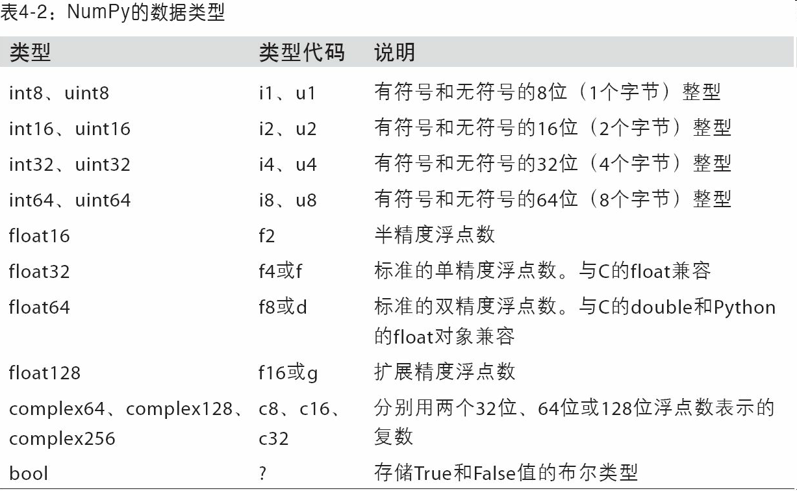
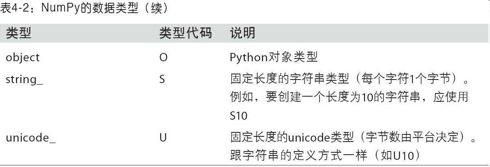

## 创建ndarray

**1. 导入numpy**

```python
import numpy as np
```

**2. 创建ndarray**

```python
data1 = [6, 7.5, 8, 0, 1]
print(data1)
arr1 = np.array(data1)
print(arr1)
```

**3. ndarray的属性**

+ ndim返回的是数组的维度

```python
print(arr2.ndim)
```

+ shape返回各维度大小的一个元组

```python
print(arr2.shape)
```

+ dtype返回数组的数据类型

```python
print(arr2.dtype)
```

**4. 创建特殊数组**

+ zeros和ones分别可以创建指定长度或形状的全0或全1数组

```python
arr3 = np.zeros(10)
np.zeros((3, 6))
```

+ empty可以创建一个没有任何具体值的数组

```python
np.empty((2, 3, 2))
```

**5. 改变数组的形状**

==数组大小没有发生变化==

```python
np.reshape((2,9))
```

**6. arange是Python内置函数range的数组版**

```python
np.arange(15)
print(np.arange(15))  # [ 0  1  2  3  4  5  6  7  8  9 10 11 12 13 14]
print(list(range(10)))  # [0, 1, 2, 3, 4, 5, 6, 7, 8, 9]
```


## ndarray的数据类型

**1. dtype（数据类型）**

==是一个特殊的对象，它包含了ndarray需要为某一种类型数据所申明的内存块的信息==

```python
arr1 = np.array([1, 2, 3], dtype=np.float64)
print(arr1.dtype)  # float64
```

**2. astype**

==通过ndarray的astype方法明确地将一个数组从一个dtype转换成另一个dtype==

```python
arr = np.array([1, 2, 3, 4, 5])
print(arr.dtype)  # int32
float_arr = arr.astype(np.float64)
print(float_arr.dtype)  # float64
```

**numpy的数据类型**





## numpy数组运算⭐️

+ 大小相等的数组之间的任何算术运算都会将运算应用到元素级

```python
arr = np.array([[1., 2., 3.], [4., 5., 6.]])  # [[1. 2. 3.]
print(arr)                                    # [4. 5. 6.]]

arr1 = arr * arr          #[4. 5. 6.]]
print(arr1)               #[16. 25. 36.]]
```

+ 数组与标量的算术运算会将标量值传播到各个元素

```python
arr3 = 1 / arr        # [[1.         0.5        0.33333333]
print(arr3)           # [0.25       0.2        0.16666667]]
```

+ 大小相同的数组之间的比较会生成布尔值数组

```python
arr4 = np.array([[0., 4., 1.], [7., 2., 12.]])
print(arr4 > arr)

"""
[[False  True False]
 [ True False  True]]
"""
```

## 基本的索引和切片

### 一维数组

**1. 一维数组创建**

```python
arr = np.arange(10)
print(arr)
arr[5:8] = 12
print((arr[5:8]))
arr_slice = arr[5:8]

```
**2.将一个标量值赋值给一个切片时（如arr[5:8]=12），该值会==自动传播==**

```python
print(arr_slice)  # [12 12 12]
arr_slice[1] = 12345
```
**3.修改arr_slice中的值，变动也会体现在原始数组arr中**

```python
print(arr_slice)  # [   12 12345    12]
print(arr)  # [    0     1     2     3     4    12 12345    12     8     9]
```
**4.切片[:]引用数组的所有值**

```python
arr_slice[:] = 64
print(arr)
```

### 二维数组

**1.  二维数组创建**
	 **在二维数组中，各索引位置上的元素不再是标量，而是一维数组**

```python
arr2d = np.array([[1, 2, 3], [4, 5, 6], [7, 8, 9]])
print(arr2d[2]) # [7 8 9]
```
**2.获取数组中的单个元素**

```python
arr2d[0][2] # 3
aee2d[0, 2] # 3
```

**3.  用arr[].copy可以将数组中的元素复制出来**

```python
arrc = arr2d[0].copy()
print(arrc)
```

### 三维数组

**1.  创建三维数组**

```python
# 下面创建一个有两个两行三列的三维数组
arr3d = np.array([[[1, 2, 3], [4, 5, 6]], [[7, 8, 9], [10, 11, 12]]])
print(arr3d)

# 创建一个有两个五行八列的三维数组
matrix_3d = np.arange(80).reshape(2, 5, 8)
print(matrix_3d)
```

**2. 获取元素**

==在多维数组中，如果省略了后面的索引，则返回对象是一个维度低一点的ndarray==

```python
print(arr3d[0]) # [[1 2 3]
                # [4 5 6]]
```

## 数组的切片索引

### 一维数组

```python
print(arr[1: 6])
```

### 二维数组

**1. 沿着第零轴切片**

```python
print(arr2d[: 2])
```

**2.  拿到前两行和后两列**

```python
print(arr2d[:2, 1:]) # [[2 3]
                     # [5 6]]

arr2d[:2, 1:] = 0  # [[1 0 0]
                   # [4 0 0]
                   # [7 8 9]]
```

**3. 切片和索引混合**

+ 行索引加列切片

  ```python
  arr2d[1, :2]  # [4, 5]
  ```

+ 行切片加列索引

  ```python
  arr2d[:2, 2]  # [3, 6]
  ```

  

==对切片的赋值也会被扩散到整个选取==

## 布尔型索引

```python
names = np.array(["Bob", "joe", "Will", "Bob", "will", "Joe", "joe"])
print(names)

# 产生一个七行四列的服从正太分布的数据
data = np.random.randn(7, 4)
print(data)
```

跟算术运算一样，数组的比较运算（如\==）也是矢量化的。因此，对names和字符串"Bob"的比较运算将会产生一个布尔型数组==这个布尔型数组可用于数组索引：==

```python
print(names == "Bob")  # [ True False False  True False False False]

# 该布尔型数组可用于数组索引
print(data[names == "Bob"])
```

要选择除"Bob"以外的其他值，==既可以使用不等于符号（!=），也可以通过~对条件进行否定==

```python
bool_array = names != "Bob"
print(bool_array)
print(data[bool_array])
print(data[~(names == "Bob")])
```

> ==：Python关键字and和or在布尔型数组中无效。要使用&与|。==

## 花式索引

## 函数

### max()

+ np.max和np.amax是同名函数

```python
amax(a, axis=None, out=None, keepdims=<no value>, initial=<no value>, where=<no value>)
```

### argmax()

**功能：返回最大值的索引**

#### 一维数组

```python
import numpy as np
numbers = np.arange(5)
print(numbers)
numbers.argmax()
```

```python
numbers.argmax()  # 4
```


#### 二维数组

```python
import numpy as np

numbers = np.arange(6).reshape(2,3)
numbers
```


**axis=0, 在列中比较，选出最大的行索引**

```python
numbers.argmax(axis=0)  # [1, 1, 1]
```

**axis=1,在行中比较，选出最大的列索引**

## 模块

### random

1. 打乱原数组的顺序

```python
np.random.shuffle(numbers)
```


