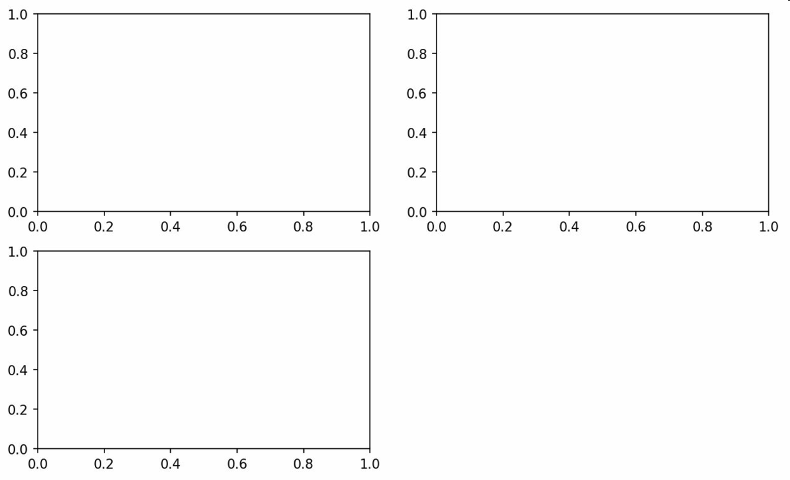

# matplotlib API入门

**matplotlib通常的引入约定：**

```python
import matplotlib.pyplot as plt
```

## Figure 和Subplot

matplotlib的图像都位于Figure对象中。相当于一个图框。

```python
fig = plt.figure()
```

```python
ax1 = fig.add_subplot(2, 2, 1)
```

上面这句代码的意思是图像是2*2的，且当前显示第一张图

下面的代码显示其他的图

```python 
 ax2 = fig.add_subplot(2, 2, 2)
 ax2 = fig.add_subplot(2, 2, 3)
```



### figure的参数


```python
x = np.linspace(-1, 1, 50)
y1 = 2 * x + 1
y2 = x ** 2

fig1 = plt.figure()
plt.plot(x, y1)

# 设置长为8高为5
fig2 = plt.figure(num=3, figsize=(8, 5))
plt.plot(x, y2)
# 设置曲线的样式
plt.plot(x, y1, color='red', linewidth=1.0, linestyle='--')
plt.show()
```

### 设置坐标轴

```python
# 设置坐标轴的范围
plt.xlim((-1, 2))
plt.ylim((-2, 3))

# 设置坐标轴的名字
plt.xlabel('I am x')
plt.ylabel('I am y')

# 设置刻度的名字
# r'$ $'是将字体变为斜体
new_ticks = np.linspace(-1, 2, 5)
print(new_ticks)
plt.xticks(new_ticks)
plt.yticks([-2, -1, 0, 1, 2, 3], [r'$relly bad$', [r'$bad$'], [r'$normal$'],
                                  [r'$good$'],
                                  [r'$great$'], [r'$relly great$']])

# 设置坐标轴的位置
# gca = 'get current axis'
ax = plt.gca()
ax.spines['right'].set_color('none')
ax.spines['top'].set_color('none')
ax.xaxis.set_ticks_position('bottom')
ax.yaxis.set_ticks_position('left')
ax.spines['bottom'].set_position(('data', -1))
ax.spines['left'].set_position(('data', 0))
```

## Legend图例

```python
x = np.linspace(-1, 1, 50)
y1 = 2 * x + 1
y2 = x ** 2


plt.figure()
plt.xlim((-1, 2))
plt.ylim((-2, 3))
plt.xlabel('I am x')
plt.ylabel('I am y')

plt.plot(x, y1, color='red', linewidth=1.0, linestyle='--', label='down')
plt.plot(x, y2, label='up')
plt.legend()

```

## 保存图片

```python
plt.savefig("../image/multiple_feature.png")
```

