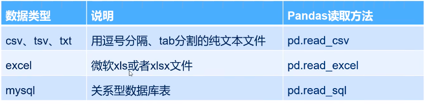
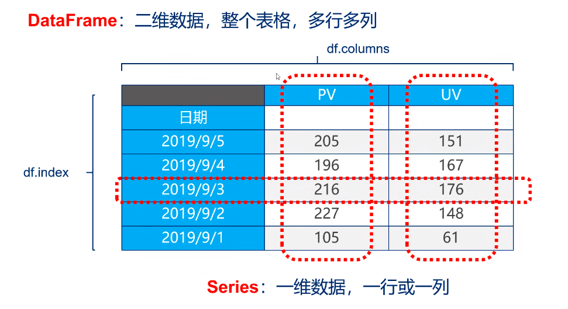
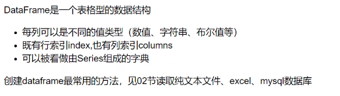
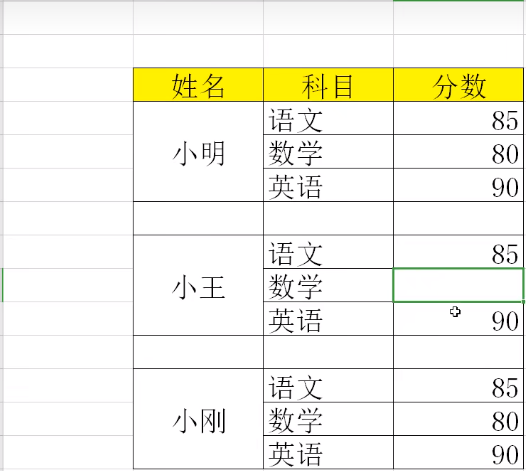
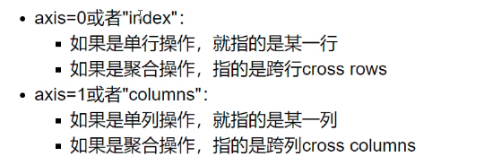
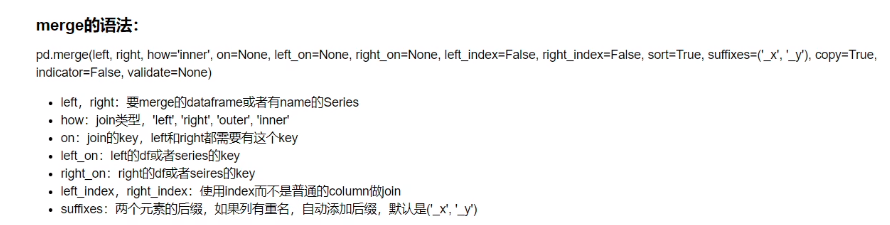

# pandas入门

## 1.导入pandas

```python
import pandas as np
from pandas import Series, DataFrame
```

## 2.pandas数据读取



<span style="color:red">csv是逗号分割的文件，tsv是tab分割的文件，txt分隔符随意
</span>

### 读取csv文件

```python
import pandas as pd

file_path = "./ratings.csv"
ratings = pd.read_csv(file_path)
print(ratings.head())
print(ratings.shape)
print(ratings.columns)
print(ratings.index)
print(ratings.dtypes)
```

+ `ratings.shape`查看文件的形状
+ `ratings.columns`查看文件的列名
+ `ratings.index`查看文件的行号
+ `ratings.dtype`查看每一列的数据类型

### 读取txt文件

```python
file_path = "./access_pvuv.txt"

pvuv = pd.read_csv(file_path, sep="\t", header None, names=["date", "pv", "uv"])
```

+ sep指定文件的分隔符
+ header设置为None代表该文件没有列名
+ names可以自己设置列名

### 读取excel文件

```python
file_path = "./filename.xlsx"
filename = pd.read_excel(file_path)
```

### 读取mysql数据库

```python
import pymysql
conn = pymysql.connect(
	host = "127.0.0.1",
    user= "root",
    password= "123456",
    database = "test",
    charset= "utf8"
)

mysql_page = pd.read_sql("select * from filename", con = conn)
```

## 3.pandas数据结构



### series

**series是一种类似于一维数组的对象，它由一组数据(不同数据类型)以及一组与之相关的数据标签(即索引)组成**


#### 创建

1. 仅由数据列表即可产生最简单的series

```python
s1 = pd.Series([1, "a", 5.2, 7])

s1.index

s1.value
```

+ index获取索引
+ value获取数据


2. 创建一个具有标签索引的Series

```python
s2 = pd.Series([1, "a", 5.2, 7], index=['a', 'b', 'c', 'd'])
```


3. 使用python字典创建Series

```python
sdata={"键盘": 200, "鼠标":50, "耳机":100}
pd.Series(sdata)
```

#### 查询

```python
s2['a']
type(s2["a"]) //查询到的是python的数据类型

s2[["b", "a"]]  //查询到的是Series
```

### DataFrame



#### 创建

1. 根据多个字典序列创建dataframe

```python
data = {
    "state": ["Ohio", "Ohio", "Ohio", "Nevada", "Nevada"],
    "year": [2000, 2001, 2002, 2001, 2002],
    "pop": [1.5, 1.7, 3.6, 2.4, 2.9]
}

df = pd.DataFrame(data)
print(df)

print(df.dtypes)
print(df.columns)
print(df.index)
```

### 查询

+ 如果只查询一行、一列，返回的是pd.Series
+ 如果查询多行、多列，返回的是pd.DataFrame


1. 查询列

```python
df["year"]

df[["yeat", "pop"]]
```

2. 查询行

```python
df.loc[1]

df.loc[1:3]
```

## 4.pandas查询数据

### pandas查询数据的几种方法

1. df.loc方法,根据行、列的标签值查询

2. df.iloc方法，根据行、列的数字位置查询

3. df.where方法

4. df.query方法

   

## 5.df.loc

### 设置索引

```python
df.set_index("stu_id", inplace=True)
```

### 改变列名

```python
df.columns = ["A", "B"]

df.rename(columns={"a":"A"}, inplace=True)
```


### 替换掉温度的后缀℃

```python
df.loc[:,"wendu"] = df["wendu"].str.rereplace("℃", "").astype("int32")
```

### 使用单个label值查询数据

行或列，都可以只传入单个值，实现精确匹配

```python
df.loc["2018-01-01", "bwendu"]
```

### 使用值列表批量查询

```python
df.loc[['2018-01-03'],["bwendu", "ywendu"]]
```

### 使用数值区间进行查询

```python
df.loc["2018-01-03":"2018-01-06","bwendu":"fengxiang"]
```

### 使用条件表达式查询

```python
df.loc.[df["ywendu"]<-10, :]
```

## 6.pandas新增数据列

## 7.pandas数据统计函数

## 8.pandas对缺失值的处理



### isnull和notnull检测是否是空值

```python
stu = pd.read_excel("./student_excel.xlsx", skiprows=2)  //skiprows=2跳过excel前两行

stu.isnull()
```

### dropna丢弃、删除缺失值

1. 删除全是空值的列

```python
stu.dropna(axis="columns", how="all", inplace=True)
```

2. 删除掉全是空值的行

```python
stu.dropna(axis="index", how="all", inplace= True)
```


### fillna填充空值

1. 将分数列为空的填充为0

```python
stu.fillna({"分数":0})
stu.loc[:,"分数"] = stu["分数"].fillna(0)
```

2. 将姓名值的缺失值填充

```python
stu.loc[:, "姓名"] = stu["姓名"].fillna(method="ffill")  // forward fill使用前面的值进行填充
```

### 将清洗好的excel保存

```python
stu.to_excel("./datas/student_excel_clean.xlsx", index=False)  //不要自动生成的index
```

## 9.pandas数据排序


## 10.字符串处理

## 11. pandas的axis参数



## 12.pandas的索引index的用途

## 13.pandas怎样实现数据的merge



```python
import pandas as pd
ratings = pd.read_csv(
    "./ratings.dat",
    sep="::",
    engine="python",
    names=["UserID", "MovieID", "Rating", "Timestamp"]
)

users = pd.read_csv(
    "./users.dat",
    sep="::",
    engine="python",
    names=["UserID", "Gender", "Age", "Occupation", "Zip-code"]
)

movies = pd.read_csv(
    "./movies.dat",
    sep="::",
    engine="python",
    names=["MovieID", "Title", "Genres"]
)

df_ratings_Users = pd.merge(
    ratings, users, left_on="UserID", right_on="UserID", how="inner"
)

df_ratings_Users_movies = pd.merge(
    df_ratings_Users, movies, left_on="MovieID", right_on="MovieID", how="inner"
)
```


**如果出现非key字段重名怎么办**

```python
left = pd.DataFrame()
```

