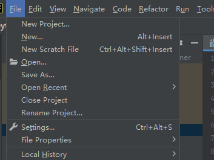
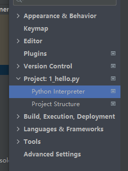
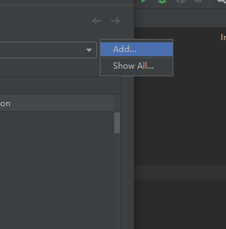
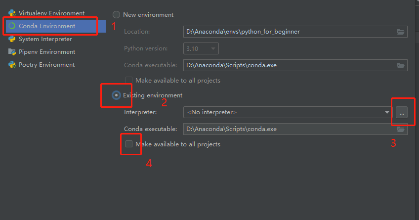
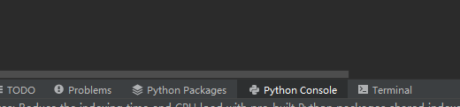

## 安装python 和pycharm

### 安装python

网址： www.python.org

点击下载windows版本

勾选 add python 3.10 to PATH  (自动添加环境变量)

检查是否安装

```cmd
cmd 窗口输入 python检查是否安装及python的版本
输入where python查看只能装路径
```

### 安装pycharm


==直接下一步，勾选上图两个方框，第一个时快捷方式，第二个是.py文件默认打开方式==

### pycharm配置python环境



==点击settings==







==第三步中只要找到python.exe的安装位置，点击ok即可==

## print

### 基础输出

```python
# venv文件夹是该项目的虚拟环境
# 文件名数字、字母、下划线都可以，别用空格
print("Dad!")  # 单引号双引号都可以
# 退出代码为0表示没错

```

### 输出字符串

```python
# python读一行解释一行，所以不能随便换行
# """  """可以跨行打印
# ctrl + shift + F10 运行代码

print("I " + "love " + "lili")
print("我是第一行\n我是第二行")
print("""尽道隋亡为此河，
至今千里赖通波。
若无水殿龙舟事，
共禹论功不较多。""")

# sep为各数据之间如何连接，end以什么为结束，默认是换行
print(36, 37, 29, sep="=", end=".")
```

## 变量

```python
# 变量名只能用数字、字母、下滑线，但不能数字打头，不能用空格，不能用引号包裹
# 变量名是大小写敏感的
# user_name  UserName都是可以的
my_love = "13766666666"
greet = "你好，吃了吗？"
print(greet + "张三")
```

##  数学运算

math库官方文档：https://docs.python.org/zh-cn/3/library/math.html

```python
import math  # 导入math库
result = math.log2(8)
print(result)
a = -1
b = -2
c = 3
print((-b + (b ** 2 - 4 * a * c) ** (1/2)) / (2 * a))
print((-b - math.sqrt(b ** 2 - 4 * a * c)) / (2 * a))
```

## 注释

```python
# 单个#表示注释
# 选中一段代码ctrl + / 多行注释
# """可以用三引号来实现多行注释"""

```

## 数据类型

```python
len("hello")  # 求字符串的长度
"hello"[3]  # 返回对应位置的字符

# 布尔类型
b1 = True
b2 = False

# 空值类型
n = None

# 二进制
h = b"hello"

# 集合
set = {1, 2, 3}

# type函数
print(type(s))
print(type(b1))
print(type(n))

# id()得到内存地址
id(s)
```

## python交互模式

1. 在cmd中输入python
2. 

​    ==python console==


## input

```python
input("这里是给用户的一些提示：")

# input返回值是字符串
user_weight = float(input("请输入您的体重(单位：kg):"))
user_height = float(input("请输入您的身高(单位：m)"))
user_BMI = user_weight / (user_height) ** 2

# print只能输出字符串
print("您的BMI值为：" + str(user_BMI))
```

## 条件语句

### 单层条件

==if下可以写多行代码，但是要保证同样的缩进，否则出错==

```python
# ctrl + shift + F10 可以直接运行文件
# if下可以写多行代码，但是要保证同样的缩进，否则出错
mood_index = int(input("粒粒今天的心情指数是："))
if mood_index >= 60:
    print("恭喜，今晚应该可以打游戏，去吧皮卡丘")
    print("颜文字(✿◡‿◡)")
else:
    print("为了自个儿小命，还是别打了！")
```

### 嵌套条件语句

```python
# 如果第一个elif满足将不会继续执行同一级的elif语句
if user_BMI <= 18.5:
    print("此BMI值属于偏瘦范围")
elif 18.5 < user_BMI <= 25:
    print("此BMI值属于正常范围")
elif 25 < user_BMI <= 30:
    print("此BMI值属于偏胖范围")
else:
    print("此BMI值属于肥胖范围")
```

## 逻辑运算

```python
# （and 与）  （or 或）   （not 非）

house_work_count = int(input("本月做了多少次家务："))
red_envelope_count = int(input("本月给粒粒发了几次红包："))
shopping_count = int(input("本月陪粒粒逛街几次："))
has_been_angry = int(input("本月是否惹粒粒生气："))

if(house_work_count > 10 and red_envelope_count > 1 and shopping_count > 4 and not has_been_angry):
    print("摩拳擦掌等待switch！")
else:
    print("Switch随风散去。。。")
```


##  列表list

```python
shopping_list = []  # 一个方括号代表一个列表
shopping_list = ["键盘","键帽"]  # 存放数据

# append方法可以在列表中添加数据
shopping_list.append("显示器")

# python列表可以存放不同的数据 
["Hello", 66.6, True, None]

shopping_list = []
shopping_list.append("键盘")
shopping_list.append("键帽")
# remove方法可以根据值删除列表中的元素
shopping_list.remove("键帽") 
shopping_list.append("音响")
shopping_list.append("电竞椅")
shopping_list[1] = "硬盘"    # 改变列表中的值可以直接对对应位置进行赋值操作

print(shopping_list)  # ["键盘", "硬盘", "电竞椅"]
print(len(shopping_list))
print(shopping_list[0])

price = [799, 1024, 200, 800]
max_price = max(price)  # 求列表中的最大值
min_price = min(price)

# 对价格从小到大排序
sorted_price = sorted(price)
# 对价格从大到小排序
sorted_price = sorted(price, reverse = True)

print(max_price)
print(min_price)
print(sorted_price)

```

### 复制列表

**在不使用任何索引的情况下，创建原列表的副本，并将副本赋给friend_foods**

```python
my_foods = ['pizza', 'falafel', 'carrot cake']
friend_foods = my_foods[:]
print(friend_foods)
friend_foods.append('ice cream')
print(friend_foods)
print(my_foods)
```

**不使用切片复制列表**

```python
friend_foods = my_foods # 行不通，这里两个变量指向的是同一个列表

```


### 列表推导式(列表解析)

==对现有的列表进行操作，生成新的列表==

```python
# 一般for循环迭代列表
animal_park = ['Rabbit', 'Cat', 'Turtle', 'Dog', 'Kangaroo']
animal_doctor = []
for animal in animal_park:
    animal_doctor.append(animal)
print(animal_doctor)
# 使用列表推导式迭代列表
animal_doctor = [animal for animal in animal_park]
print(animal_doctor)

# 条件判断
animal_doctor = []
for animal in animal_park:
    if animal != 'cat' and animal != 'Dog'
    animal_doctor.append(animal)
print(animal_doctor)

animal_doctor = [animal for animal in animal_park if animal != 'Cat' and animal != 'Dog']
print(animal_doctor)  # ['Rabbit', 'Turtle', 'Kangaroo']
```


### 方法和函数

| 方法                           | 函数               |
| ------------------------------ | ------------------ |
| 对象名.方法名(...)             | 函数名(对象)       |
| shopping_list.append("显示器") | len(shopping_list) |

==**方法**==

```python
# insert可以在指定位置插入元素
list1 = ['green', 'yellow', 'blue']
list1.insert(1, 'red')  # ['green', 'red', 'yellow', 'blue']

# pop移除指定位置的元素并返回
print(list1.pop(2))

# entend可以在列表中追加多个元素
list1.entend('black', 'white', 'pink')

# 可以使用方法sort()将列表原地排序而不需要新创建对象
a = [7, 2, 5, 1, 3]
a.sort()
print(a)
# 设置reverse =  True可以倒序
a.sort(reverse = True)

# 方法resever()可以将列表逆置
list1.reverse()

# 数值列表的方法
digits = [1, 2, 3, 4, 5, 6, 7, 8, 9, 0]
min(digits)
max(digits)
sum(digits)
```

==**函数**==

```python
# 函数sorted()函数保留原列表顺序，对列表临时排序
print(sorted(a))

# 函数len()可以用来获得列表的长度
len(a)
```


### 语句

```python
# 用del 语句删除列表中的元素
color = ['green', 'yellow', 'blue', 'black']
del color[0]
print(color)
```


### 字符串转换成大写

==列表的值是可变的，int, char, str 等是不可变的==

```python
s = "Hello"
print(s.upper())  #打印HELLO
print(s)    # 打印出s仍是Hello
s = s.upper()
print(s)    # 打印出HELLO

shopping_list = ["键盘", "键帽"]
shopping_list.append("电竞椅")
print(shopping_list) # ["键盘", "键帽", "电竞椅"]
shopping_list[1] = "硬盘"    # 改变列表中的值可以直接对对应位置进行赋值操作
print(shopping_list)  # ["键盘", "硬盘", "电竞椅"]
```


### 列表切片

```python
seq = [7, 2, 3, 7, 5, 6, 0, 1]
seq[:] # 表示从第一个元素开始到最后一个元素结束
seq[-3:] # 倒数第三个元素开始向到最后一个元素

```


## 元组tuple

**元组是由逗号标识的。如果要定义一个只包含一个元素的元组，必须在这个元素后面加逗号**

```python
my_t = (3,)
```


```python
# tuple
tup = (4, 5, 6)
print(tup)
# 不加小括号也可以定义一个元组
values = 1, 2, 4, 5

nested_tup = (4, 5, 6), (7, 8)
print(nested_tup)

# 用tuple可以将任意序列或迭代器转换为元组
tup1 = tuple([4, 0, 2])
print(tup1)  # (4, 0, 2)

tup2 = tuple('string')
print(tup2)  # ('s', 't', 'r', 'i', 'n', 'g')

# 使用方括号访问元组中的元素
print(tup[0], nested_tup[1], tup1[1], tup2[1])

# 元组中的对象可能是可变对象，一旦创建了元组，元组中的对象就不能修改了
tup3 = tuple(['foo', [1, 2], True])
tuple[2] = False  # 报错

# 如果元组的某个对象是可变的，可以在原位进行修改
tup3[1].append(3)
print(tup3)

# 可以用加号把元组串起来
tup4 = (4, None, 'foo') + (6, 0) + ('bar',)
print(tup4)  # (4, None, 'foo', 6, 0, 'bar')

# 元组乘一个整数
tup5 = ('foo', 'bar') * 4
print(tup5)  # ('foo', 'bar', 'foo', 'bar', 'foo', 'bar', 'foo', 'bar')
```

### 拆分元组

```python
tup = (4, 5, 6)
a, b, c = tup
print(a, b, c)  # 4 5 6

tup1 = 4, 5, (6, 7)
a, b, (c, d) = tup1
print(d)  # 7

# 变量替换
a = 1; b = 2
a, b = b, a
print(a, b)  # 2 1

# 变量拆分迭代元组或列表序列
seq =[(1, 2, 3), (4, 5, 6), (7, 8, 9)]
for a, b, c in seq:
    print(f"a={a}, b={b}, c={c}")
    
# 从元组的开头选取几个元素
values = 1, 2, 3, 4, 5
a, b, *rest = values
print(a)  # 1
print(a, b)  # 2
print(rest)  # [3, 4, 5]
```

### tuple方法

```python
# tuple方法
a = (1, 2, 2, 2, 3, 4, 2)
print(a.count(2))  # 4
```


## 字典dict

==由键值对组成==

键(key)：值(value)

==键是不可变的，值是可变的==

```python
contacts = {"小明": "13700000000", "小花": "13700000001"}
# 获取某个键的值
print(contacts["小明"])

# 下面这种方法是不行的，因为键是不可变的，列表是可变的，故列表不能做为键
contacts = {["张伟",23]:"15000000000",
            ["张伟",34]:"15000000001"}

# 要想存多个张伟并作区分，可以用元组，tuple
# example_tuple = ("键盘", "键帽") 与列表很像，但是元组的值是不可变的
contacts = {("张伟", 23): "15000000000",
            ("张伟", 34): "15000000001"}

```


### 增加或删除键值对

==字典是可变的，可以增加或删除键值对==

```python
# 增加或删除键值对
contacts = {"小明": "13700000000", "小花": "13700000001"}
contacts["美女A"] = "13700000002"
# 查询一个键是否存在
print("小明" in "contacts")
# 删除一个键值对
del contacts["小明"]

slang_dict = {"觉醒年代": "2021热门电视剧",
              "yyds": "永远的神"}
slang_dict["双减"] = "进一步减轻义务教育阶段学生的作业负担和校外培训负担"
slang_dict["破防"] = "原指游戏中突破了对方的防御"
slang_dict["元宇宙"] = "源于小说《雪崩》的科幻概念"
slang_dict["绝绝子"] = "粉丝用绝绝子为选手加油，多用于赞美"
slang_dict["躺平"] = "面对压力时，内心无波澜，主动放弃"
slang_dict["伤害性不高，侮辱性极强"] = "一段网络视频中，两名男子互相夹菜"
slang_dict["我看不懂，但我大受震撼"] = "源自导演李安在纪录片《打扰伯格曼》"
slang_dict["强国有我"] = "源自建党百年天安门广场庆典上青年学子的庄严宣誓"

query = input("请输入您想要查询的流行语：")
if query in slang_dict:
    print("您查询的" + query + "含义如下：")
    print(slang_dict[query])
else:
    print("您查询的流行词未收录")
    print("当前本词典收录的词条数为：" + str(len(slang_dict)) + "条。")
```

### 字典的三个方法

```python
temperature_dict = {"111":36.4, "112":36.6, "113":36.6 }
temperature_dict.keys()    #所有键
temperature_dict.values()  #所有值
temperature_dict.items()   #所有键值对
```


## for循环

==for 变量名 in 可迭代对象==

```python
temperature_dict = {"111": 36.4, "112": 36.6, "113": 36.6, "114": 38 }
# 字典名.item()在for循环时键值对会被赋值为键和值组成的元组
for staff_id, temperature in temperature_dict.items():
    if temperature >= 38:
        print(staff_id)
# 打印1到30之间的奇数，第三个参数为步长
for y in range(1, 31, 2):
    print(y, end=" ")        
```

## while循环

```python
list1 = ["你", "好", "吗", "兄", "弟"]

for char in list1:
    print(char, end="")
print()

for i in range(len(list1)):
    print(list1[i], end="")
print()

i = 0
while i < len(list1):
    print(list1[i], end="")
    i += 1
print()


# 求平均值
print("哈喽呀！我是一个求平均值的程序。")
total = 0
count = 0
user_input = input("请输入数字（完成所有输入后，请输入q中止程序）")
while user_input != "q":
    num = float(user_input)
    total += num
    count += 1
    user_input = input("请输入数字（完成所有输入后，请输入q中止程序）")
if count == 0:
    result = 0
    total = 0
else:
    result = total / count
print("您输入的数字平均值为" + str(result))
```

## 迭代器和生成器

### 迭代器

==迭代器有两个基本的方法：**iter()** 和 **next()**。==

```python
# 迭代是逐个访问集合元素的一种操作
# 可迭代是对象的一种特征，如[],{},(),文件对象都是可迭代的
"""
迭代器是一个可以记住遍历的位置的对象。
迭代器对象从集合的第一个元素开始访问，直到所有的元素被访问完结束。迭代器只能往前不会后退。
"""
list1 = [1, 2, 3]
a = iter(list1)  # 创建迭代器对象
print(a)
print(next(a))  # 输出迭代器的下一个元素
```

### 生成器

==生成器是一个返回迭代器的函数，只能用于迭代操作，更简单点理解生成器就是一个迭代器。==

```python
# 特殊的迭代器
# iter1 = [i for i in range(5)]
ite1r = (i for i in range(5))
print(iter1)
print(next(iter1))

# 使用了 yield 的函数被称为生成器（generator）
# 在调用生成器运行的过程中，每次遇到 yield 时函数会暂停并保存当前所有的运行信息，
# 返回 yield 的值, 并在下一次执行 next() 方法时从当前位置继续运行。
def creat_genetator():
    my_list = range(3)
    for i in my_list:
        yield i * i

data = creat_genetator()
print(data)
print(next(data))
```


## 字符串

### 字符串常用方法

```python
name = "ada lovelace"
# 将所有字母转换为大写
print(name.upper())
# 将所有字母转换为小写
print(name.lower())
# 将首字母大写
print(name.title())
# 通过retrip()方法去掉字符串末尾的空白
favorite_language = ' python '
print(favorite_language)
favorite_language = favorite_language.rstrip()
print(favorite_language)
# 去掉开头的空白
print(favorite_language.lstrip())
# 去掉两边的空白
print(favorite_language.strip())

```

###  格式化字符串

**1. format方法格式化字符串**

```python
# 群发短信祝福
# format方法
year = input("请输入今年是什么年：")
name = input("请输入收件人姓名：")
message_content = """
律回新春，新元肇奇。
新岁甫至，福气东来。
金{0}贺岁，欢乐祥瑞。
金{0}敲门，五福临门。
给{1}及家人拜年啦！
新春快乐，{0}年大吉！
""".format(year, name)
print(message_content)

# 根据关键词指定替换的对象
message_content1 = """
律回新春，新元肇奇。
新岁甫至，福气东来。
金{current_year}贺岁，欢乐祥瑞。
金{current_year}敲门，五福临门。
给{current_name}及家人拜年啦！
新春快乐，{current_year}年大吉！
""".format(current_year=year, current_name=name)
print(message_content1)

# f-字符串
message_content2 = f"""
律回新春，新元肇奇。
新岁甫至，福气东来。
金{year}贺岁，欢乐祥瑞。
金{year}敲门，五福临门。
给{name}及家人拜年啦！
新春快乐，{year}年大吉！
"""
print(message_content2)
```

**2. 格式化数字**

```python
# 学生成绩
gpa_dict = {"小明": 3.251, "小花": 3.869, "小李": 2.683, "小张": 3.685}
for name in gpa_dict:
    print("{0}你好，你当前的绩点为：{1:.2f}".format(name, gpa_dict[name]))
   

gpa_dict = {"小明": 3.251, "小花": 3.869, "小李": 2.683, "小张": 3.685}
for name in gpa_dict:
    print(f"{name}你好，你当前的绩点为：{gpa_dict[name]:.2f}")
```

## 函数 don't repeat yourself

### 无返回值函数

```python
# 计算扇形的面积
def calculate_sector(central_angle, radius):
    sector_area = central_angle / 360 * 3.14 * radius ** 2
    print(f"此扇形的面积为：{sector_area}")
calculate_sector(160, 30)
```

### 有返回值函数

```python
def calculate_BMI(weight, height):
    BMI = weight / (height ** 2)
    if BMI <= 18.5:
        category = "偏瘦"
        # print("您的BMI分类为：偏瘦")
    elif 18.5 < BMI <= 25:
        category = "正常"
        # print("您的BMI分类为：正常")
    elif 25 < BMI <= 30:
        category = "偏胖"
        # print("您的BMI分类为：偏胖")
    else:
        category = "肥胖"
    print(f"您的BMI分类为：{category}")
    return BMI

BMI = calculate_BMI(70, 1.8)
print(BMI)

# 计算中位数
def median(num_list):
    sorted_list = sorted(num_list)
    n = len(num_list)
    # 如果只有奇数个数字则取中间的数
    if n % 2 == 1:
        return sorted_list[n // 2]  ## 两个 // 表示除完之后向下取整
    # 如果一共有偶数个数字，取中间两个的平均值
    else:
        return (sorted_list[n / 2 - 1] + sorted_list[n / 2 + 1]) / 2

print(median([69, 124, -32, 27, 217]))

```

## python内置函数

### range

~~~python
# range(start, stop, step)
# start: 计数从 start 开始。默认是从 0 开始。例如range（5）等价于range（0， 5）;
# stop: 计数到 stop 结束，但不包括 stop。例如：range（0， 5） 是[0, 1, 2, 3, 4]没有5
# step：步长，默认为1。例如：range（0， 5） 等价于 range(0, 5, 1)
~~~

### list

```python
# list函数
tup = 1, 2, 3, 4, 5
print(list(tup))

# 实体化迭代器或生成器
gen = range(10)
print(gen)  # range(0, 10)
print(list(gen))  # [0, 1, 2, 3, 4, 5, 6, 7, 8, 9]
```


## 引入模块

==ctrl 点击函数名查看源代码==

```python
# 方法一
import statistics
statistics.mdian([69, 124, -32, 27, 217])

# 方法二
from statistics import median, mean
print(mean([69, 124, -32, 27, 217]))

# 方法三 不推荐使用
from staticstics import *
print(mean([69, 124, -32, 27, 217]))
```

==pypi.org可以对第三方库进行搜索==

==在终端pip install 库名安装第三方库==

## 面向对象编程

**1.下划线命名法**

​	适用于变量名

​	user_name

​	total_distance

​	list_count

**2.Passcal命名法**

​	适用于类名

​	UserAccount

​	CustomerOrder

​	PermentData

```python
# 可爱猫猫类
class CuteCat:
    # 接下来是一些定义类的代码
    # ...
    def __init__(self, cat_name, cat_age, cat_color):
        self.name = cat_name
        self.age = cat_age
        self.color = cat_color
    # self可以让我们获取或修改和对象绑定的属性
    def speak(self):
        # 接下来是定义方法的代码
        # ...
        print("喵" * self.age)
    def think(self, content):
        print(f"小猫{self.name}在思考{content}...")

cat1 = CuteCat("Jojo", "2", "橙色")
print(f"小猫{cat1.name}的年龄是{cat1.age}岁，花色是{cat1.color}")
cat1.think("现在去抓沙发还是去撕纸箱")


# 定义一个学生类
# 要求：
# 1. 属性包括学生姓名、学号，以及语数英三科成绩
# 2. 能够设置学生某科目的成绩
# 3. 能够打印出该学生的所有科目成绩
class Student:
    def __init__(self, name, student_id):
        self.name = name
        self.student_id = student_id
        # 如果每个对象都有一样的初始值，那么我们就不需要从参数去获取，可以直接定义
        self.grades = {"语文": 0, "数学": 0, "英语": 0}

    def set_grade(self, course, grade):
        if course in self.grades:
            self.grades[course] = grade

    def print_grades(self):
        print(f"学生{self.name}(学号：{self.student_id})的成绩为：")
        for course in self.grades:
            print(f"{course}:{self.grades[course]}")


chen = Student("小陈", "202211")
chen.set_grade("语文", 92)
chen.set_grade("数学", 94)
chen.print_grades()

zeng = Student("小曾", "202212")
zeng.set_grade("数学", 95)
print(chen.name)
print(zeng.grades)
```

