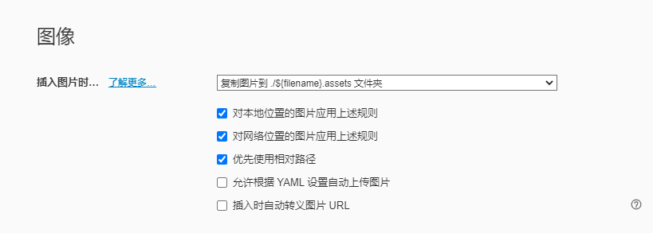

## typora

### 表格快捷键

| command       | mean           |
| ------------- | -------------- |
| Shift + Enter | 单元格内换行   |
| Ctrl + Enter  | 在下方插入行   |
| Alt+↑         | 上移该行       |
| Win键+←       | 左移该列       |
| Ctrl+退格键   | 删除该行       |
| Ctrl + /      | 切换源代码模式 |
| Ctrl + t      | 插入表格       |
| Shift + Tab   | 跳出无序列表   |
| shift + Enter | 列表换行       |
| shift + f12   | 审查元素       |
|               |                |
|               |                |
|               |                |
|               |                |

### 语法	

| command                                    | mean     |
| ------------------------------------------ | -------- |
| #                                          | 标题     |
| ==  ==                                     | 高亮     |
| **  **                                     | 加粗     |
| *  *                                       | 倾斜     |
| ~~   ~~                                    | 删除线   |
| ^  ^                                       | 上标     |
| ~  ~                                       | 下标     |
| +                                          | 无序列表 |
| 1.                                         | 有序列表 |
| >                                          | 引用     |
| ```java                                    | 代码块   |
| ***                                        | 分割线   |
| [提示文字](http://www.baidu.com) ctri+左键 | 外部跳转 |
| [提示文字](#语法)                          | 内部跳转 |
| [提示文字](地址)                           | 超链接   |
| <hjw1750218633@163.com>                    | 自动链接 |
|                               | 图片     |
|                                   |          |
|                                            |          |

## 搭建云端笔记

### 图片

图片需采用相对路径

文件——偏好设置——图像




