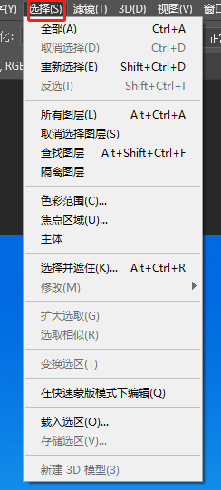

# ps快捷键

| 快捷键                 |                    |
| ---------------------- | ------------------ |
| Ctrl + J               | 复制图层           |
| Ctrl + T               | 变换控件           |
| Alt + delete           | 填充颜色           |
| Ctrl                   | 自动选择           |
| Ctrl + D               | 取消选区           |
| Alt                    | 圆心画圆           |
| space                  | 移动画布           |
| ctrl + n               | 新建文件           |
| ctrl + w               | 关闭文件           |
| ctrl + k               | 首选项             |
| alt + 新建图层         |                    |
| alt + 显示图层（眼睛） | 只显示该图层       |
| alt 拖动图层           | 复制图层           |
| 空格键不松             | 抓手工具，移动视图 |
|                        |                    |

# 常用分辨率设置

# 图层

| ctrl + shift +n | 新建图层   |
| --------------- | ---------- |
| alt + delete    | 填充前景色 |
| ctrl + delete   | 填充背景色 |
|                 |            |

# 移动

| v          | 移动             |
| ---------- | ---------------- |
| shift 移动 | 水平垂直移动     |
| ctrl 移动  | 禁止自动选择图层 |
| alt 移动   | 复制图层并移动   |
|            |                  |

变换图片形状

# 选区

| m              | 选区         |
| -------------- | ------------ |
| 点击+shift     | 画方形       |
| 选区后+v       | 移动选区     |
| alt            | 中心点开始画 |
| alt+shift      | 中心画方     |
| ctrl+d         | 取消选区     |
| ctrl+shift+d   | 重新上次选区 |
| shift+点击     | 添加选区     |
| alt+点击       | 减去选区     |
| shift+alt 点击 | 选取交叉选区 |
| shift+f6       | 羽化         |
| shift + m      | 切换选取模式 |
|                |              |
|                |              |

修改 ----- 对选区进行调整

# 套索工具

| L                                               | 套索                                 |
| ----------------------------------------------- | ------------------------------------ |
| backspace / delete                              | 取消点                               |
| ctrl + shift + J | 挖掉选区                             |
| ctrl +j                                         | 与上面类似，但是移动之后下面还有一层 |

# 历史工具

| ctrl + alt +z | 后退一步 |
| ------------- | -------- |
|               |          |
|               |          |
|               |          |

