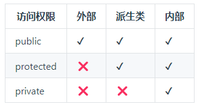
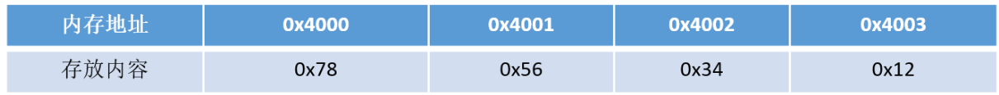
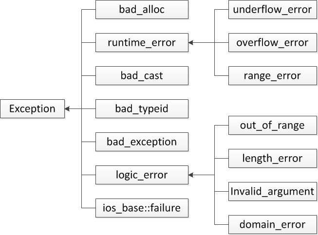
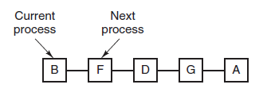
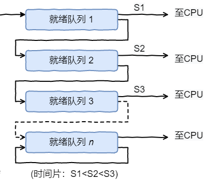

# c++

## 1.在main执行之前和执行之后的代码可能是什么？

**main函数执行之前，主要就是初始化系统相关资源：**

+ 设置栈指针
+ 初始化静态static变量和global全局变量，即.data段的内容
+ 将未初始化部分的全局变量赋初值：数值型short，int，long等为0， bool为FALSE，指针为NULL等等，即.bss段的内容
+ 全局对象初始化，在main之前调用构造函数，这是可能会执行前的一些代码
+ 将main函数的参数argc, argv等传递给main函数，然后才真正运行main函数
+ `__attribute__((constructor))`

**main函数执行之后：**

+ 全局对象的析构函数会在main函数之后执行；
+ 可以用`atexit`注册一个函数，他会在main之后执行；
+ `__attribute__((destructor))`

**深入理解计算机系统 bss段，data段，text段，堆heap和栈stack**

> bss段：
>
> ​		bss段通常是指用来存放程序中未初始化的全局变量的一块内存区域
>
> ​		bss（block started by symbol）
>
> ​		bss段属于静态内存分配
>
> data段：
>
> ​		数据段通常是指用来存放程序中已初始化的全局变量的一块内存区域
>
> ​		数据段属于静态内存分配
>
> text段：
>
> ​		代码段通常是指用来存放程序执行代码的一块内存区域
>
> ​		这部分区域的大小在程序运行前就已经确定，并且内存区域通常属于只读（某些架构也允许代码段为可写，即允许修改程序）
>
> ​		在代码段中，也有可能包含一些只读的常数变量，例如字符串常量等
>
> 堆：
>
> ​		堆是用于存放进程运行中被动态分配的内存段，它的大小并不固定，可动态扩张或缩减。
>
> ​		当进程调用malloc等函数分配内存时，新分配的内存就被动态添加到堆上（堆被扩张）
>
> ​		当利用free等函数释放内存时，被释放的内存从堆中被剔除（堆被缩减）
>
> 栈：
>
> ​		栈又称为对战，使用户存放程序临时创建的局部变量
>
> ​		也就是说我们函数括弧“{}”中定义的变量（但不包括static声明的变量，static意味着在数据段中存放变量）
>
> ​		除此之外，在函数被调用时，其参数也会被压入发起调用的进程栈中，并且待到调用结束后，函数的返回值也会被存放回栈中
>
> 　　由于栈的先进先出(FIFO)特点，所以栈特别方便用来保存/恢复调用现场。
>
> 　　从这个意义上讲，我们可以把堆栈看成一个寄存、交换临时数据的内存区

## 2. 结构体内存对齐问题

- 结构体内成员按照声明顺序存储，第一个成员地址和整个结构体地址相同。
- 未特殊说明时，按结构体中size最大的成员对齐（若有double成员，按8字节对齐。）

c++11以后引入两个关键字 [alignas (opens new window)](https://zh.cppreference.com/w/cpp/language/alignas)与 [alignof (opens new window)](https://zh.cppreference.com/w/cpp/language/alignof)。其中`alignof`可以计算出类型的对齐方式，`alignas`可以指定结构体的对齐方式。

## 3. 指针和引用的区别

- 指针是一个变量，存储的是一个地址，引用跟原来的变量实质上是同一个东西，是原变量的别名
- 指针可以有多级，引用只有一级
- 指针可以为空，引用不能为NULL且在定义时必须初始化
- 指针在初始化后可以改变指向，而引用在初始化之后不可再改变
- sizeof指针得到的是本指针的大小，sizeof引用得到的是引用所指向变量的大小
- 当把指针作为参数进行传递时，也是将实参的一个拷贝传递给形参，两者指向的地址相同，但不是同一个变量，在函数中改变这个指针变量不影响实参，而引用却可以。
- 引用本质是一个指针，同样会占4字节内存；指针是具体变量，需要占用存储空间（，具体情况还要具体分析）。
- 引用在声明时必须初始化为另一变量，一旦出现必须为`typename &refname = varname;`形式；指针声明和定义可以分开，可以先只声明指针变量而不初始化，等用到时再指向具体变量。
- 引用一旦初始化之后就不可以再改变（变量可以被引用为多次，但引用只能作为一个变量引用）；指针变量可以重新指向别的变量。
- 不存在指向空值的引用，必须有具体实体；但是存在指向空值的指针

## 4. 在传递函数参数时，是么时候该使用指针，什么时候该使用引用呢

- 需要返回函数内局部变量的内存的时候用指针。使用指针传参需要开辟内存，用完要记得释放指针，不然会内存泄漏。而返回局部变量的引用是没有意义的
- 对栈空间大小比较敏感（比如递归）的时候使用引用。使用引用传递不需要创建临时变量，开销要更小
- 类对象作为参数传递的时候使用引用，这是C++类对象传递的标准方式

## 5. 堆和栈的区别

- 申请方式不同。
  - 栈由系统自动分配。
- 堆是自己申请和释放的。
- 申请大小限制不同。
  - 栈顶和栈底是之前预设好的，栈是向栈底扩展，大小固定，可以通过ulimit -a查看，由ulimit -s修改。
  - 堆向高地址扩展，是不连续的内存区域，大小可以灵活调整。
- 申请效率不同。
  - 栈由系统分配，速度快，不会有碎片。
  - 堆由程序员分配，速度慢，且会有碎片。

栈空间默认是4M, 堆区一般是 1G - 4G

|              | 堆                                                           | 栈                                                           |
| ------------ | ------------------------------------------------------------ | ------------------------------------------------------------ |
| 管理方式     | 堆中资源由程序员控制（容易产生memory leak）                  | 栈资源由编译器自动管理，无需手动控制                         |
| 内存管理机制 | 系统由一个记录空闲内存地址的链表，当系统收到程序申请时，遍历该链表，寻找第一个空间大于申请空间的堆节点，删除空闲节点链表中的该节点，并将该节点空间分配给程序（大多数系统会在这块内存空间首地址记录本次分配的大小，这样delete才能正确释放本内存空间，另外系统会将多余的部分重新放入空闲链表中） | 只要栈的剩余内存空间大于所申请空间，系统为程序提供内存，否则报异常提示栈溢出。（这一块理解一下链表和队列的区别，不连续空间和连续空间的区别，应改就比较好理解这两种机制的区别了） |
| 空间大小     | 堆是不连续的内存区域（因为系统是用链表来存储空闲内存地址，自然不是连续的），堆大熊啊受限于计算机系统中有效的虚拟地址（32bit系统理论上是4G），所以堆的空间比较灵活，比较大 | 栈是一块连续的内存区域，大小是操作系统预定好的，windows下栈大小是2M（也有是1M，在编译时确定，VC中可设置） |
| 碎片问题     | 对于堆，频繁的new/delete会造成大量碎片，时程序效率降低       | 对于栈，他是有点类似与数据结构上的一个先进后出的栈，进出一一对应，不会产生碎片。 |
| 生长方向     | 堆向上，向高地址方向增长                                     | 栈向下，想低地址方向增长                                     |
| 分配方式     | 堆都是动态分配（没有静态分配的堆）                           | 栈由静态分配和动态分配，静态分配由编译器完成（如局部变量分配），动态分配由alloca函数分配，但栈的动态分配的资源由编译器进行释放，无需程序员实现。与 `malloc()` 不同，`alloca()` 分配的内存空间在函数返回时会自动释放，因为它是在函数的栈帧上分配的。因此，不应该在函数返回后持有对 `alloca()` 分配的内存的引用，否则会导致悬挂指针的问题 |
| 分配效率     | 堆由c/c++函数库提供，机制很复杂。所以堆的效率比栈低很多      | 栈是其系统提供的数据结构，计算机在底层对栈提供支持，分配专门寄存器存放栈地址，栈操作有专门指令 |

## 6. 你觉得对快一点还是栈快一点

毫无疑问是栈快一点。

因为操作系统会在底层对栈提供支持，会分配专门的寄存器存放栈的地址，栈的入栈出栈操作也十分简单，并且有专门的指令执行，所以栈的效率比较高也比较快。

而堆的操作是由C/C++函数库提供的，在分配堆内存的时候需要一定的算法寻找合适大小的内存。并且获取堆的内容需要两次访问，第一次访问指针，第二次根据指针保存的地址访问内存，因此堆比较慢。

## 7. 区别一下指针类型

```c
int *p[10]
int (*p)[10]
int *p(int)
int (*p)(int)
```

- `int *p[10]`表示指针数组，强调数组概念，是一个数组变量，数组大小为10，数组内每个元素都是指向int类型的指针变量。
- `int (*p)[10]`表示数组指针，强调是指针，只有一个变量，是指针类型，不过指向的是一个int类型的数组，这个数组大小是10。
- `int *p(int)`是函数声明，函数名是p，参数是int类型的，返回值是int *类型的。
- `int (*p)(int)`是函数指针，强调是指针，该指针指向的函数具有int类型参数，并且返回值是int类型的。

## 8. new/delete与malloc/free的异同

**相同点**

- 都可用于内存的动态申请和释放

**不同点**

- 前者是C++运算符，后者是C/C++语言标准库函数
- new自动计算要分配的空间大小，malloc需要手工计算
- new是类型安全的，malloc不是。例如：

```c
int *p = new float[2]; //编译错误
int *p = (int*)malloc(2 * sizeof(double));//编译无错误
```

- new调用名为**operator new**的标准库函数分配足够空间并调用相关对象的构造函数，delete对指针所指对象运行适当的析构函数；然后通过调用名为**operator delete**的标准库函数释放该对象所用内存。后者均没有相关调用
- 后者需要库文件支持，前者不用
- new是封装了malloc，直接free不会报错，但是这只是释放内存，而不会析构对象

## 9. new和delete是如何实现的

- new的实现过程是：首先调用名为**operator new**的标准库函数，分配足够大的原始为类型化的内存，以保存指定类型的一个对象；接下来运行该类型的一个构造函数，用指定初始化构造对象；最后返回指向新分配并构造后的的对象的指针
- delete的实现过程：对指针指向的对象运行适当的析构函数；然后通过调用名为**operator delete**的标准库函数释放该对象所用内存

## 10. malloc和new的区别

- malloc和free是标准库函数，支持覆盖；new和delete是运算符，支持重载。
- malloc仅仅分配内存空间，free仅仅回收空间，不具备调用构造函数和析构函数功能，用malloc分配空间存储类的对象存在风险；new和delete除了分配回收功能外，还会调用构造函数和析构函数。
- malloc和free返回的是void类型指针（必须进行类型转换），new和delete返回的是具体类型指针。

## 11. 既然有了malloc/free,c++中为什么还需要new/delete呢？直接用malloc/free不好吗

- malloc/free和new/delete都是用来申请内存和回收内存的。
- 在对非基本数据类型的对象使用的时候，对象创建的时候还需要执行构造函数，销毁的时候要执行析构函数。而malloc/free是库函数，是已经编译的代码，所以不能把构造函数和析构函数的功能强加给malloc/free，所以new/delete是必不可少的

## 12. 被free回收的内存是立即返还给操作系统吗

不是的，被free回收的内存会首先被`ptmalloc`使用双链表保存起来，当用户下一次申请内存的时候，会尝试从这些内存中寻找合适的返回。这样就避免了频繁的系统调用，占用过多的系统资源。同时`ptmalloc`也会尝试对小块内存进行合并，避免过多的内存碎片。

一种常见的优化技术是内存池（memory pool），即在程序启动时分配一定数量的内存块，然后在程序运行过程中重复使用这些内存块，而不是每次需要内存时都向操作系统请求新的内存。这种方式可以减少系统调用的次数和减少内存碎片的产生，从而提高内存分配和释放的性能。

另外，内存分配器也会尝试对小块内存进行合并，以尽量减少内存碎片。这种合并操作可以在内存释放时进行，或者在内存分配时尝试寻找合适的空闲块进行合并。

## 13. 宏定义和函数有何区别

- 宏在预处理阶段完成替换，之后被替换的文本参与编译，相当于直接插入了代码，运行时不存在函数调用，执行起来更快；函数调用在运行时需要跳转到具体调用函数。
- 宏定义属于在结构中插入代码，没有返回值；函数调用具有返回值。
- 宏定义参数没有类型，不进行类型检查；函数参数具有类型，需要检查类型。
- 宏定义不要在最后加分号

## 14. 宏定义和typedef区别

- 宏主要用于定义常量及书写复杂的内容；typedef主要用于定义类型别名。
- 宏替换发生在编译阶段之前，属于文本插入替换；typedef是编译的一部分。
- 宏不检查类型；typedef会检查数据类型。
- 宏不是语句，不在在最后加分号；typedef是语句，要加分号标识结束。
- 注意对指针的操作，typedef char * p_char和#define p_char char *区别巨大。

## 15. 变量声明和定义区别

- 声明仅仅是把变量的声明的位置及类型提供给编译器，并不分配内存空间；定义要在定义的地方为其分配存储空间。
- 相同变量可以在多处声明（外部变量  通过extern关键字实现），但只能在一处定义。

```c
// File1.c
int globalVariable; // 定义

// File2.c
extern int globalVariable; // 声明
```

## 16. strlen和sizeof区别

- sizeof是运算符，并不是函数，结果在编译时得到而非运行中获得；strlen是字符处理的库函数。
- sizeof参数可以是任何数据的类型或者数据（sizeof参数不退化）；strlen的参数只能是字符指针且结尾是'\0'的字符串。
- 因为sizeof值在编译时确定，所以不能用来得到动态分配（运行时分配）存储空间的大小

```c
  int main(int argc, char const *argv[]){
      
      const char* str = "name";

      sizeof(str); // 取的是指针str的长度，是8
      strlen(str); // 取的是这个字符串的长度，不包含结尾的 \0。大小是4
      return 0;
  }
```

**一个指针占多少字节**

在16题中有提到`sizeof（str）`的值为8，是在64位的编译环境下的，指针的占用大小为8字节；

而在32位环境下，指针占用大小为4字节。

一个指针占内存的大小跟编译环境有关，而与机器的位数无关。

## 17. 常量指针和指针常量的区别

- 指针常量是一个指针，读成常量的指针，指向一个只读变量，也就是后面所指明的`int const` 和 `const int`，都是一个常量，可以写作`nt const *p`或`const int *p`。
- 常量指针是一个不能给改变指向的指针。指针是个常量，必须初始化，一旦初始化完成，它的值（也就是存放在指针中的地址）就不能在改变了，即不能中途改变指向，如`int *const p`。

## 18. a和&a的区别

- a是数组名，是数组首元素地址，+1表示地址值加上一个int类型的大小，如果a的值是0x00000001，加1操作后变为0x00000005。*(a + 1) = a[1]。
- &a是数组的指针，其类型为int (*)[10]（就是前面提到的数组指针），其加1时，系统会认为是数组首地址加上整个数组的偏移（10个int型变量），值为数组a尾元素后一个元素的地址。
- 若(int *)p ，此时输出 *p时，其值为a[0]的值，因为被转为int *类型，解引用时按照int类型大小来读取

## 19. c++和python的区别

包括但不限于：

- Python是一种脚本语言，是解释执行的，而C++是编译语言，是需要编译后在特定平台运行的。python可以很方便的跨平台，但是效率没有C++高。
- Python使用缩进来区分不同的代码块，C++使用花括号来区分
- C++中需要事先定义变量的类型，而Python不需要，Python的基本数据类型只有数字，布尔值，字符串，列表，元组等等
- Python的库函数比C++的多，调用起来很方便

## 20. c++和c语言的区别

- C++中new和delete是对内存分配的运算符，取代了C中的malloc和free。
- 标准C++中的字符串类取代了标准C函数库头文件中的字符数组处理函数（C中没有字符串类型）。
- C++中用来做控制态输入输出的iostream类库替代了标准C中的stdio函数库。
- C++中的try/catch/throw异常处理机制取代了标准C中的setjmp()和longjmp()函数。
- 在C++中，允许有相同的函数名，不过它们的参数类型不能完全相同，这样这些函数就可以相互区别开来。而这在C语言中是不允许的。也就是C++可以重载，C语言不允许。
- C++语言中，允许变量定义语句在程序中的任何地方，只要在是使用它之前就可以；而C语言中，必须要在函数开头部分。而且C++不允许重复定义变量，C语言也是做不到这一点的
- 在C++中，除了值和指针之外，新增了引用。引用型变量是其他变量的一个别名，我们可以认为他们只是名字不相同，其他都是相同的。
- C++相对与C增加了一些关键字，如：bool、using、dynamic_cast、namespace等等

## 21. c++与java的区别

**语言特性**

- Java语言给开发人员提供了更为简洁的语法；完全面向对象，由于JVM可以安装到任何的操作系统上，所以说它的可移植性强
- Java语言中没有指针的概念，引入了真正的数组。不同于C++中利用指针实现的“伪数组”，Java引入了真正的数组，同时将容易造成麻烦的指针从语言中去掉，这将有利于防止在C++程序中常见的因为数组操作越界等指针操作而对系统数据进行非法读写带来的不安全问题
- C++也可以在其他系统运行，但是需要不同的编码（这一点不如Java，只编写一次代码，到处运行），例如对一个数字，在windows下是大端存储，在unix中则为小端存储。Java程序一般都是生成字节码，在JVM里面运行得到结果
- Java用接口(Interface)技术取代C++程序中的抽象类。接口与抽象类有同样的功能，但是省却了在实现和维护上的复杂性

**垃圾回收**

- C++用析构函数回收垃圾，写C和C++程序时一定要注意内存的申请和释放
- Java语言不使用指针，内存的分配和回收都是自动进行的，程序员无须考虑内存碎片的问题

**应用场景**

- Java在桌面程序上不如C++实用，C++可以直接编译成exe文件，指针是c++的优势，可以直接对内存的操作，但同时具有危险性 。（操作内存的确是一项非常危险的事情，一旦指针指向的位置发生错误，或者误删除了内存中某个地址单元存放的重要数据，后果是可想而知的）
- Java在Web 应用上具有C++ 无可比拟的优势，具有丰富多样的框架
- 对于底层程序的编程以及控制方面的编程，C++很灵活，因为有句柄的存在


## 22. c++中struct和class的区别

**相同点**

- 两者都拥有成员函数、公有和私有部分
- 任何可以使用class完成的工作，同样可以使用struct完成

**不同点**

- 两者中如果不对成员不指定公私有，struct默认是公有的，class则默认是私有的
- class默认是private继承， 而struct默认是public继承

**引申**：C++和C的struct区别

- C语言中：struct是用户自定义数据类型（UDT）；C++中struct是抽象数据类型（ADT），支持成员函数的定义，（C++中的struct能继承，能实现多态）
- C中struct是没有权限的设置的，且struct中只能是一些变量的集合体，可以封装数据却不可以隐藏数据，而且成员**不可以是函数**
- C++中，struct增加了访问权限，且可以和类一样有成员函数，成员默认访问说明符为public（为了与C兼容）
- struct作为类的一种特例是用来自定义数据结构的。一个结构标记声明后，在C中必须在结构标记前加上struct，才能做结构类型名（除：typedef struct class{};）;C++中结构体标记（结构体名）可以直接作为结构体类型名使用，此外结构体struct在C++中被当作类的一种特例

## 23. define宏定义和const的区别

**编译阶段**

- define是在编译的**预处理**阶段起作用，而const是在编译、运行的时候起作用

**安全性**

- define只做替换，不做类型检查和计算，也不求解，容易产生错误，一般最好加上一个大括号包含住全部的内容，要不然很容易出错
- const常量有数据类型，编译器可以对其进行类型安全检查

**内存占用**

- define只是将宏名称进行替换，在内存中会产生多分相同的备份。const在程序运行中只有一份备份，且可以执行常量折叠，能将复杂的的表达式计算出结果放入常量表
- 宏替换发生在编译阶段之前，属于文本插入替换；const作用发生于编译过程中。
- 宏不检查类型；const会检查数据类型。
- 宏定义的数据没有分配内存空间，只是插入替换掉；const定义的变量只是值不能改变，但要分配内存空间。

## 24. c++中const和static的作用

**static**

- 不考虑类的情况
  - 隐藏。所有不加static的全局变量和函数具有全局可见性，可以在其他文件中使用，加了之后只能在该文件所在的编译模块中使用
  - 默认初始化为0，包括未初始化的全局静态变量与局部静态变量，都存在全局未初始化区
  - 静态变量在函数内定义，始终存在，且只进行一次初始化，具有记忆性，其作用范围与局部变量相同，函数退出后仍然存在，但不能使用
- 考虑类的情况
  - static成员变量：只与类关联，不与类的对象关联。定义时要分配空间，不能在类声明中初始化，必须在类定义体外部初始化，初始化时不需要标示为static；可以被非static成员函数任意访问。
  - static成员函数：不具有this指针，无法访问类对象的非static成员变量和非static成员函数；**不能被声明为const、虚函数和volatile**；可以被非static成员函数任意访问

**const**

- 不考虑类的情况
  - const常量在定义时必须初始化，之后无法更改
  - const形参可以接收const和非const类型的实参，例如// i 可以是 int 型或者 const int 型void fun(const int& i){ //...}
- 考虑类的情况
  - const成员变量：不能在类定义外部初始化，只能通过构造函数初始化列表进行初始化，并且必须有构造函数；不同类对其const数据成员的值可以不同，所以不能在类中声明时初始化
  - const成员函数：const对象不可以调用非const成员函数；非const对象都可以调用；不可以改变非mutable（用该关键字声明的变量可以在const成员函数中被修改）数据的值

补充一点const相关：const修饰变量是也与static有一样的隐藏作用。只能在该文件中使用，其他文件不可以引用声明使用。 因此在头文件中声明const变量是没问题的，因为即使被多个文件包含，链接性都是内部的，不会出现符号冲突。

## 25. c++的顶层const和底层const

**概念区分**

- **顶层**const：指的是const修饰的变量**本身**是一个常量，无法修改，指的是指针，就是 * 号右边的const
- **底层**const：指的是const修饰的变量**所指向的对象**是一个常量，指的是所指变量，就是 * 号的左边const

```c
int a = 10;int* const b1 = &a;        //顶层const，b1本身是一个常量
const int* b2 = &a;       //底层const，b2本身可变，所指的对象是常量
const int b3 = 20; 		   //顶层const，b3是常量不可变
const int* const b4 = &a;  //前一个const为底层，后一个为顶层，b4不可变
const int& b5 = a;		   //用于声明引用变量，都是底层const
```

## 26. 数组名和指针区别

- 二者均可通过增减偏移量来访问数组中的元素。
- 数组名不是真正意义上的指针，可以理解为常指针，所以数组名没有自增、自减等操作。
- **当数组名当做形参传递给调用函数后，就失去了原有特性，退化成一般指针，多了自增、自减操作，但sizeof运算符不能再得到原数组的大小了。**

## 27. final和override关键字

**override**

当在父类中使用了虚函数时候，你可能需要在某个子类中对这个虚函数进行重写，以下方法都可以：

```c++
class A
{
    virtual void foo();
}
class B : public A
{
    void foo(); //OK
    virtual void foo(); // OK
    void foo() override; //OK
}
```

如果不使用override，当你手一抖，将**foo()**写成了**f00()**会怎么样呢？结果是编译器并不会报错，因为它并不知道你的目的是重写虚函数，而是把它当成了新的函数。如果这个虚函数很重要的话，那就会对整个程序不利。所以，override的作用就出来了，它指定了子类的这个虚函数是重写的父类的，如果你名字不小心打错了的话，编译器是不会编译通过的：

```c++
class A
{
    virtual void foo();
};
class B : public A
{
    virtual void f00(); //OK，这个函数是B新增的，不是继承的
    virtual void f0o() override; //Error, 加了override之后，这个函数一定是继承自A的，A找不到就报错
};

```

**final**

当不希望某个类被继承，或不希望某个虚函数被重写，可以在类名和虚函数后添加final关键字，添加final关键字后被继承或重写，编译器会报错。例子如下：

```c++
class Base
{
    virtual void foo();
};
 
class A : public Base
{
    void foo() final; // foo 被override并且是最后一个override，在其子类中不可以重写
};

class B final : A // 指明B是不可以被继承的
{
    void foo() override; // Error: 在A中已经被final了
};
 
class C : B // Error: B is final
{
};
```

## 28. 拷贝初始化和直接初始化

- 当用于类类型对象时，初始化的拷贝形式和直接形式有所不同：直接初始化直接调用与实参匹配的构造函数，拷贝初始化总是调用拷贝构造函数。拷贝初始化首先使用指定构造函数创建一个临时对象，然后用拷贝构造函数将那个临时对象拷贝到正在创建的对象。举例如下

```c++
string str1("I am a string");//语句1 直接初始化
string str2(str1);//语句2 直接初始化，str1是已经存在的对象，直接调用拷贝构造函数对str2进行初始化
string str3 = "I am a string";//语句3 拷贝初始化，先为字符串”I am a string“创建临时对象，再把临时对象作为参数，使用拷贝构造函数构造str3
string str4 = str1;//语句4 拷贝初始化，这里相当于隐式调用拷贝构造函数，而不是调用赋值运算符函数
```

- 为了提高效率，允许编译器跳过创建临时对象这一步，**直接调用构造函数构造要创建的对象，这样就完全等价于**直接初始化了

  （语句1和语句3等价），但是需要辨别两种情况。

  - 当拷贝构造函数为private时：语句3和语句4在编译时会报错
  - 使用explicit修饰构造函数时：如果构造函数存在隐式转换，编译时会报错

## 29. 初始化和赋值的区别

- 对于简单类型来说，初始化和赋值没什么区别
- 对于类和复杂数据类型来说，这两者的区别就大了，举例如下：

```c++
class A{
public:
    int num1;
    int num2;
public:
    A(int a=0, int b=0):num1(a),num2(b){};
    A(const A& a){};
    //重载 = 号操作符函数
    A& operator=(const A& a){
        num1 = a.num1 + 1;
        num2 = a.num2 + 1;
        return *this;
    };
};
int main(){
    A a(1,1);
    A a1 = a; //拷贝初始化操作，调用拷贝构造函数
    A b;
    b = a;//赋值操作，对象a中，num1 = 1，num2 = 1；对象b中，num1 = 2，num2 = 2
    return 0;
}
```

## 30. extern“C”的用法

为了能够**正确的在C++代码中调用C语言**的代码：在程序中加上extern "C"后，相当于告诉编译器这部分代码是C语言写的，因此要按照C语言进行编译，而不是C++；

哪些情况下使用extern "C"：

（1）C++代码中调用C语言代码；

（2）在C++中的头文件中使用；

（3）在多个人协同开发时，可能有人擅长C语言，而有人擅长C++；

举个例子，C++中调用C代码：

```c++
#ifndef __MY_HANDLE_H__
#define __MY_HANDLE_H__

extern "C"{
    typedef unsigned int result_t;
    typedef void* my_handle_t;
    
    my_handle_t create_handle(const char* name);
    result_t operate_on_handle(my_handle_t handle);
    void close_handle(my_handle_t handle);
}
```

综上，总结出使用方法**，在C语言的头文件中，对其外部函数只能指定为extern类型，C语言中不支持extern "C"声明，在.c文件中包含了extern "C"时会出现编译语法错误。**所以使用extern "C"全部都放在于cpp程序相关文件或其头文件中。

总结出如下形式：

（1）C++调用C函数：

```c++
//xx.h
extern int add(...)

//xx.c
int add(){
    
}

//xx.cpp
extern "C" {
    #include "xx.h"
}
```

（2）C调用C++函数

```c
//xx.h
extern "C"{
    int add();
}
//xx.cpp
int add(){    
}
//xx.c
extern int add();
```

## 31. 野指针和悬空指针

都是是指向无效内存区域(这里的无效指的是"不安全不可控")的指针，访问行为将会导致未定义行为。

- 野指针
  野指针，指的是没有被初始化过的指针

```c++
int main(void) { 
    
    int* p;     // 未初始化
    std::cout<< *p << std::endl; // 未初始化就被使用
    
    return 0;
}
```

- 因此，为了防止出错，对于指针初始化时都是赋值为 `nullptr`，这样在使用时编译器就不会直接报错，产生非法内存访问。
- 悬空指针
  悬空指针，指针最初指向的内存已经被释放了的一种指针。

```c++
int main(void) { 
  int * p = nullptr;
  int* p2 = new int;
  
  p = p2;

  delete p2;
}
```

此时 p和p2就是悬空指针，指向的内存已经被释放。继续使用这两个指针，行为不可预料。需要设置为`p=p2=nullptr`。此时再使用，编译器会直接保错。 避免野指针比较简单，但悬空指针比较麻烦。c++引入了智能指针，C++智能指针的本质就是避免悬空指针的产生。

**产生原因及解决办法：**

野指针：指针变量未及时初始化 => 定义指针变量及时初始化，要么置空。

悬空指针：指针free或delete之后没有及时置空 => 释放操作后立即置空。

## 32. c和c++的类型安全

**什么是类型安全？**

类型安全很大程度上可以等价于内存安全，类型安全的代码不会试图访问自己没被授权的内存区域。“类型安全”常被用来形容编程语言，其根据在于该门编程语言是否提供保障类型安全的机制；有的时候也用“类型安全”形容某个程序，判别的标准在于该程序是否隐含类型错误。

类型安全的编程语言与类型安全的程序之间，没有必然联系。好的程序员可以使用类型不那么安全的语言写出类型相当安全的程序，相反的，差一点儿的程序员可能使用类型相当安全的语言写出类型不太安全的程序。绝对类型安全的编程语言暂时还没有。

**（1）C的类型安全**

C只在局部上下文中表现出类型安全，比如试图从一种结构体的指针转换成另一种结构体的指针时，编译器将会报告错误，除非使用显式类型转换。然而，C中相当多的操作是不安全的。以下是两个十分常见的例子：

- printf格式输出

```c
#include <stdio.h>

int main(){
    printf("整型输出:%d\n", 10);
    printf("浮点型输出:%d\n", `0);
    return 0;
}

// 整形输出: 10
// 浮点型输出：0.000000
```

上述代码中，使用%d控制整型数字的输出，没有问题，但是改成%f时，明显输出错误，再改成%s时，运行直接报segmentation fault错误

- malloc函数的返回值

malloc是C中进行内存分配的函数，它的返回类型是void*即空类型指针，常常有这样的用法char* pStr=(char*)malloc(100*sizeof(char))，这里明显做了显式的类型转换。

类型匹配尚且没有问题，但是一旦出现int* pInt=(int*)malloc(100*sizeof(char))就很可能带来一些问题，而这样的转换C并不会提示错误。

**（2）C++的类型安全**

如果C++使用得当，它将远比C更有类型安全性。相比于C语言，C++提供了一些新的机制保障类型安全：

- 操作符new返回的指针类型严格与对象匹配，而不是void*

- C中很多以void*为参数的函数可以改写为C++模板函数，而模板是支持类型检查的；

- 引入const关键字代替#define constants，它是有类型、有作用域的，而#define constants只是简单的文本替换

- 一些#define宏可被改写为inline函数，结合函数的重载，可在类型安全的前提下支持多种类型，当然改写为模板也能保证类型安全

- C++提供了**dynamic_cast**关键字，使得转换过程更加安全，因为dynamic_cast比static_cast涉及更多具体的类型检查。

  例1：使用void*进行类型转换

```c++
#include <iostream>
using namespace std;

int main() {
    int i = 5;
    void * pInt = &i;
    double d = (*(double*)pInt);
    cout << "转换后输出:" << d << endl;
}

// 转换后输出：1.784164-307
```

 例2：不同类型指针之间转换

```c++
#include<iostream>
using namespace std;
 
class Parent{};
class Child1 : public Parent
{
public:
	int i;
	Child1(int e):i(e){}
};
class Child2 : public Parent
{
public:
	double d;
	Child2(double e):d(e){}
};
int main()
{
	Child1 c1(5);
	Child2 c2(4.1);
	Parent* pp;
	Child1* pc1;
 	
	pp=&c1; 
	pc1=(Child1*)pp;  // 类型向下转换 强制转换，由于类型仍然为Child1*，不造成错误
	cout<<pc1->i<<endl; //输出：5
 
	pp=&c2;
	pc1=(Child1*)pp;  //强制转换，且类型发生变化，将造成错误
	cout<<pc1->i<<endl;// 输出：1717986918
	return 0;
}
```

上面两个例子之所以引起类型不安全的问题，是因为程序员使用不得当。第一个例子用到了空类型指针void*，第二个例子则是在两个类型指针之间进行强制转换。因此，想保证程序的类型安全性，应尽量避免使用空类型指针void*，==尽量不对两种类型指针做强制转换==。

## 33. c++中的重载、重写（覆盖）和隐藏的区别

（1）重载（overload）

重载是指在同一范围定义中的同名成员函数才存在重载关系。主要特点是函数名相同，参数类型和数目有所不同，不能出现参数个数和类型均相同，仅仅依靠返回值不同来区分的函数。重载和函数成员是否是虚函数无关。举个例子

```c++
class A{
    ...
    virtual int fun();
    void fun(int);
    void fun(double, double);
    static int fun(char);
    ...
}
```

（2）重写（覆盖）（override）

重写指的是在派生类中覆盖基类中的同名函数，**重写就是重写函数体**，**要求基类函数必须是虚函数**且：

- 与基类的虚函数有相同的参数个数
- 与基类的虚函数有相同的参数类型
- 与基类的虚函数有相同的返回值类型

举个例子：

```c++
//父类
class A{
public:
    virtual int fun(int a){}
}
//子类
class B : public A{
public:
    //重写,一般加override可以确保是重写父类的函数
    virtual int fun(int a) override{}
}
```

重载与重写的区别：

- 重写是父类和子类之间的垂直关系，重载是不同函数之间的水平关系
- 重写要求参数列表相同，重载则要求参数列表不同，返回值不要求
- 重写关系中，调用方法根据对象类型决定，重载根据调用时实参表与形参表的对应关系来选择函数体

（3）隐藏（hide）

隐藏指的是某些情况下，派生类中的函数屏蔽了基类中的同名函数，包括以下情况：

- 两个函数参数相同，但是基类函数不是虚函数。**和重写的区别在于基类函数是否是虚函数。**举个例子：

```c++
//父类
class A{
public:
    void fun(int a){
		cout << "A中的fun函数" << endl;
	}
};
//子类
class B : public A{
public:
    //隐藏父类的fun函数
    void fun(int a){
		cout << "B中的fun函数" << endl;
	}
};
int main(){
    B b;
    b.fun(2); //调用的是B中的fun函数
    b.A::fun(2); //调用A中fun函数
    return 0;
}
```

- **两个函数参数不同，无论基类函数是不是虚函数，都会被隐藏。和重载的区别在于两个函数不在同一个类中。举个例子：**

```c++
//父类
class A{
public:
    virtual void fun(int a){
		cout << "A中的fun函数" << endl;
	}
};
//子类
class B : public A{
public:
    //隐藏父类的fun函数
   virtual void fun(char* a){
	   cout << "A中的fun函数" << endl;
   }
};
int main(){
    B b;
    b.fun(2); //报错，调用的是B中的fun函数，参数类型不对
    b.A::fun(2); //调用A中fun函数
    return 0;
}
```

**补充：**

```c
// 父类
class A {
public:
    virtual void fun(int a) { // 虚函数
        cout << "This is A fun " << a << endl;
    }  
    void add(int a, int b) {
        cout << "This is A add " << a + b << endl;
    }
};

// 子类
class B: public A {
public:
    void fun(int a) override {  // 覆盖
        cout << "this is B fun " << a << endl;
    }
    void add(int a) {   // 隐藏
        cout << "This is B add " << a + a << endl;
    }
};

int main() {
    // 基类指针指向派生类对象时，基类指针可以直接调用到派生类的覆盖函数，也可以通过 :: 调用到基类被覆盖
    // 的虚函数；而基类指针只能调用基类的被隐藏函数，无法识别派生类中的隐藏函数。

    A *p = new B();
    p->fun(1);      // 调用子类 fun 覆盖函数
    p->A::fun(1);   // 调用父类 fun
    p->add(1, 2);
    // p->add(1);      // 错误，识别的是 A 类中的 add 函数，参数不匹配
    // p->B::add(1);   // 错误，无法识别子类 add 函数
    return 0;
}
```

## 34. c++有哪几种的构造函数

C++中的构造函数可以分为4类：

- 默认构造函数
- 初始化构造函数（有参数）
- 拷贝构造函数
- 移动构造函数（move和右值引用）
- 委托构造函数
- 转换构造函数

举个例子:

```c++
#include <iostream>
using namespace std;

class Student{
public:
    Student(){//默认构造函数，没有参数
        this->age = 20;
        this->num = 1000;
    };  
    Student(int a, int n):age(a), num(n){}; //初始化构造函数，有参数和参数列表
    Student(const Student& s){//拷贝构造函数，这里与编译器生成的一致
        this->age = s.age;
        this->num = s.num;
    }; 
    Student(int r){   //转换构造函数,形参是其他类型变量，且只有一个形参
        this->age = r;
		this->num = 1002;
    };
    ~Student(){}
public:
    int age;
    int num;
};

int main(){
    Student s1;
    Student s2(18,1001);
    int a = 10;
    Student s3(a);
    Student s4(s3);
    
    printf("s1 age:%d, num:%d\n", s1.age, s1.num);
    printf("s2 age:%d, num:%d\n", s2.age, s2.num);
    printf("s3 age:%d, num:%d\n", s3.age, s3.num);
    printf("s2 age:%d, num:%d\n", s4.age, s4.num);
    return 0;
}
//运行结果
//s1 age:20, num:1000
//s2 age:18, num:1001
//s3 age:10, num:1002
//s2 age:10, num:1002
```

- 默认构造函数和初始化构造函数在定义类的对象，完成对象的初始化工作
- 复制构造函数用于复制本类的对象
- 转换构造函数用于将其他类型的变量，隐式转换为本类对象

## 35. 浅拷贝和深拷贝的区别

**浅拷贝**

浅拷贝只是拷贝一个指针，并没有新开辟一个地址，拷贝的指针和原来的指针指向同一块地址，如果原来的指针所指向的资源释放了，那么再释放浅拷贝的指针的资源就会出现错误。

**深拷贝**

深拷贝不仅拷贝值，还开辟出一块新的空间用来存放新的值，即使原先的对象被析构掉，释放内存了也不会影响到深拷贝得到的值。在自己实现拷贝赋值的时候，如果有指针变量的话是需要自己实现深拷贝的。

```c++
#include <iostream>  
#include <string.h>
using namespace std;
 
class Student
{
private:
	int num;
	char *name;
public:
	Student(){
        name = new char(20);
		cout << "Student" << endl;
    };
	~Student(){
        cout << "~Student " << &name << endl;
        delete name;
        name = NULL;
    };
	Student(const Student &s){//拷贝构造函数
        //浅拷贝，当对象的name和传入对象的name指向相同的地址
        name = s.name;
        //深拷贝
        //name = new char(20);
        //memcpy(name, s.name, strlen(s.name));
        cout << "copy Student" << endl;
    };
};
 
int main()
{
	{// 花括号让s1和s2变成局部对象，方便测试
		Student s1;
		Student s2(s1);// 复制对象
	}
	system("pause");
	return 0;
}
//浅拷贝执行结果：
//Student
//copy Student
//~Student 0x7fffed0c3ec0
//~Student 0x7fffed0c3ed0
//*** Error in `/tmp/815453382/a.out': double free or corruption (fasttop): 0x0000000001c82c20 ***

//深拷贝执行结果：
//Student
//copy Student
//~Student 0x7fffebca9fb0
//~Student 0x7fffebca9fc0
```

从执行结果可以看出，浅拷贝在对象的拷贝创建时存在风险，即被拷贝的对象析构释放资源之后，拷贝对象析构时会再次释放一个已经释放的资源，深拷贝的结果是两个对象之间没有任何关系，各自成员地址不同

## 36. 内联函数和宏定义的区别

- 在使用时，宏只做简单字符串替换（编译前）。而内联函数可以进行参数类型检查（编译时），且具有返回值。
- 内联函数在编译时直接将函数代码嵌入到目标代码中，省去函数调用的开销来提高执行效率，并且进行参数类型检查，具有返回值，可以实现重载。
- 宏定义时要注意书写（参数要括起来）否则容易出现歧义，内联函数不会产生歧义
- 内联函数有类型检测、语法判断等功能，而宏没有

**内联函数适用场景:**

- 使用宏定义的地方都可以使用 inline 函数。
- 作为类成员接口函数来读写类的私有成员或者保护成员，会提高效率。

## 37. public, protected和private访问和继承权限/public/protected private的区别

- public的变量和函数在类的内部外部都可以访问。
- protected的变量和函数只能在类的内部和其派生类中访问。
- private修饰的元素只能在类内访问。

（一）访问权限



（二）继承权限

1. 派生类继承自基类的成员权限有四种状态：public、protected、private、不可见，排序为 public > protected > private
2. 派生类对基类成员的访问权限取决于两点：一、继承方式；二、基类成员在基类中的访问权限
3. 基类成员在派生类中的访问权限不得高于继承方式中指定的权限，高于继承方式中指定的权限则下降为继承权限，低于继承权限则不调整，**基类 private 成员在任何继承方式下都是不可见的**。

## 38. 如何用代码判断大小端存储

大端存储：字数据的高字节存储在低地址中

小端存储：字数据的低字节存储在低地址中

例如：32bit的数字0x12345678

**所以在Socket编程中，往往需要将操作系统所用的小端存储的IP地址转换为大端存储，这样才能进行网络传输**

小端模式中的存储方式为：



大端模式中的存储方式为：


**方式一：使用强制类型转换**

```c
#include <iostream>
using namespace std;
int main()
{
    int a = 0x1234;
    //由于int和char的长度不同，借助int型转换成char型，只会留下低地址的部分
    char c = (char)(a);
    if (c == 0x12)
        cout << "big endian" << endl;
    else if(c == 0x34)
        cout << "little endian" << endl;
}
```

**方式二：巧用union联合体**

```c
#include <iostream>
using namespace std;
//union联合体的重叠式存储，endian联合体占用内存的空间为每个成员字节长度的最大值
union endian
{
    int a;
    char ch;
};
int main()
{
    endian value;
    value.a = 0x1234;
    //a和ch共用4字节的内存空间
    if (value.ch == 0x12)
        cout << "big endian"<<endl;
    else if (value.ch == 0x34)
        cout << "little endian"<<endl;
}
```

## 39. volatile、mutable和explicit关键字的用法

(1)**volatile**

volatile 关键字是一种类型修饰符，**用它声明的类型变量表示可以被某些编译器未知的因素更改**，比如：操作系统、硬件或者其它线程等。遇到这个关键字声明的变量，编译器对访问该变量的代码就不再进行优化，从而可以提供对特殊地址的稳定访问。

当要求使用 volatile 声明的变量的值的时候，**系统总是重新从它所在的内存读取数据**，即使它前面的指令刚刚从该处读取过数据。

**volatile定义变量的值是易变的，每次用到这个变量的值的时候都要去重新读取这个变量的值，而不是读寄存器内的备份。多线程中被几个任务共享的变量需要定义为volatile类型。**

**volatile 指针**

volatile 指针和 const 修饰词类似，const 有常量指针和指针常量的说法，volatile 也有相应的概念

修饰由指针指向的对象、数据是 const 或 volatile 的：

```c
const char* cpch;volatile char* vpch;
```

指针自身的值——一个代表地址的整数变量，是 const 或 volatile 的：

```c
char* const pchc;char* volatile pchv;
```

注意：

- 可以把一个非volatile int赋给volatile int，但是不能把非volatile对象赋给一个volatile对象。
- 除了基本类型外，对用户定义类型也可以用volatile类型进行修饰。
- C++中一个有volatile标识符的类只能访问它接口的子集，一个由类的实现者控制的子集。用户只能用const_cast来获得对类型接口的完全访问。此外，volatile向const一样会从类传递到它的成员

**多线程下的volatile**

有些变量是用volatile关键字声明的。当两个线程都要用到某一个变量且该变量的值会被改变时，应该用volatile声明，**该关键字的作用是防止优化编译器把变量从内存装入CPU寄存器中。**

如果变量被装入寄存器，那么两个线程有可能一个使用内存中的变量，一个使用寄存器中的变量，这会造成程序的错误执行。

volatile的意思是让编译器每次操作该变量时一定要从内存中真正取出，而不是使用已经存在寄存器中的值。

（2）**mutable**

mutable的中文意思是“可变的，易变的”，跟constant（既C++中的const）是反义词。在C++中，mutable也是为了突破const的限制而设置的。被mutable修饰的变量，将永远处于可变的状态，即使在一个const函数中。我们知道，如果类的成员函数不会改变对象的状态，那么这个成员函数一般会声明成const的。但是，有些时候，我们需要**在const函数里面修改一些跟类状态无关的数据成员，那么这个函数就应该被mutable来修饰，并且放在函数后后面关键字位置**。

```c
// 案例一
class person
{
    int m_A;
    mutable int m_B;//特殊变量 在常函数里值也可以被修改
public:
    void add() const//在函数里不可修改this指针指向的值 常量指针
    {
        m_A = 10;//错误  不可修改值，this已经被修饰为常量指针
        m_B = 20;//正确
    }
};

// 案例二
class person
{
public:
    int m_A;
    mutable int m_B;//特殊变量 在常函数里值也可以被修改
};

int main()
{
    const person p = person();//修饰常对象 不可修改类成员的值
    p.m_A = 10;//错误，被修饰了指针常量
    p.m_B = 200;//正确，特殊变量，修饰了mutable
}
```

（3）**explicit**

explicit关键字用来修饰类的构造函数，被修饰的构造函数的类，不能发生相应的隐式类型转换，只能以**显式的方式进行类型转换**，注意以下几点：

- explicit 关键字只能用于类内部的构造函数声明上
- 被explicit修饰的构造函数的类，不能发生相应的隐式类型转换

## 40. 什么情况下会调用拷贝构造函数

- 用类的一个实例化对象去初始化另一个对象的时候
- 函数的参数是类的对象时（非引用传递）
- 函数的返回值是函数体内局部对象的类的对象时 ,此时虽然发生（Named return Value优化）NRV优化，但是由于返回方式是值传递，所以会在返回值的地方调用拷贝构造函数

**另：第三种情况在Linux g++ 下则不会发生拷贝构造函数，不仅如此即使返回局部对象的引用，依然不会发生拷贝构造函数**

**总结就是：即使发生NRV优化的情况下，Linux+ g++的环境是不管值返回方式还是引用方式返回的方式都不会发生拷贝构造函数，而Windows + VS2019在值返回的情况下发生拷贝构造函数，引用返回方式则不发生拷贝构造函数**。

在c++编译器发生NRV优化，如果是引用返回的形式则不会调用拷贝构造函数，如果是值传递的方式依然会发生拷贝构造函数

**在VS2019下进行下述实验：**

举个例子：

```c
class A
{
public:
	A() {};
	A(const A& a)
	{
		cout << "copy constructor is called" << endl;
	};
	~A() {};
};

void useClassA(A a) {}

A getClassA()//此时会发生拷贝构造函数的调用，虽然发生NRV优化，但是依然调用拷贝构造函数
{
	A a;
	return a;
}


//A& getClassA2()//  VS2019下，此时编辑器会进行（Named return Value优化）NRV优化,不调用拷贝构造函数 ，如果是引用传递的方式返回当前函数体内生成的对象时，并不发生拷贝构造函数的调用
//{
//	A a;
//	return a;
//}


int main()
{
	A a1,a3,a4;
	A a2 = a1;  //调用拷贝构造函数,对应情况1
	useClassA(a1);//调用拷贝构造函数，对应情况2
	a3 = getClassA();//发生NRV优化，但是值返回，依然会有拷贝构造函数的调用 情况3
	a4 = getClassA2(a1);//发生NRV优化，且引用返回自身，不会调用
    return 0;
}
```

情况1比较好理解

情况2的实现过程是，调用函数时先根据传入的实参产生临时对象，再用拷贝构造去初始化这个临时对象，在函数中与形参对应，函数调用结束后析构临时对象

情况3在执行return时，理论的执行过程是：产生临时对象，调用拷贝构造函数把返回对象拷贝给临时对象，函数执行完先析构局部变量，再析构临时对象， 依然会调用拷贝构造函数


## 41. c++中有集中类型的new

在C++中，new有三种典型的使用方法：plain new，nothrow new和placement new

（1）**plain new**

言下之意就是普通的new，就是我们常用的new，在C++中定义如下：

```c++
void* operator new(std::size_t) throw(std::bad_alloc);
void operator delete(void *) throw();
```

因此**plain new**在空间分配失败的情况下，抛出异常**std::bad_alloc**而不是返回NULL，因此通过判断返回值是否为NULL是徒劳的，举个例子：

```c++
int main(){
	try {
		char *p = new char[10e11];
		delete [] p;
	} catch (const std::bad_alloc &ex) {
		cout << ex.what() << endl;
	}
	return 0;
}
//执行结果：bad allocation
```

（2）**nothrow new**

`nothrow new`在空间分配失败的情况下是不抛出异常，而是返回NULL，定义如下：

```c++
void * operator new(std::size_t,const std::nothrow_t&) throw();
void operator delete(void*) throw();
```

```c++
int main() {
	char *p = new(nothrow) char[10e11];
	if (p == NULL) {
		cout << "alloc failed" << endl;
	}
	delete [] p;
	return 0;
}
//运行结果：alloc failed
```

（3）**placement new**

这种new允许在一块已经分配成功的内存上重新构造对象或对象数组。placement new不用担心内存分配失败，因为它根本不分配内存，它做的唯一一件事情就是调用对象的构造函数。定义如下：

```c++
void* operator new(size_t,void*);
void operator delete(void*,void*);
```

使用placement new需要注意两点：

- palcement new的主要用途就是反复使用一块较大的动态分配的内存来构造不同类型的对象或者他们的数组
- placement new构造起来的对象数组，要显式的调用他们的析构函数来销毁（析构函数并不释放对象的内存），千万不要使用delete，这是因为placement new构造起来的对象或数组大小并不一定等于原来分配的内存大小，使用delete会造成内存泄漏或者之后释放内存时出现运行时错误。

举个例子：

```c++
class ADT {
private:
    int i;
    int j;
public:
    ADT() {
        i = 10;
        j = 100;
        cout << "ADT construct i = " <<  i << ", j = " << j << endl;
    }
    ~ADT() {
        cout << "ADT destruct" << endl;
    }
};
void test01() {
    char *p = new(nothrow) char[sizeof(ADT) + 1];
    if (p == nullptr) {
        cout << "alloc failed" << endl;
        ADT *q = new(p) ADT;
        q->ADT::~ADT();
        delete[] p;
    }
}
```

## 42. C++的异常处理的方法

在程序执行过程中，由于程序员的疏忽或是系统资源紧张等因素都有可能导致异常，任何程序都无法保证绝对的稳定，常见的异常有：

- 数组下标越界
- 除法计算时除数为0
- 动态分配空间时空间不足
- ...

如果不及时对这些异常进行处理，程序多数情况下都会崩溃。

**（1）try、throw和catch关键字**

C++中的异常处理机制主要使用**try**、**throw**和**catch**三个关键字，其在程序中的用法如下：

```c++
void test02() {
    double m = 1, n = 0;
    try {
        cout << "before dividing." << endl;
        if(n == 0)
            throw -1; // 抛出int类型异常
        else if (m == 0)
            throw -1.0; // 抛出double型异常
        else
            cout << m / n << endl;
        cout << "after dividing." << endl;
    } catch (double d) {
        cout << "catch (double" << d << endl;
    } catch (...) {
        cout << "catch (...)" << endl;
    }
    cout << "finished" << endl;
}
```

程序的执行流程是先执行try包裹的语句块，如果执行过程中没有异常发生，则不会进入任何catch包裹的语句块，如果发生异常，则使用throw进行异常抛出，再由catch进行捕获，throw可以抛出各种数据类型的信息，代码中使用的是数字，也可以自定义异常class。**catch根据throw抛出的数据类型进行精确捕获（不会出现类型转换），如果匹配不到就直接报错，可以使用catch(...)的方式捕获任何异常（不推荐）。**当然，如果catch了异常，当前函数如果不进行处理，或者已经处理了想通知上一层的调用者，可以在catch里面再throw异常。

**（2）函数的异常声明列表**

有时候，程序员在定义函数的时候知道函数可能发生的异常，可以在函数声明和定义时，指出所能抛出异常的列表，写法如下：

```c++
int fun() throw(int,double,A,B,C){...};
```

**（3）C++标准异常类 exception**

C++ 标准库中有一些类代表异常，这些类都是从 exception 类派生而来的，如下图所示



- `bad_typeid`：使用`typeid`运算符，如果其操作数是一个多态类的指针，而该指针的值为 NULL，则会拋出此异常，例如：

```c++
#include <iostream>
#include <typeinfo>
using namespace std;

class A{
public:
  virtual ~A();
};
 
using namespace std;
int main() {
	A* a = NULL;
	try {
  		cout << typeid(*a).name() << endl; // Error condition
  	}
	catch (bad_typeid){
  		cout << "Object is NULL" << endl;
  	}
    return 0;
}
//运行结果：bject is NULL
```

- bad_cast：在用 dynamic_cast 进行从多态基类对象（或引用）到派生类的引用的强制类型转换时，如果转换是不安全的，则会拋出此异常
- bad_alloc：在用 new 运算符进行动态内存分配时，如果没有足够的内存，则会引发此异常
- out_of_range:用 vector 或 string的at 成员函数根据下标访问元素时，如果下标越界，则会拋出此异常


## 43. static的用法和作用

1.先来介绍它的第一条也是最重要的一条：隐藏。（static函数，static变量均可）

当同时编译多个文件时，所有未加static前缀的全局变量和函数都具有全局可见性。

2.static的第二个作用是保持变量内容的持久。（static变量中的记忆功能和全局生存期）存储在静态数据区的变量会在程序刚开始运行时就完成初始化，也是唯一的一次初始化。共有两种变量存储在静态存储区：全局变量和static变量，只不过和全局变量比起来，static可以控制变量的可见范围，说到底static还是用来隐藏的。

3.static的第三个作用是默认初始化为0（static变量）

其实全局变量也具备这一属性，因为全局变量也存储在静态数据区。在静态数据区，内存中所有的字节默认值都是0x00，某些时候这一特点可以减少程序员的工作量。

4.static的第四个作用：C++中的类成员声明static

1. 函数体内static变量的作用范围为该函数体，不同于auto变量，该变量的内存只被分配一次，因此其值在下次调用时仍维持上次的值；
2. 在模块内的static全局变量可以被模块内所有函数访问，但不能被模块外其它函数访问；
3. 在模块内的static函数只可被这一模块内的其它函数调用，这个函数的使用范围被限制在声明它的模块内；
4. 在类中的static成员变量属于整个类所拥有，对类的所有对象只有一份拷贝；
5. 在类中的static成员函数属于整个类所拥有，这个函数不接收this指针，因而只能访问类的static成员变量。

类内：

1. static类对象必须要在类外进行初始化，static修饰的变量先于对象存在，所以static修饰的变量要在类外初始化；
2. 由于static修饰的类成员属于类，不属于对象，因此static类成员函数是没有this指针的，this指针是指向本对象的指针。正因为没有this指针，所以static类成员函数不能访问非static的类成员，只能访问 static修饰的类成员；
3. static成员函数不能被virtual修饰，static成员不属于任何对象或实例，所以加上virtual没有任何实际意义；静态成员函数没有this指针，虚函数的实现是为每一个对象分配一个`vptr`指针，而`vptr`是通过this指针调用的，所以不能为virtual；虚函数的调用关系，this->vptr->ctable->virtual function

## 44. 值传递、指针传递、引用传递的区别和效率

1. 值传递：有一个形参向函数所属的栈拷贝数据的过程，如果值传递的对象是类对象 或是大的结构体对象，将耗费一定的时间和空间。（传值）
2. 指针传递：同样有一个形参向函数所属的栈拷贝数据的过程，但拷贝的数据是一个固定为4字节的地址。（传值，传递的是地址值）
3. 引用传递：同样有上述的数据拷贝过程，但其是针对地址的，相当于为该数据所在的地址起了一个别名。（传地址）
4. 效率上讲，指针传递和引用传递比值传递效率高。一般主张使用引用传递，代码逻辑上更加紧凑、清晰。

## 45. const关键字的作用有哪些

1. 阻止一个变量被改变，可以使用const关键字。在定义该const变量时，通常需要对它进行初始化，因为以后就没有机会再去改变它了；
2. 对指针来说，可以指定指针本身为const，也可以指定指针所指的数据为const，或二者同时指定为const；
3. 在一个函数声明中，const可以修饰形参，表明它是一个输入参数，在函数内部不能改变其值；
4. 对于类的成员函数，若指定其为const类型，则表明其是一个常函数，不能修改类的成员变量，类的常对象只能访问类的常成员函数；
5. 对于类的成员函数，有时候必须指定其返回值为const类型，以使得其返回值不为“左值”。
6. const成员函数可以访问非const对象的非const数据成员、const数据成员，也可以访问const对象内的所有数据成员；
7. 非const成员函数可以访问非const对象的非const数据成员、const数据成员，但不可以访问const对象的任意数据成员；
8. 一个没有明确声明为const的成员函数被看作是将要修改对象中数据成员的函数，而且编译器不允许它为一个const对象所调用。因此const对象只能调用const成员函数。
9. const类型变量可以通过类型转换符const_cast将const类型转换为非const类型；
10. const类型变量必须定义的时候进行初始化，因此也导致如果类的成员变量有const类型的变量，那么该变量必须在类的初始化列表中进行初始化；
11. 对于函数值传递的情况，因为参数传递是通过复制实参创建一个临时变量传递进函数的，函数内只能改变临时变量，但无法改变实参。则这个时候无论加不加const对实参不会产生任何影响。但是在引用或指针传递函数调用中，因为传进去的是一个引用或指针，这样函数内部可以改变引用或指针所指向的变量，这时const 才是实实在在地保护了实参所指向的变量。因为在编译阶段编译器对调用函数的选择是根据实参进行的，所以，只有引用传递和指针传递可以用是否加const来重载。一个拥有顶层const的形参无法和另一个没有顶层const的形参区分开来

## 46. 什么是类的继承

1. 类与类之间的关系

has-A包含关系，用以描述一个类由多个部件类构成，实现has-A关系用类的成员属性表示，即一个类的成员属性是另一个已经定义好的类；

use-A，一个类使用另一个类，通过类之间的成员函数相互联系，定义友元或者通过传递参数的方式来实现；

is-A，继承关系，关系具有传递性；

1. 继承的相关概念

所谓的继承就是一个类继承了另一个类的属性和方法，这个新的类包含了上一个类的属性和方法，被称为子类或者派生类，被继承的类称为父类或者基类；

1. 继承的特点

子类拥有父类的所有属性和方法，子类可以拥有父类没有的属性和方法，子类对象可以当做父类对象使用；

1. 继承中的访问控制

public、protected、private

1. 继承中的构造和析构函数
2. 继承中的兼容性原则

## 47. malloc、relloc、calloc的区别

1.malloc函数

```cpp
void* malloc(unsigned int num_size);
int *p = malloc(20*sizeof(int));申请20个int类型的空间；
```

2.calloc函数

```cpp
void* calloc(size_t n,size_t size);
int *p = calloc(20, sizeof(int));
```

省去了人为空间计算；malloc申请的空间的值是随机初始化的，calloc申请的空间的值是初始化为0的；

3.realloc

```cpp
void realloc(void *p, size_t new_size);
```

给动态分配的空间分配额外的空间

## 48. 类成员初始化方式？构造函数的执行顺序？为什么是使用成员初始化列表会快一些

1. 赋值初始化，通过在函数体内进行赋值初始化；列表初始化，在冒号后使用初始化列表进行初始化。

   这两种方式的主要区别在于：

   对于在函数体中初始化,是在所有的数据成员被分配内存空间后才进行的。

   列表初始化是给数据成员分配内存空间时就进行初始化,就是说分配一个数据成员只要冒号后有此数据成员的赋值表达式(此表达式必须是括号赋值表达式),那么分配了内存空间后在进入函数体之前给数据成员赋值，就是说初始化这个数据成员此时函数体还未执行。

2. 一个派生类构造函数的执行顺序如下：

   ① 虚拟基类的构造函数（多个虚拟基类则按照继承的顺序执行构造函数）。

   ② 基类的构造函数（多个普通基类也按照继承的顺序执行构造函数）。

   ③ 类类型的成员对象的构造函数（按照成员对象在类中的定义顺序）

   ④ 派生类自己的构造函数。

3. 方法一是在构造函数当中做赋值的操作，而方法二是做纯粹的初始化操作。我们都知道，C++的赋值操作是会产生临时对象的。临时对象的出现会降低程序的效率。

## 49. 有哪些情况必须用到成员初始化列表初始化？作用是什么？

1. **初始化引用成员**：引用成员必须在构造函数的初始化列表中进行初始化，因为引用在创建时必须绑定到对象。例如：

   ```cpp
   cppCopy codeclass MyClass {
   private:
       int& ref;
   public:
       MyClass(int& r) : ref(r) {}
   };
   ```

2. **初始化常量成员**：常量成员在声明时必须进行初始化，因为一旦声明后就不能再修改它的值。在构造函数中使用成员初始化列表初始化常量成员是唯一的选择。例如：

   ```cpp
   cppCopy codeclass MyClass {
   private:
       const int value;
   public:
       MyClass(int v) : value(v) {}
   };
   ```

3. **调用基类的构造函数**：在派生类的构造函数中，如果需要调用基类的构造函数并传递参数，则必须使用成员初始化列表。例如：

   ```cpp
   cppCopy codeclass Base {
   public:
       Base(int x) { /* ... */ }
   };
   
   class Derived : public Base {
   public:
       Derived(int x, int y) : Base(x) { /* ... */ }
   };
   ```

4. **调用成员类的构造函数**：如果一个类拥有另一个类的成员，并且需要在构造函数中调用该成员类的构造函数并传递参数，则也必须使用成员初始化列表。例如：

   ```cpp
   cppCopy codeclass MemberClass {
   public:
       MemberClass(int x) { /* ... */ }
   };
   
   class MyClass {
   private:
       MemberClass member;
   public:
       MyClass(int x) : member(x) { /* ... */ }
   };
   ```

**成员初始化列表做了什么**

① 编译器会一一操作初始化列表，以适当的顺序在构造函数之内安插初始化操作，并且在任何显示用户代码之前；

② list中的项目顺序是由类中的成员声明顺序决定的，不是由初始化列表的顺序决定的；

## 50. c++中新增了string，它与c语言中的char *有什么区别吗？它是如何实现的？

string继承自basic_string,其实是对char*进行了封装，封装的string包含了char*数组，容量，长度等等属性。

string可以进行动态扩展，在每次扩展的时候另外申请一块原空间大小两倍的空间（2*n），然后将原字符串拷贝过去，并加上新增的内容。


# 操作系统

## 1. 进程、线程和协程的区别和联系

|          | 进程                                                         | 线程                                                 | 协程                                                         |
| -------- | ------------------------------------------------------------ | ---------------------------------------------------- | ------------------------------------------------------------ |
| 定义     | 资源分配和拥有的基本单位                                     | 程序执行的基本单位                                   | 用户态的轻量级线程，线程内部调度的基本单位                   |
| 切换情况 | 进程、CPU环境（栈、寄存器、页表和文件句柄等）的保存以及新调度的进程CPU环境的设置 | 保存和设置程序计数器、少量寄存器栈的内容             | 先将寄存器上下文和栈保存，等切换回来的时候再进行恢复         |
| 切换者   | 操作系统                                                     | 操作系统                                             | 用户                                                         |
| 切换过程 | 用户态->内核态->用户态                                       | 用户态->内核态->用户态                               | 用户态（没有陷入内核）                                       |
| 调用栈   | 内核栈                                                       | 内核栈                                               | 用户栈                                                       |
| 拥有资源 | CPU资源、内存资源、文件资源和句柄等                          | 程序计数器、寄存器、栈和状态字                       | 拥有自己的寄存器上下文和栈                                   |
| 并发性   | 不同进程之间切换实现并发，个桌子占有CPU实现并行              | 一个进程内部的多个线程并发执行                       | 同一时间只能执行一个协程，而其协程处于休眠状态，适合堆任务进行分时处理 |
| 系统开销 | 切换虚拟地址空间，切换内核栈和硬件上下文，CPU告诉缓存失效、页表切换，开销很大 | 切换时只需要保存和设置少量寄存器内容，因此开销很小   | 直接操作栈则基本没有内核切换的开销，可以不加锁的访问全局变量，所以上下文的切换非常快 |
| 通信方面 | 进程间通信需要借助操作系统                                   | 线程间可以直接读写进程数据段（如全局变量）来进行通信 | 共享内存消息队列                                             |

1. 进程是资源分配的基本单位，运行一个可执行程序会创建一个或多个进程，进程就是运行起来的可执行程序
2. 线程是资源调度的基本单位，也是程序执行的基本单位，是轻量级的进程。每个进程中都有唯一的主线程，且只能由一个，主线程和进程是相互依存的关系，主线程结束也会结束。
3. 协程是用户态的轻量级线程，线程内部调度的基本单位


## 2. 线程与进程的比较

1. 线程启动速度较快，轻量级
2. 线程的系统开销小
3. 线程使用有一定难度，需要处理数据一致性的问题
4. 同一线程共享的有堆、全局变量、静态变量、指针，引用、文件等，而独自占有栈

**线程和进程的区别：**

+ 调度： 线程是调度的基本单位（PC、状态码，通用寄存器，线程栈及栈指针）；进程是有用资源的基本单位（打开文件，堆，惊天去，代码段等）
+ 并发性：一个进程内多个线程可以并发（最好和CPU核数相等）；多个进程可以并发
+ 拥有资源：线程不拥有系统资源，但一个进程的多个线程可以共享隶属进程的资源；进程是拥有资源的独立单位
+ 系统开销：线程创建销毁只需要处理PC值，状态码，通用寄存器值，线程栈及栈指针即可；进程创建和销毁需要重新分配及销毁task_stuct结构

## 3. 一个进程可以创建多少线程，和什么有关

这个要分不同系统去看：

+ 如果是32位系统，用户态和虚拟空间只有3G，如果创建线程时分配的栈空间是10M，那么一个进程最多只能创建300个左右的线程
+ 如果是64位系统，用户态的虚拟空间大到有128T，理论上不会受虚拟内存大小的限制，而会受系统的参数或性能限制

==过多的线程将会导致大量的事件浪费在线程切换上，给程序运行效率带来负面影响，无用线程要及时销毁==

## 4. 外中断和异常有什么区别

外中断是指由CPU执行指令以外的事件引起，如I/O完成中断，表示设备输入/输出处理已经完成，处理器能够发送下一个输入/输出请求。此外还有时钟中断、控制台中断等。

而异常是由CPU执行指令的内部事件引起，如非法操作码、地址越界、算数溢出等

## 5. 进程线程模型你知道多少

对于进程和线程的理解和把握可以说基本奠定了对系统的认知和把控能力。其核心意义绝不仅仅是线程调度的基本单位，进程是资源分配的基本单位这么简单

**多线程**

我们这里讨论的是用户态的线程模型，同一个进程内部由多个线程，所有的线程共享同一个进程的内存空间，进程中定义的全局变量会被所有的线程共享，比如由全局变量`int i = 10`,这一进程中所有并发运行的线程都可以读取和修改这个i的值，而多个线程被CPU调度的顺序又是不可控的，所以对临界资源的访问尤其需要注意安全

我们必须知道，**做一次简单的`i = i + 1`在计算机中并不是原子操作，涉及内存取数，计算和写入内存几个环节，**而线程的切换有可能发生在上述任何一个环节中间，所以不同的操作顺序很有可能带来意想不到的结果

但是，虽然线程在安全性方面会引入许新挑战，但是线程带来的好处也是有目共睹的。首先，原先顺序执行的程序（暂时不考虑多进程）可以被拆分成几个独立的逻辑流，这些逻辑流可以独立完成一些任务（最好这些任务是不相关的）

对于多线程，弄清以下两点非常重要：

+ 线程之间有无先后访问顺序（线程依赖关系）
+ 多个线程共享访问同一变量（同步互斥问题）

另外，我们通常会去说同一进程的多个线程共享进程的资源，但是每个线程特有的部分却很少提及，除了表示线程的tid，每个线程还有自己独立的栈空间，线程彼此之间是无法访问其他线程栈上的内容的

而作为处理机调度的最小单位，线程调度只需要保存线程栈、寄存器数据和PC即可，相比进程切换开销要小很多。

线程相关接口不少，主要需要了解各个参数意义和返回值意义。

1. 进程创建和结束

   + 背景知识

     在一个文件内的多个函数通常都是按照main函数中出现的顺序来执行，但是在分时系统下，我们可以让每个函数都作为一个逻辑流并发执行，最简单的方式就是采用多线程策略。在main函数中调用多线程接口创建线程，每个线程对应特定的函数（操作）这样就可以不按照main函数中各个函数出现的顺序来执行，避免了忙等的情况。线程基本操作接口如下。

   + 相关接口：

     + 创建线程：`int pthread_create(pthread_t *thread, const pthread_attr_t * attr, void * (start_routine)(void), void * arg)`;

       创建一个新线程，`pthread`和`start_routine`不可或缺，分别用于标识线程和执行体入口，其他可以填NULL。

       + `pthread`: 用来返回线程的`tid`， `*pthread`值即为`tid`，类型`pthread_t == unsigned long int`
       + `attr`: 指向线程属性结构的指针，用于改变所创建线程的属性，填NULL使用默认值
       + `start_routine`: 线程执行函数的首地址，传入函数指针
       + `arg`：该线程执行函数的参数，可以传递任意类型变量的地址，在被传入函数中先强制类型转换成所需类型即可

     + 获得线程ID：`pthread_t pthread_self();`

       调用时，会打印线程ID

     + 等待线程结束：`int pthread_join(pthread_t tid, void**retval);`

       主线调用，等待子线程退出并回收其资源，类似于进程中`wait/waitpid`回收僵尸进程，调用`pthread_join`的进程会被阻塞

       + `tid`:指定要等待线程的`tid`
       + `retval`:指向所等待线程返回值的指针

     + 结束线程：`pthread_exit(void *retval);`

       子线程执行，用来结束当前线程并通过`retval`传递返回值，该返回值可通过`pthread_join获得`

       + `retval`：同上

     + 分离线程：`int pthread_detach(pthread_t tid);`

       主线程、子线程均可调用。主线程中`pthread_detach(tid)`, 子线程中`pthread_detach(pthread_self())`, 调用结束时自己立即回收资源

       成功返回0，失败返回错误码：EINVAL  /  ESRCH

       (1) EINVAL: 不是==joinabale==的线程，不能调用detach

       (2) ESRCH: 参数tid指定的线程不存在

       + `tid`: 同上

2. 线程状态：joinable与detached:

   一个线程的状态只能有两种：要么是“可汇合的（joinable）“，要么是”脱离的（detached）“

   <span style="color:red">线程的默认属性是joinable </span>

   **joinable**: 当一个joinable的线程终止时，他的线程ID和退出状态将留存到另一个线程对它调用pthread_join（往往是main主线程）；

   **detached**:而当一个线程detach脱离后，当他们终止时，所有相关资源都会由系统来自动释放（如线程ID、线程栈空间、线程退出状态等）。

   一个调用了detach的线程不能被其他线程join等待

   <span style="color:red">如果一个线程需要知道另一个线程什么时候终止，那么就必须保持第二个线程的joinable可汇合状态，并在本线程调用pthread_join等待第二个线程退出</span>

3. 线程属性值修改

   + 线程属性对象类型为`pthread_attr_t`，结构体定义如下：

     ```c++
     typedef struct{
         int detachstate;    // 线程分离的状态
         int schedpolicy;    // 线程调度策略
         struct sched_param schedparam;    // 线程的调度参数
         int inheritsched;    // 线程的继承性
         int scope;    // 线程的作用域
         // 以下为线程栈的设置
         size_t guardsize;    // 线程栈末尾警戒缓冲大小
         int stackaddr_set;    // 线程的栈设置
         void *    stackaddr;    // 线程栈的位置
         size_t stacksize;    // 线程栈大小
     }pthread_attr_t;
     ```

   + 相关接口：

     对上述结构体中各参数大多有：`pthread_attr_get()`和`pthread_attr_set()`来获取和设置


**多进程**

每个进程是资源分配的基本单位

进程结构由一下几个部分组成：代码段、对栈段、数据段。代码段是静态的二进制代码，多个进程可以共享

实际上在父进程创建子进程之后，父子进程除了pid外，几乎所有的部分几乎一样。

父子进程共享全部数据，但并不是说他们就是对同一块数据进行操作，子进程在读写数据时会通过写时复制机制将公共的数据重新拷贝一份，之后在拷贝出的数据上进行操作

如果子进程想要运行自己得分代码段，还可以通过调用`execv()`函数重新加载新的代码段，之后就和父进程独立开了

我们在shell中执行程序就是通过shell进程先`fork()`一个子进程在通过`execv()`重新加载新的代码段的过程

1. 进程创建与结束

   + 背景知识

     进程有两种创建方式，一种是操作系统创建的一种是父进程创建的。从计算机启动到终端执行程序的过程为：0号进程->1号内核进程->1号用户进程(init进程)->getty进程->shell进程->命令行执行进程。所以我们在命令行中通过./program执行可执行文件时，所有创建的进程都是shelll进程的子进程，这也就是为什么shell关闭时，在shell中执行的进程都自动被关闭的原因。从shell进程创建其他子进程需要通过一下接口。

   + 相关接口

     + 创建进程：`pid_t fork(void)`

       返回值：出错返回-1；父进程中返回pid  >  0；子进程中 pid  == 0；

     + 结束进程：`void exit(int status)`

       status是退出状态，保存在全局变量$？中

     + 获得PID：`pid_t getpid(void)`

       返回调用者的pid

     + 获得父进程的PID：`pid_t getppid(void)`

       返回父进程的pid

   + 其他补充

     + 正常退出方式：exit()、_exit()、return（在main中）

       exit()和_exit()区别：exit()是对`_exit()`的封装，都会终止进程并作相关收尾工作，最主要的区别是`_exit()`函数关闭全部描述符和清理函数后不会刷新流，但是`exit()`会在调用`_exit()`函数前刷新数据流

       return和exit()区别：exit()是函数，有参数，执行完之后控制权交给系统。return若是在调用函数中，执行完之后控制权交给调用进程，若是在main函数中，控制权交给系统

     + 异常退出方式：abort()、终止信号

2. Linux进程控制

   + 进程地址空间(地址空间)

     虚拟存储器为每个进程提供了独占系统地址空间的假象

     尽管每个进程地址空间内容不尽相同，但是他们都有相似的结构。x86Linux进程的地址空间底部是保留给用户程序的，包括文本、数据、堆、栈等，其中文本区和数据区是通过存储器映射方式将磁盘中可执行文件的响应段映射至虚拟存储器地址空间中

     有一些”敏感“的地址需要注意，对于32为进程来说，代码段从0x08048000开始到0xFFFFFFFF是内核地址空间，通常情况下代码运行在用户态，使用）0x00000000 ~ 0xC0000000的用户地址空间，当发生系统调用、进程切换等操作时，CPU控制寄存器设置模式位，进入内核模式，在该状态下今晨更可以访问全部存储位置和执行全部指令

     也就是说32位进程的地址空间都是4G，单用户态只能访问低3G的地址空间，若要访问3G ~ 4G 的地址空间则之后又进入内核态才行

   + 进程控制块

     进程的调度实际就是内核选择相应的进程控制块，被选择的进程控制块中包含了一个进程的基本信息

   + 上下文切换

     内核管理所有进程控制块，而进程控制块记录了进程全部状态信息。每一次进程调度 就是一次上下文切换，所谓的上下文本质上就是当前运行状态，主要包括通用寄存器、浮点寄存器、状态寄存器、程序计数器、用户栈和内核数据结构(页表，进程表，文件表)等

     进程执行时，内核可以决定抢占当前进程并开始新的进程，这个过程由内核调度器完成，当调度器选择了某个进程时称为该进程被调度，该过程通过上下文切换来改变当前状态。

     一次完整的上下文切换通常是进程A原先运行于用户态，之后因系统调用或时间片切换到内核执行内核指令，完成上下文切换后回到用户态，此时已经切换到进程B


## 6. 进程调度算法你了解多少

**先来先服务 first-come first-served(FCFS)**

非抢占式的调度算法，按照请求的顺序进行调度

有利于长作业，但不利于短作业，因为短作业必须一直等待前面的长作业执行完毕才能执行，而长作业由需要执行很长时间，造成了短作业等待时间过长


**短作业优先 shortest job first(SJF)**

非抢占式的调度算法，按估计运行时间最短的顺序进行调度

长作业有可能会饿死，处于一直等待短作业执行完毕的状态，因为如果一直由短作业到来，那么长作业永远得不到调度


**最短剩余时间优先 shortest remaining time next(SRTN)**

最短作业有限的抢占式版本，按剩余运行时间的顺序进行调度，当一个新的作业到达时，其整个运行时间与当前的剩余时间进行比较

如果新进程需要的时间更少，则挂起当前进程，运行新的进程。否则新进程等待


**时间片轮转**

将所有就绪进程按FCFS的原则排成一个队列，每次调度时，把CPU时间分配给队首进程，该进程可以执行一个时间片

当时间片用完时，由计时器发出始终中断，调度程序便停止该进程的执行，并将它送往就绪队列末尾，同时继续把CPU时间分配给队首进程

时间片轮转算法的效率和时间片的大小有很大关系

+ 因为进程切换都要保存进程的信息并且载入新进程的信息，如果时间片太小，会导致进程切换得太频繁，在进程切换上就会花过多时间
+ 而如果时间片过长，那么实时性就不能得到保证




**优先级调度**

为每个进程分配一个优先级，按优先级进行调度。

为了防止低优先级的进程永远得不到调度，随着时间的推移增加等待进程的优先级


**多级反馈队列**

一个进程需要执行100个时间片，如果采用时间片轮转调度算法，那么需要交换100次

多级队列是为这种需要连续执行多个时间片的进程考虑，他设置了多个队列，每个队列时间片大小都不同，例如1,2,4,8...进程在第一个队列没执行完就会被移到下一个队列

这种方式下，之前的进程只需要交换7次。每个队列优先权也不同，最上面的优先权最高。因此只有上一个队列没有进程在排队，才能调度当前队列的进程

可以将这种调度算法看成是时间片轮转调度算法和优先级调度算法的结合



## 7. Linux下进程通信方式

+ 管道
  + 无名管道（内存文件）：管道是一种半双工的通信方式，数据只能单向流动，而且只能在具有亲缘关系的进程之间使用。进程的沁园关系通常是父子进程关系
  + 又名管道（FIFO文件，借助文件系统）：有名管道也是半双工的通信方式，但是允许在没有亲缘关系的进程之间使用，管道是先进先出的通信方式
+ 共享内存：共享内存就是映射有单能被其他进程所访问的内存，这段共享内存由一个进程创建，但多个进程都可以访问。共享内存是最快的IPC方式，它是针对其他进程间通信方式运行效率低而专门设计的，他往往与信号量配合使用来实现进程的同步和通信
+ 消息队列：消息队列是由消息的链表，存放在内核中并由消息队列表示符标识。消息队列克服了信号传递信息少、管道只能承载无格式字节流以及缓冲区大小受限制等缺点
+ 套接字：适用于不同机器间进程通信，本地也可作为两个进程通信的方式
+ 信号：用于通知接收进程某个事件已经发生，比如按下ctrl+c就是信号
+ 信号量：信号量是一个计数器，可以用来控制多个进程对资源的访问。它常作为一种锁机制，实现进程、线程对临界区的同步及互斥访问

## 8. Linux下同步机制

+ POSIX信号量：可用于进程同步，也可用于线程同步
+ POSIX互斥锁+条件变量：只能用于线程同步

## 9. 如果系统之具有块表之后，那么地址的转换过程编程什么样了

> ①CPU给出逻辑地址，由某个硬件算得页号、页内偏移量，将页号与快表中的所有页号进行比较。
>
> ②如果找到匹配的页号，说明要访问的页表项在快表中有副本，则直接从中取出该页对应的内存块号，再将内存块号与页内偏移量拼接形成物理地址，最后，访问该物理地址对应的内存单元。因此，若快表命中，则访问某个逻辑地址仅需一次访存即可。
>
> ③如果没有找到匹配的页号，则需要访问内存中的页表，找到对应页表项，得到页面存放的内存块号，再将内存块号与页内偏移量拼接形成物理地址，最后，访问该物理地址对应的内存单元。因此,若快表未命中，则访问某个逻辑地址需要两次访存(注意:在找到页表项后，应同时将其存入快表,以便后面可能的再次访问。但若快表已满，则必须按照-定的算法对旧的页表项进行替换)

由于查询快表的速度比查询页表的速度快很多，因此只要块表命中，就可以节省很多时间。因为局部性原理，一般来说块表的命中率可以达到90%以上

## 10. 内存交换和覆盖有什么区别？

交换技术主要是在不同进程之间进行，而覆盖则用于同一程序或进程中

内存交换（Swapping）和覆盖（Overlaying）是两种不同的内存管理技术，它们用于不同的场景和目的：

1. **内存交换（Swapping）**：
   - **定义**：内存交换是一种操作系统用于管理内存的技术，它允许将物理内存（RAM）中暂时不活跃的进程页面移动到磁盘上的交换空间（swap space）。
   - **目的**：其主要目的是释放RAM，以便为需要更多内存资源的进程提供空间。当系统内存不足时，操作系统会将一些不活跃或优先级较低的进程的页面交换出去，从而为其他进程腾出空间。
   - **过程**：当被交换出去的进程再次需要执行时，操作系统会将其页面重新加载到物理内存中，可能会涉及到页面置换算法来确定哪些页面应该被换入或换出。
   - **适用场景**：内存交换适用于所有类型的进程，特别是那些暂时不执行或不需要立即访问的进程。
2. **覆盖（Overlaying）**：
   - **定义**：覆盖是一种程序设计技术，它允许一个程序的不同部分按层次结构组织，其中只有一部分（基础层）始终驻留在内存中，其他部分（覆盖层）根据需要加载和卸载。
   - **目的**：其主要目的是允许大型程序在有限的内存空间中运行。通过覆盖技术，程序的某些部分可以被设计为按需加载，从而减少程序对内存的总体需求。
   - **过程**：程序运行时，只有基础层在内存中，当需要执行覆盖层中的代码时，当前不活跃的覆盖层会被交换出去，需要的覆盖层被加载进来。
   - **适用场景**：覆盖主要用于早期内存资源受限的系统，或者在某些特定类型的软件（如操作系统、大型软件系统）中，这些软件被设计为模块化，只有部分模块需要同时运行。

**区别**：

- **内存交换**是操作系统级别的内存管理活动，主要关注进程的内存页面在物理内存和虚拟内存（磁盘交换空间）之间的移动。
- **覆盖**是程序设计级别的内存管理技术，主要关注程序内部如何组织代码和数据，以适应有限的内存资源。

简而言之，内存交换是操作系统用来优化整个系统内存使用的技术，而覆盖是程序设计用来优化单个程序内存使用的技术。随着内存资源的增加和虚拟内存管理技术的发展，覆盖技术在现代编程中已经较少使用，而内存交换仍然是操作系统内存管理的一个关键组成部分。

## 11. 动态分区分配算法有哪几种？

**首次适应算法**

算法思想：每次都从低地址开始查找，找到第一个能满足大小的空闲分区。

如何实现：空闲分区以地址递增的次序排列，每次分配内存时顺序查找空闲分区链（或空闲分区表），找到大小能满足要求的第一个空闲分区


**最佳适应算法**

算法思想：由于动态内存分区分配是一种连续分配方式，为各进程分配的空间必须是连续的一整片区域。因此为了保证当“大进程”到来时能有连续的大片空间，可以尽可能多地留下大片的空闲分区，优先使用更小的空闲区，选择一个能够满足程序所需大小且与请求大小最接近的空闲内存块。

如何实现：闲分区按容量递增次序链接。每次分配内存时顺序查找空闲分区链(或空闲分区表)，找到大小能满足要求的第-一个空闲分区。

缺点：每次都使用最小的分区进行分配，越来越多的难以利用的小内存快会被留下来，因此这种方法会产生很多==外部碎片==


**最坏适应算法**

算法思想：为了解决最佳适应算法的问题，即留下太多难以利用的小碎片，可以在每次分配时优先使用最大的连续空闲区，这样分配后剩余的空闲区就不会太小，更方便使用

如何实现：空闲分期按容量递减次序链接，每次分配内存是顺序查找空闲分区链，找到大小能满足要求的第一个空闲分区

缺点：每次都选最大的分区进行分配，虽然可以让分配后留下的空闲区更大，可利用，但是这种方式会导致较大的连续空闲区被迅速用完，如果之后有”大进程“到达，就没有内存可以用了


**邻近适应算法**

算法思想：首次适应算法每次都从链头开始查找。这可能会导致低地址部分出现很多小的空闲分区，而每次分配查找时，都要经过这些分区，因此也增加了查找的开销。如果每次都从上次查找结束的位置开始检索，就能解决上述问题

如何实现：空闲分区以地址递增的顺序排序（可排成一个循环链表）。每次分配内存时从上次查找结束的位置开始查找空闲分区链，找到倒下能满足要求的第一个空闲分区


**总结**

首次适应不仅最简单，通常也是最好最快，不过首次适应算法会使得内存低地址部分出现很多小的空闲分区，而每次查找都要经过这些分区，因此也增加了查找的开销。邻近算法试图解决这个问题，但实际上，它常常会导致在内存的末尾分配空间分裂成小的碎片，它通常比首次适应算法结果要差。

最佳导致大量碎片，最坏导致没有大的空间。

进过实验，首次适应比最佳适应要好，他们都比最坏好。


## 